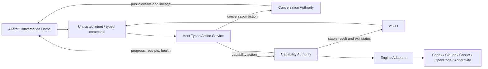
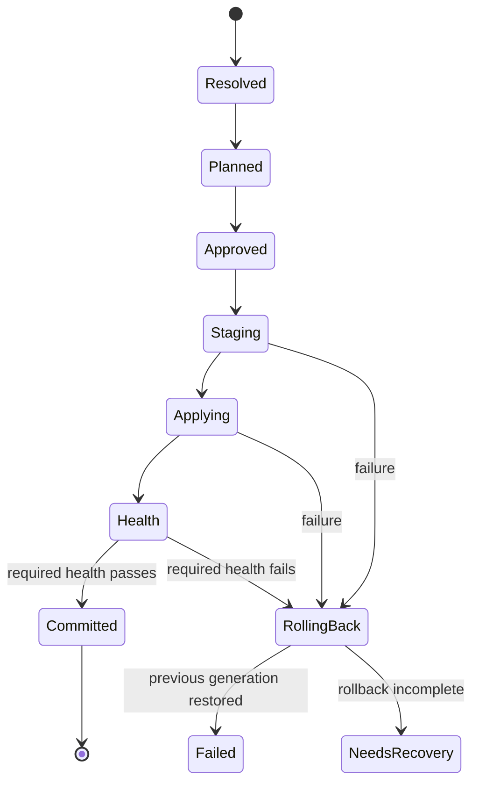

# AI-first Home and CLI Capability Fabric design

Date: 2026-08-24
Status: design approved and fresh-reader tested; implementation pending plan
Product boundary: VibeFlow remains a local-first harness for AI CLIs

## Decision

VibeFlow will replace its modal Conversation Workspace and stage-oriented default Home with a
persistent, AI-first conversation surface. A durable, searchable session rail sits beside the
active conversation. Adding or removing an agent, changing settings, and installing tools for an
AI CLI happen inside the conversation through host-rendered action proposals.

VibeFlow will not become a general plugin application host. Its extension surface is a dynamic CLI
Capability Fabric: packages describe skills, MCP servers, tools, hooks, roles, and engine settings;
VibeFlow resolves, approves, installs, verifies, updates, removes, and rolls them back through
VF-owned engine adapters. Packages never inject arbitrary HTML, microfrontends, or executable
lifecycle code into the VibeFlow UI.

The complete program has two subsystems with one stable integration contract:

1. **AI-first Conversation Home** owns discovery, conversation continuity, natural-language intent,
   action review, and the public user experience.
2. **CLI Capability Fabric** owns package resolution, permission disclosure, engine projection,
   immutable locks, health, recovery, and rollback.

A capability request follows the same path whether it starts as chat text, a shortcut, or a CLI
command:

```text
intent → typed proposal → host validation → review/confirmation
       → authoritative operation → adapter evidence → health → audited result
```

Natural-language output is never authority. Only the host can turn a validated, current proposal
into a mutation.

## Why this change is necessary

The current UI inherited the old `AskCard` modal mechanism:

- `App.vue` conditionally mounts `ChatWorkspace` from `askOpen`.
- `ChatWorkspace.vue` is a full-screen dialog with a focus trap, Escape close, and local workspace
  state.
- Closing the dialog unmounts its active conversation, snapshot, stream cursor, token, notices, and
  local history.
- Resume requires typing an opaque conversation ID because there is no conversation-list API.
- The current `workspace.sessions` map represents native engine-session reconciliation records; it
  is not a user-facing catalog of conversations.

The current child-revision path also preserves configuration lineage rather than conversational
context. A child starts with a fresh trace containing its configuration and the new user message.
Parent messages, responses, evidence, consensus, and generic artifacts are not injected into the
child. Parent linkage is not durably exposed through the public snapshot, and the UI remembers it
only in process-local state.

Capability installation is already partially present, but through separate paths:

- the skill registry resolves immutable Git commits and bundle hashes;
- skill sync projects a canonical skill into engine-specific mirrors;
- tool descriptors detect tools and emit installation/MCP plans;
- MCP writers preserve unrelated engine configuration with managed-name sidecars;
- hook and role adapters render engine-specific files;
- `doctor` and verification commands provide fragmented health checks.

These are useful foundations, but they do not share a package model, permission model, durable
approval, transaction journal, per-adapter receipts, update/remove/rollback lifecycle, or one
authoritative lock. Directly adding more installers would deepen that fragmentation.

## Goals

1. Make AI conversation the default VibeFlow Home, not a modal or one stage among many.
2. Show durable, searchable, restart-safe conversation sessions in a collapsible rail.
3. Preserve one continuous public timeline across revisions without giving any agent hidden or
   asymmetric native provider history.
4. Let users express actions naturally in Vietnamese or English without memorizing slash commands.
5. Keep shortcuts and CLI commands deterministic, discoverable, scriptable, and authority-safe.
6. Install and manage dynamic CLI capability packages across supported AI engines through a common
   plan, permission, lock, health, and rollback lifecycle.
7. Preserve user-owned configuration and accurately report `manual` or `unsupported` engine states.
8. Migrate existing conversations and VF-managed capability state without rewriting authoritative
   journals/manifests or silently claiming unowned files.
9. Ship only with whole-repository verification at confidence `1.0`, fault-injection evidence, and
   a tested recovery path.

## Non-goals

- Hosting arbitrary plugin pages, package-provided components, iframes, or microfrontends.
- Reimplementing AI CLIs, provider-native session stores, or provider plugin loaders.
- Treating MCP as the universal abstraction for skills, hooks, roles, and settings.
- Sharing or importing private provider-native session history between agents.
- Letting an agent or model approve its own request.
- Running arbitrary package lifecycle scripts.
- Mutating state merely because prose resembles a command.
- Keeping the old modal and direct capability writers as a permanent second implementation.
- Replacing workflow, orchestration, logs, or verification with packages; these remain core harness
  capabilities.

## Product and authority principles

The implementation must preserve these invariants:

1. **One public conversation, fresh private sessions.** Users see continuous lineage; every child
   participant starts a fresh provider session and receives the same canonical shared-context bytes.
2. **Intent is untrusted.** Chat text and model tool calls can request a proposal, never manufacture
   authority.
3. **Review binds exact state.** Approval binds the action, scope, target, permission digest,
   conversation revision/sequence, capability lock generation, package hashes, and expiry.
4. **Revalidation happens at commit.** A valid preview can become stale; commit must compare current
   authority again under the owning lock.
5. **Explicit durable records are authoritative.** Conversation manifests/journals/lineage-head
   records and capability packages/locks/operation/grant frames own state. Catalogs, cards, health
   summaries, and engine files are projections or evidence.
6. **Ownership is narrow.** An adapter may change only the keys/files recorded in its plan and
   receipt. It uses surgical mutation that preserves unrelated bytes; if that cannot be guaranteed,
   the complete full-file rewrite is a separate exact-preimage-bound high-risk/manual action.
7. **Failure is visible.** Partial apply, failed rollback, manual work, drift, and unsupported
   targets are never relabeled as healthy.
8. **Private/tainted secrets are handles.** Locks, plans, browser DTOs, logs, exports, and diagnostics
   never contain secret-tainted/private values. A suspected-only user literal becomes public only
   through the explicit audited declassification contract below.
9. **Rollback is monotonic.** It creates a new audited operation and generation; it never erases
   the failed operation or rewrites history.
10. **No permanent dual authority.** Compatibility commands may remain, but they call the same
    action/capability services rather than maintaining old writers.

## System architecture



The Typed Action Service is a host boundary, not an LLM agent. It accepts typed candidate actions,
validates them against versioned schemas and current policy, derives an immutable proposal, and
commits only after current authority is proven. A conversation agent may suggest a typed candidate
through a tool call, but the candidate is treated exactly like untrusted input.

The Conversation Authority and Capability Authority are separate durable domains. They share action
envelopes, risk policy, actor identity, idempotency, and audit correlation, but do not share locks or
pretend that a conversation journal can atomically commit an engine configuration update. A
capability action requested inside chat records correlation in both domains and renders one
continuous user-facing action lifecycle.

## Subsystem 1: AI-first Conversation Home

### Information architecture

The default application shell is:

```text
┌ session rail ───────┬──────── active conversation ────────┐
│ new conversation    │ title · revision · participants     │
│ search              ├─────────────────────────────────────┤
│ today               │ timeline                            │
│  active session     │ messages                            │
│  other session      │ compact system/revision events      │
│ this week           │ pending proposal near composer      │
│  ...                ├─────────────────────────────────────┤
│ capability health   │ composer · + · @ · optional /       │
└─────────────────────┴─────────────────────────────────────┘
```

The session rail is open by default on desktop, collapsible for focus mode, and becomes an icon rail
or drawer at narrower widths. Search is at the top of the list. Clicking a session immediately
activates it; users never need an opaque ID in the primary flow. An advanced recovery action may
resume by ID when the derived catalog is degraded, but it is not a competing Create/Resume UI.

The center column owns the scrollable conversation and sticky composer. Trace, artifacts,
capability health, and detailed evidence open in host-owned drawers. They do not become a dashboard
beside the chat or create nested permanent cards.

### Durable session catalog

`GET /api/conversations` returns a browser-safe, paginated projection. The projection is stored under
the private conversation root and can be rebuilt from validated manifests and canonical journals.
It is never the authority for whether a conversation, event, or revision exists.

One rail row represents one **root session lineage**, not one revision. Identity is normative:

- `conversation_id` identifies exactly one revision-scoped manifest, journal, snapshot, SSE stream,
  control target, and existing `/api/conversations/:conversation_id/...` route;
- `revision_id` is that resource's opaque immutable trace/correlation identity and is never accepted as
  a route alias for `conversation_id`;
- for a root, `root_session_id === conversation_id`; for a child, `root_session_id` is the
  `conversation_id` reached by following jointly validated parent conversation/revision pairs to the
  root. `workflow_id` is correlation only and cannot establish lineage;
- `child_id` means the child's `conversation_id`; it is not a fourth identifier namespace;
- parent IDs are jointly null for a root or jointly match the immediate parent's manifest identity.

Each newly committed child receives a monotonically increasing `revision_ordinal` starting at 1 after
the root's ordinal 0. Version 1 permits one committed successor from the selected lineage head; it does
not silently branch. Because existing manifests permit a tree and contain no unique-head authority, the
unique active head is a new CAS-protected `LineageHeadRecordV1` in the existing private conversation
artifact store. The catalog only projects that record. Migration creates it automatically only when
validated ancestry has exactly one eligible leaf; competing legacy leaves produce `ambiguous` and
require an audited user selection rather than a timestamp guess. If that unique-leaf first-head CAS is
explicitly and durably deferred, the retained one-candidate record is `unclaimed` until the same typed
selection path commits it; zero eligible leaves is corruption rather than a selectable status. A crash
before the absent-to-initial CAS retries byte-identical bytes, while a crash after rename observes the
installed record; interruption alone never invents `unclaimed`.

```ts
interface ConversationRevisionSummary {
  schema_version: "1.0";
  conversation_id: string;
  revision_id: string;
  revision_ordinal: number;
  parent_conversation_id: string | null;
  parent_revision_id: string | null;
  lineage_status: "verified" | "unverified";
  topic: string;
  policy: string;
  lifecycle: ConversationLifecycle;
  health: ConversationHealth;
  participants: PublicParticipantSummary[];
  created_at: string;
  updated_at: string;
  last_seq: number;
  lock_digest: string;
}

interface PublicParticipantSummary {
  participant_id: string;
  role_ref: string;
  engine: EngineName;
  model: string | null;
}

interface ParticipantInput {
  role_ref: string;
  engine: EngineName;
  model: string | null;
  skill_refs: string[];
}

interface ConversationSessionSummary {
  schema_version: "1.0";
  root_session_id: string;
  head_status: "committed" | "ambiguous" | "unclaimed";
  root: ConversationRevisionSummary;
  active_conversation_id: string | null;
  active_revision_id: string | null;
  active_revision_ordinal: number | null;
  revision_count: number;
  active: ConversationRevisionSummary | null;
  matched_revision: LineageNodeIdentityV1 | null;
  association_ids: string[];
  sort_updated_at: string;
  lineage_cursor: string;
}

interface ConversationListResponse {
  schema_version: "1.0";
  items: ConversationSessionSummary[];
  next_cursor: string | null;
  catalog_generation: string;
  source_watermark: string;
  catalog_health: "ready" | "rebuilding" | "degraded";
}

interface ConversationTimelineResponse {
  schema_version: "1.0";
  root_session_id: string;
  head: LineageNodeIdentityV1;
  head_epoch: number;
  head_digest: string;
  items: Array<
    | {
        kind: "conversation-event";
        revision_ordinal: number;
        event: PublicStoredTraceEvent;
        action_operations: AnchoredActionOperationsPageV1;
      }
    | {
        kind: "conversation-start";
        revision_ordinal: number;
        conversation_id: string;
        revision_id: string;
        anchor_id: string;
        action_operations: AnchoredActionOperationsPageV1;
      }
    | {
        kind: "revision-boundary";
        boundary_id: string;
        from: LineageNodeIdentityV1;
        to: LineageNodeIdentityV1;
        handoff_id: string;
        prompt_projection_digest: string;
      }
  >;
  next_cursor: string | null;
}

interface AnchoredActionOperationsPageV1 {
  schema_version: "1.0";
  items: ActionOperationView[];
  next_cursor: string | null;
  proposal_set_watermark: string;
}

interface ConversationLineageResponseV1 {
  schema_version: "1.0";
  root_session_id: string;
  requested: LineageNodeIdentityV1;
  head_status: "committed" | "ambiguous" | "unclaimed";
  active: LineageNodeIdentityV1 | null;
  candidate_heads: LineageNodeIdentityV1[];
  head_epoch: number;
  head_digest: string;
  nodes: ConversationRevisionSummary[];
  next_cursor: string | null;
}

interface ConversationCatalogSourceInventoryEntryV1 {
  source_kind: "conversation-manifest" | "conversation-journal-head" | "lineage-head" | "lineage-association";
  root_session_id: string;
  record_id: string;
  record_digest: string;
}

interface ConversationCatalogDeltaV1 {
  schema_version: "1.0";
  sequence: number;
  previous_event_digest: string | null;
  root_session_id: string;
  cause:
    | "conversation-source-committed"
    | "lineage-head-committed"
    | "lineage-association-committed"
    | "projection-retry";
  source_record: ConversationCatalogSourceInventoryEntryV1;
  source_inventory_digest: string;
  recorded_at: string;
  event_digest: string;
}

interface ConversationCatalogGenerationV1 {
  schema_version: "1.0";
  generation_id: string;
  source_inventory_digest: string;
  source_watermark: string;
  starting_delta_sequence: number;
  applied_through_delta_sequence: number | null;
  rows: ConversationSessionSummary[];
  created_at: string;
  content_digest: string;
}

interface ConversationCatalogCurrentV1 {
  schema_version: "1.0";
  generation_id: string;
  generation_digest: string;
  source_watermark: string;
  applied_through_delta_sequence: number | null;
  updated_at: string;
  content_digest: string;
}

type ConversationSseFrameV1 =
  | { id: string; event: "trace"; data: PublicStoredTraceEvent }
  | { id: string; event: "snapshot"; data: ConversationSnapshot }
  | { event: "heartbeat"; data: "" }
  | { event: "error"; data: PublicApiError["error"] };
```

`PublicStoredTraceEvent` normatively means the exported server schema of that exact name in
`src/orchestrator/trace/types.ts`, including its mapped `PublicTraceEvent` projection, at the
reader-compatible migration baseline. This feature extends its underlying `TraceEvent` union only with
`{type:"capability_action_projection"; payload: CapabilityConversationOutboxEventV1}`; the existing
mapped projector therefore produces the public form without an alternate DTO. It also additively permits
`artifact_type:"compaction"` in the existing `artifact_created` payload; that semantic event names the
committed `PublicCompactionArtifactV1` opaque ref/digest and is not a new trace-event variant. All legacy variants and
fields remain byte-compatible. The timeline wrapper supplies its revision ordinal. Boundary items are derived only from a
validated published `RevisionOperationV1` and `LineageHeadRecordV1` chain.
The trace reader accepts the existing UUID event-ID grammar for every legacy event. It additionally
accepts `^vf-outbox-[0-9a-f]{64}$` only when `event.type === "capability_action_projection"`, the ID
byte-equals `event.payload.outbox_event_id`, and the complete prepared-record factory below validates;
that spelling remains invalid in the `event_id` position for every other trace variant or generated event.
`ConversationSnapshot` likewise means the existing exported schema in
`src/orchestrator/conversation/types.ts`; reader-compatible fields are not redefined or weakened here.
`boundary_id = vf-revision-boundary-<hex>` from
`digestV1("VF-REVISION-BOUNDARY-ID\0v1\0",
{root_session_id,from,to,handoff_id,prompt_projection_digest})`; every boundary field must match that
published operation.
Session `association_ids` are unique and bytewise sorted.
Revision-summary participants sort by `participant_id`; lineage candidate heads and nodes sort by
`(revision_ordinal, conversation_id)`. Timeline items follow
`(revision_ordinal,item_kind_order,public_seq_or_zero,item_id)`, where a child boundary uses its `to`
ordinal, kind order zero, sequence zero, and `boundary_id`; a `conversation-start` item uses kind order
one, sequence zero, and `anchor_id`; and an event uses kind order two and its public sequence/event ID.
Duplicate identity/order tuples are projection corruption, not arrival-order
ties.
Cross-domain projection-only trace events, including `capability_action_projection`, are not separate
root-timeline ordering items because they may arrive after a child commits. Instead, each semantic event
carries the first bounded page of operations whose immutable proposal names its `event_id` as
`origin_event_id`. Operations sort by `(created_at, proposal_id)`, are unique by proposal ID, and the
page's watermark is the digest of the complete sorted `(proposal_id,proposal_digest)` set; mutable
operation progress is not part of that watermark or ordering. Empty pages still carry the canonical
empty-set watermark. The anchored-operation endpoint below consumes `next_cursor` for additional cards.
Null-origin conversation proposals appear only on their revision's derived `conversation-start` item
under the same page/watermark rules.
Raw projection events remain in the revision-scoped trace/audit endpoint, and a running card follows
the operation-events endpoint. A late proposal or projection therefore adds or updates an overlay
without inserting an older base item behind an issued root-timeline cursor. A changed proposal set
makes only an anchored-operation cursor stale; it never invalidates the base timeline cursor.
Catalog deltas are projection invalidations, not row authority. Their sequence is global, zero-based,
dense, and chained; `event_digest` omits itself and uses `VF-CONVERSATION-CATALOG-DELTA\0v1\0`. Replaying
a delta re-derives that root row from current validated sources and is idempotent. A missing/corrupt
delta cannot roll back an authoritative operation; it degrades the catalog and forces the snapshot
inventory/watermark rebuild below.
Each delta's `source_inventory_digest` is the post-cause validated inventory observed when the
invalidation was appended; it never contains the delta's own digest. The separately derived
`source_watermark` may include the latest completed delta digest, avoiding a self-hash cycle.
Generation rows use the list's root-row order. The generation digest omits
`generation_id/content_digest` under `VF-CONVERSATION-CATALOG-GENERATION\0v1\0`, and the ID is
`vf-catalog-generation-<hex>`. The current-pointer digest omits `content_digest` under
`VF-CONVERSATION-CATALOG-CURRENT\0v1\0`. `starting_delta_sequence` is the first delta not in the frozen
inventory; an empty log uses zero, and `applied_through_delta_sequence` is null until a delta is applied.
`generation_digest` must equal that generation's `content_digest`; the pointer may name only a fully
validated caught-up generation.
Stored generation rows always have `matched_revision:null`; a search request derives that bounded
response-only field from the generation's validated search index without mutating or re-digesting the
stored row.
`source_inventory_digest = digestV1("VF-CONVERSATION-CATALOG-SOURCE-INVENTORY\0v1\0",
{schema_version:"1.0",entries})` over unique `ConversationCatalogSourceInventoryEntryV1` objects sorted
bytewise by `(source_kind,root_session_id,record_id,record_digest)` in that order.
Entries are validated authoritative conversation/lineage records only; catalog generations, pointers,
deltas, indexes, and other projections are excluded.
The delta cause and typed source record are a closed pair:
`conversation-source-committed` permits only `conversation-manifest|conversation-journal-head`,
`lineage-head-committed` only `lineage-head`, and `lineage-association-committed` only
`lineage-association`. `projection-retry` repeats byte-for-byte the source record of the failed delta it
is retrying; it may not invent a catalog record as cause. `record_id` is the source schema's stable
manifest/journal/head/association identifier and `record_digest` is the validated full record content
digest. Any cause/source mismatch is corrupt delta input.
`source_watermark` is `digestV1("VF-CONVERSATION-CATALOG-SOURCE-WATERMARK\0v1\0",
{source_inventory_digest, latest_catalog_delta_digest})`; an empty delta log uses null for the latter.

`PublicParticipantSummary` contains only the public participant ID, role reference, engine name, and
safe model identifier already permitted by public conversation snapshots. It never contains rendered
roles, skills, prompts, native session IDs, or binding authority records.

Catalog behavior:

- root-row ordering is stable by `(sort_updated_at DESC, root_session_id DESC)`. For a committed head,
  `sort_updated_at === active.updated_at`; for recovery rows it is the maximum validated candidate/root
  update time and remains projection-only;
- `root` is always the validated ordinal-zero summary; committed `active` is the exact selected-head
  summary. A recovery row therefore remains renderable without inventing a candidate head. With a
  search query, `matched_revision` is the highest
  `(revision_ordinal, conversation_id, revision_id)` verified match; without a query it is null;
- a match in any verified revision returns its root row and activates the committed head; the UI may
  highlight and deep-link the matching historical revision without treating it as writable;
- cross-revision timeline uses the exact tuple above with an explicit revision boundary; per-revision
  public sequences are never rewritten into a fake
  global sequence;
- an existing revision-scoped snapshot/events/SSE endpoint remains addressable by `conversation_id`;
  posting to a non-head revision returns `409 not_lineage_head` with the exact current root/head
  identity, digest, and epoch contract below;
- `GET /api/conversations/:conversation_id/lineage` accepts any verified node's `conversation_id` and
  returns bounded lineage
  detail plus its root/head identities; its lineage cursor binds root ID, head digest, last ordinal, and
  last public sequence, and returns `409 stale_lineage_cursor` with a restart cursor if a new child
  commits;
- an `ambiguous|unclaimed` legacy lineage opens read-only lineage recovery instead of selecting a head
  from catalog timestamps; no message or child commit is accepted until a head claim is approved;
- a user-confirmed association never merges roots, renumbers revisions, selects a head, or creates a
  cross-root timeline. Associated roots remain separate rail rows carrying the immutable association ID;
  the UI may group them under a label and explain that continuity was not historically verified;
- cursors are opaque and bind query digest, sort contract, catalog generation, source watermark, and
  the last ordering tuple; a changed generation returns `409 stale_catalog_cursor` and a restart cursor;
- the endpoint is authenticated, `Cache-Control: no-store`, and bounded by a server maximum;
- search covers safe topic, policy, role, and engine fields;
- lifecycle/policy filters apply to the committed active summary or, for a recovery row, its root
  summary; they never select an ambiguous candidate as active;
- a normal list request reads the catalog and never folds every journal;
- projection update failure does not roll back an authoritative conversation operation;
- missing, stale, truncated, or corrupt catalog entries trigger an idempotent atomic rebuild;
- invalid source records are reported and skipped, never deleted;
- session selection renews a memory-only stream token through the existing narrow token endpoint.

Rebuild is single-flight. It snapshots the validated source inventory, builds a temporary generation,
and records its starting projection-delta offset. Under the catalog lock it replays all idempotent deltas
after that offset, compares the source inventory/watermark, and atomically swaps only a caught-up
generation. Conversation operations never depend on the catalog commit; a missed projection update
marks catalog health degraded and is recovered by delta replay or source rebuild.

### Safe session switching

Only one conversation owns a live browser stream at a time. Every activation receives a monotonic
generation plus an `AbortController`.

Before switching from A to B, the UI closes A's `EventSource`, renewal timer, and reconnect timer.
Snapshot, token-renewal, notices, and SSE callbacks may update state only when both the conversation
ID and activation generation still match. A late A response after B is selected is discarded.

Catalog summaries are kept separate from the active conversation state. The existing native
reconciliation `sessions` map is not reused or renamed into the public catalog.

### Natural language and friendly actions

The composer accepts ordinary Vietnamese or English:

- “Thêm Claude làm skeptic, giữ nguyên context hiện tại.”
- “Cài sqlite inspector cho Codex, chỉ cho phép đọc repo.”
- “Đổi model của reviewer sang Sonnet.”

Natural language is the primary interface. The `+` menu exposes contextual actions, `@` mentions
participants, and slash autocomplete appears only after the user types `/`. Slash commands are
accelerators, not visible syntax users must memorize.

The intent pipeline is:

1. classify/project the submitted bytes first; append the safe public message only after projection, or
   keep a suspected/private value in the staging/broker flow defined below;
2. an agent or deterministic shortcut may emit an untrusted `BrowserHostActionRequestV1` candidate;
3. the host resolves and validates the candidate against its action schema and current policy;
4. ambiguous, quoted, negated, conditional, or malformed intent stays a message or asks for
   clarification;
5. a valid candidate becomes an immutable host-rendered proposal;
6. the user reviews scope, target, delta, permissions, reversibility, and evidence requirements;
7. commit revalidates current authority and consumes the proposal exactly once;
8. progress and the terminal result appear as compact audited system events.

There is no hidden privileged model parser. Deterministic `+`/slash/CLI inputs produce a typed candidate
directly. Any conversation participant explicitly granted the host `propose_action` tool may emit a
candidate with its producer and origin-message IDs; the host validates every candidate under the same
schemas, projection-groups canonically identical intent, and shows genuinely competing valid choices
rather than selecting one by model authority.

Read-only inspection may run directly when policy permits. Reversible local mutations require a
preview and offer Undo. Agent membership, settings, package installation, permission escalation, or
user-scope configuration require explicit confirmation. A requesting agent cannot confirm its own
proposal.

If an agent/settings change is requested while an operation is producing a turn, the UI may retain only
an untrusted draft intent associated with that operation. It is visibly labelled **waiting to prepare**,
has no proposal, approval, plan, authority binding, or execution right, and cannot be confirmed. After
the operation reaches a stable terminal, the host reloads the new terminal sequence/semantic head and
materializes a fresh proposal through the normal pipeline; the user then reviews and confirms those
newly derived immutable bytes. If the turn fails, is stopped, the draft source changes, or the stable
terminal cannot be proved, the UI offers edit/discard and creates no proposal. The alternative is an
explicit Stop-current-operation action followed by the same fresh-proposal flow. Thus a pre-terminal
draft is never represented as an already reviewed or scheduled mutation, and participant bindings are
never changed underneath an in-flight turn.
If proposal creation races the terminal boundary it returns `409 stale_conversation`, retryable with
recovery action `retry`, before any authority/idempotency write. A draft is discarded if its revision is
no longer the committed writable head. Interactive CLI may wait and then display a freshly derived
Review; non-interactive CLI returns `action-required` and never queues an unseen approval. No
pre-terminal CAS, anchor, preview, plan, confirmation, child ID, reservation, or idempotency key is
reused.

### Action lifecycle in the UI

Every mutation renders the same host-owned lifecycle:

```text
Draft → Review/Edit → Confirm → Running → Result → Undo (when reversible)
```

Editing creates a new immutable proposal; it never mutates approved bytes. Pending proposals remain
discoverable near the composer and survive reconnect through their durable proposal record. Resolved
proposal and system events collapse to one human-readable line so audit does not flood the chat. Full
inputs, receipts, hashes, and evidence remain in Trace.

Package metadata, Markdown, labels, icons, and URLs are sanitized. Packages can supply typed metadata
and versioned form schemas only; VibeFlow renders all proposal, permission, health, and settings UI.

### Visual production standard

The approved mockups specify structure, not a low-fidelity production ceiling. The production UI
must have a deliberate editorial/tool art direction:

- Hanken Grotesk or an equivalently intentional project typeface;
- warm off-black and stone neutrals with one restrained amber accent;
- 14–16 px body text, approximately 65 characters per reading line, and a clear typographic scale;
- generous conversation spacing, grouped messages, few borders, and no nested-card hierarchy;
- no decorative gradients or generic pill-heavy dashboard styling;
- subtle grain only where it does not reduce clarity or performance;
- motion limited to state-explaining transform/opacity transitions;
- a first-class reduced-motion mode;
- visible non-color-only focus, status, permission, and error treatment.

The UI must intentionally design initial loading, true empty/onboarding, search-no-results, load-more,
offline, reconnecting, stale, permission-denied, corrupt-session, and recovery states. Generic toasts
or blank panels are not sufficient.

### Accessibility contract

- Semantic application landmarks, session lists, conversation log, status, and labeled icon buttons.
- Keyboard-only rail → timeline → composer → proposal flow.
- A skip link and predictable focus restoration after drawers, confirmations, and autocomplete.
- Escape closes transient autocomplete/drawers without clearing the draft.
- Shortcuts never steal IME composition or ordinary text input.
- `aria-live="polite"` announces coarse lifecycle changes, not every streamed token.
- 44 px interactive targets where touch applies, 200% zoom, and 320 px reflow.
- Virtualized or incremental history must preserve DOM reading order and focus.
- Automated accessibility checks plus a manual keyboard and screen-reader pass.

## Conversation authority and context continuity

### Generalized child revisions

Adding/removing an agent or changing conversation settings never mutates a running participant set in
place. It creates a generalized child revision from a stable terminal parent.

“Stable terminal” means lifecycle `COMPLETED|STOPPED|FAILED|ABORTED`, no live participant/control
operation, no uncommitted lifecycle transition, and no existing child reservation. Commit acquires the
parent record and trace snapshot locks, rechecks that predicate, and captures the exact source sequence
and semantic journal-head digest. After reservation, ordinary user/participant/control appends are
rejected on that parent. Idempotent cross-domain projection events may still update their anchored cards,
but they are classified outside the semantic handoff head and cannot change the reserved context bytes.
Conversation mutations use the fixed lock order `root-lineage → durable record → trace snapshot`; catalog
and cross-domain delivery occur after release. A capability scope lock is never held while acquiring a
conversation lock.

The opaque conversation lock is one content-addressed binding, not an implementation-selected aggregate:

```ts
interface ConversationLockBindingV1 {
  schema_version: "1.0";
  root_session_id: string;
  conversation_id: string;
  revision_id: string;
  manifest_record_digest: string;
  semantic_journal_head_digest: string;
  semantic_last_seq: number;
  revision_claim_epoch: number;
  lock_digest: string;
}
```

`lock_digest` omits itself under `VF-CONVERSATION-LOCK\0v1\0`. The manifest digest resolves the exact
validated current manifest record. The journal digest resolves its exact highest validated semantic
event and excludes projection-only events; an empty semantic journal uses
`digestV1("VF-CONVERSATION-SEMANTIC-JOURNAL-EMPTY\0v1\0",
{schema_version:"1.0",conversation_id,revision_id})`. `semantic_last_seq` is the highest semantic event
sequence, or `0` for that empty state; physical conversation records begin at sequence one. The claim
epoch is the current lineage reservation claim epoch, using zero before any
claim. Conversation summaries, handoffs, proposals, revision plans, and commits must carry this exact
digest for the same source state. Its preimage never contains a proposal, reservation, operation, child
revision, catalog generation, or projection-only event identifier.

The parent proposal is bound to:

- root session, conversation, revision, and exact lineage-head digest/epoch;
- expected public `last_seq`;
- an opaque lock digest derived from validated manifest authority, journal head, and the current
  revision-claim epoch;
- the exact binding delta and resulting complete participant set;
- actor, idempotency key, creation time, and expiry.

Commit takes the parent durable-record lock, recomputes the base lock, and reserves the revision epoch.
It also verifies that the parent pair equals the current `LineageHeadRecordV1`; a stale, ambiguous, or
competing claim returns a conflict without publishing partial lineage. The winning proposal derives one
64-character lowercase SHA-256 hex digest from the length-prefixed RFC 8785 bytes of
`{schema_version:"1.0", root_session_id, parent_conversation_id, parent_revision_id, proposal_id,
revision_claim_epoch}` under the exact domain `VF-CONVERSATION-CHILD\0v1\0`. The child
`conversation_id` is `conversation-` plus the first 32 hex characters, the child `revision_id` is
`revision-` plus that same suffix, and `child_id` always refers to the former. Creation checks any
pre-existing identifier for byte-identical identity and treats a mismatch as integrity failure.
Repeating the same commit returns the same pair; a different proposal against the consumed base fails.

Retained participant IDs remain stable. Additions receive server-owned IDs. Removed participants stay
visible in prior history but receive no new turns. All child bindings are rematerialized and validated
before the parent link becomes visible.

Child creation uses a private durable `RevisionOperation` state machine:

```text
preparing → prepared → published → starting → started
     └──────────→ abandoned          └──────→ start_failed
     └──────────────────────────────────────→ needs_recovery
```

- `preparing` persists proposal/base digests, the deterministic child conversation/revision pair,
  intended binding set, handoff profile, and parent reservation before external effects.
- `prepared` means the content-addressed handoff and hidden child record validate, but neither appears
  in public lineage or catalog results.
- `published` is the public lineage commit marker. Under the root-lineage lock, atomic CAS replacement
  of `LineageHeadRecordV1` from the exact parent pair/epoch to the already-validated child pair/ordinal
  makes the child, handoff, and successor claim visible together before participant execution. Hidden
  child bytes are not returned by ID until that head commit references them; a crash before it leaves
  the old head authoritative and is reconciled as preparation, never as a second lineage node.
- `starting` records a private receipt for every participant start attempt. Each receipt binds the
  exact shared handoff digest, participant wrapper digest, engine/model/adapter fingerprint, and native
  attempt ID without exposing native IDs publicly.
- Before invoking an engine/provider, the operation journal appends and fsyncs a participant
  `prepared` frame containing a deterministic `attempt_key` derived from
  `(revision_operation_id, participant_id, start_generation)`. It then appends/fsyncs
  `effect_in_progress` before the external call. An engine adapter is eligible for revision start only
  if it provides at least one host-verifiable deduplication boundary: provider idempotency using that
  exact key, `inspect_start(attempt_key)`, or a VF-owned subprocess lease/handshake that can prove
  whether the native create was accepted. The resulting native session identifier or process handle is
  written immediately to a private `observed` receipt and never enters public state.
- Restart at `effect_in_progress` calls the adapter's reconciliation boundary before any retry. A
  proved existing session is adopted into the same attempt and then accepted or canceled; a proved
  absence permits a new `start_generation` and attempt key. An ambiguous/unsupported result becomes
  `needs_recovery` and blocks another start or child claim. The host never repeats a provider create
  merely because its post-effect receipt is missing. Adapters unable to satisfy this contract are
  `unsupported` for context-continuity revisions rather than creating duplicate hidden sessions.
- For `provider-idempotency`, reissuing the exact create with the same `attempt_key` is itself the
  reconciliation call and the provider contract must return the one existing-or-created session; it
  never increments `start_generation`. `inspect-start` must distinguish present, absent, and unknown.
  `vf-process-lease` reconciles the durable process start identity plus its handshake. Only the latter
  two may prove absence from an uncertain create. Any mode may allocate a new generation after the
  prior attempt is durably proved failed/canceled; `unknown` always freezes the operation.
- Participant execution uses a host barrier: the child is public before the task/context payload is
  released. If one participant then fails, already-started sessions are canceled, the child becomes
  `start_failed`, and any emitted public event/effect remains visible rather than being hidden. Retry
  uses the same child and starts every participant again with fresh native sessions; it never resumes
  only a subset.
- Cancellation is also write-ahead: `cancel_in_progress` is appended/fsynced before the adapter call.
  Its deterministic `cancel_attempt_key` and cancellation mode are recorded first. Cancel must be
  idempotent for the recorded native reference/key or expose inspect-cancel;
  recovery repeats/proves the same cancellation and records `canceled`, while an ambiguous cancellation
  becomes `needs_recovery` and forbids a new all-participant retry.
- “Canceled” means the adapter proves the session/process can emit no further participant event or
  external tool effect; deleting a provider's historical record is not required. An adapter that cannot
  idempotently stop or inspect quiescence is unsupported for multi-participant revision start.
- `started` means every current participant has a successful start receipt for the same shared digest.
- `abandoned` is authorized only before `published` and releases the reservation under the parent
  lock after private preparation cleanup. After publication, recovery uses retry/stop/new revision;
  lineage is never erased. An uncertain effect or corrupt receipt becomes
  `needs_recovery`, blocks another child claim, and requires repair.

Restart reconciliation inspects the parent reservation, hidden/published child, handoff digest,
participant receipts, and public commit marker. Before publication it completes or abandons the same
deterministic operation; after publication it resumes/repairs the same child. It never manufactures a
second child. Orphaned hidden records are quarantined for bounded diagnostics and garbage-collected only
after their operation reaches a verified terminal state.

### Canonical context handoff

Every child uses fresh native provider sessions, including retained agents. Reusing retained native
sessions would give them hidden parent history unavailable to a newly added agent.

The server derives one canonical, content-addressed `ContextHandoff` from public-safe parent data at a
fixed source sequence:

```ts
interface ContextHandoff {
  schema_version: "1.0";
  projection_profile: "vf-public-handoff/1";
  handoff_id: string;
  source: {
    conversation_id: string;
    revision_id: string;
    last_seq: number;
    lock_digest: string;
  };
  topic: string | null;
  policy: PublicHandoffPolicy;
  bindings: PublicHandoffBinding[];
  transcript: {
    user_messages: PublicHandoffMessage[];
    final_responses: PublicHandoffResponse[];
    omitted_public_ranges: PublicEventRange[];
  };
  compaction: PublicCompactionArtifactV1 | null;
  consensus: {
    score: number | null;
    synthesis: string | null;
  };
  artifacts: PublicArtifactReference[];
  handoff_selection_digest: string;
  prompt_projection: PromptHandoffProjectionV1;
  prompt_projection_digest: string;
  digest: string;
}
```

The exact subtype fields, prompt projection, digest preimages, and array ordering are defined in the
normative wire appendix. They are part of `vf-public-handoff/1`, not adapter choices.

`vf-public-handoff/1` is normative:

- input events are ordered by `(revision_ordinal ASC, public_seq ASC)` and deduplicated by public event
  ID;
- text is validated, recursively public-projected, normalized to Unicode NFC, and encoded as UTF-8;
- the content structure is serialized with RFC 8785 JSON Canonicalization Scheme;
- digests use SHA-256 with domain tags for the content artifact and prompt projection;
- the common prompt budget is measured in UTF-8 bytes and is the minimum declared safe handoff budget
  across the selected engine adapters after their fixed wrapper reservation;
- mandatory content is the source/profile header, ordered user messages, current topic/policy,
  consensus/synthesis, binding summary, and artifact references attached to a user message or explicitly
  confirmed in the immutable handoff selection plan;
- optional final participant responses and their causally linked public evidence/artifacts form
  indivisible groups. The exact removal/omission algorithm is in the normative appendix; no adapter may
  skip a non-fitting group and then include a different older group;
- a required artifact must be inlined within the bound or exposed through a conversation-scoped,
  read-only resolver that the target adapter actually supports. An inaccessible reference cannot be
  treated as delivered context.

The canonical shared handoff segment is the byte-identical content covered by
`prompt_projection_digest`. Engine- and participant-specific system/role wrappers are separately
canonicalized and receipt-bound but explicitly outside that digest. Therefore prompts may have
different wrappers while the continuation evidence is provably identical.

The content artifact preserves the complete public-safe selected/omitted evidence through inline values
or content-addressed omission artifacts. The prompt projection is
deterministically budgeted and never silently drops a user instruction. It may replace older assistant
response/evidence ranges with explicit content-addressed references and an omission manifest. If the
entire mandatory projection plus its required omission manifest exceeds the versioned hard prompt
bound, child creation stops with
`handoff_too_large` and offers an explicit user-reviewed compaction proposal; it does not guess which
instruction to discard. After any approved compaction, every retained and added participant receives
byte-identical prompt projection content and the same digest. Private native history is never a hidden
fallback.

The child manifest stores the internal handoff reference and digest. The public snapshot/event exposes
lineage, source sequence, handoff status, digest, and an opaque artifact ID. The UI renders parent and
child as one continuous timeline with a compact event such as:

```text
Revision 3 created · Claude added as skeptic · context verified at seq 48
```

The complete parent trace and artifacts remain durable and inspectable. “No context loss” therefore
means no public history disappears and every child agent gets the same canonical continuation. It
does not mean copying unbounded private provider transcripts into new sessions.

Handoff generation fails closed before publication on redaction failure, source-sequence drift, or
digest mismatch. Participant-start failure occurs only after valid lineage is published, remains visible
as `start_failed`, and cannot give any participant a different shared payload.

### Action proposal model

Proposal content is immutable; status transitions live in an append-only operation record.

```ts
type ActorKind = "human-browser" | "human-cli" | "agent" | "system-recovery";

interface PublicActor {
  kind: ActorKind;
  public_actor_id: string;
  credential_class: "loopback-session" | "interactive-tty" | "automation-grant" | "recovery";
}

type ActionProposalProducerRequestBindingV1 =
  | { kind: "canonical-action-request"; digest: string }
  | { kind: "recovery-bootstrap-repair-plan"; digest: string };

type ActionPlanningOptionsV1 =
  | { mode: "durable"; network_read: "ordinary-host-policy" }
  | { mode: "transient"; network_read: "forbid" | "allow-if-granted" };

interface ActionProposal<TAction extends HostAction> {
  schema_version: "1.0";
  proposal_id: string;
  proposal_digest: string;
  idempotency_key: string;
  origin_event_id: string | null;
  domain: "conversation" | "capability";
  action_root_locator: PrivateActionRootLocatorV1;
  producer_request_binding: ActionProposalProducerRequestBindingV1;
  planning_options: ActionPlanningOptionsV1;
  execution_object_closure_digest: string | null;
  base: {
    root_session_id: string | null;
    conversation_id: string | null;
    revision_id: string | null;
    last_seq: number | null;
    conversation_lock_digest: string | null;
    lineage_head_digest: string | null;
    lineage_head_epoch: number | null;
    capability_scope: "project" | "user" | null;
    capability_generation_ordinal: number | null;
    capability_generation_id: string | null;
    capability_lock_digest: string | null;
    capability_parent_generation_digests: string[];
    user_prerequisites: UserScopePrerequisiteBindingV1[];
    authority_binding_mode: "current" | "recovery-checkpoint";
    authority_epoch: number;
    authority_head_digest: string;
    repair_authorization_binding_digest: string | null;
  };
  action: TAction;
  requested_by: PublicActor;
  risk: ActionRisk;
  effect_classes: ActionEffectClass[];
  target_set: ActionTargetBindingV1[];
  package_pins: PackagePin[];
  source_authority_set_digest: string;
  adapter_set_digest: string;
  plan_digest: string;
  handoff_selection_digest: string | null;
  policy_digest: string;
  grant_digest: string;
  permission_digest: string;
  reversibility: "reversible" | "compensatable" | "manual" | "irreversible";
  preview: HostRenderedPreview;
  created_at: string;
  expires_at: string;
}

interface ActionApproval {
  schema_version: "1.0";
  approval_id: string;
  proposal_id: string;
  proposal_digest: string;
  plan_digest: string;
  adapter_set_digest: string;
  target_set_digest: string;
  package_pin_set_digest: string;
  source_authority_set_digest: string;
  policy_digest: string;
  grant_digest: string;
  permission_digest: string;
  authority_epoch: number;
  authority_head_digest: string;
  reversibility: ActionProposal<HostAction>["reversibility"];
  decided_by: PublicActor;
  credential_class: PublicActor["credential_class"];
  challenge_class:
    | "normal-confirm"
    | "fresh-user-scope"
    | "public-literal"
    | "automation-grant"
    | "recovery-tty";
  challenge_digest: string | null;
  decision: "approved" | "denied";
  decided_at: string;
  expires_at: string;
  approval_digest: string;
}
```

Every normal proposal uses `authority_binding_mode:"current"`, has a null
`repair_authorization_binding_digest`, and binds one current general authority
head. Conversation-only actions use the owning
project authority scope; capability/registry/secret/grant actions use their explicit project/user scope.
Thus `authority_epoch` and `authority_head_digest` are never absent even when the unrelated conversation
or capability base fields are null. For an approval, `target_set_digest` and
`package_pin_set_digest` are recomputed from the proposal's canonically ordered arrays, and
`credential_class` must equal `decided_by.credential_class`.
Grant, policy, secret, and trust actions use `domain: "capability"` because their durable owner is the
project/user capability authority root. Authority repair uses the target authority's immutable origin
(`conversation` or `capability`); conversation correlation remains metadata and never relocates it.
`capability_parent_generation_digests` is empty for non-capability actions and a first generation.
Otherwise it is unique/bytewise sorted and contains the current `capability_lock_digest`; a reviewed
branch-reconcile plan may add other fully validated parent generation digests, while an ordinary
mutation has exactly that one parent.

An `authority.repair` proposal instead has a non-null `repair_authorization_binding_digest` resolving
the exact binding defined below. It normally uses `authority_binding_mode:"current"`; an isolated
bootstrap repair uses `authority_binding_mode:"recovery-checkpoint"`. In either case the proposal's
mode/epoch/head must equal the resolved binding, never guessed state.

Challenge combinations are exact: `normal-confirm`, `automation-grant`, and `recovery-tty` require
`challenge_digest === null`; `fresh-user-scope|public-literal` require the digest of one successfully
consumed challenge of the same class. `automation-grant` requires
`decided_by.credential_class === "automation-grant"` and a current exact grant. `recovery-tty` requires
the bootstrap exception above plus `decided_by.kind:"human-cli"` and
`credential_class:"recovery"`; it is forbidden elsewhere. The other approved classes require an
authenticated human browser/TTY actor. A denied decision is `normal-confirm`, needs
no stronger challenge, and never uses an automation actor. Approval expiry is the earliest of proposal
expiry, consumed-challenge expiry when present, exact grant expiry when present, and the policy maximum.

Proposal IDs are deterministic hashes of the authority base plus canonical proposal content. The same
idempotency key in the namespace `(authenticated principal, authority scope, key)` with byte-equivalent
canonical input returns the existing proposal. Reusing a key with different content fails.
Confirmation disables double submit in the client, but server idempotency is the authority.

Precisely, `proposal_digest = digestV1("VF-ACTION-PROPOSAL\0v1\0",
proposalWithoutProposalIdAndDigest)` and
`proposal_id = vf-proposal-<the same hex>`. After approval, the execution/correlation
`operation_id = vf-operation-<hex>` from
`digestV1("VF-ACTION-OPERATION-ID\0v1\0", {proposal_id, approval_id, domain})`. The immutable proposal
bytes are stored under their digest and the idempotency namespace stores that digest; callers never
supply either derived ID as authority.

`approval_digest = digestV1("VF-ACTION-APPROVAL\0v1\0", approvalWithoutApprovalIdAndDigest)` and
`approval_id = vf-approval-<the same hex>`, for both approved and denied decisions. An approved record
uses that ID to derive an operation; a denied record does not.

The durable proposal/operation states are:

```text
pending_review → approved → committing → succeeded
       │             │            ├──→ failed
       │             │            └──→ needs_recovery
       ├────────────────→ denied
       ├─────────────┴──→ canceled
       ├────────────────→ expired
       └────────────────→ stale
```

Proposal bytes never change. Edit creates a replacement proposal with a new ID and marks the old one
stale. An authenticated denial appends an `ActionApproval` with `decision: "denied"` and CAS-transitions
the proposal from `pending_review` to terminal `denied`; it starts no mutation execution/effect and the
same proposal can never later be approved. Commit, deny, cancel, expiry, and a competing winner use one
CAS transition; the first transition wins.
Cancel after `committing` returns a conflict and may offer a compensating Undo only after the operation
settles. Retrying the same commit returns the existing operation/terminal result. Terminal records are
retained at least as long as referenced conversation/audit history and are never garbage-collected while
an operation, rollback, or diagnostic export references them.

Multiple agent candidates carry producer identity and the originating public message ID. Idempotency
deduplicates only within its authenticated principal/authority namespace. The UI may group separate
proposals whose canonical `(base, action, plan_digest)` tuple is identical, but that grouping is a
rebuildable projection: it neither merges authority records nor loses producer attribution. Conflicting
candidates remain separate choices; confirming one makes proposals against the consumed base stale.

### Actor, policy, grant, and approval authority

Policy and approval are distinct:

- project policy in `.vibeflow/SETTINGS.json` and private user policy in
  `~/.vibeflow/SETTINGS.json` define the maximum permitted behavior for their exact scopes;
- private project grants live at `.vibeflow/private/capabilities/authority/v1/grants.frames` and bind a project
  identity hash, actor/principal, action/permission scope, expiry, revocation epoch, and digest;
- private user grants live at `~/.vibeflow/capabilities/authority/v1/grants.frames` and are required for unattended
  user-scope effects;
- denies override allows; a narrower grant cannot exceed tracked policy or a user-scope deny;
- `grants.frames` contains only `GrantFrameV1` authorization history. Secret values and secret-handle
  bindings live only in the credential broker and fixed private binding/object stores; approval
  challenge/verifier material lives only in the action challenge and private identity stores. None is
  serialized into `grants.frames`, portable locks, or public DTOs.

The project authority writer lock is
`.vibeflow/private/capabilities/authority/v1/writer.lock`; the user writer lock is
`~/.vibeflow/capabilities/authority/v1/writer.lock`. It is a non-authoritative mutual-exclusion sidecar;
the exact authoritative filenames beneath each root are defined in Storage format. Registry trust,
secret revocation, policy, grant, epoch-head, and epoch-event bytes have no alias or second authority
path. These are mode-restricted private paths and use the durable lock/framing primitives defined below.
The same exact project/user `writer.lock` serializes first activation, crash resumption, activation-
receipt reconstruction, every later authority mutation, and repair observation; no separate
initialization-lock path or namespace exists. Secure creation and fsync of missing mode-0700 parent
directories may precede acquisition, but no identity, receipt, checkpoint, head, journal, or dependent
Fabric byte may be created before exclusive ownership.

These writer locks use the exclusive interprocess owner/owner-death primitive defined for the capability
scope lock: private owner metadata contains PID, process-start identity, host, operation, and nonce;
acquisition uses no-follow exclusive create; recovery never breaks ownership from age or PID alone; and
a contender must prove the recorded process-start identity is gone before atomically replacing the
exact observed owner record with a fresh nonce. When no HostAction operation ID exists, `operation` is
the fixed lock-purpose literal `project-authority-activation` or `user-authority-activation`. An
unprovable owner, unknown owner field, symlink, or unreliable exclusive-create/CAS/fsync primitive keeps
writers fenced. After first acquisition or proved-dead-owner replacement, the holder validates all
durable files and enters exactly one activation/recovery case below before writing. Lock bytes are never
authority or recovery evidence.

Authorization is normative:

| Actor | May request | May approve project scope | May approve user scope |
|---|---:|---:|---:|
| Authenticated human browser | yes | interactive confirmation | fresh user-scope loopback challenge |
| Interactive human CLI | yes | TTY confirmation | TTY confirmation with explicit user scope |
| Non-interactive human CLI | yes | only an unrevoked exact automation grant | only an unrevoked exact user grant |
| Agent | yes, within conversation policy | never | never |
| System recovery | no new intent | only exact pre-approved compensation | only exact pre-approved compensation |

The requesting actor and approving actor may be the same authenticated human, but an `agent` can never
be the approver. A removed participant loses request authority for future revisions. Approval is a
separate durable record and binds the exact proposal, plan, package pins, adapter/version digest,
resolved source-authority set, targets, permission/policy/grant digests, reversibility, and expiry.

Approval issuance is owned by the Typed Action Service. An authenticated project-scope browser button
or interactive TTY creates `challenge_class: normal-confirm`; denial uses the same endpoint/service and
never requires a stronger challenge. User-scope approval and suspected-literal publication require a
fresh challenge. The server generates a 256-bit CSPRNG nonce and opaque challenge ID, binds it to the
authenticated principal/session, CSRF epoch, proposal digest, decision class, and server expiry, and
stores only its keyed digest in a private CAS record. It displays ASCII `user <12 hex>` or
`publish <12 hex>`, where the suffix is the first 12 lowercase hex characters of
`digestV1("VF-APPROVAL-CHALLENGE-DISPLAY\0v1\0", {nonce_base64url, proposal_digest})`. The response
trims ASCII edge whitespace but otherwise must match exactly.

A challenge expires after 120 seconds, permits at most five failed responses, and is consumed by CAS on
the first successful approval request; success, expiry, principal/session mismatch, CSRF-epoch change,
or attempt exhaustion makes replay fail. The approval request and record bind the challenge digest, not
the phrase. Interactive CLI uses the same internal challenge service and TTY phrase; non-interactive
CLI cannot create a fresh approval and must present an exact current automation grant. Challenge and
approval responses are `Cache-Control: no-store`.

Grant creation, expansion, or renewal is itself an approved action. Revocation increments the grant
epoch, invalidates pending proposals, and makes brokered installed capabilities `blocked` until a new
grant or remove/repair action. Where runtime enforcement is only disclosed rather than brokered,
revocation must report that it cannot stop the external engine, mark readiness accordingly, and offer a
disable/remove plan; it cannot silently continue to report `ready`.

Each scope has one authority-epoch lock/general head plus typed append-only grant, policy, secret, and
trust journals. Grant issue/renew/revoke, secret-handle revocation, trust change, and VF-owned policy
mutation CAS both the exact general head and their applicable domain head, then increment the one scope
authority epoch while holding that lock. Corruption in any authority domain is quarantined as non-empty,
blocks proposal approval and every new effect in that scope, and is repaired only by an explicitly
approved restore from fully validated bytes; the host never reconstructs an allow from a partial record.

Capability execution first holds its operation scope lock. Immediately before every adapter effect and
the final capability-lock replacement it acquires the authority-epoch lock, rereads policy/grant/trust
and secret epochs, and compares all bound digests. It holds the authority lock from that recheck through
the bounded effect and durable observed receipt, then releases it; grant writers acquire only the
authority lock. The complete cross-domain order is
`capability-operation scope → authority epoch, when applicable → broker current-key locks in bytewise
current_key_digest order → broker handle/tuple locks in bytewise
(broker_scope_digest,secret_handle_id_digest,broker_binding_epoch) order`. Locks are acquired
left-to-right and released in reverse; omitted classes do not alter the order, and no
conversation/action-root lock is co-held with the capability-scope lock. Every attachment/current-head
writer, including private staging and crash resume, acquires that same scope lock. If revocation wins
first, no effect starts. If a bounded effect wins first, revocation waits for its receipt, then wins
before the next effect; the operation detects the new epoch and reverses under its approved recovery
plan. That exact reverse-to-preimage is permitted to `system-recovery` after revocation because it was
bound by the original approval; it may only reduce/remove the recorded effect and cannot add a new
forward effect. If revocation follows the final lock commit, the revoker immediately projects the
installed state to `blocked` and the broker denies subsequent use. An unbounded/non-cancelable effect
cannot participate in this protocol and is classified manual or irreversible, with the limitations
shown before approval.

### Public API

The minimal additive browser API is:

```text
GET  /api/conversations?q=&lifecycle=&policy=&cursor=&limit=
GET  /api/conversations/:conversation_id/snapshot        # existing revision-scoped snapshot
POST /api/conversations/:conversation_id/stream-token    # existing narrow stream credential
GET  /api/conversations/:conversation_id/events?stream_token=&since= # existing revision-scoped SSE
GET  /api/conversations/:conversation_id/lineage?cursor=&limit=
GET  /api/conversations/:conversation_id/context-handoff
GET  /api/conversations/:conversation_id/artifacts/:artifact_id?expected_sha256=
GET  /api/conversation-sessions/:root_session_id/timeline?cursor=&limit=
GET  /api/capabilities?view=search|list|status&scope=project|user&q=&package_id=&status=&engine=&cursor=&limit=
GET  /api/capabilities/:package_id?scope=project|user&package_pin_digest=&version=&content_sha256=

POST /api/conversations/:conversation_id/private-input-bindings
POST /api/conversations/:conversation_id/secret-revocation-candidates
POST /api/conversations/:conversation_id/legacy-adopt-candidates
POST /api/conversations/:conversation_id/action-proposals
GET  /api/conversations/:conversation_id/action-proposals?state=pending&cursor=&limit=
GET  /api/conversations/:conversation_id/action-proposals/:proposal_id
GET  /api/conversations/:conversation_id/action-operations?anchor_kind=event|conversation-start&anchor_event_id=&revision_id=&cursor=&limit=
GET  /api/conversations/:conversation_id/action-proposals/:proposal_id/events?after=<cursor>
POST /api/conversations/:conversation_id/action-proposals/:proposal_id/approval-challenge
POST /api/conversations/:conversation_id/action-proposals/:proposal_id/approval
POST /api/conversations/:conversation_id/action-proposals/:proposal_id/commit
POST /api/conversations/:conversation_id/action-proposals/:proposal_id/cancel

```

Success contracts are fixed:

| Route class | Success status/body |
|---|---|
| conversation snapshot | `200 ConversationSnapshot`, `Cache-Control: no-store` |
| stream-token renewal | `200` and the existing `StreamTokenRenewalResponse`, `Cache-Control: no-store` |
| conversation events | `200 text/event-stream; charset=utf-8` using `ConversationSseFrameV1` |
| list, lineage, root timeline | `200` and their versioned response DTO |
| child context handoff | `200 ContextHandoff`, `Cache-Control: no-store` |
| conversation artifact | `200` exact raw artifact bytes under the resolver contract below, `Cache-Control: private, no-store` |
| capability query | `200 CapabilityQueryResponseV1`, `Cache-Control: no-store` |
| capability detail | `200 CapabilityBrowserDetailResponseV1`, `Cache-Control: no-store` |
| private-input binding create | `201 PublicPrivateInputBindingV1`; exact idempotent replay is `200` with the same body, `Cache-Control: no-store` |
| secret-revocation candidate create | `201 PublicSecretRevocationCandidateV1`; exact idempotent replay is `200` with the same body, `Cache-Control: no-store` |
| legacy-adopt candidate inspection | `201 PublicLegacyAdoptInspectionResponseV1`; exact idempotent replay is `200` with the same body, `Cache-Control: no-store` |
| proposal create | `201 ActionProposalResponseV1`; exact idempotent replay is `200` with the same logical body |
| pending proposals | `200 PendingActionProposalListResponseV1` |
| proposal get | `200 ActionProposalResponseV1` |
| anchored operations | `200 AnchoredActionOperationsPageV1` |
| challenge create | `201 ActionApprovalChallengeResponse`, never cacheable |
| approval/denial | `200 ActionApprovalResponseV1` |
| commit | `202 ActionMutationResponseV1` while running, or `200` for an existing/terminal result |
| cancel | `200 ActionMutationResponseV1` |
| proposal operation events | `200 ActionOperationEventsResponseV1`, or the same items as SSE data frames when negotiated |

`POST /api/conversations/:conversation_id/private-input-bindings` returns `201` only after the
binding object, every broker attachment, the atomic current-head CAS receipt, and the public issuance
are durable and mutually validate. Exact issuance replay returns `200` with the byte-identical public
body even if a later request has superseded one or more installed heads. Losing the atomic head
comparison returns `409 private_input_head_conflict`; it publishes no head or issuance and cannot
resample under the same idempotency key. Failure to acquire the shared capability-scope lock before
publication returns `423 scope_locked`; it performs no head CAS or issuance, and the same request may
resume after the lock becomes available. Integrity failure remains `423 authority_corrupt`; unavailable
durable storage remains `503 service_unavailable`. Every one of these responses uses
`Cache-Control: no-store`.

The cache rule is global and overrides no row: every authenticated browser API success, exact replay,
redirect rejection, and every `PublicApiError` written before headers has
`Cache-Control: no-store`. The artifact `200` is the sole stronger spelling and remains exactly
`private, no-store`; errors from that route still use `no-store`. Both conversation-events and
proposal-operation-events SSE responses write `Cache-Control: no-store` before the stream headers and
first byte. A typed error emitted after headers inherits that already-sent directive. Challenge “never
cacheable,” stale cursors, integrity failures, rate limits, unavailable stores, and middleware-generated
4xx/5xx responses all mean this exact directive; an omitted table cell or framework default can never
weaken it.

Pending-list cursors bind conversation ID, query/state, authority watermark, last
`(created_at, proposal_id)` tuple, and return `409 stale_pending_proposal_cursor` with the exact restart
contract below on a changed set. Activation
loads this collection before subscribing to operation events, so pending review survives reconnect even
though proposal creation does not increment the semantic conversation sequence. SSE event IDs equal
`event_cursor`; JSON and SSE use identical projected item bytes.
Pending proposal items sort by `(proposal.created_at DESC, proposal.proposal_id DESC)`. In every
`ActionOperationView`, progress sorts by its dense `sequence`, targets by `target_id`, and recovery
actions by the declared `RecoveryAction` enum order; operation-event response items sort by
`phase_sequence ASC`. Duplicate ordering keys or conflicting bytes reject instead of being folded by
arrival order.
The pending-list `authority_watermark =
digestV1("VF-PENDING-ACTION-PROPOSAL-SET\0v1\0",
{schema_version:"1.0",conversation_id,proposals:[{proposal_id,proposal_digest}]})` over the complete
currently pending set in that same row order. State transitions remove a proposal from this set; mutable
domain progress after dispatch is not part of it.

The anchored-operation route uses exactly one of two closed selectors. `anchor_kind=event` requires a
non-empty `anchor_event_id` naming one semantic public event in the named revision.
`anchor_kind=conversation-start` requires an empty/absent `anchor_event_id`, names the deterministic
start anchor of the exact `revision_id`, and is valid only for proposals whose immutable
`origin_event_id` is null. Both use the same order and first-page shape embedded by the root timeline.
Its opaque cursor
binds conversation/revision/anchor IDs, the immutable proposal-set watermark, the last
`(created_at,proposal_id)` tuple, and the effective limit. A new proposal on that anchor returns
`409 stale_action_projection_cursor` plus a restart cursor; progress changes keep the proposal-set
cursor valid and are refreshed through each operation's status/events route.
The embedded page uses 20 items; the route defaults to 20 and caps an explicit limit at 50. Its
`proposal_set_watermark = digestV1("VF-ANCHORED-ACTION-PROPOSAL-SET\0v1\0",
{schema_version:"1.0",conversation_id,revision_id,origin_event_id,
proposals:[{proposal_id,proposal_digest}]})` over the complete sorted proposal set, not merely the
returned page.

The root timeline always derives exactly one `conversation-start` item per selected revision, before
that revision's first semantic event and after its incoming revision boundary. Its
`anchor_id = vf-conversation-start-<hex>` where hex is
`digestV1("VF-CONVERSATION-START-ANCHOR\0v1\0",
{schema_version:"1.0",root_session_id,conversation_id,revision_id,revision_ordinal})`. The embedded and
paged proposal sets use `origin_event_id:null`; the start item remains addressable after later semantic
events arrive, so an action created for an initially empty revision never disappears from history.

The artifact resolver accepts only a grammar-valid opaque artifact ID and one required lowercase
64-hex `expected_sha256`; it never accepts a filesystem path, URI, content reference, or alternate
hash algorithm. The current conversation control credential must authorize the requested conversation.

Let `R` be every schema-valid `PublicArtifactReference` whose `artifact_id` equals the route value and
which occurs in validated published handoff/event bytes on the unique validated root-to-
`:conversation_id` ancestry path, inclusive. If `:conversation_id` is a retained historical/non-head
revision, `R` is derived from that historical branch path; resolution never substitutes the currently
selected head or searches a sibling or descendant branch. Byte-identical repeated occurrences within
one handoff or across later handoffs collapse to one logical reference. If two members of `R` differ in
any field, return `423 authority_corrupt`. If `R` is empty or its one canonical reference has
`content_sha256 !== expected_sha256`, return the same non-enumerating `404` used for a foreign artifact.
Otherwise that canonical reference is the sole resolver input.

This lookup introduces no mutable artifact index or authority: the host resolves the published
reference set first, then asks the retained `ConversationArtifactStore` for exactly
`(artifact_id, content_sha256)`, opens no-follow, bounds and fully reads the declared byte length, and
hashes the stored bytes before sending headers. Success is `200` with body exactly those bytes, no
content encoding, redirect, or JSON wrapper; `Content-Type` and `Content-Length` equal the validated
reference, `ETag` is exactly `"sha256:<expected_sha256>"`, `Cache-Control` is `private, no-store`,
`Content-Disposition` is `attachment; filename="vibeflow-artifact"`, and
`X-Content-Type-Options` is `nosniff`. The browser renders only host-registered inert media types.

A malformed query or `Range`/conditional request header is `400 invalid_request`; missing control auth
is `401`; missing, foreign, unreachable, or expected-hash-mismatched artifacts are the same
non-enumerating `404`; corrupt reference/object bytes are `423`; rate limits are `429`; and an
unavailable store is `503`. Redirects and cacheable responses are forbidden. After headers, a transport
failure only closes the response and the client rejects a length/hash mismatch. A stream token or
participant capability cannot invoke this browser route. The private participant resolver uses
the same exact-byte routine after validating its one non-forwardable handoff/participant/artifact/hash
capability, and exposes no HTTP control credential to an engine.

Conversation SSE accepts exactly one query `stream_token` and at most one decimal safe-integer
`since >= 0`. A standard `Last-Event-ID` header may supply the same revision-local public sequence; if
both are present they must be equal or the pre-stream response is `400 invalid_request`. After
authentication the server subscribes and captures the current snapshot boundary before sending headers.
A resume sequence greater than that boundary is `409 future_event_cursor`; it is never clamped. The
server then emits missing `trace` frames in dense ascending
sequence through the captured snapshot boundary, emits one `snapshot` frame with
`id = snapshot.last_seq`, then emits buffered/live trace frames above that boundary.
Trace IDs are their decimal `PublicStoredTraceEvent.seq`; snapshot data is the exact exported snapshot;
heartbeat frames have no ID and empty data. Each frame is UTF-8
`id: <id>\nevent: <event>\ndata: <RFC8785 JSON data>\n\n` (without the `id` line when absent and with an
empty data value for heartbeat). A post-header failure emits one typed `error` frame and closes; an HTTP
failure before headers uses `PublicApiError`. Reconnect resumes by the last sequence, never an action
`event_cursor`, and replay deduplicates sequence IDs. Tokens remain conversation-scoped and carry no
control authority.

The proposal-events endpoint is located by the already-authorized `(conversation_id, proposal_id)`;
there is no global operation-ID lookup or cross-root scan. JSON is the default. SSE is selected only by
the exact request header `Accept: text/event-stream`; any other `Accept` value uses JSON. The opaque
`after` query and `Last-Event-ID` header are alternate encodings of the same operation-event cursor and,
when both are present, must byte-equal or return `400 invalid_request` before headers. After subscribing,
the server replays immutable `ActionOperationEventV1` phases strictly after that cursor and then emits
live phases. SSE uses `event: operation`, `id: <event_cursor>`, and
`data: <RFC8785 JSON ActionOperationEventV1>` with the same UTF-8 framing as conversation SSE;
heartbeat and typed post-header error behavior are identical. A cursor that does not resolve to the
same proposal/derived operation and phase prefix returns `409 stale_operation_cursor` with a restart
cursor. Before dispatch, the stream may remain open with heartbeats and the JSON form returns an empty
page. In JSON mode an absent cursor starts before phase zero; one response returns at most 100 phases,
and `next_cursor` is the last returned cursor only when more immutable phases already exist, otherwise
null. In SSE mode the same absent cursor replays from phase zero and stays subscribed. Proposal GET
remains the authoritative current-status snapshot; phase events are immutable and do
not re-emit mutable outbox-delivery updates. Consequently `ActionOperationEventV1` has no `delivery`
field: `ActionOperationView.delivery` is a current aggregate read from proposal GET (or the anchored
operation snapshot), never a historical phase value.

That aggregate is a deterministic fold whose applicability comes from fields already retained inside
the immutable proposal; `proposal.domain` alone is never an applicability test. It is applicable if and
only if `proposal.action.type` is one of the nine `CapabilityOutboxActionKindV1` values,
`proposal.action_root_locator.kind === "conversation"`, and
`proposal.producer_request_binding.kind === "canonical-action-request"`.
Every other action is `not-applicable`, including every grant/policy/secret/trust/authority action even
when its domain is `capability` and it originated in a conversation, and including every standalone
capability action. After dispatch, an applicable action requires a non-null capability-header
`conversation_correlation` that byte-equals the proposal's immutable conversation base/correlation; a
standalone capability action requires null. Either mismatch is corruption, never a reason to change
applicability. The existing action-root/base/producer-origin matrix must validate before this fold; a
conversation locator with a bootstrap binding, a capability/bootstrap locator with conversation base
fields, or any other matrix mismatch is corruption. An otherwise applicable proposal is also
`not-applicable` when `operation_id` is null and
state is `denied|canceled|expired|stale`; before that pre-dispatch terminal, an empty introduced-outbox-
event set folds to `pending`, including the window after dispatch but before phase zero. Any outbox event
for a non-applicable action is corruption. For a non-empty applicable set, group outbox WAL rows by
`outbox_event_id`, take
the latest legal delivery transition for every introduced event, then return `delivered` iff every
group is delivered, `pending` iff at least one group is pending, and `failed` otherwise (at least one
group is failed and every other group is delivered or failed). A later phase introduction can therefore
move the aggregate from delivered back to pending, and a retry can move failed to delivered; neither
change mutates an immutable operation phase or its semantic state.

Normal proposal creation and commit compare the `writable-revision` identity, `last_seq`, and lock
digest. Lineage-head selection instead compares every field of its `lineage-recovery` base under the
root lock. Stale state returns a typed `409` response. A repeated winning commit returns the same terminal result. Proposal creation
does not increment the conversation journal sequence; the committed action and outcome do.

The challenge endpoint only stages the bound private challenge. The approval endpoint authenticates the
approver, validates/consumes any required challenge, appends `ActionApproval`, and CAS-transitions
`pending_review→approved|denied`. Commit accepts only an unexpired `approved` record whose proposal and
all bound digests still match; clients cannot manufacture or inline an approval inside a commit.

All endpoints require the current conversation/control authentication. Mutating requests also use the
existing loopback CSRF policy. SSE stream tokens grant only stream access and cannot list, propose,
commit, cancel, renew unrelated credentials, or cross conversation boundaries.
The capability-query endpoint requires `view` and `scope` as singleton values and returns only public
package/target/health projections for scopes the authenticated browser principal may inspect. Search
reads only validated cached discovery data; list/status read validated locks and retained evidence.
Neither GET performs network, process, credential, cache-write, or live-probe effects. Consequently
`GET /api/capabilities?view=search...` never constructs a `SourceAccessDescriptorV1`, never evaluates
`capability.discover`, and never refreshes a registry. After a separately authorized conversational or
background refresh commits the discovery pointer, the UI reissues this cache-only GET. The browser
labels the grant action “Refresh capability registries”; wire and CLI JSON always use the literal
`capability.discover`. Query items use the CLI order; a cursor binds the complete normalized query,
scope identity, discovery/lock/health
source watermark, effective limit, and last item tuple. A changed watermark returns
`409 stale_capability_cursor` with the typed restart details below rather than mixing pages. The detail
route requires a full package identity when more than one retained candidate exists and returns the
validated host-owned input declarations plus only `unset`, public scalar, or secret-presence state; it
never returns secret handles or values. The private-input route accepts exactly
`PrivateInputBrokerStageRequestV1`, requires CSRF plus control of the route conversation and ownership
of the selected capability scope, and selects that conversation's action root. It performs no
capability mutation and returns only `PublicPrivateInputBindingV1`; request bodies, raw values, broker
handles, handle digests, epochs, and broker-scope digests never enter access logs or public errors.
The secret-revocation candidate route accepts exactly
`SecretRevocationCandidateCreateRequestV1`, requires the authenticated principal to own the requested
capability scope as well as control the route conversation, and stores the candidate/issuance only in
that conversation's private root. It never revokes a handle or creates a proposal. A standalone CLI
request selects the explicit project/user capability root and calls the same issuance service without
an HTTP DTO; candidate bytes are never copied between roots.

The local CLI calls the same internal Typed Action and Capability services directly. It does not need
to route local project mutations through browser HTTP.

Every `:conversation_id` above remains the single-revision resource key. `revision_id`,
`root_session_id`, and `workflow_id` are never aliases; root-level selection begins at the list response
and then uses its `active_conversation_id` when the head is committed. The distinct root-session
timeline endpoint folds semantic public events only from the selected committed ancestry, orders them by
the exact catalog tuple above, inserts content-derived host-owned revision-boundary events, and binds its
cursor to root ID, exact head digest/epoch, last tuple, and query. A head change returns
`409 stale_timeline_cursor` with the exact current head and restart cursor so the client restarts from
the new lineage; historical branches remain accessible by their
revision-scoped snapshot but are never spliced into the selected continuous timeline. Live SSE remains
attached only to `active_conversation_id`. Projection-only trace events remain revision-auditable but
are excluded from this base ordering; their current operation views are the anchored overlays above.

For `/context-handoff`, `:conversation_id` always names the **destination child revision** whose
validated manifest owns the handoff reference; it never names `ContextHandoff.source`. The loaded
handoff's source pair must equal that child manifest's parent pair and its digest/reference must
byte-equal the manifest. A root, a hidden/unpublished child, or any published revision with no committed
handoff returns `404 not_found`; a missing/corrupt referenced object returns `423 authority_corrupt`.
Authorization is checked against that child and its root lineage. Pre-publication candidates are
available only inside their private proposal, never through this route.

The root timeline requires a committed lineage head. For an `ambiguous|unclaimed` valid root it returns
`409 lineage_head_unresolved` with the exact typed head status/candidates/digest/epoch below and recovery
action `select-lineage-head`; it never invents a non-null head or chooses a candidate. Once committed,
`ConversationTimelineResponse.head_epoch/head/head_digest` must byte-equal the selected authority record.

### Cross-domain outbox and reconciliation

Conversation and capability authorities never pretend to share an atomic transaction. A capability
proposal created in chat receives one stable action/operation correlation ID. The Capability operation
journal owns the authoritative lifecycle and a durable outbox. Every user-visible phase has a
deterministic outbox event ID derived from `(operation_id, phase, phase_sequence)` using the normative
domain and schema below. `phase_sequence` is one dense zero-based sequence across the operation, not a
per-phase counter.

Correlation binds the root session, originating revision, and origin semantic event/proposal ID. Outbox events
are projection-only system events on that originating revision and fold into the anchored action card;
they do not create participant turns or retroactively change a child's already committed handoff source.
A terminal revision may accept only these idempotent correlated projection events, not ordinary new
messages or binding mutations.

Each conversation-correlated durable capability state transition owns its complete expected phase list.
The standalone/null-correlation list is always empty as defined below. A correlated transition may
commit before that list or in the same durable append as a prefix of it; exact-prefix recovery completes
the list before any later operation-state transition. A reconciler idempotently appends introduced
events to the conversation journal, and conversation delivery remains downstream and independent. If conversation delivery fails,
the capability operation remains authoritative; that event becomes failed and the current operation
aggregate follows the exact fold above. Retry publishes the same event ID, may advance failed to
delivered, and cannot duplicate it. A conversation event can never be used as proof that the capability
lock committed.

The conversation journal stores the exact recursively projected outbox payload under
`event_id === outbox_event_id`. Re-appending the same ID/digest is a no-op; the same ID with different
bytes is integrity failure. The action card folds events only by `(operation_id, phase_sequence)`, rejects
regression/conflict, and shows a bounded gap state until the reconciler delivers missing sequences.

The chat card reconnects through the browser-safe operation-status endpoint and then catches up from its
operation event cursor. The conversation SSE is a convenient projection, not the only source of current
operation state. CLI callers read the capability operation directly. Recovery continues outbox delivery
after process restart and surfaces prolonged delivery failure without rolling back an otherwise healthy
capability commit.

An opaque operation ID grants no access by itself. Browser status/event reads require the authenticated
control principal to retain access to the correlated conversation and capability scope; unauthorized and
cross-conversation probes return the same bounded not-found projection.

### Public/private boundary

Public projections may contain:

- safe topic, policy, lifecycle, lineage, sequence, and opaque CAS digests;
- public participant IDs, role references, engine names, and safe model IDs;
- user messages, public responses, claims, evidence, consensus, and synthesis;
- conversation-scoped opaque artifact references;
- proposal deltas, permission descriptions, package identity/version/source hash, status, and health.

The following are always private:

- raw manifests, binding-authority snapshots, and internal artifact paths;
- rendered system prompts, role/skill bodies, and provider request payloads;
- native provider session IDs, resume bindings, and private provider history;
- repository roots, environment variables, credentials, and secret values;
- raw tool records or unbounded stderr/stdout;
- journal-chain material and private epochs used to derive public opaque digests.

Redaction occurs before persistence into public artifacts/events and before rendering, not through CSS
or client-side filtering.

One versioned recursive `PublicProjector` owns every public-output boundary: topics, user input,
agent output, synthesis, compaction, evidence, artifacts, proposal previews, SSE, HTTP errors, logs,
diagnostic exports, and outbox events. It classifies by source and field, walks nested arrays/objects,
normalizes text, applies known-secret canaries and structural token/path/native-ID rules, bounds output,
and returns either a public value plus redaction manifest or a fail-closed error. Handoff and proposal
digests bind the projector version and redaction-manifest digest.

Classification is provenance-first and normative:

```ts
type PublicProjectorBoundaryV1 =
  | "topic"
  | "user-input"
  | "agent-output"
  | "synthesis"
  | "compaction"
  | "evidence"
  | "artifact"
  | "proposal-preview"
  | "config-diff-side"
  | "sse"
  | "http-error"
  | "log"
  | "diagnostic-export"
  | "outbox-event";

type PublicProjectorSourceSchemaIdV1 =
  | "vf.projector.topic-source/1"
  | "vf.projector.user-input-source/1"
  | "vf.projector.agent-output-source/1"
  | "vf.projector.synthesis-source/1"
  | "vf.projector.compaction-source/1"
  | "vf.projector.evidence-source/1"
  | "vf.projector.artifact-source/1"
  | "vf.projector.proposal-preview-source/1"
  | "vf.projector.config-diff-side-source/1"
  | "vf.projector.sse-source/1"
  | "vf.projector.http-error-source/1"
  | "vf.projector.log-source/1"
  | "vf.projector.diagnostic-export-source/1"
  | "vf.projector.outbox-event-source/1";

type PrivateOwnerRootLocatorV1 =
  | { kind: "conversation"; root_session_id: string }
  | {
      kind: "capability";
      scope: CapabilityScope;
      scope_identity_digest: string;
    }
  | {
      kind: "host-projector";
      store_id: "vf-host-projector-store-v1";
    };

interface PublicProjectorSourceBindingV1 {
  schema_version: "1.0";
  owner_root_locator: PrivateOwnerRootLocatorV1;
  boundary_kind: PublicProjectorBoundaryV1;
  source_schema_id: PublicProjectorSourceSchemaIdV1;
  encoding: "raw-utf8" | "rfc8785-json" | "raw-bytes";
  source_byte_length: number;
  source_content_digest: string;
  source_provenance_digest: string;
  matcher_referent_set_digest: string;
  source_digest: string;
}

type PrivateProjectorMatcherReferentV1 =
  | {
      class: "broker-secret";
      private_ref: {
        kind: "private-input-binding-row";
        private_binding_id: string;
        binding_digest: string;
        input_id: string;
        secret_handle_id_digest: string;
        broker_scope_digest: string;
      };
      referent_digest: string;
      broker_binding_epoch: number;
    }
  | {
      class: "repository-root";
      private_ref: {
        kind: "repository-root-binding";
        binding_digest: string;
      };
      referent_digest: string;
      broker_binding_epoch: null;
    }
  | {
      class: "native-id";
      private_ref: {
        kind: "native-identifier-binding";
        binding_digest: string;
      };
      referent_digest: string;
      broker_binding_epoch: null;
    };

interface PrivateProjectorMatcherReferentSetV1 {
  schema_version: "1.0";
  owner_root_locator: PrivateOwnerRootLocatorV1;
  referents: PrivateProjectorMatcherReferentV1[];
  referent_set_digest: string;
}

interface PrivateProjectorRepositoryRootBindingV1 {
  schema_version: "1.0";
  owner_root_locator: PrivateOwnerRootLocatorV1;
  repository_root_utf8: string;
  binding_digest: string;
}

interface PrivateProjectorNativeIdentifierBindingV1 {
  schema_version: "1.0";
  owner_root_locator: PrivateOwnerRootLocatorV1;
  identifier_kind:
    | "provider-session"
    | "provider-resume"
    | "process-handle"
    | "process-lease"
    | "adapter-reference";
  identifier_utf8: string;
  binding_digest: string;
}

type PrivateProjectorRepositoryRootProducerKindV1 =
  | "conversation-operation-context"
  | "project-capability-operation-context"
  | "user-capability-operation-context";

type PrivateProjectorProducerContextKeyV1 =
  | {
      kind: "action-proposal-build";
      request_binding: ActionProposalProducerRequestBindingV1;
      action_root_locator: PrivateActionRootLocatorV1;
    }
  | {
      kind: "participant-start";
      operation_id: string;
      participant_id: string;
      start_generation: number;
      attempt_key: string;
    }
  | {
      kind: "adapter-observation";
      action_root_locator: PrivateActionRootLocatorV1;
      operation_id: string | null;
      package_pin_digest: string;
      component_id: string;
      plan_id: string | null;
      step_id: string | null;
      probe_id: string | null;
      attempt: 0 | null;
      evidence_kind: "inspection" | "receipt" | "health";
    }
  | {
      kind: "source-projection";
      boundary_kind: PublicProjectorBoundaryV1;
      source_schema_id: PublicProjectorSourceSchemaIdV1;
      source_content_digest: string;
    };

interface PrivateProjectorProducerContextV1 {
  schema_version: "1.0";
  owner_root_locator: PrivateOwnerRootLocatorV1;
  producer_kind:
    | PrivateProjectorRepositoryRootProducerKindV1
    | PrivateProjectorNativeIdentifierProducerKindV1;
  context_key: PrivateProjectorProducerContextKeyV1;
  recorded_at: string;
  context_digest: string;
}

interface PrivateProjectorRepositoryRootProducerReceiptV1 {
  schema_version: "1.0";
  owner_root_locator: PrivateOwnerRootLocatorV1;
  producer_kind: PrivateProjectorRepositoryRootProducerKindV1;
  producer_context_digest: string;
  repository_root_binding_digest: string;
  recorded_at: string;
  receipt_digest: string;
}

type PrivateProjectorNativeIdentifierProducerKindV1 =
  | "host-provider-session"
  | "host-provider-resume"
  | "host-process-handle"
  | "host-process-lease"
  | "host-adapter-reference";

interface PrivateProjectorNativeIdentifierProducerReceiptV1 {
  schema_version: "1.0";
  owner_root_locator: PrivateOwnerRootLocatorV1;
  producer_kind: PrivateProjectorNativeIdentifierProducerKindV1;
  producer_context_digest: string;
  native_identifier_binding_digest: string;
  recorded_at: string;
  receipt_digest: string;
}

interface PrivateProjectorSourceProvenanceV1 {
  schema_version: "1.0";
  owner_root_locator: PrivateOwnerRootLocatorV1;
  boundary_kind: PublicProjectorBoundaryV1;
  source_schema_id: PublicProjectorSourceSchemaIdV1;
  source_content_digest: string;
  broker_referents: Array<
    Extract<PrivateProjectorMatcherReferentV1, { class: "broker-secret" }>
  >;
  repository_root_producer_receipt_digests: string[];
  native_identifier_producer_receipt_digests: string[];
  provenance_digest: string;
}

type ProjectionTaint =
  | "public"
  | "secret-tainted"
  | "private-field"
  | "suspected-secret";

interface RedactionManifestV1 {
  schema_version: "1.0";
  projector_version: "vf-public-projector/1";
  rules_digest: string;
  source_digest: string;
  findings: Array<{
    json_pointer: string;
    classification: Exclude<ProjectionTaint, "public">;
    rule_id: string;
    replacement_id: string;
  }>;
  manifest_digest: string;
}

type PublicProjectorDurableBoundaryV1 = Extract<
  PublicProjectorBoundaryV1,
  | "topic"
  | "user-input"
  | "agent-output"
  | "synthesis"
  | "compaction"
  | "evidence"
  | "artifact"
  | "outbox-event"
>;

type PublicProjectorDurableOccurrenceLocatorV1 =
  | {
      kind: "conversation-manifest-field";
      root_session_id: string;
      conversation_id: string;
      manifest_record_digest: string;
      result_json_pointer: string;
    }
  | {
      kind: "conversation-journal-record-field";
      root_session_id: string;
      conversation_id: string;
      revision_id: string;
      journal_identity_digest: string;
      record_digest: string;
      event_id: string;
      result_json_pointer: string;
    }
  | {
      kind: "conversation-object-field";
      root_session_id: string;
      object_schema_id: AuthorityRepairConversationObjectSchemaIdV1;
      record_digest: string;
      result_json_pointer: string;
    }
  | {
      kind: "action-object-field";
      action_root_locator: Exclude<
        PrivateActionRootLocatorV1,
        { kind: "recovery-bootstrap" }
      >;
      object_schema_id: AuthorityRepairActionObjectSchemaIdV1;
      record_digest: string;
      result_json_pointer: string;
    }
  | {
      kind: "capability-object-field";
      scope: CapabilityScope;
      scope_identity_digest: string;
      object_schema_id: AuthorityRepairCapabilityObjectSchemaIdV1;
      record_digest: string;
      result_json_pointer: string;
    }
  | {
      kind: "capability-outbox-payload";
      scope: CapabilityScope;
      scope_identity_digest: string;
      public_payload_digest: string;
      result_json_pointer: "";
    };

interface PublicProjectorDurableResultBindingV1 {
  schema_version: "1.0";
  projection_owner_root_locator: PrivateOwnerRootLocatorV1;
  occurrence: PublicProjectorDurableOccurrenceLocatorV1;
  boundary_kind: PublicProjectorDurableBoundaryV1;
  source_schema_id: PublicProjectorSourceSchemaIdV1;
  source_digest: string;
  redaction_manifest_digest: string;
  projected_result_digest: string;
  occurrence_key_digest: string;
  binding_digest: string;
}

interface PublicProjectorRulesV1 {
  schema_version: "1.0";
  projector_version: "vf-public-projector/1";
  canary_encodings: Array<"raw" | "url" | "base64" | "base64url">;
  assignment_keys: string[];
  rules: Array<{
    rule_id: string;
    match_kind:
      | "known-canary"
      | "registered-repository-root"
      | "registered-native-id"
      | "pem-private-key"
      | "uri-userinfo"
      | "jwt"
      | "sensitive-assignment"
      | "ascii-pattern"
      | "ascii-diverse-run";
    pattern_ascii: string | null;
  }>;
  fixed_declassifiers: Array<"presence" | "bounded-length" | "domain-separated-digest">;
  validated_exempt_field_kinds: Array<"digest" | "sha256" | "signature" | "content-derived-id">;
}

type PublicProjectorJsonValueV1 =
  | null
  | boolean
  | number
  | string
  | PublicProjectorJsonValueV1[]
  | { [key: string]: PublicProjectorJsonValueV1 };

interface PublicAdapterEvidenceProjectionV1 {
  schema_version: "1.0";
  evidence_kind: AdapterBoundedEvidenceV1["evidence_kind"];
  scope: CapabilityScope;
  package_pin_digest: string;
  component_id: string;
  operation_id: string | null;
  plan_id: string | null;
  step_id: string | null;
  probe_id: string | null;
  observed_receipt_state: AdapterBoundedEvidenceV1["observed_receipt_state"];
  receipt_attempt: 0 | null;
  error_code: string | null;
  health_probe_kind: CapabilityHealthDeclaration["kind"] | null;
  health_outcome: AdapterHealthObservationV1["results"][number]["outcome"] | null;
  target_ids: string[];
  facts: AdapterBoundedEvidenceV1["facts"];
  observed_at: string;
  expires_at: string | null;
  evidence_digest: string;
}

interface PublicNamedArtifactProjectionV1 {
  schema_version: "1.0";
  artifact_id: string;
  artifact_type: "decision-matrix" | "plan" | "diff" | "tests" | "synthesis" | "transcript";
  media_type: string;
  content: PublicProjectorJsonValueV1;
  created_at: string;
}

type PublicProjectorDurableResultObjectV1 =
  | {
      schema_version: "1.0";
      boundary_kind: "evidence";
      source_schema_id: "vf.projector.evidence-source/1";
      public_result: PublicAdapterEvidenceProjectionV1;
      record_digest: string;
    }
  | {
      schema_version: "1.0";
      boundary_kind: "artifact";
      source_schema_id: "vf.projector.artifact-source/1";
      public_result: PublicArtifactProjectionV1;
      record_digest: string;
    };

type PublicArtifactProjectionV1 =
  | PublicArtifactReference
  | PublicCompactionArtifactV1
  | PublicOversizedHandoffCandidateV1
  | PublicNamedArtifactProjectionV1;

interface PublicLogProjectionV1 {
  schema_version: "1.0";
  level: "debug" | "info" | "warn" | "error";
  code: string;
  message: string;
  correlation: {
    root_session_id: string | null;
    conversation_id: string | null;
    operation_id: string | null;
    target_id: string | null;
  };
  occurred_at: string;
}

interface PublicDiagnosticExportV1 {
  schema_version: "1.0";
  generated_at: string;
  sessions: ConversationSessionSummary[];
  events: PublicStoredTraceEvent[];
  operations: ActionOperationView[];
  capabilities: CapabilityQueryItemV1[];
  errors: Array<PublicApiError["error"]>;
}

type PublicProjectorRegistryV1 =
  | {
      boundary_kind: "topic";
      source_schema_id: "vf.projector.topic-source/1";
      encoding: "raw-utf8";
      source_value: string;
      public_result: string;
      projection_rule: "recursive-string-v1";
      persistence: "durable-occurrence-binding";
    }
  | {
      boundary_kind: "user-input";
      source_schema_id: "vf.projector.user-input-source/1";
      encoding: "raw-utf8";
      source_value: string;
      public_result: string;
      projection_rule: "recursive-string-v1";
      persistence: "durable-occurrence-binding";
    }
  | {
      boundary_kind: "agent-output";
      source_schema_id: "vf.projector.agent-output-source/1";
      encoding: "raw-utf8";
      source_value: string;
      public_result: string;
      projection_rule: "recursive-string-v1";
      persistence: "durable-occurrence-binding";
    }
  | {
      boundary_kind: "synthesis";
      source_schema_id: "vf.projector.synthesis-source/1";
      encoding: "raw-utf8";
      source_value: string;
      public_result: string;
      projection_rule: "recursive-string-v1";
      persistence: "durable-occurrence-binding";
    }
  | {
      boundary_kind: "compaction";
      source_schema_id: "vf.projector.compaction-source/1";
      encoding: "rfc8785-json";
      source_value: PublicCompactionArtifactV1;
      public_result: PublicCompactionArtifactV1;
      projection_rule: "recursive-same-shape-v1";
      persistence: "durable-occurrence-binding";
    }
  | {
      boundary_kind: "evidence";
      source_schema_id: "vf.projector.evidence-source/1";
      encoding: "rfc8785-json";
      source_value: AdapterBoundedEvidenceV1;
      public_result: PublicAdapterEvidenceProjectionV1;
      projection_rule: "adapter-evidence-public-subset-v1";
      persistence: "durable-occurrence-binding";
    }
  | {
      boundary_kind: "artifact";
      source_schema_id: "vf.projector.artifact-source/1";
      encoding: "rfc8785-json";
      source_value: PublicArtifactProjectionV1;
      public_result: PublicArtifactProjectionV1;
      projection_rule: "recursive-same-shape-v1";
      persistence: "durable-occurrence-binding";
    }
  | {
      boundary_kind: "proposal-preview";
      source_schema_id: "vf.projector.proposal-preview-source/1";
      encoding: "rfc8785-json";
      source_value: ProposalPreviewProjectorSourceV1;
      public_result: HostRenderedPreviewProjectionV1;
      projection_rule: "proposal-preview-candidate-v1";
      persistence: "durable-inline-manifest";
    }
  | {
      boundary_kind: "config-diff-side";
      source_schema_id: "vf.projector.config-diff-side-source/1";
      encoding: "raw-utf8";
      source_value: string;
      public_result: string;
      projection_rule: "recursive-string-v1";
      persistence: "durable-inline-manifest";
    }
  | {
      boundary_kind: "sse";
      source_schema_id: "vf.projector.sse-source/1";
      encoding: "rfc8785-json";
      source_value: ConversationSseFrameV1;
      public_result: ConversationSseFrameV1;
      projection_rule: "recursive-same-shape-v1";
      persistence: "transient";
    }
  | {
      boundary_kind: "http-error";
      source_schema_id: "vf.projector.http-error-source/1";
      encoding: "rfc8785-json";
      source_value: PublicApiError;
      public_result: PublicApiError;
      projection_rule: "recursive-same-shape-v1";
      persistence: "transient";
    }
  | {
      boundary_kind: "log";
      source_schema_id: "vf.projector.log-source/1";
      encoding: "rfc8785-json";
      source_value: PublicLogProjectionV1;
      public_result: PublicLogProjectionV1;
      projection_rule: "recursive-same-shape-v1";
      persistence: "transient";
    }
  | {
      boundary_kind: "diagnostic-export";
      source_schema_id: "vf.projector.diagnostic-export-source/1";
      encoding: "rfc8785-json";
      source_value: PublicDiagnosticExportV1;
      public_result: PublicDiagnosticExportV1;
      projection_rule: "recursive-same-shape-v1";
      persistence: "transient";
    }
  | {
      boundary_kind: "outbox-event";
      source_schema_id: "vf.projector.outbox-event-source/1";
      encoding: "rfc8785-json";
      source_value: CapabilityConversationOutboxProjectorSourceV1;
      public_result: CapabilityConversationOutboxEventV1;
      projection_rule: "outbox-event-finalize-v1";
      persistence: "durable-occurrence-binding";
    };
```

The version-1 boundary registry is the following closed table. There is no wildcard schema ID, fallback
extractor, projection rule, or extension row in a version-1 writer. The source/result type names below
refer to the exact strict DTO/scalar types in `PublicProjectorRegistryV1`; unknown/excess DTO fields and
an unlisted union member reject before `B` is formed:

| `boundary_kind` | exact `source_schema_id` | exact encoding | exact source → public result | projection rule | persistence |
|---|---|---|---|---|---|
| `topic` | `vf.projector.topic-source/1` | `raw-utf8` | `string → string` | `recursive-string-v1` | `durable-occurrence-binding` |
| `user-input` | `vf.projector.user-input-source/1` | `raw-utf8` | `string → string` | `recursive-string-v1` | `durable-occurrence-binding` |
| `agent-output` | `vf.projector.agent-output-source/1` | `raw-utf8` | `string → string` | `recursive-string-v1` | `durable-occurrence-binding` |
| `synthesis` | `vf.projector.synthesis-source/1` | `raw-utf8` | `string → string` | `recursive-string-v1` | `durable-occurrence-binding` |
| `compaction` | `vf.projector.compaction-source/1` | `rfc8785-json` | `PublicCompactionArtifactV1 → PublicCompactionArtifactV1` | `recursive-same-shape-v1` | `durable-occurrence-binding` |
| `evidence` | `vf.projector.evidence-source/1` | `rfc8785-json` | `AdapterBoundedEvidenceV1 → PublicAdapterEvidenceProjectionV1` | `adapter-evidence-public-subset-v1` | `durable-occurrence-binding` |
| `artifact` | `vf.projector.artifact-source/1` | `rfc8785-json` | `PublicArtifactProjectionV1 → PublicArtifactProjectionV1` | `recursive-same-shape-v1` | `durable-occurrence-binding` |
| `proposal-preview` | `vf.projector.proposal-preview-source/1` | `rfc8785-json` | `ProposalPreviewProjectorSourceV1 → HostRenderedPreviewProjectionV1` | `proposal-preview-candidate-v1` | `durable-inline-manifest` |
| `config-diff-side` | `vf.projector.config-diff-side-source/1` | `raw-utf8` | `string → string` | `recursive-string-v1` | `durable-inline-manifest` |
| `sse` | `vf.projector.sse-source/1` | `rfc8785-json` | `ConversationSseFrameV1 → ConversationSseFrameV1` | `recursive-same-shape-v1` | `transient` |
| `http-error` | `vf.projector.http-error-source/1` | `rfc8785-json` | `PublicApiError → PublicApiError` | `recursive-same-shape-v1` | `transient` |
| `log` | `vf.projector.log-source/1` | `rfc8785-json` | `PublicLogProjectionV1 → PublicLogProjectionV1` | `recursive-same-shape-v1` | `transient` |
| `diagnostic-export` | `vf.projector.diagnostic-export-source/1` | `rfc8785-json` | `PublicDiagnosticExportV1 → PublicDiagnosticExportV1` | `recursive-same-shape-v1` | `transient` |
| `outbox-event` | `vf.projector.outbox-event-source/1` | `rfc8785-json` | `CapabilityConversationOutboxProjectorSourceV1 → CapabilityConversationOutboxEventV1` | `outbox-event-finalize-v1` | `durable-occurrence-binding` |

Every row also uses exactly `owner-provenance-closure-v1`. `recursive-string-v1` projects one complete
pre-NFC string scalar. `recursive-same-shape-v1` recursively projects every string scalar while
preserving every key, union discriminant, array order, number, boolean, and null, then strictly
revalidates the exact result DTO; validated digest/SHA/signature/content-ID fields are fixed
declassifiers and must remain byte-identical. `adapter-evidence-public-subset-v1` first constructs
exactly `PublicAdapterEvidenceProjectionV1` by copying the same-named fields and no others from the
validated source, then applies the same recursive rule. In particular it drops adapter fingerprint,
scope identity, manifest/source/private-input/authority/policy/grant/permission digests, pre/postimage
hashes, producer receipts, and private payload identity. `proposal-preview-candidate-v1` projects only
the exact `candidate` and returns `HostRenderedPreviewProjectionV1`; its three producer/root/plan fields
remain private binding input. No rule may rename a field, manufacture a default, preserve an unknown
field, change array order, or select another result type.

`outbox-event-finalize-v1` accepts only the strict
`CapabilityConversationOutboxProjectorSourceV1`, which has no `public_payload_digest`. It applies
`recursive-same-shape-v1` to that complete source, then constructs exactly one
`CapabilityConversationOutboxEventV1` by copying the projected fields and adding
`public_payload_digest = digestV1("VF-CAPABILITY-OUTBOX-PAYLOAD\0v1\0", complete result without
public_payload_digest)`. The returned digest is therefore derived from the final recursively projected
payload and is never projector input or a preserved source field. A source that supplies the digest, a
result whose digest does not recompute, or a second projection/finalization is invalid.

Persistence is part of that same closed registry and is not chosen by a handler. A
`durable-occurrence-binding` result has one owner-relative naming record with these exact preimages:

```text
projected_result_digest = digestV1(
  "VF-PUBLIC-PROJECTOR-RESULT\0v1\0",
  {schema_version:"1.0", boundary_kind, source_schema_id, public_result})
occurrence_key_digest = digestV1(
  "VF-PUBLIC-PROJECTOR-OCCURRENCE-KEY\0v1\0",
  {schema_version:"1.0", occurrence, boundary_kind, source_schema_id})
binding_digest = digestV1(
  "VF-PUBLIC-PROJECTOR-DURABLE-RESULT-BINDING\0v1\0",
  PublicProjectorDurableResultBindingV1 without binding_digest)
```

`PublicProjectorDurableResultObjectV1` is the strict owner object for every `evidence` or `artifact`
result. Its union admits only the exact
boundary/schema/result pairs shown in the type. In both arms,
`record_digest === projected_result_digest`: omitting `record_digest` leaves exactly
`{schema_version:"1.0",boundary_kind,source_schema_id,public_result}`, the same
`VF-PUBLIC-PROJECTOR-RESULT\0v1\0` preimage above. The result binding uses
`result_json_pointer:"/public_result"`, names that record digest, fsyncs first, and only then may the
owner object commit. The object contains no binding, source, or manifest backlink, so this edge is
acyclic.

`result_json_pointer` is a canonical RFC 6901 pointer selected by the typed host writer, never request
input. The strict decoder for the selected occurrence must resolve it to exactly one subtree whose
validated public value is byte-equal to `public_result`; `""` selects the complete result. Every
locator ID and record digest recomputes under its ordinary fixed identity/path contract before the
occurrence key is accepted. The result binding's boundary/schema/source/manifest fields must match the
one projection invocation, its projection owner byte-equals the source/manifest owner, and its result
digest recomputes from the resolved subtree. The occurrence locator derives the root in which the
binding is stored. That root must equal the projection owner except for the exact conversation delivery
copy of a capability outbox result described below.

Valid durable boundary/occurrence pairs are closed:

| durable boundary | permitted occurrence locator(s) |
|---|---|
| `topic` | `conversation-manifest-field` or `conversation-journal-record-field` |
| `user-input`, `agent-output`, `synthesis` | `conversation-journal-record-field` |
| `compaction` | `conversation-object-field` or `conversation-journal-record-field` |
| `artifact` | `conversation-object-field`, `action-object-field`, or `capability-object-field` with `object_schema_id:"vf.public-projector-durable-result/1"` and pointer `/public_result` |
| `evidence` | `conversation-object-field`, `action-object-field`, or `capability-object-field` with `object_schema_id:"vf.public-projector-durable-result/1"` and pointer `/public_result` |
| `outbox-event` | `capability-outbox-payload`, plus `conversation-journal-record-field` only for its byte-identical delivered copy |

No other pair validates. One occurrence key has exactly one immutable binding; different bytes at the
same key are corruption. Equal projected bytes may have any number of distinct occurrence bindings and
never share or overwrite an occurrence slot. A public result copied into a catalog generation,
timeline, snapshot, or diagnostic response is a read projection of its already-bound durable owner and
does not create a new projection occurrence. `proposal-preview` and `config-diff-side` are the only
`durable-inline-manifest` rows: their exact `HostRenderedPreview.redaction_manifest_digest` and
`PublicConfigDiffSideBindingV1.redaction_manifest_digest` fields directly name the manifest after the
already-specified split-envelope construction, so an additional result binding is forbidden.

The four `transient` rows create no durable projector file. SSE and HTTP-error values exist only for
the response write, and version-1 log and diagnostic-export values are transport-only. If a log or
export must be retained, its validated value first enters the durable `artifact` boundary and obtains
that artifact occurrence binding; a writer cannot persist the transient result directly. Transient
source/provenance/referent/manifest records exist only as bounded request-memory values and are cleared
after emission. They never acquire durable resolver or replay meaning.

`owner-provenance-closure-v1` is one exact host algorithm. Every broker read, validated repository-root
resolution, provider session/resume observation, process handle/lease observation, and adapter-native
reference enters host code as a non-serializable provenance-carrying value. Concatenation, formatting,
encoding, recursive object construction, exception wrapping, and derived-string operations union those
carriers; only the boundary factory may unwrap them into source bytes. The factory also attaches the
validated operation-context repository-root receipt even when the root text is not itself a source
field. It then materializes one `PrivateProjectorSourceProvenanceV1` containing exactly the union reachable
from the complete pre-projection value graph; durable/inline rows persist it in the dependency order
below, while transient rows retain it only for the response validation lifetime. Untagged output from a private ingress, a carrier dropped
by a transform, a pair absent from the table, or an unknown producer kind fails before projection. The
checked-in registry has a compile-time exhaustive case for every row above and every private-ingress
return type; adding a source schema or private ingress without extending both exhaustiveness checks is a
build failure, not an empty-set fallback.

Owner selection is part of `owner-provenance-closure-v1`, never caller input. The factory forms a set
from the host-validated conversation/capability owner, when one exists, and every owner carried by
reachable private provenance. More than one distinct owner fails closed. Exactly one selects that
owner. An empty owner set selects exactly
`{kind:"host-projector",store_id:"vf-host-projector-store-v1"}`. The host-projector owner is legal
only when all three provenance arrays and the recomputed matcher referent set are empty; it cannot own
broker, repository-root, native-ID, action, capability, authority, or recovery records. Thus a
pre-authentication HTTP error or genuinely ownerless bounded log has one reachable empty owner, while
an operation-bound log/error/export must use its operation owner and cannot shed private provenance to
move into the host store.

There is one closed split-root case, not a fourth owner kind. A `proposal-preview` whose validated
`ProposalPreviewProjectorSourceV1.action_root_locator.kind === "recovery-bootstrap"` must have the
matching `producer_request_binding.kind === "recovery-bootstrap-repair-plan"`, an empty provenance
closure, and the canonical empty host-projector referent set. It selects exactly the fixed
host-projector owner above for its projector source/manifest chain, while proposal/action/repair bytes
remain exclusively in the recovery-bootstrap root. No other boundary or action-root kind may use this
split mapping, and any non-empty broker/root/native provenance makes the bootstrap preview invalid
rather than selecting another root.

The producer mapping consumed by that extractor is also closed:

| private class/value | sole producer receipt kind | binding digest field |
|---|---|---|
| repository root in a conversation owner | `conversation-operation-context` | `repository_root_binding_digest` |
| repository root in a project capability owner | `project-capability-operation-context` | `repository_root_binding_digest` |
| repository root in a user capability owner | `user-capability-operation-context` | `repository_root_binding_digest` |
| `provider-session` | `host-provider-session` | `native_identifier_binding_digest` |
| `provider-resume` | `host-provider-resume` | `native_identifier_binding_digest` |
| `process-handle` | `host-process-handle` | `native_identifier_binding_digest` |
| `process-lease` | `host-process-lease` | `native_identifier_binding_digest` |
| `adapter-reference` | `host-adapter-reference` | `native_identifier_binding_digest` |

The repository producer's owner kind/scope must match its row in that table. A native producer's
`producer_kind` must map one-to-one to the resolved binding's `identifier_kind` in the same row order.
`PrivateProjectorProducerContextV1.context_digest` omits itself under
`VF-PRIVATE-PROJECTOR-PRODUCER-CONTEXT\0v1\0`. Every receipt's `producer_context_digest` resolves only
the same owner's fixed context path, and context owner/producer kind byte-equal the receipt. The closed
context-key mapping is:

- a repository-root receipt used by a proposal preview requires `action-proposal-build`. Its ordinary
  `request_binding` is `{kind:"canonical-action-request",digest:canonical_request_digest}`; recovery
  bootstrap instead uses `{kind:"recovery-bootstrap-repair-plan",digest:<the exact approved repair-plan
  digest>}`. It must byte-equal the internal proposal's `producer_request_binding`, and the action-root
  locator must byte-equal both the proposal and selected build root. The host
  preselects `recorded_at` before projection and later requires it to equal `ActionProposal.created_at`;
  the context contains no proposal, approval, operation, or header ID/digest;
- a participant native-ID receipt requires `participant-start`; every key field equals the eventual
  `ParticipantStartReceiptV1`, and context/receipt `recorded_at` equals its preselected `prepared_at`;
- an adapter native-ID receipt requires `adapter-observation`; its locator, package/component and
  nullable operation/plan/step/probe/attempt fields equal the naming `AdapterBoundedEvidenceV1` and,
  when present, `AdapterReceiptV1` plus its immutable plan/header. Receipt observation uses
  `recorded_at === AdapterReceiptV1.prepared_at`; evidence-only inspection/health uses
  `recorded_at === AdapterBoundedEvidenceV1.observed_at`;
- `source-projection` is legal only for a non-proposal boundary that has no participant/adapter attempt
  record. Its boundary/schema/content fields equal the source binding, and its one selected timestamp is
  authoritative in the immutable context itself.

Thus proposal-time repository provenance is constructible before approval, while a post-approval
projection may still validate its already-existing participant/adapter context. No implementation may
substitute a future operation header, infer a timestamp on replay, or change context-key kind.
The proposal digest covers `producer_request_binding`, while the public proposal view deliberately
omits it. On restart an ordinary conversation/capability preview resolves the manifest/source/context
chain beneath its derived owner. A recovery-bootstrap preview instead resolves the manifest and every
projector sibling directly beneath the one fixed host-projector root, then reloads the private proposal
only through its retained recovery-bootstrap action locator; neither lookup enumerates roots. The host
requires any context binding to equal the retained internal request field. A digest-valid context
attached to another canonical request or bootstrap plan is corruption.
Repository and native receipt digests omit themselves respectively under
`VF-PRIVATE-PROJECTOR-REPOSITORY-ROOT-PRODUCER-RECEIPT\0v1\0` and
`VF-PRIVATE-PROJECTOR-NATIVE-IDENTIFIER-PRODUCER-RECEIPT\0v1\0`; the binding owner must byte-equal the
receipt owner. The durability order is producer-context file/directory fsync → binding file/directory
fsync → producer-receipt file/directory fsync → every durable naming record. Repository receipts are
named by `PrivateProjectorSourceProvenanceV1`; native receipts are named by the applicable explicit
`ParticipantStartReceiptV1` field or the sorted producer-receipt array in `AdapterReceiptV1` /
`AdapterBoundedEvidenceV1`, and may additionally appear in source provenance. A missing/mismatched
context or binding, a receipt not named by the required producer record, or a durable naming record with
an absent receipt is corruption. No clock is reread during replay/recovery. A crash before the first
naming record leaves only collectible content-addressed context/binding/receipt orphans.

`PrivateProjectorSourceProvenanceV1.provenance_digest` omits itself under
`VF-PRIVATE-PROJECTOR-SOURCE-PROVENANCE\0v1\0`. Its owner, boundary/schema pair, and source-content
digest must equal the source binding, whose `source_provenance_digest` must equal that recomputed
provenance digest; its three arrays are unique and bytewise sorted (broker rows use
the referent order below). The extractor resolves only the fixed producer-receipt paths, derives one
repository/native referent row from each validated receipt, unions those rows with `broker_referents`,
and canonicalizes the result. The candidate `PrivateProjectorMatcherReferentSetV1.referents` must be
exactly byte-equal to that recomputed closure: an omitted row, extra row, duplicate, unknown producer,
or changed receipt rejects. The empty referent array is valid only when all three provenance arrays are
empty and the extractor independently recomputes the empty closure.

The projector builds one non-durable private runtime matcher view with exactly three classes:
`broker-secret`, `repository-root`, and `native-id`. Raw matcher entries are never serialized, cached,
logged, exported, or persisted as an independent registry. Before each new projection, the boundary
registry resolves the source binding's exact `PrivateProjectorMatcherReferentSetV1` and rebuilds the
view in memory from those retained broker/private records. The referent set contains only opaque private
refs and their typed record digests, never a secret/root/native value. Each ref/digest string is
non-empty; rows are unique and sorted by class order `broker-secret`, `repository-root`, `native-id`,
then bytewise by the RFC 8785 encoding of
`{private_ref,referent_digest,broker_binding_epoch_or_minus_one}`.
`referent_set_digest` omits itself under
`VF-PUBLIC-PROJECTOR-MATCHER-REFERENT-SET\0v1\0`; therefore its preimage includes the exact
`owner_root_locator`. The exact empty array is the sole empty-set binding for that owner, so empty sets
in distinct owners intentionally have distinct digests. The source binding and resolved referent set
must have byte-equal `owner_root_locator`, and
`PublicProjectorSourceBindingV1.matcher_referent_set_digest` must equal that resolved record's digest.
For durable/inline rows the source provenance is create-or-verify/fsynced before the referent set, and
the referent set before the source binding. For a durable occurrence, the complete acyclic order is producer
contexts → primary private bindings → producer receipts → source provenance → owner-bound referent set → owner-bound source binding → redaction
manifest → projected result in memory → complete durable-owner bytes and record digest in memory →
durable-result binding file/directory fsync → ordinary owner record/object/payload/journal commit. The
binding names that already-computed owner digest; the owner bytes do not contain the binding digest, so
neither preimage contains the other. An inline-manifest row instead fsyncs the graph through its
manifest before committing its already-defined split envelope. A transient row performs the analogous
validation only in request memory and writes none of these projector records.

Referent resolution is a closed owner-relative mapping; it never searches roots, accepts a caller path,
or follows a ref kind not declared above:

- `broker-secret/private-input-binding-row` resolves exactly
  `actions/v1/private-input-bindings/<private_binding_id>.json` beneath the set's owner root. The bytes
  must decode as one `PrivateInputBindingV1`; its `action_root_locator` must byte-equal the set owner,
  its `private_binding_id` and recomputed `binding_digest` must equal the ref, and
  `referent_digest === private_ref.binding_digest`. Exactly one `bindings` row must match `input_id`,
  and its handle digest, broker scope digest, and broker epoch must equal both the ref and referent row.
  The durable binding-to-receipt/original-source-attachment invariant below must validate before broker
  access; any current-head requirement uses a fresh direct read.
  The raw matcher bytes are the strict-UTF-8 bytes returned by the credential broker only for that exact
  validated `(secret_handle_id_digest,broker_binding_epoch,broker_scope_digest)` tuple.
- `repository-root/repository-root-binding` resolves exactly
  `objects/v1/<digestHex(private_ref.binding_digest)>.json` beneath the set's owner root. The bytes must
  decode as one `PrivateProjectorRepositoryRootBindingV1`, its owner must byte-equal the set owner, and
  `referent_digest === private_ref.binding_digest === binding_digest`. `binding_digest` omits itself
  under `VF-PRIVATE-PROJECTOR-REPOSITORY-ROOT-BINDING\0v1\0`. The raw matcher bytes are exactly the
  strict-UTF-8 encoding of `repository_root_utf8`, which must be a non-empty host-validated absolute
  repository-root spelling of at most 4096 bytes.
- `native-id/native-identifier-binding` resolves exactly
  `objects/v1/<digestHex(private_ref.binding_digest)>.json` beneath the set's owner root. The bytes must
  decode as one `PrivateProjectorNativeIdentifierBindingV1`, its owner must byte-equal the set owner,
  and `referent_digest === private_ref.binding_digest === binding_digest`. `binding_digest` omits itself
  under `VF-PRIVATE-PROJECTOR-NATIVE-IDENTIFIER-BINDING\0v1\0`. The raw matcher bytes are exactly the
  strict-UTF-8 encoding of non-empty `identifier_utf8`, at most 4096 bytes; `identifier_kind` must match
  the provider receipt/reference or process-lease field that first retains those bytes.

The repository/native binding is the primary retained private context/effect record named by its
source receipt, not a projector-created mirror or a second registry. It is written/fsynced before that
source receipt and before a referent set can name it. A projector referent row/locator and these two
bindings contain no projector referent-set digest, projector source digest, redaction-manifest digest,
or public object/event digest. (`PrivateInputBindingV1.manifest_digest` is the selected capability
package manifest, not a projector redaction manifest.) Any environment value classified as secret and
able to reach a projectable source must first be represented by the broker row above; ambient
environment enumeration is not authority. A missing, expired, revoked, inaccessible, class-mismatched,
owner-mismatched, or corrupt referent fails the new projection closed instead of producing a partial
view.

The rebuilt entries are non-empty strict-UTF-8 byte strings of at most 4096 bytes, unique by
`(class,raw_bytes)`, and processed in class order then raw-byte order. `broker-secret` contains every
exact credential-broker value named by the set. `repository-root` contains every exact textual spelling
of a validated repository root named by the set, plus its backslash-to-slash spelling when different;
matching the root substring therefore also catches a descendant absolute path. `native-id` contains
every exact textual native provider session, resume, process, lease, or adapter reference named by the
set.

The immutable referent set and its referents are retained while the source/operation can still require
a new projection. A crash after a durable-result binding fsync but before its owner commit leaves only a
collectible binding orphan. Once an occurrence exists, its fixed owner-relative binding must resolve
and fully validate; absence or mismatch is projection corruption, with no directory scan,
reprojection, or ambient-value fallback. Existing persisted public event/artifact/outbox bytes replay
byte-for-byte with the manifest named by that binding (or by their exact inline field) and are never
reprojected. The result binding is retained while its occurrence exists. Its manifest, source,
provenance, referent set, referents, contexts, and receipts remain retained while any result binding,
inline-manifest owner, source, in-flight operation, proposal, approval, audit, retained private
diagnostic, or not-yet-persisted projection refers to them. Garbage collection proceeds only in reverse
reference order after the final such owner is gone. This gives direct restart reconstruction without a
scan or a second persisted copy of any raw secret.

For registered bytes `C`, the four `canary_encodings` mean exactly:

- `raw`: `C`;
- `url`: RFC 3986 byte encoding, leaving only `[A-Za-z0-9._~-]` literal and encoding every other byte as
  `%HH` with uppercase hex;
- `base64`: RFC 4648 section 4 alphabet with mandatory canonical padding;
- `base64url`: RFC 4648 section 5 alphabet with all padding omitted.

For each encoding in the schema's declared order, enumerate every byte-exact occurrence, including
overlapping occurrences, in the original pre-NFC scalar. Equal `(start,end,rule_id)` candidates are
deduplicated. `broker-secret` produces rule `known-secret-canary` and classification `secret-tainted`;
repository roots produce `registered-repository-root` and `private-field`; native IDs produce
`registered-native-id` and `private-field`. Registry bytes never enter a public manifest, rules digest,
log, or error.

A second conservative canonical-equivalence pass prevents Unicode normalization bypass. Every registry
entry is strict UTF-8; the host computes its NFC and NFD forms and rejects registration if the NFD UTF-8
length exceeds 16,384 bytes. For each original strict-UTF-8 string scalar and entry `C`, the pass
deterministically enumerates these decoded candidate views on original-byte boundaries:

- `raw`: every non-empty substring on UTF-8 scalar boundaries whose byte length is at most
  `max(byteLength(C),byteLength(UTF8(NFD(C))))`;
- `url`: every substring that is wholly tokenized as one or more literal ASCII bytes other than `%` or
  valid `%HH` triplets, contains at least one triplet, accepts either hex case, and decodes to
  1–16,384 bytes; allowing literal `/`, `:`, and other serializer-preserved ASCII makes partially
  percent-encoded paths/URIs part of this view;
- `base64`: every substring that is canonical RFC 4648 section 4 with mandatory padding and decodes to
  1–16,384 bytes;
- `base64url`: every substring that is canonical unpadded RFC 4648 section 5, has encoded length modulo
  four other than one, and decodes to 1–16,384 bytes.

Enumeration is by encoding order, start byte ascending, then end byte ascending. URL/base64 candidates
must strict-decode to UTF-8. A candidate is a normalized-only hit when its decoded text has
`NFC(candidate) === NFC(C)` but its original encoded bytes are not the byte-exact canonical encoding of
`C` for that view. Thus composed/decomposed spellings, canonical combining-mark reorderings, and
lowercase percent triplets cannot evade a registered value; exact candidates continue through the
ordinary interval matcher.

If any normalized-only hit exists, the projector creates one whole-string-scalar finding before
ordinary interval arbitration and replaces that entire scalar. It chooses the winning hit by
`broker-secret`, `native-id`, `repository-root`, then raw entry bytes and encoding order; classification
and rule ID are the same as that registry class's exact matcher. Ordinary candidates for that scalar are
not considered. This deliberate over-redaction avoids inventing offsets from normalized text and
prevents a higher-ranked exact match elsewhere from exposing the normalized-only value. Only after this
pass or exact interval replacement may NFC normalization run.

`uri-userinfo` operates on the original ASCII bytes with this exact grammar:

```text
scheme       = ALPHA 0*31(ALPHA / DIGIT / "+" / "-" / ".")
unreserved   = ALPHA / DIGIT / "." / "_" / "~" / "-"
pct          = "%" HEXDIG HEXDIG
subdelim     = "!" / "$" / "&" / "'" / "(" / ")" / "*" / "+" / "," / ";" / "="
userinfo     = 1*2048(unreserved / pct / subdelim / ":")
regname      = 1*255(unreserved / pct / subdelim)
ipliteral    = "[" 1*255(ALPHA / DIGIT / ":" / "." / "_" / "~" / "-") "]"
port         = ":" 1*5DIGIT
uri-prefix   = scheme "://" userinfo "@" (regname / ipliteral) [port]
```

A candidate start is legal only at input start or when the preceding byte is not a scheme character.
The parsed authority ends at EOF or the first literal `/`, `?`, `#`, ASCII whitespace, or control byte;
the grammar must consume that entire authority and it must contain exactly one literal `@`. `pct`
accepts uppercase or lowercase input hex but contains exactly two digits. The matched half-open interval
is exactly the `userinfo` bytes, excluding `scheme://` and `@`. It is classified `suspected-secret`
unless stronger provenance already makes the scalar `secret-tainted|private-field`.

- Credential-broker values, private-input values, native IDs/provider payloads, secret adapter slots,
  environment values, and any value derived through concatenation/encoding/substrings from them carry
  non-clearable `secret-tainted|private-field` provenance. Only fixed declassifiers returning presence,
  bounded length, or a domain-separated non-reversible digest may produce public values.
- Before accepting untrusted text, `vf-public-projector/1` evaluates the original UTF-8 bytes with the
  checked-in canonical rules table whose JCS digest is `rules_digest`: exact in-memory broker-secret
  canaries and their URL/base64 encodings; PEM private-key blocks; URI userinfo; JWT three-segment form;
  assignment/header keys matching the case-folded set
  `api_key|apikey|authorization|cookie|credential|password|private_key|secret|token`; registered provider
  token forms `AKIA[0-9A-Z]{16}`, `ASIA[0-9A-Z]{16}`, `sk-[A-Za-z0-9_-]{16,}`,
  `gh[pousr]_[A-Za-z0-9]{20,}`, `github_pat_[A-Za-z0-9_]{20,}`,
  `xox[baprs]-[A-Za-z0-9-]{16,}`, `AIza[A-Za-z0-9_-]{20,}`, `npm_[A-Za-z0-9]{20,}`, and
  `pypi-[A-Za-z0-9_-]{20,}`; and contiguous 20–512-byte runs from the exact ASCII class
  `[A-Za-z0-9_+/=-]` that contain at least one lowercase letter, uppercase letter, digit, and one of
  `_+/=-`, and at least 14 distinct byte values. Runs are maximal over that class and classification is
  byte-based, so there is no locale, floating-point entropy, or regex-engine-dependent threshold.
  Field schemas explicitly exempt already-validated public
  digest/signature fields; free-form user/agent text has no such exemption.
- The rules table is data, not adapter discretion. Changes require a new projector version, golden
  positive/negative fixtures, and migration compatibility. Matching uses byte offsets before NFC so a
  normalization trick cannot evade detection; projection normalizes only after classification.
- `secret-tainted|private-field` can never be declassified into a public journal. A
`suspected-secret` user input stays in a mode-0600, TTL-bounded private staging record until the human
chooses redact, broker-private input, or an explicit audited “public literal” override. The override
  is forbidden for known broker canaries/private provenance. Suspected agent/output fields have no
  override and are redacted or fail closed.
- Redaction replacements are random opaque IDs scoped to one manifest, contain no digest/prefix/length
  of the source, and are stable only inside that projection. The manifest stores JSON pointers and rule
  IDs, never matched bytes.

`rules_digest = digestV1("VF-PUBLIC-PROJECTOR-RULES\0v1\0", canonicalRulesTable)`.
`canonicalRulesTable` is exactly `PublicProjectorRulesV1`: the three fixed arrays use the displayed
order, assignment keys use the bytewise order listed above, and rules sort by `rule_id`. Rule IDs are
`known-secret-canary`, `registered-repository-root`, `registered-native-id`, `pem-private-key`,
`uri-userinfo`, `jwt-three-segment`, `sensitive-assignment`, `ascii-diverse-run`, plus
`provider-aws-akia|provider-aws-asia|provider-openai-sk|provider-github-classic|provider-github-pat` and
`provider-slack|provider-google-aiza|provider-npm|provider-pypi`; each provider rule's `pattern_ascii` is
the exact corresponding pattern printed above and other pattern fields are null except
`ascii-diverse-run` (`[A-Za-z0-9_+/=-]{20,512}`). Both registered matcher rows have null
`pattern_ascii`. The `match_kind` mapping is exhaustive and admits no writer choice:

| `rule_id` | `match_kind` |
|---|---|
| `known-secret-canary` | `known-canary` |
| `registered-repository-root` | `registered-repository-root` |
| `registered-native-id` | `registered-native-id` |
| `pem-private-key` | `pem-private-key` |
| `uri-userinfo` | `uri-userinfo` |
| `jwt-three-segment` | `jwt` |
| `sensitive-assignment` | `sensitive-assignment` |
| `ascii-diverse-run` | `ascii-diverse-run` |
| every enumerated `provider-*` rule | `ascii-pattern` |

No row may derive `match_kind` from a pattern or substitute another union member. JWT means three
non-empty 1–4096-byte base64url
segments separated by literal dots. Sensitive assignment means a listed case-folded ASCII key followed
by optional ASCII space, `:` or `=`, optional ASCII space, and a non-empty value run bounded to 512
bytes and terminated by ASCII whitespace, comma, semicolon, quote, or end of input. PEM matches only
complete ASCII BEGIN/END blocks whose label contains `PRIVATE KEY`.
Overlapping classifier matches use one exact arbitration algorithm. Enumerate every candidate on the
original pre-NFC bytes, then sort by the following precedence (lower wins), followed by
`start_utf8_byte ASC`, matched byte length `DESC`, and `rule_id` bytewise:
`known-secret-canary`, `registered-native-id`, `registered-repository-root`, `pem-private-key`,
`uri-userinfo`, `jwt-three-segment`,
`sensitive-assignment`, `provider-aws-akia`, `provider-aws-asia`, `provider-openai-sk`,
`provider-github-classic`, `provider-github-pat`, `provider-slack`, `provider-google-aiza`,
`provider-npm`, `provider-pypi`, then `ascii-diverse-run`. Traverse that order and accept a candidate
only when its half-open byte interval does not intersect an already accepted interval. Finally sort the
accepted findings by `(start_utf8_byte,end_utf8_byte,rule_id)` before staging/digesting; the recursive
projector applies the same winner set per string scalar before producing JSON-pointer findings. Thus a
provider token also matching the generic diverse-run rule has one deterministic provider finding, not
two implementation-dependent overlapping findings.
Secret/private provenance applies to the complete derived scalar before interval arbitration and can
never be weakened by a lower-ranked match or public-literal publication.
An exemption is granted by a successfully validated schema field kind, never merely by a user-chosen
field name.
Let `B` be the exact bytes presented to the projector before projection: original pre-NFC UTF-8 for
`raw-utf8`, unchanged bytes for `raw-bytes`, or RFC 8785 encoding of the already schema-validated value
for `rfc8785-json`. Structured input with duplicate JSON keys is rejected before this step. Define:

```text
source_content_digest =
  sha256:<SHA256("VF-PUBLIC-PROJECTOR-SOURCE-CONTENT\0v1\0" || U64BE(|B|) || B)>
source_digest = digestV1(
  "VF-PUBLIC-PROJECTOR-SOURCE\0v1\0",
  PublicProjectorSourceBindingV1 without source_digest)
```

The binding's byte length is `|B|`, and its schema/boundary/encoding are selected by the host boundary
registry rather than untrusted input. `manifest_digest` omits itself under
`VF-REDACTION-MANIFEST\0v1\0`; every `RedactionManifestV1.source_digest` equals this exact source
binding digest. Both records are mode-restricted and content-addressed, and the source digest is never
exposed outside private projector/config bindings. For transient rows these are validated in-memory
record values only; for durable rows they use the fixed owner-relative paths below. Findings sort by
`(json_pointer, classification, rule_id, replacement_id)`.

No finite classifier can identify an arbitrary unregistered low-entropy value a human intentionally
chooses to publish. Therefore the enforceable guarantee is: values carrying private/secret provenance
or matching the versioned suspected-secret classifier never enter public state without the explicit
public-literal rule above. The composer labels the conversation public and routes intended credentials
through private input; the design does not make the false claim that semantic secrecy can always be
inferred from arbitrary prose.

The public-literal override is the typed `conversation.publish_suspected_literal` action. It requires a
fresh interactive human approval, cannot use an automation grant or agent approver, binds the staging
content/findings/projector digests and expiry, and reclassifies immediately before append. The opaque
staging ID is random and non-resolving outside the private store; expired or changed staging fails with
zero public write.
Staging expiry is exactly ten minutes after its millisecond-precision `staged_at`; successful redact,
broker transfer, or public-literal append consumes it once. Expired/consumed bytes are removed when no
in-flight proposal references them, while the audit retains only the safe binding/findings digests.

If browser/CLI input is tainted or classified as suspected secret, it is not appended to the public
journal first. The host offers “redact and send” with non-resolving placeholders or a private-input flow
that stores the value through the local credential broker and inserts a random, non-semantic opaque
secret handle. Suspected-only user input also offers the audited public-literal override defined above;
tainted/private input does not. Until a credential backend is available for that scope, private input is
rejected with guidance to configure the engine/tool natively. Secret-tainted/private values never enter
a proposal, grant digest, lock, trace, or public artifact. All conversation, proposal, operation, and
diagnostic browser responses use `Cache-Control: no-store`.

## Subsystem 2: CLI Capability Fabric

### Package model

A capability package contains a validated, versioned `capability.json` manifest:

```ts
type VersionRange = string;

interface PlatformConstraint {
  os: "darwin" | "linux" | "win32";
  arch: "arm64" | "x64";
  libc: "glibc" | "musl" | null;
}

interface CapabilityManifest {
  schema_version: "1.0";
  id: string;
  version: string;
  metadata: CapabilityMetadataV1;
  compatibility: {
    vf: VersionRange;
    engines: Partial<Record<EngineName, VersionRange>>;
    platforms?: PlatformConstraint[];
  };
  components: CapabilityComponent[];
  dependencies: CapabilityDependency[];
  conflicts: CapabilityConflict[];
  permissions: CapabilityPermission[];
  inputs: CapabilityInputDeclaration[];
  health: CapabilityHealthDeclaration[];
}

interface CapabilityMetadataV1 {
  display_name: string;
  summary: string;
  homepage_url: string | null;
  documentation_url: string | null;
  icon: {
    relative_path: string;
    sha256: string;
    media_type: "image/png" | "image/webp";
  } | null;
}

type CapabilityComponent =
  | SkillComponent
  | McpComponent
  | ToolComponent
  | HookComponent
  | RoleComponent
  | EngineSettingComponent;

interface ComponentBase {
  component_id: string;
  targets: EngineName[];
  required: boolean;
}

interface SkillComponent extends ComponentBase {
  type: "skill";
  bundle_path: string;
  bundle_sha256: string;
}

interface McpComponent extends ComponentBase {
  type: "mcp";
  transport: "stdio" | "http" | "sse";
  executable?: PackageExecutableRef;
  args?: CapabilityStringValue[];
  url?: CapabilityStringValue;
  secret_slots?: string[];
}

interface ToolComponent extends ComponentBase {
  type: "tool";
  installer: HostInstallerSpec;
  expected_binary: string;
  version_constraint: string;
}

interface HookComponent extends ComponentBase {
  type: "hook";
  event: "pre-tool" | "post-tool" | "pre-commit" | "pre-push";
  vf_handler_id: string;
}

interface RoleComponent extends ComponentBase {
  type: "role";
  role_spec_path: string;
  role_spec_sha256: string;
}

interface EngineSettingComponent extends ComponentBase {
  type: "engine-setting";
  setting_id: string;
  value: CapabilityTemplateValue;
}

type CapabilityTemplateValue =
  | PublicScalar
  | CapabilityTemplateValue[]
  | { [key: string]: CapabilityTemplateValue }
  | { input_ref: string };

type CapabilityStringValue = string | { input_ref: string };

interface CapabilityInputDeclaration {
  input_id: string;
  label: string;
  type: "string" | "boolean" | "integer" | "enum" | "project-path" | "secret-handle";
  required: boolean;
  default_value: PublicScalar | null;
  enum_values: string[];
  min: number | null;
  max: number | null;
  pattern: string | null;
}

interface CapabilityDependency {
  package_id: string;
  version_range: string;
  required_scope: "same" | "user-prerequisite";
}

interface CapabilityConflict {
  package_id: string;
  version_range: string | null;
  reason: string;
}

interface CapabilityPermissionBaseV1 {
  permission_id: string;
  required_enforcement: RuntimeEnforcement;
}

type CapabilityPermission = CapabilityPermissionBaseV1 &
  (
    | {
        kind: "filesystem";
        scope: {
          root: "project" | "user-home";
          access: "read" | "write";
          path_prefix: string;
        };
      }
    | {
        kind: "network";
        scope: {
          transport: "https" | "git-https" | "mcp-https";
          host: string;
          port: number | null;
          path_prefix: string;
        };
      }
    | {
        kind: "process";
        scope: {
          executable_class: string;
          argv_prefix: string[];
          allow_additional_args: boolean;
        };
      }
    | {
        kind: "shell";
        scope: { adapter_id: string; template_id: string };
      }
    | {
        kind: "config";
        scope: {
          engine: EngineName;
          namespace: string;
          access: "read" | "write";
          key_prefix: string;
        };
      }
    | {
        kind: "secret";
        scope: { input_ids: string[] };
      }
    | {
        kind: "hook";
        scope: {
          engine: EngineName;
          hook_point: string;
          participant_id: string | null;
        };
      }
  );

type CapabilityPermissionKindScopeV1 = CapabilityPermission extends infer TPermission
  ? TPermission extends { kind: CapabilityPermission["kind"]; scope: unknown }
    ? Pick<TPermission, "kind" | "scope">
    : never
  : never;

interface CapabilityHealthDeclaration {
  probe_id: string;
  component_ids: string[];
  kind: "binary-version" | "file-hash" | "mcp-handshake" | "hook-selftest" | "role-parse" | "engine-config";
  required: boolean;
  timeout_ms: number;
  retries: 0 | 1 | 2;
}

interface PackageExecutableRef {
  component_id: string;
  relative_path: string;
  sha256: string;
}

interface HostInstallerSpec {
  kind: "npm" | "bun" | "pipx" | "uv" | "go" | "cargo" | "download";
  coordinate: string;
  version: string;
  artifact_sha256: string;
  lifecycle_scripts: "disabled";
}
```

`VersionRange` is ASCII and, in version 1, accepts only `*`, one exact SemVer 2.0 version, one
`^`/`~`-prefixed SemVer version, or a whitespace-conjoined pair of `<|<=|>|>=|=` comparators; `||`,
implicit latest, leading `v`, and partial versions reject. Producers serialize without redundant `=` or
whitespace. Prereleases participate only when a comparator explicitly contains that exact prerelease.
Manifest/package IDs are lowercase ASCII, at most 128 bytes, and match
`^[a-z][a-z0-9]*(?:[.-][a-z0-9]+)*$`. Component, input, probe, executable-class, adapter/template,
config-namespace/key, hook-point, and local permission IDs are at most 64 bytes and match
`^[a-z][a-z0-9]*(?:[-_.][a-z0-9]+)*$`; a structured key prefix is a non-empty dot-separated sequence
of those local segments. Identifiers are validated as already canonical and are never Unicode-folded or
case-normalized after parsing.
The namespace `vf.source/` is reserved for host-generated source permissions; package manifests must
reject both package ID `vf.source` and any permission ID with that prefix. Define
`rawSha256Bytes("sha256:<64-lowercase-hex>")` as decoding the 32 hex bytes without rehashing, and
`base32lowerNoPad` with alphabet `abcdefghijklmnopqrstuvwxyz234567` and no padding, producing 52
characters for 32 input bytes. The exact host-only constructors are:

```text
sourcePermissionId(tag, permission_scope_digest) =
  "vf.source/" + tag + "-" +
  base32lowerNoPad(rawSha256Bytes(permission_scope_digest))

sourceCredentialInputId(tag, credential_binding_digest) =
  tag + "-" + base32lowerNoPad(rawSha256Bytes(credential_binding_digest))
```

Permission tags are exactly `n|cw|lr|rc|gh|gs`; credential tags are exactly `sr|sg`. The resulting
local segments satisfy the ordinary grammar. Host-only credential slot IDs never enter
`PermissionBindingV1.secret_input_ids`, a `PrivateInputBindingV1`, or a portable capability lock.
Platform constraints are unique and sorted by `(os, arch, libc-or-empty)`; `libc` must be null off Linux.
Manifest arrays are canonical before validation/digesting: components by `component_id`, dependencies by
`(required_scope, package_id, version_range)`, conflicts by
`(package_id, version_range-or-empty, reason)`, permissions by `permission_id`, inputs by `input_id`, and
health declarations by `probe_id`; the corresponding stable IDs are unique. Component `targets`, health
`component_ids`, MCP `secret_slots`, and enum `enum_values` are non-empty where applicable, unique, and
bytewise sorted. Every health component ID must resolve. Source JSON in any other array
order is rejected rather than silently normalized, so the signed manifest bytes, validated manifest
digest, and package-tree identity cannot disagree about ordering.
Metadata labels/summaries use the public text bounds. Homepage/documentation URLs are canonical absolute
HTTPS URLs with no credentials, and an icon is an ordinary in-tree file of at most 256 KiB whose bytes
and declared media type pass host decoding before display; SVG, HTML, remote icon URLs, and active
content are forbidden. Registry search metadata is treated only as an untrusted hint until these signed,
tree-bound manifest fields validate.
The component list is non-empty. A missing key in `compatibility.engines` means unsupported, and every
engine named by a component target must have one range entry; unused compatibility entries reject.
Omitted `platforms` means every host platform otherwise supported by the selected VF adapter, while a
present array must be non-empty and the current platform must match one tuple. These rules apply before
discovery claims compatibility and before any selector expansion.

Components are typed data interpreted by VF-owned adapters. Packages cannot ship arbitrary UI code or
generic install scripts. Tool components use host-supported installers and immutable package
coordinates/checksums. MCP components declare bounded commands/arguments or remote endpoints and their
permissions. Health declarations select bounded VF-owned probe kinds and cannot contain arbitrary
probe scripts. New component types or engine adapters require a VibeFlow code change and review.
Every manifest `permission_id` is globally namespaced as `<manifest.id>/<local-id>`, where the local ID
uses the canonical local-ID grammar above; a mismatched prefix or duplicate rejects. Permission unions and
grants still bind the complete scope/enforcement fields, never only this name.

Input declarations are data-only host-rendered controls in chat/CLI. An object with exactly the one key
`input_ref` is a reference rather than a literal object. Regex patterns use a host-selected
linear-time engine and bounded syntax. Defaults are forbidden for `secret-handle`; secret values never
enter the manifest, proposal preview, plan, or lock. Resolution validates every reference, substitutes
public values into the exact typed adapter descriptor, and gives secret slots only an opaque private
broker binding. The approval/plan digest binds the recursively canonical input projection and private
binding digest, while the portable lock records neither the handle name nor value.
`secret-handle` inputs may be referenced only by a component's declared `secret_slots` and delivered
through the adapter broker's secret channel; substitution into URL, argv, settings, labels, or files is
rejected.

For `McpComponent`, `stdio` requires `executable`, permits `args`, and forbids `url`; `http|sse`
requires `url` and forbids `executable|args`. Every referenced secret slot names one declared
`secret-handle` input and every `input_ref` names exactly one declaration. Non-secret defaults must
match the declared primitive/range/enum/pattern, fields irrelevant to that input type are their empty or
null canonical value, and a required input without a valid binding prevents planning.
`project-path` values are normalized repo-relative logical paths with `/`, no absolute/root escape,
drive prefix, `.`/`..`, or control character; absolute machine resolution remains private and apply
rechecks no-follow containment and rejects symlink escape.

Supported sources:

1. a verified HTTPS registry resolved to an immutable commit and package hash;
2. an immutable Git URL/ref resolved to a full commit OID and package hash;
3. a local development source with a tree hash and an explicit `dev/unverified` status;
4. a synthetic `legacy-adopt` tree produced only by the migration evidence contract below.

Discovery searches configured verified registry metadata and the immutable local cache, filters by VF,
engine, and platform compatibility, and displays source trust and scan status. A conversational request
such as “tìm capability để kiểm tra SQLite” is read-only discovery until the user selects a result and
reviews an install proposal. Offline discovery may return exact cached results but never invents or
silently substitutes a source. Local development packages require explicit unverified-source review;
`--yes` cannot bypass a missing source trust grant.

Resolution rejects malformed or oversized manifests, traversal/control characters, symlink escape,
duplicate package/component/input/owned-key IDs, missing or type-invalid input references, dependency
cycles, conflicts, incompatible engines, digest drift, and ambiguous candidates. It never silently
falls back from an unavailable verified source to an unverified source.

Resolution is deterministic. An explicit version/source/hash must match exactly. Otherwise one
canonical source must remain after configured-origin and trust-policy filtering; multiple sources for
the same ID require a user selection. Within that source, select the highest compatible stable SemVer
by SemVer precedence and then bytewise-descending exact version bytes; prereleases participate only when explicitly
requested. A duplicate `(id, version)` with different content hashes is registry corruption. After
sources are fixed, dependency packages are visited by `package_id`; each candidate list puts an already
locked satisfying exact pin first and then uses the version order above. The resolver chooses the first
complete depth-first vector satisfying every range/conflict, memoizes canonical partial states, and
visits at most 50,000 distinct partial states. An empty intersection, cycle, or next state beyond that
bound returns `dependency_resolution_too_complex`/no plan rather than changing source trust.
The complete sorted pin/dependency result is materialized
before proposal hashing; apply never resolves again except to prove those exact bytes remain available
and authorized.

All source kinds use one exact package-tree hash after bounded safe materialization. Symlinks, hard
links, devices, sockets, and case-fold-colliding paths are rejected. Remaining entries are regular files
only; relative paths use NFC UTF-8, `/`, no leading slash, empty segment, `.` or `..`, and sort by raw
UTF-8 bytes. Empty directories and source/archive metadata are not entries. Let each entry be
`U32BE(pathBytes.length) || pathBytes || U64BE(fileBytes.length) || SHA256(fileBytes)`. Then:

```text
treePreimage = UTF8("VF-CAPABILITY-PACKAGE-TREE\0v1\0")
             || U32BE(entryCount)
             || entry[0] || ... || entry[n-1]
content_sha256 = lowercaseHex(SHA256(treePreimage))
```

File bytes are never newline-normalized, and filesystem mode/mtime/owner are excluded; executable
intent comes only from validated manifest component data and adapters set deterministic target modes.
`manifest_digest = digestV1("VF-CAPABILITY-MANIFEST\0v1\0", validatedManifest)` while the tree hash also
covers the manifest's exact source bytes. Registry statements, Git/local pins, cache keys, plans, and
locks must agree on this same `content_sha256`; archive transport hashes are separate.

“Verified” is an authenticity claim, not merely a hash match. A trusted registry configuration pins
its canonical HTTPS origin and publisher/registry verification keys; signed marketplace metadata binds
package ID, version, content hash, and provenance. A pinned Git commit without a trusted signature is
shown as `source-pinned`, not publisher-verified. Source authentication uses credential handles or the
user's Git credential helper; credentials in URLs are rejected and never copied into plans/locks.

Registry authenticity uses one interoperable envelope:

```ts
interface RegistryPackageStatementV1 {
  schema_version: "1.0";
  registry_origin: string;
  package_id: string;
  version: string;
  content_sha256: string;
  provenance: { source_url: string; commit_oid: string | null };
  publisher_id: string;
  issued_at: string;
  expires_at: string;
}

interface RegistrySignatureEnvelopeV1 {
  schema_version: "1.0";
  statement: RegistryPackageStatementV1;
  signature: {
    algorithm: "Ed25519";
    key_id: string;
    value_base64url: string;
  };
}

interface RegistryCapabilityIndexV1 {
  schema_version: "1.0";
  registry_origin: string;
  generated_at: string;
  entries: Array<{
    package_id: string;
    version: string;
    metadata_hint: CapabilityMetadataV1;
    package_url: string;
    signature_envelope: RegistrySignatureEnvelopeV1;
  }>;
  content_digest: string;
}
```

A configured registry exposes this bounded index at exactly
`<registry_origin>/v1/capabilities/index.json`. Entries sort uniquely by
`(package_id, version, statement.content_sha256)`, and `content_digest` omits itself under
`VF-REGISTRY-CAPABILITY-INDEX\0v1\0`. The index is at most 8 MiB/10,000 entries. `package_url` is a
canonical credential-free HTTPS URL on the same registry origin; redirects still pass the network
policy below. The index and its metadata hints are untrusted discovery data: selecting an entry fetches
the package, validates its universal tree hash/manifest, and verifies the embedded envelope before a
proposal may call it verified. A validated manifest's metadata replaces the hint. Cached discovery
retains the exact index bytes/digest/ETag and may serve them offline with an explicit stale timestamp;
an index change never substitutes content for an already pinned proposal.

The statement is RFC 8785-canonicalized after the field validation and NFC rules in the normative
appendix. The exact signed byte string is ASCII `VF-REGISTRY-PACKAGE-SIGNATURE`, one NUL byte, ASCII
`v1`, one NUL byte, an unsigned 64-bit big-endian statement-byte length, then the canonical statement
bytes. Verification is Ed25519 as specified by RFC 8032; signatures are unpadded base64url. `key_id` is
`sha256:<64 lowercase hex>` over the DER SubjectPublicKeyInfo bytes of the Ed25519 public key. A verified
resolution requires an exact canonical registry origin, matching statement/package bytes, an unexpired
statement, and a trusted key whose identity and validity interval cover `issued_at`.

Canonical `registry_origin` is `https://` plus the lowercase IDNA A-label host and an optional
non-default port; it has no credentials, path, query, or fragment. `provenance.source_url` uses the
network canonicalizer's absolute HTTPS/Git form with credentials removed, dot segments resolved, and
percent-encoding normalized before signing. Producer and verifier reject rather than repair a
non-canonical signed value.

The private registry trust store is checksummed and CAS-updated under its authority lock. Each key has
`key_id`, public key, registry/publisher scope, `valid_from`, `valid_until`, and
`active|deprecated|revoked` state plus a revocation epoch. Adding, widening, or replacing trust is an
approved grant/policy action. Rotation uses an overlap interval in which old and new keys may verify;
new resolution rejects a deprecated, expired, or revoked key. A normally expired/deprecated key makes
an existing exact locked pin `stale` and immutable; refresh selects a newly signed envelope, creates a
distinct reviewed pin/proposal/generation, and never rewrites the old pin. Explicit revocation for
compromise makes matching installed capabilities `blocked`, prevents brokered launch/update, and offers
remove or a newly verified repair. It cannot silently uninstall content or claim containment over an
already-running disclosed external runtime. The signature-envelope digest, key ID, and statement expiry
are the registry portion of portable `PackageAuthenticityBindingV1`; those values plus the machine trust
head/epoch and exact source-access authority form `ResolvedSourceAuthorityBindingV1`, whose set digest is bound into the
proposal, approval, adapter plan, operation header, and private receipt. Apply revalidates it immediately
before every effect and again before lock commit.

The signature-envelope digest is
`digestV1("VF-REGISTRY-SIGNATURE-ENVELOPE\0v1\0", envelope)` over the complete envelope including the
signature. Trust-key records are private authority frames chained and repaired under the same
corruption/CAS rules as grant frames; their monotonic `trust_epoch` changes for add, deprecate, revoke,
or scope change.

```ts
interface RegistryTrustKeyFrameV1 {
  schema_version: "1.0";
  scope: CapabilityScope;
  scope_identity_digest: string;
  previous_frame_digest: string | null;
  trust_epoch: number;
  authority_epoch: number;
  operation_id: string;
  proposal_id: string;
  approval_id: string;
  plan_digest: string;
  action_root_locator: PrivateActionRootLocatorV1;
  operation_header_digest: string;
  transition: "added" | "rescoped" | "deprecated" | "revoked";
  key_id: string;
  algorithm: "Ed25519";
  public_key_spki_base64: string;
  registry_origin: string;
  publisher_id: string | null;
  valid_from: string;
  valid_until: string;
  reason_digest: string | null;
  recorded_at: string;
  frame_digest: string;
}
```

The frame digest omits `frame_digest` and uses `VF-REGISTRY-TRUST-KEY-FRAME\0v1\0`; sequences must
increment `trust_epoch` by
one and match the previous digest; `authority_epoch` is the proposed next general epoch and may skip
between trust changes. `deprecated|revoked` repeats the full key/scope/validity tuple and
only narrows state. `rescoped` keeps identical key bytes/algorithm/validity, changes only registry or
publisher scope, and always requires a fresh approval even when narrowing. Reusing a `key_id` with
different DER bytes or widening a deprecated/revoked key is corruption, not rotation; rotation adds a
different key ID.

Network fetches canonicalize URLs, bound redirects and response/archive sizes, revalidate each redirect,
and reject link-local/private-address or DNS-rebinding targets unless the source was explicitly approved
as local development. Archive extraction rejects absolute paths, traversal, special devices, hard links,
and escaping symlinks. Host-supported package managers must disable lifecycle scripts; an ecosystem that
cannot do so becomes a disclosed `manual` or `unsupported` step. The same origin/redirect/address policy
applies to remote MCP health and runtime brokering according to its approved network grant.

### Three durable sources of truth

Each install scope has exactly three durable source-of-truth classes:

1. **Resolved package content and manifest** pinned by source, commit OID/tree hash, and package hash.
2. **Capability lock generation**: current bytes at `.vibeflow/CAPABILITIES.lock.json` for project
   scope or the corresponding private user-scope VibeFlow root, plus their byte-identical immutable
   private `history/v1/<generation_id>.json` snapshots. It contains the monotonic generation, exact packages,
   dependencies, targets, portable policy/permission digests, adapter projection hashes, and ownership
   keys.
3. **Capability operation journal** containing the plan/base/history hashes, actor/approval, phase transitions,
   adapter receipts, preimage/backup references, bounded health evidence, and rollback result.

The complete `CapabilityLockV1` and `CapabilityLockEntryV1` wire schemas, including portable source
authenticity and degraded target bindings, are normative in the wire/storage appendix. No
adapter-private or machine-local field
may be added to the portable lock.
In particular, a lock never stores the local grant digest, source-trust epoch, authority epoch/head, or
private secret binding. The private operation header/receipts prove the exact authority used at commit.
Activation and health revalidate the current local authority and project a changed grant/trust/secret
state as `blocked|stale` without rewriting the desired lock; the private user lock uses the same schema
so lock semantics do not fork by scope.

Tracked projection digests describe deterministic desired bytes/owned slices, not machine-local live
receipts. Adapter fingerprints identify the VF adapter implementation/schema used to derive them;
machine engine observations, actual health evidence, and observed pre/post hashes remain in the private
operation/history records. Current-lock authority begins only at a matching `lock-commit`; a history
snapshot is immutable recovery/rollback evidence and never becomes current merely by existing.

Engine config files, skill mirrors, managed-name sidecars, catalogs, status cards, and health summaries
are derived projections. Secrets appear only as opaque handles/references.

An operation has one declared authority scope: `project` or `user`. A project operation cannot hide a
user/global config mutation. If an engine requires user-scope configuration, the resolver produces a
separate user-scope proposal with explicit permission disclosure.

Record placement is normative:

- `.vibeflow/PROJECT_ID.json` is the only portable project-scope identity record; the user identity
  remains at the private fixed authority path and neither is inferred from absolute paths/remotes;
- the project `CAPABILITIES.lock.json` is portable and tracked; it contains no absolute paths, public
  actor IDs, secret-handle names, credentials, private receipts, or backup locations;
- every Fabric-created lock contains `fabric_active: true`; reader-compatible legacy frontends fence
  their direct writers when any active or unknown/newer Fabric lock is present;
- a project-local development source may record a normalized repo-relative source alias and
  `nonportable: true`; any absolute resolution path remains only in the private receipt;
- the current lock includes a content-derived generation ID, display ordinal, and parent generation
  digest(s). Divergent Git branches do not pick the larger ordinal; a reconcile plan creates a new
  generation with both parent digests and an explicit package/config delta;
- immutable checksummed generation snapshots, package cache, operation journals, receipts, and outbox
  payloads live only in the exhaustive ignored, permission-controlled capability paths defined in
  Storage; there is no generic `backups/` namespace;
- the user lock is `~/.vibeflow/capabilities/CAPABILITIES.lock.json`; its private
  history/cache/operations/outbox records use the same exhaustive user-root paths and are never
  committed;
- exact pre-existing bytes needed for rollback live only as typed action-root preimage blobs,
  runtime-evidence blobs, recovery checkpoints, quarantine bytes, or restore-source bytes. Their
  binding-specific mode, retention, export exclusion, and GC rules apply; no adapter-selected backup
  location or second copy is legal;
- checkout/branch changes compare the tracked desired lock to live projection receipts and report
  drift; repair is explicit and exact-preimage bound.

Keep the current generation, every prepared-but-uncommitted generation, every generation referenced by
an open operation/proposal/repair/audit, and by default the ten most recent successful generations plus
their required package/object closure. GC is configurable and refuses
to remove the last material needed by an advertised rollback. If content is missing, rollback reports
`blocked` before writing rather than attempting a partial restore.

Version 1 prohibits atomic cross-scope installs. A project package may declare an exact healthy
user-scope prerequisite, but the user operation must commit first and the project proposal binds that
user generation/lock/entry/health digest in `UserScopePrerequisiteBindingV1`. Commit acquires a
read-only user prerequisite lease, revalidates those bytes/health, then acquires the project operation
lock. Immediately around each bounded effect and final project-lock commit it acquires/revalidates the
bound user authority head and then the project authority head. The fixed order is
`user prerequisite → project operation → user authority epoch → project authority epoch`. It performs
no user mutation or rollback and releases the lease only after project commit/rollback settles.
Revocation/drift of the prerequisite makes the project capability `blocked`. Every
engine target is marked required or optional before approval. `manual` and `unsupported` targets create
no ownership entry and cannot enter the committed lock as installed; a later verified Adopt operation
may claim a completed manual projection.

The prerequisite lease uses the same exclusive interprocess owner/owner-death primitive as a user-scope
operation lock but carries `mode: prerequisite-read` and authorizes no user write. Thus a concurrent
user mutation waits rather than invalidating the bound dependency mid-effect.

The portable project lock records the `user-prerequisite` requirement and health-plan digest, never a
machine's user generation. Exact local bindings live in the proposal, adapter plans, and private
operation receipt. A Fabric activation receipt never proves a user-scope prerequisite. A fresh machine
or changed user lock remains `blocked` until an approved
repair/configuration operation establishes a new exact local binding; it cannot infer satisfaction from
a matching package name alone.

### Adapter contract

VF-owned adapters implement one deterministic contract:

```ts
interface InspectContext {
  schema_version: "1.0";
  scope: CapabilityScope;
  scope_identity_digest: string;
  package_pin_digest: string;
  manifest_digest: string;
  component_id: string;
  adapter_fingerprint: string;
  evidence_schema_id: string;
  targets: ActionTargetBindingV1[];
  source_authority_binding_digest: string;
  authority_epoch: number;
  authority_head_digest: string;
  policy_digest: string;
  grant_digest: string;
  permission_digest: string;
  broker_context_ref: string;
  deadline_at: string;
}

interface AdapterBoundedEvidenceV1 {
  schema_version: "1.0";
  evidence_schema_id: string;
  evidence_kind: "inspection" | "receipt" | "health";
  adapter_fingerprint: string;
  scope: CapabilityScope;
  scope_identity_digest: string;
  package_pin_digest: string;
  manifest_digest: string;
  component_id: string;
  source_authority_binding_digest: string;
  private_input_binding_digest: string | null;
  authority_epoch: number;
  authority_head_digest: string;
  policy_digest: string;
  grant_digest: string;
  permission_digest: string;
  operation_id: string | null;
  plan_id: string | null;
  step_id: string | null;
  probe_id: string | null;
  observed_receipt_state: "applied" | "failed" | "uncertain" | "reversed" | null;
  receipt_attempt: 0 | null;
  observed_preimage_sha256: string | null;
  observed_postimage_sha256: string | null;
  error_code: string | null;
  health_probe_kind: CapabilityHealthDeclaration["kind"] | null;
  health_timeout_ms: number | null;
  health_attempt_count: 1 | 2 | 3 | null;
  health_outcome: AdapterHealthObservationV1["results"][number]["outcome"] | null;
  target_ids: string[];
  facts: Array<{
    fact_id: string;
    outcome:
      | "present"
      | "absent"
      | "match"
      | "mismatch"
      | "ready"
      | "degraded"
      | "failed"
      | "unknown"
      | "stale";
    value: PublicScalar;
  }>;
  native_identifier_producer_receipt_digests: string[];
  private_payload_content_digest: string | null;
  observed_at: string;
  expires_at: string | null;
  evidence_digest: string;
}

interface ProjectionSnapshot {
  schema_version: "1.0";
  target_states: Array<{
    target_id: string;
    state: "absent" | "owned" | "unmanaged" | "drifted" | "orphaned";
    live_projection_digests: string[];
  }>;
  owned_resources: AdapterStepV1["owned_resources"];
  ownership_evidence_digest: string;
  observed_at: string;
  snapshot_digest: string;
}

interface InspectResult {
  schema_version: "1.0";
  snapshot: ProjectionSnapshot;
  effect_classes: ActionEffectClass[];
  bounded_evidence_digest: string;
}

interface AdapterExecutionContextV1 {
  schema_version: "1.0";
  operation_id: string;
  approval_digest: string;
  authority_epoch: number;
  authority_head_digest: string;
  policy_digest: string;
  grant_digest: string;
  permission_digest: string;
  source_authority_binding_digest: string;
  private_input_binding_digest: string;
  broker_context_ref: string;
  deadline_at: string;
}

interface AdapterHealthObservationV1 {
  schema_version: "1.0";
  plan_id: string;
  results: Array<{
    target_id: string;
    probe_id: string;
    outcome: "ready" | "degraded" | "failed" | "unknown" | "stale";
    evidence_digest: string;
    checked_at: string;
    expires_at: string;
  }>;
  observation_digest: string;
}

interface AdapterHealth {
  schema_version: "1.0";
  observation: AdapterHealthObservationV1;
  overall: "ready" | "degraded" | "failed" | "unknown" | "stale";
}

interface RollbackResult {
  schema_version: "1.0";
  receipt: AdapterReceiptV1;
  outcome: "reversed" | "uncertain" | "manual";
}

type CanonicalPrivateJsonV1 =
  | null
  | boolean
  | number
  | string
  | CanonicalPrivateJsonV1[]
  | { [key: string]: CanonicalPrivateJsonV1 };

interface AdapterPrivateDescriptorV1 {
  schema_version: "1.0";
  descriptor_kind: "intent" | "rollback";
  descriptor_schema_id: string;
  value: CanonicalPrivateJsonV1;
  descriptor_digest: string;
}

interface CapabilityAdapterRegistryV1 {
  schema_version: "1.0";
  entries: Array<
    {
      component_type: CapabilityComponent["type"];
      engine: EngineName;
    } &
      (
        | {
            support:
              | "host"
              | "manual-runtime-setup"
              | "native-install-required"
              | "external-confirmation-required";
            adapter: {
              adapter_id: string;
              adapter_version: string;
              fingerprint: string;
            };
          }
        | {
            support: "unsupported";
            adapter: null;
          }
      )
  >;
  registry_digest: string;
}

type CapabilityExecutionObjectSchemaIdV1 =
  | "vf.capability-adapter-registry/1"
  | "vf.adapter-plan/1"
  | "vf.projection-snapshot/1"
  | "vf.adapter-bounded-evidence/1"
  | "vf.adapter-private-descriptor/1"
  | "vf.step-enforcement-binding/1"
  | "vf.probe-enforcement-binding/1"
  | "vf.permission-binding/1"
  | "vf.adapter-set-binding/1"
  | "vf.source-access-descriptor/1"
  | "vf.source-access-authority-binding/1"
  | "vf.package-authenticity-binding/1"
  | "vf.resolved-source-authority-binding/1"
  | "vf.control-credential-binding/1";

interface ActionRootJsonObjectBindingV1 {
  object_schema_id: CapabilityExecutionObjectSchemaIdV1;
  object_digest: string;
  object_ref: string;
  canonical_byte_length: number;
}

interface ActionRootRawBlobBindingV1 {
  blob_kind:
    | "owned-resource-preimage"
    | "inspection-private-evidence"
    | "suspected-literal-content"
    | "policy-settings-preimage"
    | "policy-settings-replacement";
  content_digest: string;
  raw_sha256: string;
  byte_length: number;
  blob_ref: string;
}

interface CapabilityRuntimeEvidenceBlobBindingV1 {
  schema_version: "1.0";
  scope: CapabilityScope;
  scope_identity_digest: string;
  content_digest: string;
  raw_sha256: string;
  byte_length: number;
  blob_ref: string;
  binding_digest: string;
}

interface CapabilityExecutionObjectClosureV1 {
  schema_version: "1.0";
  action_root_locator: PrivateActionRootLocatorV1;
  scope: CapabilityScope;
  scope_identity_digest: string;
  adapter_registry_digest: string;
  adapter_set_digest: string;
  permission_digest: string;
  source_authority_set_digest: string;
  plans: Array<{
    order: number;
    plan_id: string;
    plan_digest: string;
  }>;
  json_objects: ActionRootJsonObjectBindingV1[];
  private_input_bindings: Array<{
    order: number;
    plan_id: string;
    binding_digest: string;
    binding_ref: string | null;
  }>;
  raw_blobs: ActionRootRawBlobBindingV1[];
  closure_digest: string;
}

interface AdapterProposalObjectWriterV1 {
  readonly action_root_locator: PrivateActionRootLocatorV1;
  put_descriptor(
    value: Omit<AdapterPrivateDescriptorV1, "descriptor_digest">,
  ): ActionRootJsonObjectBindingV1;
  put_preimage(bytes: Uint8Array): ActionRootRawBlobBindingV1;
  put_inspection_private_evidence(bytes: Uint8Array): ActionRootRawBlobBindingV1;
  put_inspection_evidence(
    evidence: Omit<AdapterBoundedEvidenceV1, "evidence_digest">,
  ): ActionRootJsonObjectBindingV1;
}

interface CapabilityAdapter {
  inspect(
    component: CapabilityComponent,
    ctx: InspectContext,
    writer: AdapterProposalObjectWriterV1,
  ): InspectResult;
  plan(
    component: CapabilityComponent,
    current: ProjectionSnapshot,
    ctx: InspectContext,
    writer: AdapterProposalObjectWriterV1,
  ): AdapterPlanV1;
  apply_step(
    plan: AdapterPlanV1,
    step_id: string,
    attempt: 0,
    ctx: AdapterExecutionContextV1,
  ): AdapterReceiptV1;
  health(plan: AdapterPlanV1, receipts: AdapterReceiptV1[], ctx: AdapterExecutionContextV1): AdapterHealth;
  rollback_step(receipt: AdapterReceiptV1, ctx: AdapterExecutionContextV1): RollbackResult;
  remove(
    component: CapabilityComponent,
    lockEntry: CapabilityLockEntryV1,
    current: ProjectionSnapshot,
    ctx: InspectContext,
    writer: AdapterProposalObjectWriterV1,
  ): AdapterPlanV1;
}

type AdapterOutcome =
  | "applied"
  | "manual"
  | "required-user-action"
  | "unsupported"
  | "failed";
```

`AdapterPrivateDescriptorV1.descriptor_digest` omits itself under
`VF-ADAPTER-PRIVATE-DESCRIPTOR\0v1\0`. Its inner schema ID selects one checked-in adapter validator;
version-1 descriptor schemas contain no additional object/blob reference. The proposal writer is a
non-serializable host capability bound to one already-selected action root. It never exposes an
absolute root and never accepts a caller-selected digest, ref, or path. In durable-proposal mode each
`put_*` validates, hashes, create-or-verifies, file/directory-fsyncs, and returns the sole canonical
binding. In transient-preview mode the identical facade validates/hashes and retains the exact canonical
bytes/ref only in the bounded transient ledger defined below; adapters cannot observe which backing mode
the host selected or branch on it. `remove` receives the
explicit immediately preceding snapshot because every removal plan binds that inspection just as an
install/update plan does.
The host creates one logical writer ledger per proposal-build attempt after selecting the action root
and passes that ledger's facade to every `inspect`, `plan`, or `remove` call. Every descriptor,
preimage, or inspection-private-evidence reference returned by an adapter must byte-equal a binding
emitted by that ledger for the same attempt; `put_inspection_evidence` may name a private-payload digest
only after the matching blob binding was emitted. The host, not the adapter, validates, recomputes,
serializes, and stores returned `ProjectionSnapshot` and `AdapterPlanV1` values. Adapters return no
artifact bundle, filesystem path, or caller-chosen digest. Writer outputs not reachable from the final
validated plan are excluded from the closure and remain collectible pre-proposal orphans.

A CLI path that will not persist proposal sequence zero—`--dry-run` or non-TTY planning without
`--yes`—must use `transient-preview` for the complete build, not merely suppress the final proposal
write. The host enforces the same size/schema/order/reference/digest validators over an in-memory ledger;
when bounded raw bytes require spill, it may use only a newly created mode-0700 private temporary
directory outside every conversation/capability/recovery/cache root. Logical refs and canonical digests
are byte-identical to durable mode, but no action blob/object, private-input aggregate, producer context
or receipt, source/provenance/referent binding, redaction manifest, adapter plan, closure, action plan,
candidate/issuance, idempotency frame, proposal, authority frame, cache record, or current pointer is
persisted. Existing immutable cache/package bytes may be read and revalidated but never refreshed or
created; an explicitly allowed network read materializes only inside that temporary directory.

The transient ledger validates the complete closure and preview, emits a jointly null proposal
ID/digest, then recursively removes its exact validated temporary directory before returning success or
failure. Deletion failure changes the result to an operational failure and reports only a bounded safe
error. Transient objects are never promoted, renamed, linked, or later committed; a subsequent approved
run rebuilds and revalidates a fresh durable graph against current authority. Fault tests assert zero
filesystem changes beneath every authoritative/cache root on every transient success/failure boundary.

For any validated `sha256:<64 lowercase hex>` digest `d`, the only proposal-execution references are:

```text
actionJsonRef(d) = "actions/v1/objects/" + digestHex(d) + ".json"
actionBlobRef(d) = "actions/v1/blobs/" + digestHex(d) + ".bin"
```

An `ActionRootJsonObjectBindingV1.object_ref` must equal `actionJsonRef(object_digest)` and its length
must equal the RFC 8785 byte length of the complete validated object, including its normative digest
field when the type carries one. Each schema ID selects exactly one type/digest pair:

| `object_schema_id` | Exact bytes | `object_digest` |
|---|---|---|
| `vf.capability-adapter-registry/1` | `CapabilityAdapterRegistryV1` | `registry_digest` |
| `vf.adapter-plan/1` | `AdapterPlanV1` | `plan_digest` |
| `vf.projection-snapshot/1` | `ProjectionSnapshot` | `snapshot_digest` |
| `vf.adapter-bounded-evidence/1` | inspection `AdapterBoundedEvidenceV1` | `evidence_digest` |
| `vf.adapter-private-descriptor/1` | `AdapterPrivateDescriptorV1` | `descriptor_digest` |
| `vf.step-enforcement-binding/1` | `StepEnforcementBindingV1` | `enforcement_digest` |
| `vf.probe-enforcement-binding/1` | `ProbeEnforcementBindingV1` | `enforcement_digest` |
| `vf.permission-binding/1` | `PermissionBindingV1` | `digestV1("VF-PERMISSION-BINDING\0v1\0", binding)` |
| `vf.adapter-set-binding/1` | `AdapterSetBindingV1` | `digestV1("VF-ADAPTER-SET\0v1\0", binding)` |
| `vf.source-access-descriptor/1` | `SourceAccessDescriptorV1` | `descriptor_digest` |
| `vf.source-access-authority-binding/1` | `SourceAccessAuthorityBindingV1` | `binding_digest` |
| `vf.package-authenticity-binding/1` | `PackageAuthenticityBindingV1` | `authenticity_digest` |
| `vf.resolved-source-authority-binding/1` | `ResolvedSourceAuthorityBindingV1` | `binding_digest` |
| `vf.control-credential-binding/1` | `ControlCredentialBindingV1` | `binding_digest` |

All named fields/domains use their independently specified omit-self digest rule. No
generic JSON, alternate schema, caller path, symlink, or second digest domain is admitted. Intent and
rollback `private_descriptor_ref` values equal `actionJsonRef(descriptor_digest)`, and their schema IDs
must equal the resolved descriptor's `descriptor_schema_id` and kind. A `reversible|compensatable`
rollback has all of `schema_id`, `descriptor_digest`, and `private_descriptor_ref` non-null; a
`manual|irreversible` rollback has all three null. For an owned resource, a non-null
`expected_preimage_sha256` requires both `private_preimage_digest` and `private_preimage_ref`; proved
absence requires all three null. For exact preimage bytes `B`:

```text
private_preimage_digest = sha256:<lowercase hex SHA256(
  UTF8("VF-ADAPTER-PRIVATE-PREIMAGE\0v1\0") || U64BE(B.length) || B)>
raw_sha256 = <lowercase hex SHA256(B)>
private_preimage_ref = actionBlobRef(private_preimage_digest)
```

The matching `owned-resource-preimage` blob row repeats that content digest, raw SHA-256, byte length,
and ref exactly; `expected_preimage_sha256 === raw_sha256`. Inspection-private bytes use the already
defined `VF-ADAPTER-PRIVATE-EVIDENCE\0v1\0` content digest, the same raw-SHA/length/ref rules, and blob
kind `inspection-private-evidence`. The inspection evidence record and blob are proposal-time objects;
receipt/health evidence created after dispatch instead uses the owning capability operation's runtime
object store and is not retroactively added to this closure.

`CapabilityExecutionObjectClosureV1.closure_digest` omits itself under
`VF-CAPABILITY-EXECUTION-OBJECT-CLOSURE\0v1\0`; its complete canonical bytes are stored at
`actionJsonRef(closure_digest)`. Its arrays are closed, not extensible bags:

- Form `plans` by filtering the enclosing `ActionPlanBindingV1.steps` to
  `plan_kind:"capability-adapter"` without changing their relative step order. For each selected step,
  resolve `step.plan_digest` to its one `AdapterPlanV1`, require
  `step.step_id === plan.plan_id`, and emit exactly
  `{order:<dense zero-based subsequence index>,plan_id:plan.plan_id,plan_digest:plan.plan_digest}`. Thus
  closure order is dense even when non-adapter action-plan steps intervene; it never copies the
  enclosing step's absolute order or compares unlike row shapes;
- `private_input_bindings` has exactly one row at each plan order and repeats that plan's ID and
  `private_input_binding_digest`. A non-empty binding uses its sole
  `binding_ref = "actions/v1/private-input-bindings/vf-private-input-binding-" +
  digestHex(binding_digest) + ".json"` in this action root and the decoded
  record repeats the closure root/scope/identity. The scope/package/pin/manifest-specific
  `VF-PRIVATE-INPUT-BINDING-EMPTY` sentinel uses `binding_ref:null`; no other digest may use null;
  every decoded non-empty record must also satisfy the durable binding-to-receipt/original-source-
  attachment invariant before the closure is accepted;
- `json_objects` is the exact unique transitive proposal-owned execution set: the one adapter-registry
  snapshot, adapter-set binding, and permission binding; every listed adapter plan; its immediately preceding projection snapshot and
  inspection evidence; every intent/rollback descriptor; every step/probe enforcement binding; and
  every resolved-source,
  authenticity, source-access-authority, source-access-descriptor, and applicable interactive-control
  credential binding reachable from those plans. It contains no unreferenced extra object;
- `raw_blobs` is the exact unique set of every non-null owned-resource preimage and every non-null
  inspection private-evidence payload reachable from `json_objects`.

`json_objects` sorts by the declaration order of `CapabilityExecutionObjectSchemaIdV1` and then
`object_digest`; `raw_blobs` sorts by the declared blob-kind order and then `content_digest`; duplicate
identity or digest with conflicting bytes rejects. The closure's `adapter_set_digest`,
`permission_digest`, and `source_authority_set_digest` byte-equal those three proposal fields; only
`permission_digest` also byte-equals `ActionPlanBindingV1.permission_digest`. Closure `scope` equals the
capability action/base scope and every adapter/source/private-input row. Its `scope_identity_digest`
equals the immutable capability-scope identity selected by the proposal's authority/base records and
every source/private-input row. `adapter_registry_digest` resolves the one registry snapshot in
`json_objects` and byte-equals the same field in the adapter-set binding. `adapter_set_digest` recomputes from exactly the adapter identities and
target sets of the closure plans plus that registry digest, while the source-set digest covers exactly the resolved-source rows
in this closure. Grant/policy/trust journals, package/cache bytes, current locks, action plans, the closure
itself, proposals, approvals, dispatch records, operation headers/WAL, and runtime receipt/health
evidence are external authorities or later records and are forbidden in `json_objects`.

For a durable capability-proposal build, the only legal persistence strata are: (0) the adapter-registry
snapshot; (1) fixed-path private-input bindings, raw blobs, private descriptors, adapter-set and
`PermissionBindingV1` bindings, package-authenticity bindings, and applicable control credentials; (2)
`SourceAccessDescriptorV1` objects; (3) `SourceAccessAuthorityBindingV1` objects; (4)
`ResolvedSourceAuthorityBindingV1` objects; (5) inspection bounded evidence and step/probe enforcement
bindings; (6) projection snapshots; (7) adapter plans; (8) the execution closure; (9)
`ActionPlanBindingV1`; and (10) the proposal followed by action-authority sequence zero. A source
credential binding is first constructed in memory from the already durable external broker
receipt/head/head-CAS closure. Source permission rows are then materialized in stratum 1; every
descriptor in stratum 2 contains that exact credential binding and resolves its complete permission-row
digest list from the already durable `PermissionBindingV1`. Each stored
record may reference only an earlier stratum or an explicitly external authority excluded from the
closure. Every file and containing directory is fsynced before writing the next stratum. No member may
name the closure, action plan, proposal, approval, operation, or runtime observation. A crash before proposal sequence zero leaves only
collectible immutable orphans; once sequence zero commits, a missing, mismatched, extra, or cyclic
closure member is authority corruption and may never be repaired by replanning, reconstructing bytes,
searching another root, or accepting an adapter-supplied path.
Transient preview applies the same dependency strata in ledger order without fsync/persistence; none of
its logical members becomes an orphan or an authoritative resolver target.

`AdapterPlanV1` contains exact owned keys/files, before/after diffs, ordered steps, scope, permission
requirements, health checks, and rollback class. `AdapterReceiptV1` records only bounded evidence and
preimage references needed for verification/recovery.

`ProjectionSnapshot.snapshot_digest` omits itself under `VF-PROJECTION-SNAPSHOT\0v1\0`; target states
sort by target ID, each live-digest list is bytewise sorted, and resources use canonical plan order.
Every adapter evidence digest resolves one retained `AdapterBoundedEvidenceV1`. Its target IDs are
unique/bytewise sorted, facts are unique/sorted by `fact_id`, and `evidence_schema_id` selects a
versioned, host-compiled schema for the exact allowed fact IDs, outcome/value type, string and array
bounds, and secret-safe public projection. A manifest or package cannot define that schema. The digest
omits `evidence_digest` under `VF-ADAPTER-BOUNDED-EVIDENCE\0v1\0`. Proposal-time inspection evidence is
stored only at `actionJsonRef(evidence_digest)` in the selected action root and included in the closure;
`native_identifier_producer_receipt_digests` is unique/bytewise sorted and equals exactly the producer
receipts for native identifiers retained by its private payload or provenance; an absent, extra, or
wrong-context receipt rejects the evidence. Runtime evidence applies the same rule in its runtime
object namespace.
post-dispatch receipt/health evidence is stored by digest only in the owning capability operation's
private runtime `objects/v1/` namespace. `private_payload_content_digest` is null when no private
evidence bytes exist; otherwise it is the content digest of a mode-restricted, content-addressed payload
in the matching store, and the public record still contains no path, command output, secret, or
unbounded text.
Specifically, for private payload bytes `B`,
`private_payload_content_digest = sha256:<lowercase hex SHA256(UTF8("VF-ADAPTER-PRIVATE-EVIDENCE\0v1\0")
|| U64BE(B.length) || B)>`; no JSON normalization or adapter-selected alternate domain is allowed.
For post-dispatch receipt/health evidence define
`runtimeEvidenceBlobRef(d) = "runtime-evidence/v1/blobs/" + digestHex(d) + ".bin"` and
`runtimeEvidenceBindingRef(d) = "runtime-evidence/v1/bindings/" + digestHex(d) + ".json"` beneath the
owning project/user capability root. A non-null payload digest resolves exactly one
`CapabilityRuntimeEvidenceBlobBindingV1` at the latter path. Its scope/identity equal the evidence and
operation root, `content_digest` equals that payload digest, `raw_sha256` is the 64 lowercase hex
SHA-256 of `B`, `byte_length === B.length`, and `blob_ref === runtimeEvidenceBlobRef(content_digest)`.
Its `binding_digest` omits itself under
`VF-CAPABILITY-RUNTIME-EVIDENCE-BLOB-BINDING\0v1\0`. The host writes/fsyncs raw blob, binding JSON,
bounded evidence JSON, receipt/health observation, and WAL reference in that dependency order. A crash
before a reference leaves collectible orphans; after any evidence/WAL reference, a missing or
mismatched binding/blob is capability-operation corruption, never `unknown` and never permission to
rerun a historical probe or reconstruct private bytes. Retention follows every evidence, receipt,
operation, health inventory, repair, and audit reference.

An inspection record has `evidence_kind:"inspection"`, null operation/plan/step/probe IDs and private
input digest, the inspect context's exact package pin/manifest/component, adapter, scope/identity, source
authority, general authority, evidence schema, and target set, and `observed_at` equal to its snapshot. Both
`InspectResult.bounded_evidence_digest` and
`ProjectionSnapshot.ownership_evidence_digest` equal that record's digest, including when every target
is absent. Inspection also requires null receipt/health structural fields and null `expires_at`.
A receipt record has `evidence_kind:"receipt"`, exact non-null operation/plan/step IDs, null probe ID,
the receipt/plan's exact package/component/adapter, source/private-input and general-authority fields,
target subset and step evidence schema, attempt, observed pre/post hashes, error code, and observation
time; all health fields and
`expires_at` are null. Its `observed_receipt_state` equals the receipt state for
`applied|failed|uncertain|reversed`; a `reverse_in_progress` receipt reuses the preceding applied evidence
whose value remains `applied`. A health record has
`evidence_kind:"health"`, exact non-null operation/plan/probe IDs, null step ID, exactly the result
target, null receipt structural fields, the exact plan/context package/component/adapter, source/private
input and general-authority fields, and observation/expiry equal to that result. Its probe kind, timeout,
and `evidence_schema_id` byte-equal the approved `PublicHealthPlan`; `health_attempt_count` is the actual
count in `1..(1 + retries)` and its outcome equals the result. Each
`AdapterHealthObservationV1.results[].evidence_digest` must resolve that health record and its outcome
must equal both `health_outcome` and the record's required host-schema outcome fact.

`AdapterReceiptV1.bounded_evidence_digest` is null exactly for `prepared|effect_in_progress`; it is
non-null for `applied|reverse_in_progress|reversed|failed|uncertain`, and resolves the matching receipt
record. `reverse_in_progress` repeats the exact applied evidence digest. Its `private_evidence_ref` is
null exactly when the evidence record's private payload digest is null; otherwise it is the one private
content-addressed `runtimeEvidenceBlobRef(private_payload_content_digest)` whose binding/bytes
validate. `native_identifier_producer_receipt_digests` is unique/bytewise sorted, is empty when the
receipt retains no native identifier, and otherwise equals exactly the receipts whose producer contexts
match this operation/plan/step/attempt and `prepared_at`. It must equal the corresponding bounded
evidence subset; neither record may name a producer absent from the other when both retain the same
native identifier. All referenced producer contexts, receipts, bindings, and evidence digests must
recompute as above. Health evidence derives the same ref from its non-null content digest even though
the public/observation row does not repeat the private ref. A non-null
`PublicTargetResult.evidence_digest` resolves exactly one of: terminal receipt evidence in the operation
runtime store; health evidence in that store; or, only for the proved-no-op case below, the inspection
`ProjectionSnapshot.ownership_evidence_digest` at `actionJsonRef(evidence_digest)` beneath the immutable
operation header's `action_root_locator`. That inspection evidence is named by the covering plan/snapshot,
is already a member of the proposal closure, and is retained through every proposal, operation, outbox
payload, delivered conversation event, rollback, and audit reference. Cross-root/runtime lookup or any
other opaque digest is corruption. The following is the sole `PublicTargetResult` fold; adapters never
construct that DTO.

For each immutable header target, reload the capability proposal/closure and require one byte-equal
preview target plus the disposition derived by the closed table above. A `host` target is covered by its
exact approved registry/adapter-plan target and may own steps, probes, and projections. A non-host target
has no host-applied step, health WAL row, or owned next-lock projection. The result always copies
`target_id`, `target`, and `subject` byte-for-byte from the header row.

Fold receipt chains by `(plan_id,step_id,attempt:0)` in validated capability-WAL sequence and take the
greatest-WAL-sequence legal full-state receipt in each chain. Plan order is
`CapabilityOperationV1.plan_ids`; step order is the plan's dense `AdapterStepV1.order`. For one target,
an unresolved chain is a target-touching chain whose selected receipt state is
`effect_in_progress|reverse_in_progress|uncertain`. Zero or one is legal; two or more is corruption.
The uncertainty witness is exactly the selected greatest-sequence receipt in that unique chain—not an
earlier onset frame and not a resolved earlier chain—and its `bounded_evidence_digest` is used verbatim,
including the one legal null for `effect_in_progress`. With no unresolved chain there is no
target-local `needs-recovery` outcome; an unproved postcondition lacking the required chain/evidence is
operation corruption rather than a second selector.

For health, the canonical probe key is `(plan-order, health-plan-array-index, target_id)`, where each
plan's health array already sorts by `(probe_id,target_ids)`. Only rows from a completed or exact-prefix-
recoverable observation batch below are legal. At a completed fold prefix, select the greatest-WAL-
sequence row for each key. A later reconciliation row for the same key requires a strictly later
`checked_at`; equal time is legal only for byte-identical outcome/evidence/expiry and introduces no new
logical row. Once a host target enters health, the completed batches cover every declared probe key that
names it, required and optional. A missing row outside an open exact-prefix batch, conflict, or row for a
non-host/not-yet-applied target is corruption.

The public `health` field is `unknown` when no selected health row exists. Otherwise its aggregate
witness is the highest severity in `failed > stale > unknown > degraded > ready`, with ties resolved by
the smallest canonical probe key. This aggregate witness selects only the `health` value. Separately,
the causal-health set contains exactly the selected non-`ready` rows whose approved
`PublicHealthPlan.required === true` and which activate the target's declared abort/omit/commit-degraded
policy. Its causal witness uses the same severity/tie rule. Non-required probe rows may worsen the public
health field but never become failure/degraded evidence. When all required rows are ready, the required-
success witness is the smallest canonical required-probe key; if there is no required probe it is absent.
No current clock, arrival order, observation-digest order, or adapter `overall` participates.

An optional-probe-only witness exists exactly when no adapter step names the host target, one or more
health-plan rows name it, every such row has `required:false`, and one completed observation batch has
selected a row for every one of those canonical probe keys. It is that target's aggregate-health witness
defined above and is always non-null. It is success evidence only for the target-result fold: its
possibly non-`ready` value still affects the independent public `health` field but never enters the
causal-health set or creates an omitted/failed/degraded branch.

A proved-no-op host target is exact: the unique covering plan has no step or health-plan row naming the
target; its immediately preceding retained `ProjectionSnapshot` has one `state:"owned"` target row;
that row's `live_projection_digests` byte-equal the bytewise-sorted projection digests of the same target
in the validated base lock; no config, permission, dependency, ownership, or target binding changes it;
and any prepared/committed next-lock target is byte-equal to that base target. Its sole witness is the
snapshot's non-null `ownership_evidence_digest`. Absence of a base target, an extra effect/probe/delta,
or unequal live/lock bytes is not a no-op.

Outcome and evidence selection is first-match and exhaustive:

| Validated target condition at the operation-state transition prefix | Public outcome | Evidence selector |
|---|---|---|
| disposition is non-host | exactly `manual|required-user-action|unsupported` from that disposition | null |
| host target has the unique unresolved chain defined above | `needs-recovery` | that chain's greatest-WAL-sequence receipt digest, including null only for `effect_in_progress` |
| optional host target/group is proved restored after its own apply failure and operation continues | `omitted` | earliest target-touching causal `failed` receipt |
| optional host target/group is proved restored after its causal health failure and operation continues | `omitted` | causal-health witness |
| host target's apply failure causes terminal operation failure | `failed` | earliest target-touching causal `failed` receipt |
| host target's causal required-health failure causes terminal operation failure | `failed` | causal-health witness |
| host target has no begun effect because canonical execution stopped at an earlier required failure, an earlier unresolved/uncertain chain, or the validated pre-effect refusal frontier below; this includes a refusal-causal target whose named effect never began | `blocked` | null |
| operation aborts because of the validated pre-effect refusal frontier or a different target/probe, this target has at least one target-touching chain that reached `applied` and later `reversed`, every begun effect for it is proved restored, and it has no target-local causal apply/health failure or omission | `reversed` | greatest-WAL-sequence target-touching `reversed` receipt |
| optional host target's `commit-degraded` branch accepts its causal health set | `degraded` | causal-health witness |
| host target is accepted as disclosed-not-enforced with no causal health row and all effects are applied | `degraded` | greatest target-touching `applied` receipt, or the proved-no-op inspection witness |
| all host effects are applied, target is proved no-op, or target is optional-probe-only, and all required health rows are ready | `applied` | required-success witness when present; otherwise greatest target-touching `applied` receipt, then the optional-probe-only witness, then the proved-no-op inspection witness |

For every row, `health` remains the independent aggregate even when outcome is
`omitted|reversed|failed|needs-recovery`; no health rows means `unknown`. Receipt selectors must name a
receipt containing this target. Health selectors must name a selected row in the declared causal/success
set, except that the exact optional-probe-only applied branch selects its aggregate-health row as
specified above. Null evidence is legal only for a non-host/blocked target or the exact unresolved
`effect_in_progress` row; every other selected witness is non-null and passes its owning resolver. If no
predicate holds, multiple same-priority causal branches hold, a witness is absent, or final operation/
lock validation disagrees, the WAL is corrupt. Initial publication and reconciliation correction invoke
this identical fold against their respective immutable transition prefix, making result bytes and
correction suppression deterministic.
Broker/context refs are opaque private capability
handles with no public/path interpretation. `apply_step`/`rollback_step` may return only the next receipt
state allowed by the normative transition table, and the host fsyncs each returned full-state receipt
around the effect. Adapter health returns only a pre-lock `AdapterHealthObservationV1`: its results sort
by `(target_id,probe_id)`, and its digest omits itself under
`VF-ADAPTER-HEALTH-OBSERVATION\0v1\0`. Its result keys exactly equal every declared health-plan
`(target_id,probe_id)` whose host target has completed apply and entered health, including optional probe
rows; non-host, omitted, and blocked targets contribute none. It cannot name a future generation or lock
entry.

One retained observation is introduced to the capability WAL as an indivisible logical batch even
though its results use individual `kind:"health"` payloads. After all result evidence and observation
bytes are fsynced, the expected WAL list is the observation's complete canonical result order; each row
copies its plan ID, observation digest, target/probe, outcome, checked/expiry times, and evidence digest.
With no referencing WAL row the observation is an unselected collectible orphan and a later recovery may
perform a fresh probe. The first row selects it and must equal list item zero. Thereafter rows carrying
that observation digest, after ignoring delivery-transition rows for already-introduced outbox events,
must be an exact prefix of the expected list. Recovery reloads the selected retained observation and
appends the first missing row without rerunning the probe. Until the prefix is complete, no adapter-step,
pre-effect-refusal, different health-observation batch, checkpoint/prepared/lock-commit payload, outbox introduction, or
operation-state transition is legal. A gap, extra/conflicting row, interleaved forbidden payload, missing
observation/evidence, or result outside the eligible declared key set is corruption; an exact short
prefix is recoverable, not corrupt. Recovery completes that selected exact prefix before evaluating
another pre-effect frontier; it never refuses, reprobes, or terminalizes from inside an open batch. Only
a completed batch enters the target-result fold. Reconciliation
uses the same protocol for a later approved observation, and no operation transition may cross any open
batch.

Adapters translate a resolved plan into native engine primitives; they cannot reinterpret package
intent or add undeclared permissions. In particular, secret-bearing Copilot global configuration may
return `manual` rather than pretending VibeFlow installed it. `manual` becomes `ready` only after a
live host-owned probe and a separate Adopt operation confirm and claim the completed projection.

### Existing implementation to reuse

The Fabric generalizes rather than replaces proven mechanisms:

- `src/tools/index.ts`: `ToolDescriptor` detect/install-plan/MCP projection/health pattern;
- `src/skills/registry-*`: HTTPS registry, immutable commit cache, marketplace validation, lock parsing,
  bundle hash, security scan, and backup-on-replace;
- `src/skills/acquisition.ts`: deterministic proposal IDs and gather-decisions-before-mutation flow;
- `src/skills/sync.ts`: canonical skill catalog to per-engine mirrors and mirror verification;
- `src/commands/tools-mcp-config.ts`: per-engine MCP serialization, managed ownership, and unrelated-key
  preservation;
- `src/hooks/adapters.ts`: per-engine hook projection and enforcement capability reporting;
- `src/agents/*` and `src/adapters/agent-files.ts`: engine-neutral role projection;
- durable operation/path-safety helpers from conversation authority, reused as patterns rather than
  sharing the conversation store itself;
- `doctor`, tool probes, skill verification, and lock verification as health integration points.

Current strict safety behavior remains. A malformed legacy or new lock fails closed and is never
interpreted as an empty install state.

### Permission model

Permissions are typed and scoped, including:

- filesystem read/write with canonical path scope;
- network domains/transports;
- process spawn with executable/argument class;
- shell execution, if a host adapter explicitly supports it;
- project or user configuration keys;
- secret-handle access without exposing the secret value;
- hook/tool interception scope;
- engine and participant targets.

The manifest stores the discriminated `CapabilityPermission` union, never a package-authored display
scope. Each `scope` is canonical before hashing: filesystem prefixes are NFC, slash-separated relative
paths with no empty interior segment, `.`, `..`, backslash, NUL, or symlink traversal; empty means the
declared root. Network hosts use the canonical registry IDNA/port rules, path prefixes are absolute
percent-normalized URL paths, null port means 443 and an explicit port is 1–65535, and no wildcard host is valid. Executable classes, adapter/template IDs,
config namespaces/key prefixes, hook points, and input IDs use the identifier grammar in the package
section; argv strings are NFC with no NUL and retain exact order. Secret input arrays are unique and
bytewise sorted. `permission_scope_digest =
digestV1("VF-CAPABILITY-PERMISSION-SCOPE\0v1\0", {kind,scope})`. The public `public_scope` shown in a
preview is exactly the RFC 8785 JSON string of `{kind,scope}`; specialized UI renderers may label it but
cannot replace its authority bytes.
Project actions accept only filesystem root `project`; user actions accept only `user-home`. A need to
touch both is split into the explicit prerequisite/two-proposal flow and is never encoded as one wider
filesystem scope.

Containment is closed and kind-preserving. Filesystem scopes require the same root/access and a grant
path prefix that contains the requested prefix on a complete segment boundary. Network scopes require
the same transport/host/effective port and a containing complete path-segment prefix. Process scopes
require the same executable class and a grant argv prefix of the requested argv prefix. If the request
has `allow_additional_args:true`, the grant must also have it true; if the request has it false,
containment requires either a true grant flag or byte-equal argv arrays. Shell scopes are exact-equality
only.
Config scopes require the same engine/namespace/access and a containing key-segment prefix. Secret
scope containment is set inclusion. Hook scopes require the same engine/hook point and either the same
participant or a null grant participant, where null explicitly means every participant. Write never
implicitly contains read, and different kinds never contain one another.

The canonical union removes any scope contained by another binding with the same permission ID,
targets, and enforcement, then sorts by `(permission_id,kind,permission_scope_digest,enforcement,
permission_target_set_digest)`, where
`permission_target_set_digest = digestV1("VF-PERMISSION-TARGET-SET\0v1\0", sorted_unique_target_ids)`.
A requested union is authorized only when every member is contained by at least one
current granted member for the same targets and the exact same runtime enforcement. Expansion is
set containment in the requested direction; narrowing is the reverse; incomparable changes are remove
plus add and always invalidate approval. This is the sole algorithm used by preview deltas, grant
checks, adapter planning, and commit revalidation.

When more than one grant contains a requested member, proposal planning derives one canonical
`CapabilityGrantAuthorizationWitnessV1` from the exact historical grant fold selected by the proposal's
`authority_epoch`, `authority_head_digest`, and `grant_digest`. `evaluated_at` is exactly the immutable
proposal `created_at`, which the host preselects before authority/source planning; replay always uses
that retained timestamp rather than its current clock. A latest grant frame is effective for this
witness exactly when its transition is `issued|renewed`,
`not_before <= evaluated_at < expires_at`, `revoked_at === null`, and its committed principal, scope,
action kind, engine, target set, and enforcement match.

For each row in the canonical requested `PermissionBindingV1.permissions` array, compute
`requested_permission_row_digest = digestV1("VF-CAPABILITY-PRE-EFFECT-PERMISSION\0v1\0",
{schema_version:"1.0",permission_id,kind,permission_scope_digest,enforcement,target_ids})` with sorted
target IDs. Within each effective candidate frame, filter its `permissions:
GrantedPermissionBindingV1[]` rows to those that contain that complete request and select the
bytewise-smallest `binding_digest`; this
removes ambiguity when several incomparable granted scopes in one frame contain the same request.
Select the candidate frame with the latest `expires_at`; ties choose the bytewise-smallest
`(grant_id,frame_digest)`. Zero candidates rejects planning.

Group selected requests by exact grant frame. Each `authorization_rows` array contains exactly one row
per selected request with its requested digest, selected covering granted-binding digest, and requested
sorted target IDs; it sorts by
`(requested_permission_row_digest,covering_granted_permission_binding_digest)`. The witness grant row's
`target_ids` are their unique bytewise-sorted union and `expires_at` is the frame expiry. Grant rows sort
by `(grant_id,frame_digest)`. Every non-empty requested permission array appears exactly once across the
witness; an empty requested permission array produces `grants:[]`; single- and multiple-grant cases use
the identical factory. Duplicate/conflicting request or covering selection rejects.

`CapabilityGrantAuthorizationWitnessV1.witness_digest` omits itself under
`VF-CAPABILITY-GRANT-AUTHORIZATION-WITNESS\0v1\0`, and `grant_state_digest` byte-equals the
proposal/plan/header `grant_digest`. The witness is a deterministic derived view rather than another
authority object: proposal creation and every replay reconstruct byte-identical bytes from the retained
historical authority prefix at `evaluated_at` and require the same digest. That exact prefix, every
selected frame, every selected granted binding, and the requested permission binding stay retained
while a proposal, approval, operation, refusal, rollback,
diagnostic, or audit may reconstruct the witness. A live current grant scan, later grant, arrival order,
or alternate still-containing grant cannot replace a selected row.

The proposal shows the effective union of direct and transitive permissions and the delta from the
current grant. Any escalation, target expansion, source/hash change, dependency change, or plan change
invalidates prior approval. Adapter code receives a capability-limited context and cannot write outside
the approved scope.

Every inspect/plan/apply/probe step declares one or more effect classes:

```ts
type ActionEffectClass =
  | "pure-local-read"
  | "local-read-with-cache"
  | "network-read"
  | "process-probe"
  | "project-write"
  | "user-write"
  | "external-compensatable"
  | "external-irreversible";

type RuntimeEnforcement =
  | "brokered"
  | "sandboxed"
  | "engine-enforced"
  | "disclosed-not-enforced"
  | "unsupported";
```

`CapabilityPermission.required_enforcement` may be only
`brokered|sandboxed|engine-enforced|disclosed-not-enforced`; `unsupported` is an adapter outcome and is
rejected in a manifest. Version 1 defines no implicit strength lattice: each resolved target's actual
enforcement must byte-equal the manifest requirement for that permission. A mismatch makes that target
`unsupported` before proposal approval rather than silently substituting a supposedly stronger or
weaker mode. An explicitly required `disclosed-not-enforced` binding is accepted only through the
already-declared degraded/manual risk path and can never yield a fully enforced `ready` target.

`effect_classes` is the deduplicated union of every approved plan step and is serialized in the exact
declaration order above; it is never a single “highest” label. The separate aggregate
`reversibility` uses its own conservative lattice defined below.

Only a bounded `pure-local-read` with no process, network, secret access, prompt, credential lookup,
cache population, or persistent write is confirmation-free. Other inspection effects require a
matching current grant or explicit review even when they do not mutate project files.

VF-executed adapter work uses a capability-limited broker: no shell interpolation, bounded argv,
canonical/no-follow paths, explicit destination keys, allowed network origins, timeouts, and output
limits. Runtime execution by an installed MCP server, hook, or external CLI may not remain under that
broker. Each permission/engine pair therefore records its honest enforcement mode. A required
permission that is merely `disclosed-not-enforced` cannot be advertised as fully enforced or silently
`ready`; the approved plan must classify it as an accepted degraded/manual risk or reject the target.
Health proves availability, not containment.

Adapters perform surgical key/file-slice mutation whenever the native format supports it. If preserving
unknown content would require whole-file reserialization, the plan shows the complete before/after file
as a separate high-risk or manual action. Apply is bound to the exact inspected byte preimage and refuses
on any drift; “semantically equivalent” is not permission to overwrite external edits.

### Install lifecycle



The lifecycle is:

1. resolve immutable sources, dependencies, conflicts, compatibility, and package hashes;
2. inspect target engines and current owned/unowned projections;
3. generate one deterministic plan with permission delta, native diffs, health, and rollback;
4. approve the exact plan hash and current lock generation/digest;
5. acquire the scope lock and revalidate source, plan, permission, and base generation;
6. revalidate the already-staged exact preimages/rollback sources and initialize durable operation state;
7. apply adapters in deterministic order, persisting each receipt around its effect boundary;
8. run bounded host-owned health probes;
9. atomically commit the next lock generation only after required health passes;
10. append correlated audit/system events and render the result.

The capability operation retains the scope lock acquired at step 5 without a release gap through every
forward effect, health observation, required rollback/reconciliation step, and terminal current-lock or
proved-unchanged-base outcome. A crash transfers ownership only through the proved-dead-owner recovery
protocol below. This is the same lock private-input head publication must acquire, so staging can never
advance a broker head while an operation is between pre-effect validation and bounded secret use.

The scope lock is an exclusive interprocess lock with private owner metadata (PID, process start
identity, host, operation, and nonce). Recovery never breaks it from age alone; it proves the owner is
gone and uses atomic ownership replacement. Local filesystems without reliable exclusive create,
no-follow inspection, atomic rename, file fsync, and parent-directory fsync are unsupported for
mutation.

Each adapter effect has a checksummed framed WAL sequence:

```text
prepared → effect_in_progress → applied → reverse_in_progress → reversed
```

`prepared` contains exact preimage/postimage hashes, owned scope, argv/network/config intent, rollback
class, and preimage reference and is fsynced before the effect. Apply first performs exact-preimage CAS,
marks/fsyncs `effect_in_progress`, executes with no-follow/bounded primitives, inspects the resulting
postimage, then records/fsyncs the receipt as `applied`. Recovery encountering `effect_in_progress`
compares live state to both preimage and postimage: it completes the receipt, safely reverses, or enters
`needs_recovery`; it never guesses. Final lock replacement and containing-directory fsync are the commit
point.

Rollback similarly appends/fsyncs `reverse_in_progress` before restoring/compensating and records
`reversed` only after the exact approved recovery state is observed. A crash or third state becomes
`uncertain`; the normative receipt/attempt table below controls reconciliation.

A required apply or health failure reverses completed adapters in reverse order and leaves the prior
lock unchanged. Target failure policy is immutable plan input: required targets use
`abort-scope`; optional targets separately declare `on_apply_failure: omit-after-rollback` and
`on_health_failure: omit-after-rollback|commit-degraded`. A step shared by any required target is
promoted to required and cannot use an optional policy. A step shared only by optional targets is one
atomic optional group identified by its exact sorted `target_ids`; all those targets must declare the
same failure policies, and the planner rejects overlapping shared groups or ownership outside that set.

On optional-target/group apply failure, the host stops every target in the exact step group and reverses
every receipt owned solely by that target set in reverse order. Only after exact preimages are restored
may the operation continue; every affected target is
recorded as `omitted`, contributes no ownership/projection entry to the next lock, and is never reported
installed. On optional-target health failure, `omit-after-rollback` has the same outcome, while
`commit-degraded` is legal only when apply completed, the approved plan declared the bounded failed
probe/risk, and the lock records the target as degraded. If target-local rollback is uncertain or a
shared effect crosses its approved atomic group, the entire scope enters `needs-recovery`, the old lock
stays current, and no other target is committed. These rules are identical on first execution and
restart recovery. Any rollback failure blocks further mutation and preserves all
evidence for deterministic repair.

The post-receipt must-exist closure is the directly requested package for
install/update/configure/retarget/restore/repair/adopt plus every transitive same-scope dependency;
packages intentionally selected by remove/cascade are excluded. After folding optional
omitted/manual/unsupported results and exact reversals, every package in that closure must retain at
least one installed or approved-degraded target. A pre-dispatch plan with no possible survivor is
`action-required` and starts no operation. If runtime results leave any closure package with zero
surviving targets, the proposed generation is invalid with reason
`no_surviving_package_targets`: reverse every effect begun by the operation, including newly introduced
dependency effects, in global reverse-plan order and retain the exact prior lock/generation. Proven
reversal terminates `failed` with `changed:false` and the unchanged base generation ID (or null for an
initial empty scope); uncertainty terminates `needs_recovery`. The host never serializes an empty
package entry, an orphan dependency, or a new generation for this case.

The operation journal behaves as a write-ahead recovery record. Restart reconciliation uses the lock
generation as the commit point: if committed, it idempotently completes post-commit evidence; otherwise
it reverses recorded effects. Running recovery twice converges to the same state.

Operation journals use length-delimited checksummed frames, and every committed generation has an
immutable checksummed snapshot. Corruption is never parsed as empty. Under the scope lock, recovery
quarantines corrupt bytes without deleting them, selects the last fully validated frame/generation, marks
the scope `needs-recovery`, and requires an approved repair before restoring projections or writers.

Health evidence records probe kind/version, engine/adapter fingerprint, checked/expiry timestamps,
bounded redacted evidence digest, timeout, and attempt count. Probe declarations have finite host caps
(maximum two retries and 30 seconds per attempt); expired evidence becomes `stale`, absent/unusable
evidence becomes `unknown`, and neither is silently displayed as current `ready`.

### Update, remove, rollback, repair, and status

- **Update** resolves a new immutable pin, shows old/new package, permission, dependency, and projection
  deltas, retains the prior cached generation, and commits only after complete health.
- **Remove** deletes only ownership keys/files recorded by the lock/receipts, refuses when dependents
  exist unless an explicit cascade plan is approved, and verifies the remaining graph.
- **Rollback** is a new approved whole-scope operation derived from one immutable prior generation with
  monotonic history. Selection resolves the direct same-owner
  `history/v1/<generation_id>.json` path, validates its complete package/object closure before proposal
  or effect, and commits a new generation; it never republishes the selected historical file as current.
  A package-only restore is an Update plan that takes that package's old pin/projection while preserving
  and revalidating all unrelated current packages. Missing historical closure blocks planning.
  Automatic rollback for a failed apply is authorized by the original exact plan.
- **Undo** always creates a new proposal against current authority; it is never a replay of the original
  inverse and is hidden when current state makes compensation unavailable.
- **Repair** compares locked projection hashes/ownership to live state, presents a normal diff, and
  never silently overwrites external user edits.
- **Status** is read-only and reports `ready`, `degraded`, `failed`, `blocked`, `drifted`, `orphaned`, `manual`,
  `unsupported`, `unknown`, `stale`, or `needs-recovery` per component and engine.

Plain status reads the last validated evidence and performs only pure local reads. An explicit refresh
declares any process/network/credential effect of live probes and requires the corresponding current
grant; stale evidence is not silently refreshed in the background.

A discovery refresh writes/fsyncs its immutable generation, then exact-preimage CAS-replaces
`discovery/v1/current.json` against the prior `pointer_digest`. A health refresh samples the exact
`(capability_lock_digest,health pointer_digest)`, writes/fsyncs complete replacement bindings and
inventory, then CAS-replaces `health/v1/current.json`. A changed CAS input is stale; implementations do
not merge or choose by timestamp. For a replaced `(target_id,probe_id)`, `checked_at` must be later than
the selected row; equality is legal only for byte-identical evidence/outcome and is a no-op.

For a lock-changing operation, under the scope writer lock the host samples the exact prior health
pointer digest (or proved absence), then writes/fsyncs complete bindings and the new health inventory
after the proposed lock digest is known. It create-or-verifies/fsyncs the exact canonical proposed
`CapabilityLockV1` first at
`history/v1/<generation_id>.json`, fsyncs that directory, and only then appends/fsyncs exactly one
`health-inventory-prepared` WAL frame containing the proposed generation/lock/inventory digests and that
sampled `expected_health_pointer_digest`. It then publishes current lock bytes byte-identical to that
history snapshot, appends the `lock-commit`
frame repeating all four values, and finally CAS-installs the health pointer only against that expected
digest/absence. A crash before the prepared frame leaves only collectible immutable orphans. After that
frame, recovery obtains the same lock and reloads only the directly named immutable history snapshot
and prepared inventory; it never reconstructs either from plans, live projections, or current state.
Missing, corrupt, foreign-root, or digest-mismatched prepared history is `needs_recovery`. If current
lock bytes equal the recorded base/absence, recovery runs the complete `lock-publication` pre-effect
frontier immediately before the exact-preimage current-lock CAS; an all-valid result publishes the exact
history bytes, fsyncs the current-lock directory, and appends the one byte-equal `lock-commit`. If current
lock bytes already equal the proposed history snapshot, the rename is the authoritative commit point:
recovery skips every pre-effect check and refusal path, completes any missing directory fsync, and
appends the one byte-equal `lock-commit`. Any third current state, corrupt current bytes, or a proposed
snapshot mismatch is `needs_recovery`; it cannot be represented as a stale refusal. After either valid
branch, recovery performs only the recorded pointer CAS. An already-selected
inventory for the same lock is preserved when it is a valid later refresh; the exact prepared inventory
is an idempotent success, while a pointer for an incompatible lock is `needs-recovery`. Thus the
committed lock can always locate its prepared inventory, and no crash path infers a digest or winner.

Unknown or orphaned VF markers are reported, not automatically claimed or deleted.

`capability.repair` repairs derived engine projection drift only. Corrupt authoritative bytes use the
separate typed `authority.repair` flow and can never be bypassed by a package-scoped repair.

Every effect is classified before approval as `reversible` (exact inverse), `compensatable` (a bounded
counter-operation), `manual`, or `irreversible`. Irreversible external effects are not eligible for
unattended `--yes`, cannot display Undo, and require a separately emphasized interactive confirmation.
Package components whose required effect cannot satisfy the approved rollback policy are rejected or
remain manual.

Compound-plan `reversibility` is the maximum severity over every approved step and dependency using the
fixed lattice `reversible < compensatable < manual < irreversible`. Optional steps contribute until
they are explicitly omitted while planning; they cannot be ignored after approval to lower the bound.
Any required irreversible step therefore makes the proposal irreversible. Undo is offered only for an
aggregate `reversible` or `compensatable` result and only when a fresh inverse plan validates against
current authority. `manual` and `irreversible` aggregates never show Undo; manual remediation may be
offered as instructions, and any irreversible aggregate is ineligible for unattended `--yes`.

### Friendly CLI surface

The canonical umbrella command is:

```text
vf capability install [package] [--package-pin-digest <digest>] [--for <engine>]... [--scope project|user] [--set <input>=<json-scalar>]... [--private <input>=<binding-id>:<digest>]...
vf capability search [query] [--for <engine>] [--scope project|user]
vf capability list [--scope project|user]
vf capability status [package] [--scope project|user] [--refresh]
vf capability update [package] [--package-pin-digest <digest>] [--scope project|user] [--for <engine>]... [--from-generation-id <id>] [--set <input>=<json-scalar>]... [--private <input>=<binding-id>:<digest>]...
vf capability configure <package> [--scope project|user] [--set <input>=<json-scalar>]... [--private <input>=<binding-id>:<digest>]...
vf capability private-input bind <package> --scope project|user [--package-pin-digest <digest>] --input <id>... [--idempotency-key <key>] [--values-stdin]
vf capability retarget <package> --for <engine> [--scope project|user]
vf capability remove <package> [--scope project|user] [--cascade]
vf capability rollback --generation-id <vf-generation-id> [--scope project|user] # whole scope
vf capability repair [package] [--scope project|user]
vf capability adopt inspect --scope project|user --source <legacy-source>... --idempotency-key <key> [--json]
vf capability adopt --candidate-id <id> --candidate-digest <digest> [--scope project|user]
vf authority grant create --grant-file <path|->
vf authority grant renew --grant-id <id> --grant-file <path|->
vf authority grant revoke --grant-id <id> --scope project|user
vf authority policy update --scope project|user --replacement-file <path|->
vf authority secret revoke --scope project|user --package <id> --input <id>
vf authority secret revoke --scope project|user --candidate-id <id> --candidate-digest <digest>
vf authority trust add|rescope|deprecate|revoke --scope project|user --trust-file <path|->
vf authority repair [--scope project|user] [--conversation <conversation-id>]

# shared non-TTY direct-mode suffix
vf <capability-or-authority-mutation> <direct-semantic-flags> --idempotency-key <key> [--dry-run [--allow-network-read]] [--yes] [--json]

# request-file mode is the exclusive alternative; its DTO owns the key (authority repair excluded)
vf <capability-or-authority-mutation-except-authority-repair> --request-file <path|-> [--dry-run] [--yes] [--json]
```

Behavior:

- `vf capability install` with missing arguments opens a guided TTY flow;
- project scope is the interactive default; if the same package/generation exists in both scopes, a
  status or mutation command requires `--scope` rather than guessing. Non-TTY install/retarget requires
  at least one explicit repeatable `--for`, deduplicated/canonicalized before review, while update
  without `--for` preserves the current locked targets;
- secret and trust mutations always require an explicit scope in argv; an interactive guided flow may
  ask for it before proposal creation but never infers it from a handle, registry, or current directory;
- `configure` renders the package's host-owned typed inputs. `--set` accepts only a manifest-valid
  non-secret `PublicScalar`; `--private` accepts only the exact opaque ID/digest returned by the binding
  command. Secret values are never accepted in argv, `--set`, a mutation request file, shell history,
  or `--json` output;
- `private-input bind` prompts for the listed manifest secret inputs in a TTY. In non-TTY mode it
  requires both `--values-stdin` and explicit `--idempotency-key <key>`; the key obeys the common
  1–128-byte idempotency grammar. In a TTY, an omitted key is generated once as
  `vf-cli-private-input-<64 lowercase CSPRNG hex>` for that staging request; an explicit valid key is
  preserved. The entire standard input is one bounded `PrivateInputValuesStdinV1` JSON value whose
  `values` keys equal exactly the unique sorted `--input` IDs. It rejects extra/missing/duplicate keys
  and invalid trailing data, never echoes or persists the raw object, and calls the private staging
  service. Human mode renders only the safe fields of `PublicPrivateInputBindingV1`; `--json` emits
  exactly the succeeded or failed `CapabilityCliResult` private-input variant below. If package ID
  alone does not resolve one current/verified candidate,
  the full `package_pin_digest` is required and must resolve the returned pin/manifest digests.
  `--request-file` is forbidden for this private command because `FabricCliMutationRequestV1` cannot
  carry raw secrets; `--dry-run` and `--yes` are likewise not aliases for broker staging. Standard input
  is never shared with a later approval prompt;
- generation selectors accept only the full content-derived `generation_id` printed by `list/status`;
  the branch-local ordinal is a display label and is never accepted as authority. An unknown,
  ambiguous prefix, or retained snapshot with missing material fails before planning or writing;
- `search` is read-only and reports compatibility, source trust, scan status, and cached/offline state.
  Every query selects one owner scope: project is the default only when the current repository has one
  validated project identity; otherwise `--scope` is required. User scope always resolves the fixed user
  identity. Results and watermarks never merge project/user inventories. “Read-only” means no
  `HostAction`, proposal, capability lock/configuration, or operation is created. A non-offline
  `vf capability search` performs one bounded discovery-refresh attempt before projecting results. It
  constructs one `discover-index` descriptor per configured registry in bytewise canonical-origin
  order, with `authorization_action_type:"capability.discover"`, `origin:"standalone"`, and durable
  ordinary-host-policy planning options. Direct human TTY invocation derives `foreground-control`;
  non-TTY invocation derives `non-interactive` and must use the automatic grant arm. All descriptors
  and their authorization arms validate before the first network or cache-write effect. `--offline`
  constructs no source descriptor and reads only the validated current discovery generation. An
  explicit conversational discovery request that performs a live refresh uses
  `authorization_action_type:"capability.discover"` and `origin:"conversation"`; direct controlled
  human-browser work derives `foreground-control`, while agent/background work derives `background`.
  It remains discovery, never an implicit install proposal. Results and watermarks never merge
  project/user inventories;
- help includes realistic examples and related commands;
- invalid names and flags offer typo suggestions;
- mutation always renders a plan before applying;
- `--dry-run` guarantees no persistent/config/package-manager effects; by default it uses the immutable
  cache. A disclosed, already granted network read may be requested explicitly, uses a private temporary
  directory deleted before exit, and remains forbidden by `--offline`;
- `--allow-network-read` is legal only on a capability mutation in direct `--dry-run` mode. Its absence
  maps to `network_read:"forbid"`; its presence maps to `"allow-if-granted"`. It is rejected with
  `--offline`, `--yes`, an authority command, or without a currently valid source-access grant. The
  selected `ActionPlanningOptionsV1` is covered by the standalone canonical-request digest, copied
  byte-for-byte into `ActionPlanBindingV1`, internal `ActionProposal`, and the host-rendered preview, and
  revalidated before the one bounded network read. Durable/browser planning instead uses
  `{mode:"durable",network_read:"ordinary-host-policy"}` under the ordinary source-access rules;
- non-TTY mutation does not prompt and requires `--yes` to apply;
- `--dry-run` and `--yes` are mutually exclusive; without either, non-TTY performs validation/planning
  only and writes no proposal, while `--dry-run` additionally enforces the no-effect contract above;
- every non-TTY direct-mode mutation requires exactly one explicit outer `--idempotency-key` plus all
  command-specific semantic fields shown above. Request-file mode instead accepts exactly one
  `--request-file`; its `FabricCliMutationRequestV1.idempotency_key` is the sole key and an outer
  `--idempotency-key` is forbidden as a duplicate. Direct semantic flags and `--request-file` never mix.
  `-` means standard input and a path is read once with no-follow/size/schema checks. The file DTO cannot
  carry raw secrets. A missing/duplicate key, mixed envelope/direct flags, or body/action/scope
  disagreement exits as usage/schema error before proposal persistence. Interactive TTY flows may gather
  the same fields, generate or accept one key, then display the exact canonical DTO before review. `vf
  authority repair` remains deliberately guided/interactive-only and rejects `--request-file`,
  non-TTY, `--yes`, and automation grants because its recovery credential class is not scriptable;
- request-file mode owns `planning_options.network_read` just as it owns the idempotency key. The field
  is required and closed to `forbid|allow-if-granted`; the latter requires the outer `--dry-run` and the
  same grant/offline checks as the direct flag. An outer `--allow-network-read` is forbidden with
  `--request-file`, so direct and file modes produce one identical canonical planning option;
- direct flags canonicalize to the same DTO: install/update `--package-pin-digest` populates
  `PackageSelector.package_pin_digest` and cannot disagree with any supplied version, source-kind, or
  content selector; install/retarget bind the full target list; ordinary update
  binds either explicit targets or preservation, while `update --from-generation-id` maps only to
  `capability.restore_package` and cannot combine target/input selectors; configure binds every
  public scalar/private ID-and-digest; remove binds `cascade`; adopt binds the candidate pair; grant and
  trust files are exactly their versioned public input schemas; policy replacement files contain only
  `replacement_authority_subtree`; and secret revoke first issues/resolves the exact private candidate.
  Therefore the interactive and scripted paths cannot authorize different semantics;
- the closed CLI-to-action mapping is:
  `install→capability.install`, ordinary `update→capability.update`,
  `update --from-generation-id→capability.restore_package`,
  `configure→capability.configure`, `retarget→capability.retarget`, `remove→capability.remove`,
  `rollback→capability.rollback_scope`, `repair→capability.repair`, `adopt inspect→the non-authority
  legacy inspection service`, `adopt→capability.adopt`,
  `authority grant create|renew|revoke→grant.create|grant.renew|grant.revoke`,
  `authority policy update→policy.update_authority`, `authority secret revoke→secret.revoke`,
  `authority trust add|rescope|deprecate|revoke→registry.trust_key` with that exact transition, and
  `authority repair→authority.repair`. Any command/action mismatch is exit-2 usage error before private
  staging, proposal persistence, or mutation;
- `--yes` can skip interaction only when existing policy/authority covers the exact plan; new permission
  or scope escalation exits with `approval-required` rather than silently granting it;
- `--json` emits a versioned schema with no decorative output;
- output and errors are bounded/redacted;
- stable exit categories distinguish success/valid plan, operational failure, usage/schema error, and
  approval/manual/stale action required.

Existing `vf skills`, tool/MCP, and hook commands remain as domain-specific compatibility frontends
where useful, but all capability mutations route through the same resolver, planner, operation journal,
adapters, and lock. Non-install skill authoring/evaluation commands remain independent domain tools.

## Migration and cutover

Migration is additive for data and decisive for code ownership. It is not a permanent workaround.

### Phase 1: characterization and reader compatibility

- Freeze existing browser API, CLI semantics, public redaction, config preservation, and durable fixture
  behavior with characterization tests.
- Add versioned readers for the catalog, lineage-head/revision operation, context handoff, action
  proposal, capability manifest, lock, and operation journal before enabling new writes.
- Keep existing manifests and journals authoritative and byte-identical.
- Rehearse every supported legacy fixture, malformed/truncated fixture, and empty repository.

This reader-first phase is the safe rollback target for later writers. New event kinds must be safely
ignored by compatible readers or produce explicit read-only degradation, never corrupt journals.

### Phase 2: derived catalog and shared action authority

- Materialize/validate the immutable scope identity before any shared authority writer; existing
  projects add the tracked project identity only through explicit interactive `vf init` before any
  dependent Fabric byte exists. Identity creation is not a HostAction; later restoration uses
  `authority.repair`, and version 1 has no generic activation mutation.
- The reader-compatible upgrade creates the user authority identity and recovery-bootstrap identity in
  their separate crash-consistent activation protocols defined below, only when their final stores have never
  existed and no Fabric authority writer has run; each first creation has its own activation receipt.
  Missing identity after any dependent
  authority byte exists is corruption and is never silently regenerated. Earlier design-draft paths
  `.vibeflow/private/authority/` and `~/.vibeflow/authority/` were never shipped authority and are neither
  read nor migrated; finding files there is reported as unmanaged conflict, not treated as an alias.
- Build/rebuild the conversation catalog atomically from validated durable sources.
- Add authenticated list/handoff/proposal APIs.
- Add the Typed Action Service and conversation CAS/idempotency records.
- Add `LineageHeadRecordV1` authority and shadow-derive a committed head only for roots with exactly one
  validated eligible leaf when the migration CAS completes. A root with at least two eligible leaves is
  `ambiguous`; an explicitly durable deferred first-head choice with exactly one eligible leaf is
  `unclaimed`. A crash retries/observes the same deterministic initial record rather than changing its
  status. Zero eligible leaves is corrupt/unrecoverable and emits no selectable catalog row/head.
- Add activation-generation guards and separate catalog state from active stream state.
- Shadow-compare catalog projections against source fixtures before UI cutover.

Catalog failure cannot block direct recovery by conversation ID.

### Phase 3: revision continuity and Capability Fabric

- Enable generalized child revisions and canonical context handoff.
- Add capability manifests, lock generations, operation journals, permission policy, and adapter contract.
- Wrap existing skill/tool/MCP/hook/role mechanisms behind deterministic adapter plans.
- Migrate only state already unambiguously owned by VF markers/locks/sidecars.
- Present ambiguous/external state as `unmanaged` or `drifted` and require an Adopt proposal.

No read/status operation writes a new capability lock. First mutation may offer a deterministic import
plan; its dry run is zero-write and approved import is idempotent.

Legacy adoption uses durable evidence only:

| Legacy source | Synthetic identity / eligibility |
|---|---|
| `SKILL_REGISTRY.lock.json` plus validated installed bundle | `legacy.skill.<managed-id>` bound to version, commit OID, and bundle hash |
| Tool settings/detection | `legacy.tool.<managed-id>` only when VF's descriptor and managed evidence agree; a merely present global binary is unmanaged |
| MCP managed-name sidecars | `legacy.mcp.<engine>.<managed-id>` only for the exact owned key and inspected bytes |
| Hook sentinels/receipts | `legacy.hook.<engine>.<managed-id>` only for a recognized VF-owned sentinel and matching projection |
| VF-generated role markers | `legacy.role.<engine>.<managed-id>` only when renderer identity and content hash validate |
| Arbitrary engine/user config | never auto-adopted; remains unmanaged |

The inspecting VF-owned legacy adapter emits `LegacyAdoptCandidateV1`, never only a display name. It
constructs a normal `CapabilityManifest` with exactly one typed component per validated legacy marker,
no inputs, only dependencies proven by owned records, permissions mechanically implied by every owned
resource/runtime declaration, the real engine target, and the corresponding host-owned health probe.
Its metadata is deterministic: `display_name` equals the synthetic package ID, `summary` is the exact
ASCII string `Imported VF-managed legacy capability`, and both URLs and the icon are null.
If any executable, endpoint, secret slot, permission, dependency, target, or owned slice cannot be
represented exactly, inspection returns unmanaged and no candidate.

Candidate `permissions` must byte-equal the canonical sorted manifest permission union,
`dependencies` must byte-equal its resolved legacy-safe dependency set, `targets` must match every
component/engine target as recomputed `ActionTargetBindingV1`, and the synthetic pin ID/version/content
must match the manifest/derivation below;
duplicate or merely equivalent alternative encodings are rejected.

The synthetic package ID is exactly the row prefix above plus the normalized managed identifier; MCP,
hook, and role prefixes include the canonical engine enum segment. First,
the adapter extracts exactly the source-owned raw identifier named by the matrix row (skill name, tool
descriptor ID, MCP managed name, engine hook marker, or role marker). It NFC-normalizes that bounded
public identifier, forms a lowercase display slug by replacing each maximal run outside `[a-z0-9]`
with `-`, trimming dashes, using `item` when empty, and truncating to 32 ASCII bytes. The normalized
managed identifier is
`<slug>-<64 lowercase hex SHA-256>` where the hash preimage is
`UTF8("VF-LEGACY-MANAGED-IDENTIFIER\0v1\0") || U64BE(rawUtf8.length) || rawUtf8` over the untruncated
NFC bytes. The resulting full package ID must pass the manifest ID grammar; the original bytes and
source kind remain in inspection evidence, so a conflicting identifier is corruption rather than a
collision winner. Then
`legacy_version_digest = digestV1("VF-LEGACY-ADOPT-VERSION\0v1\0",
{legacy_source, synthetic_manifest_without_version, owned_resources, inspection_evidence_digest})`,
where the otherwise complete manifest omits only `version`; the synthetic version is
`0.0.0-legacy.<first 12 legacy-version-digest hex>`. The adapter then materializes an immutable
synthetic package tree in the private cache: exact JCS bytes of
the synthetic manifest at `capability.json`, exact JCS bytes of
`{schema_version:"1.0", legacy_source, owned_resources, inspection_evidence_digest}` at
`legacy-adopt-evidence.json`, and every validated regular file referenced by the manifest at its declared
relative path. No other file is present. Missing referenced content makes the state unmanaged. This tree
uses the universal `VF-CAPABILITY-PACKAGE-TREE` algorithm above; there is no second Adopt content-hash
algorithm. `synthetic_pin.content_sha256` equals that tree hash, its version equals the already-derived
manifest version, source kind is `legacy-adopt`, and trust is
`legacy-verified`. `candidate_digest` uses `VF-LEGACY-ADOPT-CANDIDATE\0v1\0` with
`candidate_id/candidate_digest` omitted; `candidate_id` is `vf-adopt-<the same hex>`.
Candidate `owned_resources` sort uniquely by
`(ownership_key,public_target,expected_preimage_sha256)`; duplicate ownership keys reject. That exact
order is used by the legacy-version preimage, evidence file, candidate digest, preview, and committed
ownership fold.
`inspection_evidence_digest` resolves exact private `LegacyInspectionEvidenceV1` bytes and omits itself
under `VF-LEGACY-INSPECTION-EVIDENCE\0v1\0`. Its `legacy_source`, NFC raw identifier, adapter
fingerprint, and owned resources must byte-equal the candidate/derivation. Source records sort uniquely
by `(record_kind,logical_id,content_sha256,record_digest)` and contain only validated legacy authority or
VF ownership evidence; an arbitrary live file cannot be promoted into this list. The evidence has no
inspection timestamp, so unchanged source bytes produce one stable synthetic version; candidate
`inspected_at/expires_at` still make each approval lease fresh without changing package identity.
Each nested `record_digest = digestV1("VF-LEGACY-INSPECTION-SOURCE-RECORD\0v1\0",
{record_kind,logical_id,content_sha256})`; it is recomputed before the enclosing evidence digest, so an
adapter cannot attach an unrelated digest label to inspected bytes.

Inspection is an authenticated, idempotent issuance rather than an implicit directory scan. Browser
`POST /api/conversations/:conversation_id/legacy-adopt-candidates` accepts exactly
`LegacyAdoptInspectionRequestV1`, requires CSRF, control of the route conversation, and ownership of the
requested scope, and selects that conversation's one action root. Standalone
`vf capability adopt inspect` selects the explicit project/user capability action root and calls the
same service. `legacy_sources` is non-empty, unique, and sorted in the enum order shown in
`LegacyAdoptCandidateV1`; “all” is represented by all five explicit values, never an omitted wildcard.
Inspection performs only bounded VF-owned legacy reads and inert private cache/evidence staging. It
creates no proposal, approval, lock entry, ownership claim, or executable authority.

Every candidate repeats the requested scope and its validated immutable `scope_identity_digest`; those
fields participate in the existing complete candidate digest. One issuance takes one canonical
millisecond `inspected_at`, every candidate uses it, and every `expires_at` is exactly ten minutes later.
Private/public candidate arrays and the issuance reference array are unique and sort by
`(candidate_id,candidate_digest)`. Public candidates copy the private scope, ID/digest, safe pin,
permission/target IDs, count, and times exactly. The issuance repeats scope/scope identity, requested
source list, inspected/expiry times, and candidate set; the public response copies all but the private
scope identity/principal/key/request/issuance digests, so an empty candidate set remains self-describing.
The candidate-set digest is
`digestV1("VF-LEGACY-ADOPT-CANDIDATE-SET\0v1\0",
{schema_version:"1.0",scope,scope_identity_digest,legacy_sources,
candidates:[{candidate_id,candidate_digest}]})` in that canonical order. The request digest is
`digestV1("VF-LEGACY-ADOPT-INSPECTION-REQUEST\0v1\0",
{schema_version:"1.0",scope,legacy_sources})`. `issuance_scope_digest` is
`digestV1("VF-LEGACY-ADOPT-INSPECTION-ISSUANCE-SCOPE\0v1\0", value)`, where `value` is exactly
`{kind:"conversation",root_session_id,scope,scope_identity_digest}` or
`{kind:"standalone",scope,scope_identity_digest}`. The key digest uses
`VF-ACTION-IDEMPOTENCY-KEY\0v1\0`; issuance digest omits itself under
`VF-LEGACY-ADOPT-INSPECTION-ISSUANCE\0v1\0`.

The host materializes and validates the exact synthetic tree and inspection evidence in the selected
scope cache, fsyncs them and their directories, writes/fsyncs every candidate in the selected action
root, then CAS-writes/fsyncs its `LegacyAdoptInspectionIssuanceV1`; only then may it return `201`.
Before issuance, staged files are collectible orphans and no response is visible. After issuance every
reference must validate. Exact principal/scope/key/request replay returns the same public candidate set
with `200`, even after candidate expiry; different request or candidate-set bytes return
`409 idempotency_conflict`. Expiry never refreshes authority: creating an Adopt proposal requires a new
inspection/key, and proposal creation/approval/commit revalidate scope identity, expiry, evidence,
synthetic package bytes, and every live preimage. Candidates and issuances are evidence only.
If a crash occurred before the issuance CAS, retry may take a new inspection timestamp and create a new
set because no result was visible; it then wins the still-absent key exactly once and old unreferenced
files remain collectible. Once the issuance path exists, neither time nor candidate bytes may change.

The synthetic tree uses the same universal package-cache tree, manifest, authenticity, package-record
publication, corruption, and GC contract as registry/Git/local packages; Adopt has no alternate cache
or visibility rule. Its additional evidence lives at
`cache/v1/legacy-adopt-inspection-evidence/<digestHex(inspection_evidence_digest)>.json` beneath the
exact project/user private capability root selected by candidate scope identity. Candidate and issuance
paths are fixed in the action-root storage table below. Conversation and standalone records are never
copied, mirrored, or searched across action roots; the candidate's scope identity gives the one exact
cache root used during revalidation.
The package-tree segment is the already-validated lowercase raw 64-hex `_sha256` value; `digestHex`
is not applied because that helper accepts only `sha256:<hex>` domain digests.

An existing new capability lock has precedence. Conflicting legacy ownership blocks import rather than
choosing a winner. Adopt shows the synthetic package, exact bytes/keys, source evidence, permissions,
preimage, and resulting ownership; commit repeats all inspection under CAS. An Adopt operation cannot
claim unknown keys, secret-bearing global config, a file modified since preview, or an artifact claimed
by another scope.

Adopt writes no legacy projection bytes: it verifies every candidate preimage, health result, and marker
under the scope lock, then commits a normal lock entry and private receipt that claims only those exact
ownership keys. Candidate expiry, evidence drift, a changed derived permission/target, or any mismatch
requires a new inspection/candidate and invalidates approval.

Legacy conversation lineage is reconstructed only from a validated durable parent/child claim and
manifest ancestry. Timestamps, similar text, and process-local UI state are never evidence. Records with
no durable proof remain separate roots with `lineage_status: unverified`. A user-confirmed association
creates a new audited lineage-association sidecar; it does not edit historical journals or assert that
old agents received a handoff they never received. For a validated legacy tree with one leaf, migration
CAS-creates a committed head record at that leaf. Multiple leaves remain one read-only `ambiguous`
lineage until an approved head-selection action writes the first committed head record; losing leaves
remain immutable history and are never deleted or relabeled as descendants of the selected leaf.

### Phase 4: AI Home cutover

- Extract reusable conversation rendering/state from the modal shell.
- Mount exactly one persistent Conversation Home owner.
- Make the session rail and central chat the default Home.
- Move file-range intent into the typed one-shot Home handoff; do not persist private context in browser
  storage.
- Enable host-rendered action, capability, progress, health, and recovery cards.
- Complete responsive, keyboard, screen-reader, offline, empty, loading, and error states.

Temporary rollout switches may exist only during migration and rollback rehearsal.

### Phase 5: delete duplicate implementations

- Remove modal overlay/focus-trap/close behavior and `askOpen` ownership.
- Remove manual Create/Resume as a primary workspace; retain only an advanced recovery-by-ID action.
- Remove old direct capability writers after compatibility commands call the Fabric.
- Remove rollout switches once the final Home and shared authority path pass the release gate.
- Keep old public create/snapshot/control/SSE endpoints where client compatibility requires them.

The final shipped product has one Conversation Home, one action authority path, and one capability lock
authority per scope.

Writer cutover is fenced. The reader-compatible migration build recognizes every new lock schema and the
tracked `fabric_active` field and refuses its legacy direct writers. Only after that build is the supported
downgrade target may a later build create new locks. An unknown/newer lock or operation schema always
forces read-only status/diagnostics; it is never treated as empty or overwritten. Downgrade below the
reader-compatible baseline is explicitly blocked once Fabric state exists. The rollback drill uses that
baseline and proves it can read, report, and disable writers without damaging newer state.

## Normative wire and storage contract

This section removes ambiguity from the earlier illustrative interfaces. Implementation may split files
or generated validators differently, but it must preserve these wire/storage meanings.

### Canonical values and bounds

- All new schemas use `schema_version: "1.0"`; mutation rejects an unknown major version with
  `422 unsupported_schema_version`.
- A reader encountering a future major version preserves the bytes and degrades to read-only
  `unsupported`; it never applies defaults, rewrites, or interprets the record as empty.
- Existing conversation ID/message/event bounds remain unchanged when stricter. New content-derived
  IDs are `vf-<kind>-<64 lowercase hex>` for `proposal`, `approval`, `operation`, `handoff`, and
  `generation`; the same form also applies to explicitly defined `outbox` and authority-record IDs.
- New fields ending `_sha256` contain exactly 64 lowercase hex characters without a prefix. New fields
  ending `_digest` contain `sha256:` plus those 64 characters unless the field explicitly carries an
  existing opaque conversation digest. Validators do not accept uppercase or alternate encodings.
- Package IDs are at most 128 ASCII bytes and match exactly
  `^[a-z][a-z0-9]*(?:[.-][a-z0-9]+)*$`; this is the one package-ID grammar used everywhere in version
  1. Versions/provenance labels are at most 128 bytes. Human labels are NFC UTF-8, reject NUL
  and disallowed controls, and are at most 256 bytes; descriptions are at most 8 KiB.
- Search query is at most 512 UTF-8 bytes. Page size defaults to 50 and is constrained to 1–100 unless
  a route below explicitly sets a stricter default/cap.
- A capability manifest is at most 512 KiB with at most 256 components, 256 dependencies/conflicts,
  512 permission entries, 128 inputs, 32 engine targets, and 64 health declarations. An enum input has
  at most 256 values; an input pattern is at most 1 KiB.
- A fetched package/archive is at most 64 MiB, 10,000 regular-file entries, and 16 MiB per file unless
  a stricter component validator applies. Expanded size and nesting depth are bounded before extraction.
- An action proposal is at most 512 KiB with at most 64 targets and 256 package pins. An adapter plan is
  at most 2 MiB with at most 4,096 steps and 4,096 owned-resource entries; each typed private descriptor
  is at most 1 MiB. A revision has at most 32 participant start lanes.
- A grant or trust frame is at most 256 KiB; a grant has at most 64 action types, 512 permissions, and
  32 target engines. IDs/digests/opaque references not otherwise bounded are at most 512 ASCII bytes.
- Every action/candidate idempotency key is 1–128 ASCII bytes and matches
  `^[A-Za-z0-9][A-Za-z0-9._~-]{0,127}$`; validation occurs before hashing or path selection.
- A canonical handoff content artifact is at most 1 MiB. Public operation/error events are at most
  256 KiB/4 KiB respectively; larger raw evidence remains private and only a redacted digest/ref is
  exposed.
- Canonical structured digests normalize defined text fields to NFC and use RFC 8785 JSON
  Canonicalization Scheme plus a domain tag, schema major, byte length, and SHA-256. Array order is
  semantic and must be explicitly sorted by each schema before canonicalization.
- Unless a schema below gives a special preimage, `digestV1(domain, value)` is lowercase SHA-256 over
  `UTF8(domain) || U64BE(canonicalJsonBytes.length) || canonicalJsonBytes`, where each named domain
  already ends in the literal `\0v1\0` bytes and `canonicalJsonBytes` is RFC 8785 JSON after required
  NFC normalization. Digest fields are encoded as `sha256:<64 lowercase hex>`; content-derived IDs use
  the same 64 hex without the prefix. No implementation may replace the length field, domain bytes, or
  canonical serializer with a language-native JSON encoding.
- A non-null `reason_digest` is
  `digestV1("VF-AUDIT-REASON\0v1\0", {schema_version:"1.0", reason})` after the reason passes the public
  projector and NFC/bounds; a missing optional reason is null. Raw reasons are not copied into private
  authority frames unless a separately retained public conversation event already owns that text.
- `U8/U16BE/U32BE/U64BE` mean unsigned fixed-width network-byte-order integers; negative, fractional,
  non-finite, or overflowing values reject before encoding. Timestamps are UTC RFC 3339 with exactly
  millisecond precision and a `Z` suffix.

### Handoff wire contract

These are the complete public-safe handoff subtypes:

```ts
interface PublicHandoffMessage {
  event_id: string;
  conversation_id: string;
  revision_id: string;
  revision_ordinal: number;
  public_seq: number;
  author_public_id: string;
  text: string;
  created_at: string;
  redaction_manifest_digest: string;
}

interface PublicHandoffResponse {
  event_id: string;
  conversation_id: string;
  revision_id: string;
  revision_ordinal: number;
  public_seq: number;
  participant_id: string;
  role_ref: string;
  text: string;
  terminal_status: "completed" | "stopped" | "failed";
  created_at: string;
  redaction_manifest_digest: string;
}

interface PublicArtifactReference {
  artifact_id: string;
  artifact_kind: "conversation-artifact" | "omitted-public-events";
  media_type: string;
  byte_length: number;
  content_sha256: string;
  resolver: "conversation-artifact-v1";
}

interface PublicEventRange {
  revision_id: string;
  revision_ordinal: number;
  first_public_seq: number;
  last_public_seq: number;
  first_event_id: string;
  last_event_id: string;
  event_count: number;
  canonical_events_sha256: string;
  artifact: PublicArtifactReference;
}

interface PublicHandoffBinding {
  participant_id: string;
  engine: EngineName;
  model: string | null;
  role_ref: string;
  continuity: "retained" | "added";
}

interface PublicHandoffPolicy {
  policy_id: string;
  public_summary: string;
  source_policy_value: string;
  source_conversation_lock_digest: string;
  projector_version: "vf-public-projector/1";
  rules_digest: string;
  policy_digest: string;
}

type PromptArtifactSelectionV1 =
  | {
      artifact: PublicArtifactReference;
      delivery: "inline-public-text";
      public_text: string;
    }
  | {
      artifact: PublicArtifactReference;
      delivery: "conversation-artifact-resolver";
      public_text: null;
    };

interface PromptHandoffProjectionV1 {
  schema_version: "1.0";
  projection_profile: "vf-public-handoff/1";
  source: {
    conversation_id: string;
    revision_id: string;
    last_seq: number;
    lock_digest: string;
  };
  topic: string | null;
  policy: PublicHandoffPolicy;
  bindings: PublicHandoffBinding[];
  transcript: {
    user_messages: PublicHandoffMessage[];
    final_responses: PublicHandoffResponse[];
    omitted_public_ranges: PublicEventRange[];
  };
  compaction: PublicCompactionArtifactV1 | null;
  consensus: { score: number | null; synthesis: string | null };
  artifacts: PromptArtifactSelectionV1[];
}

interface HandoffSelectionPlanV1 {
  schema_version: "1.0";
  source_public_head_digest: string;
  active_compaction_digest: string | null;
  prompt_budget_bytes: number;
  mandatory_artifact_ids: string[];
  optional_groups: Array<{
    group_id: string;
    anchor_revision_ordinal: number;
    anchor_public_seq: number;
    anchor_event_id: string;
    event_ids: string[];
    artifact_ids: string[];
  }>;
  selection_digest: string;
}

interface OversizedHandoffRejectedProjectionV1 {
  schema_version: "1.0";
  source: ContextHandoff["source"];
  source_public_head_digest: string;
  selection_plan_digest: string;
  mandatory_projection_digest: string;
  prompt_budget_bytes: number;
  prompt_projection: PromptHandoffProjectionV1;
  shared_prompt_byte_length: number;
  shared_prompt_sha256: string;
  content_digest: string;
}

interface OversizedHandoffCandidateV1 {
  schema_version: "1.0";
  candidate_id: string;
  source: ContextHandoff["source"];
  source_public_head_digest: string;
  selection_plan_digest: string;
  mandatory_projection_digest: string;
  prompt_budget_bytes: number;
  encoded_candidate_bytes: number;
  overflow_bytes: number;
  private_candidate_ref: string;
  created_at: string;
  expires_at: string;
  candidate_digest: string;
}

interface PublicOversizedHandoffCandidateV1 {
  schema_version: "1.0";
  candidate_id: string;
  candidate_digest: string;
  source: ContextHandoff["source"];
  source_public_head_digest: string;
  selection_plan_digest: string;
  mandatory_projection_digest: string;
  prompt_budget_bytes: number;
  encoded_candidate_bytes: number;
  overflow_bytes: number;
  created_at: string;
  expires_at: string;
}

interface OversizedHandoffCandidateIssuanceFrameV1 {
  schema_version: "1.0";
  sequence: 0 | 1;
  previous_frame_digest: string | null;
  state: "prepared" | "visible";
  principal_digest: string;
  authority_scope_digest: string;
  idempotency_key_digest: string;
  canonical_request_digest: string;
  candidate_id: string;
  candidate_digest: string;
  created_at: string;
  expires_at: string;
  visible_at: string | null;
  frame_digest: string;
}

interface PublicCompactionInputV1 {
  schema_version: "1.0";
  profile: "vf-public-compaction/1";
  public_summary: string;
  retained_event_ids: string[];
  retained_artifact_ids: string[];
  input_digest: string;
}

interface PublicCompactionArtifactV1 {
  schema_version: "1.0";
  profile: "vf-public-compaction/1";
  source: ContextHandoff["source"];
  source_public_head_digest: string;
  oversized_candidate_digest: string;
  selection_plan_digest: string;
  previous_compaction_digest: string | null;
  compaction_input_digest: string;
  public_summary: string;
  retained_event_ids: string[];
  retained_artifact_ids: string[];
  omitted_public_ranges: PublicEventRange[];
  created_at: string;
  content_digest: string;
}
```

Arrays have one required order before RFC 8785 canonicalization: messages and responses by
`(revision_ordinal, public_seq, event_id)`; omitted ranges by
`(revision_ordinal, first_public_seq, first_event_id)`; bindings by `participant_id`; artifact selections
by `artifact.artifact_id`. Duplicate keys, duplicate IDs, non-finite numbers, or values outside the
declared bounds reject the handoff. An omitted range references the canonical public-event array stored
under its artifact; its digest covers those full recursively projected events, not display snippets.
Precisely, `omittedEventsBytes` is the UTF-8 RFC 8785 encoding of
`{schema_version:"1.0",events}` with events in dense public-sequence order. Both
`canonical_events_sha256` and `artifact.content_sha256` equal lowercase raw SHA-256 hex of those exact
bytes; `artifact.byte_length` is their byte length, its kind is `omitted-public-events`, its media type
is `application/vnd.vibeflow.public-events+json`, and its ID is
`vf-omitted-public-events-<that same hex>`. Range endpoints/count must equal the first/last/full event
array, so no second artifact serialization or hash preimage exists.
`conversation-artifact-v1` is a host-owned, read-only fetch operation accepting only the opaque
`artifact_id`, root-lineage authorization, and expected content hash. Browser fetch uses the current
conversation control credential; participant fetch uses a private, non-forwardable resolver capability
minted for that exact `(handoff_id, participant_id, artifact_id, content_sha256)` and no other control
action. Every selected adapter must support that resolver or the artifact must be inlined.

Budget selection is an exact host algorithm:

1. Freeze the complete recursively projected public-event inventory at `source.last_seq` and bind its
   head digest. A mandatory artifact is one structurally attached to a retained user message or named in
   the reviewed `mandatory_artifact_ids`; those IDs are unique and bytewise sorted.
   If the selected ancestry contains a committed compaction, choose the latest valid
   `artifact_created/compaction` event by `(revision_ordinal,public_seq,event_id)`. Its
   `source_public_head_digest` must match the exact inventory prefix through its source sequence and its
   `previous_compaction_digest` must equal the preceding selected compaction or null. For events at or
   before that source, the artifact's summary is mandatory, only its retained event/artifact IDs remain
   mandatory inline/resolver material, and its omission ranges preserve the rest. Every user message after that source
   remains mandatory. The compaction event itself is provenance, not a duplicated user turn.
   `active_compaction_digest` is that selected artifact digest or null and must equal the final prompt's
   `compaction` field; source-head inclusion alone is not permission to choose another artifact.
2. Create one optional group per final participant response. The group contains that response plus only
   public evidence/artifacts whose durable causal owner is that response; an event/artifact may occur in
   at most one group. Groups are sorted oldest-first by
   `(anchor_revision_ordinal, anchor_public_seq, anchor_event_id)`, with their member IDs bytewise sorted.
   Public optional evidence with no valid owner is omitted from the prompt and represented in the same
   omission inventory; it is never attached heuristically.
3. Build a candidate with all mandatory material and every optional group. Encode the exact
   `sharedPromptBytes`, including the fixed header and omission manifest. If it exceeds
   `prompt_budget_bytes`, remove the oldest remaining optional group, rebuild maximal omitted ranges,
   and re-encode from scratch. Repeat; do not skip the oldest non-fitting group to try another.
4. An omitted range is a maximal run within one revision where every public event in the source
   inventory is omitted; a retained mandatory/user event breaks the run. Its artifact stores the exact
   canonical recursively projected event array. Ranges are then ordered by
   `(revision_ordinal, first_public_seq, first_event_id)`.
5. Stop at the first candidate whose complete encoded bytes fit. The retained optional groups are thus
   the newest suffix and are restored to chronological order in the projection. If mandatory content,
   required inline artifacts, and the complete omission manifest still do not fit after all optional
   groups are removed, return `handoff_too_large`; this includes oversized topic/policy/binding/consensus
   content, not only user text.

`selection_digest` omits itself and uses `VF-HANDOFF-SELECTION-PLAN\0v1\0`. The proposal, revision
operation, and final handoff bind that digest. Any missing/duplicate causal link, source-head drift,
mandatory artifact mismatch, unsupported resolver, or byte-budget disagreement fails before
publication.
Each optional `group_id` is `vf-handoff-group-<hex>` where hex is
`digestV1("VF-HANDOFF-OPTIONAL-GROUP\0v1\0",
{schema_version:"1.0",source_public_head_digest,anchor_revision_ordinal,anchor_public_seq,
anchor_event_id,event_ids,artifact_ids})` after the member arrays are sorted. The anchor must be the one
final-response event in `event_ids`; recomputation/uniqueness is mandatory before selection hashing.
`source_public_head_digest = digestV1("VF-HANDOFF-SOURCE-PUBLIC-HEAD\0v1\0",
{schema_version:"1.0", source, public_events})`, where `source` is the exact handoff source tuple and
`public_events` is the complete recursively projected inventory in the ordering above, including full
event bytes rather than IDs alone. It is frozen before group selection, so the plan cannot be replayed
against changed content with reused IDs.

`PublicHandoffPolicy.policy_digest` omits `policy_id` and itself under
`VF-PUBLIC-HANDOFF-POLICY\0v1\0`; `policy_id` is `vf-handoff-policy-<the same hex>`. Its source policy
value and lock digest must byte-equal the validated source revision snapshot/manifest at
`ContextHandoff.source.last_seq`, while projector/rules values equal the exact redaction profile used
for every included field. The policy object is copied byte-for-byte into the content and prompt
projection. A changed policy, lock, projector, or rules table therefore changes the handoff and cannot
reuse an earlier policy digest.

On mandatory overflow the host first materializes one
`OversizedHandoffRejectedProjectionV1`. `prompt_projection` is the exact rejected all-mandatory
projection and contains the authoritative omission ranges/artifact inventory.
`mandatory_projection_digest` is its normal prompt-projection digest;
`shared_prompt_byte_length` and lowercase raw `shared_prompt_sha256` cover the exact
`sharedPromptBytes(prompt_projection)`. The payload repeats the selection source/head/plan/budget,
contains no candidate/issuance ID, digest, or visibility timestamp, and omits `content_digest` under
`VF-OVERSIZED-HANDOFF-REJECTED-PROJECTION\0v1\0`. The host writes/fsyncs its complete canonical JSON at
`objects/v1/<digestHex(content_digest)>.json` in the owning conversation artifact root before creating
the candidate. The candidate's `private_candidate_ref` is exactly that logical path,
`encoded_candidate_bytes` equals `shared_prompt_byte_length`, and `overflow_bytes` equals
`shared_prompt_byte_length - prompt_budget_bytes`; all repeated fields must byte-equal the payload.
This ordering is acyclic because the rejected projection has no candidate-derived field.

The host then returns only
`PublicOversizedHandoffCandidateV1` in the typed error below. The projection repeats every candidate
field except `private_candidate_ref`; it never returns the private candidate object or ref.
`candidate_digest` omits `candidate_id/candidate_digest` under
`VF-OVERSIZED-HANDOFF-CANDIDATE\0v1\0`; `candidate_id = vf-oversized-handoff-<hex>`. The private ref is
resolved only inside the conversation artifact root, must have the exact path above, and must recompute
from the payload at that path. The candidate and the exact rejected bytes are
written/fsynced before the error is emitted; failure to persist either returns a generic fail-closed
service error with no candidate. A compaction proposal accepts only the public ID/digest, resolves the
one private object at its fixed owning content-addressed path, and binds the whole candidate,
lets the human review the explicit retained/omitted result, and revalidates source head/expiry before
writing a new compaction artifact. No completed `handoff_id` exists until a subsequent child handoff
fits and validates.
Candidate expiry is exactly ten minutes after its millisecond-precision `created_at`. The originating
action-request idempotency namespace serializes oversized issuance with normal proposal creation. The
host writes the candidate first, appends/fsyncs a `prepared` issuance frame at sequence zero with null
previous/visible fields, then appends/fsyncs `visible` sequence one pointing to sequence zero and setting
`visible_at`; only `visible` may be returned. The frame digest omits itself under
`VF-OVERSIZED-HANDOFF-ISSUANCE-FRAME\0v1\0`. The same
`(principal,authority scope,idempotency key)` can own either this issuance chain or an
`ActionIdempotencyBindingV1`, never both. Exact canonical-request replay returns the same `422` and
public candidate; different request bytes conflict. A crash before sequence zero leaves an unreferenced
candidate, while recovery after sequence zero validates that exact candidate and completes the one
visible frame. If a `context.compact` candidate still does not fit, the response returns its existing
public candidate and creates no nested oversized candidate.
`mandatory_projection_digest` is the normal prompt-projection digest of the rejected all-mandatory
candidate. A proposed `PublicCompactionArtifactV1` is recursively projected, orders retained IDs
bytewise and omitted ranges by the normal handoff order, and omits `content_digest` under
`VF-PUBLIC-COMPACTION-ARTIFACT\0v1\0`. The compaction plan's proposed artifact/prompt digests must equal
those exact retained bytes; commit never asks a model to regenerate approved summary text.

`PublicCompactionInputV1` is the complete public request material. Its non-empty NFC summary is bounded
to 64 KiB UTF-8 and passes the same recursive public projector/classifier as a user message; retained
event/artifact IDs are unique and bytewise sorted. `input_digest` omits itself under
`VF-PUBLIC-COMPACTION-INPUT\0v1\0`. The host resolves every ID against the immutable oversized
candidate, rejects foreign/missing IDs, and derives—rather than accepts—the maximal omitted ranges as
the exact complement of retained source events. It constructs `PublicCompactionArtifactV1` with the
candidate source/head/selection bytes, the latest valid prior compaction digest, the input digest and
values, and those derived ranges.

The proposed post-compaction `PromptHandoffProjectionV1` is also fully constructive: start from the
candidate's exact all-mandatory projection; replace the prefix through the compaction source with the
new artifact's mandatory `public_summary`, retained events/artifacts, and derived omission ranges; set its
`compaction` field to the complete artifact; preserve every later mandatory event byte-for-byte; then
run the ordinary optional-group algorithm only for later optional groups and apply the RFC 8785 encoder. Its standard
`VF-CONTEXT-HANDOFF-PROMPT\0v1\0` digest is exactly
`ContextCompactionPlanV1.proposed_prompt_projection_digest`. The plan's
`proposed_compaction_artifact_digest` is exactly the artifact `content_digest`. Proposal creation fails
with `handoff_too_large` if this approved candidate still exceeds the bound, allowing the user to edit
the summary/retained set without committing a useless artifact.

Commit CAS-checks the source head, appends one semantic `artifact_created/compaction` event carrying the
artifact's opaque ref/content digest, and then writes its terminal conversation receipt. Future
handoffs select it by the ancestry rule above; a later compaction must chain it in
`previous_compaction_digest` and may explicitly summarize that prior summary plus newer content. Raw
source events and omission artifacts remain durable/readable, so compaction changes shared prompt bytes
only through this reviewed record and never deletes public history.

First let `promptJsonBytes` be the RFC 8785 encoding of `PromptHandoffProjectionV1` and calculate
`prompt_projection_digest` below. The content digest input is then the RFC 8785 encoding of the complete
`ContextHandoff` object with only `handoff_id` and `digest` omitted; it therefore binds both the prompt
projection object and its verified digest. Let `contentBytes` be that byte array. Exact bytes are:

Before encoding, the `ContextHandoff.source/topic/policy/bindings/transcript/compaction/consensus` fields must
byte-equal their namesakes in `prompt_projection`; `artifacts` must equal the ordered
`prompt_projection.artifacts[].artifact` values, and its selection digest must equal the reviewed plan.
Any duplicate field mismatch is integrity failure rather than an alternate display representation.

```text
sharedPromptBytes     = UTF8("VF-HANDOFF/1\n") || promptJsonBytes
promptDigestPreimage  = UTF8("VF-CONTEXT-HANDOFF-PROMPT\0v1\0")
                      || U64BE(sharedPromptBytes.length) || sharedPromptBytes
contentDigestPreimage = UTF8("VF-CONTEXT-HANDOFF-CONTENT\0v1\0")
                      || U64BE(contentBytes.length) || contentBytes
```

There is no BOM and no trailing line feed after `promptJsonBytes`. `digest` is
`sha256:<lowercase hex SHA-256(contentDigestPreimage)>`; `handoff_id` is
`vf-handoff-<the same 64 hex>`; and `prompt_projection_digest` is
`sha256:<lowercase hex SHA-256(promptDigestPreimage)>`. The exact `sharedPromptBytes`, not a parsed and
reserialized equivalent, are passed as the shared continuation segment to every adapter. Each
participant wrapper is first materialized in the bound private payload defined below and receipt-bound as SHA-256 over
`UTF8("VF-CONTEXT-HANDOFF-WRAPPER\0v1\0") || U64BE(wrapperBytes.length) || wrapperBytes`; wrapper bytes
must not alter, quote, summarize, or duplicate the shared segment. This eliminates provider-specific
serialization choices from context equality.

### Action enums and preview

```ts
type EngineName = "claude" | "codex" | "copilot" | "opencode" | "antigravity";
type ConversationLifecycle =
  | "INIT"
  | "ACTIVE"
  | "PAUSED"
  | "COMPLETED"
  | "STOPPED"
  | "FAILED"
  | "ABORTED";
type ConversationHealth = "healthy" | "degraded";

type CapabilityScope = "project" | "user";

type HostActionKind =
  | "conversation.add_participant"
  | "conversation.remove_participant"
  | "conversation.update_participant"
  | "conversation.update_settings"
  | "conversation.select_lineage_head"
  | "conversation.associate_lineages"
  | "conversation.publish_suspected_literal"
  | "conversation.stop_operation"
  | "conversation.abandon_revision_operation"
  | "conversation.retry_revision_operation"
  | "conversation.reconcile_revision_operation"
  | "context.compact"
  | "capability.install"
  | "capability.update"
  | "capability.configure"
  | "capability.retarget"
  | "capability.remove"
  | "capability.rollback_scope"
  | "capability.restore_package"
  | "capability.repair"
  | "capability.adopt"
  | "grant.create"
  | "grant.renew"
  | "grant.revoke"
  | "policy.update_authority"
  | "secret.revoke"
  | "registry.trust_key"
  | "authority.repair";

type SourceAuthorizationActionTypeV1 = HostActionKind | "capability.discover";

type HostAction =
  | { type: "conversation.add_participant"; participant: ParticipantInput }
  | { type: "conversation.remove_participant"; participant_id: string }
  | { type: "conversation.update_participant"; participant_id: string; changes: ParticipantBindingDelta }
  | { type: "conversation.update_settings"; changes: ConversationSettingDelta }
  | {
      type: "conversation.select_lineage_head";
      root_session_id: string;
      candidate_conversation_id: string;
      candidate_revision_id: string;
    }
  | {
      type: "conversation.associate_lineages";
      root_session_ids: string[];
      reason: string;
    }
  | {
      type: "conversation.publish_suspected_literal";
      binding: SuspectedLiteralPublicationBindingV1;
    }
  | { type: "conversation.stop_operation"; operation_id: string }
  | {
      type: "conversation.abandon_revision_operation";
      revision_operation_id: string;
      expected_header_digest: string;
    }
  | {
      type: "conversation.retry_revision_operation";
      revision_operation_id: string;
      expected_header_digest: string;
      expected_head_digest: string;
    }
  | {
      type: "conversation.reconcile_revision_operation";
      revision_operation_id: string;
      expected_header_digest: string;
      expected_state_digest: string;
      expected_effect_action_operation_id: string;
    }
  | {
      type: "context.compact";
      oversized_candidate: OversizedHandoffCandidateV1;
      profile: "vf-public-compaction/1";
      compaction_input: PublicCompactionInputV1;
    }
  | {
      type: "capability.install";
      package: PackageSelector;
      scope: CapabilityScope;
      requested_targets: CapabilityTargetSelectorV1[];
      inputs: CapabilityPublicInput[];
    }
  | {
      type: "capability.update";
      package_id: string;
      selector: PackageSelector;
      scope: CapabilityScope;
      requested_targets: CapabilityTargetSelectorV1[] | null;
      inputs: CapabilityPublicInput[] | null;
    }
  | {
      type: "capability.configure";
      package_id: string;
      scope: CapabilityScope;
      inputs: CapabilityPublicInput[];
    }
  | {
      type: "capability.retarget";
      package_id: string;
      scope: CapabilityScope;
      requested_targets: CapabilityTargetSelectorV1[];
    }
  | { type: "capability.remove"; package_id: string; scope: CapabilityScope; cascade: boolean }
  | { type: "capability.rollback_scope"; scope: CapabilityScope; generation_id: string }
  | {
      type: "capability.restore_package";
      package_id: string;
      scope: CapabilityScope;
      generation_id: string;
    }
  | { type: "capability.repair"; package_id: string | null; scope: CapabilityScope }
  | { type: "capability.adopt"; scope: CapabilityScope; candidate: LegacyAdoptCandidateV1 }
  | { type: "grant.create"; grant: GrantInput }
  | { type: "grant.renew"; grant_id: string; grant: GrantInput }
  | { type: "grant.revoke"; scope: CapabilityScope; grant_id: string }
  | { type: "policy.update_authority"; scope: CapabilityScope; change: PolicyAuthorityChangeV1 }
  | {
      type: "secret.revoke";
      scope: CapabilityScope;
      private_binding_ref: string;
      expected_binding_digest: string;
    }
  | { type: "registry.trust_key"; scope: CapabilityScope; change: RegistryTrustKeyInput }
  | { type: "authority.repair"; plan: AuthorityRepairPlanV1 };

// The validator asserts that this union's discriminants exactly equal HostActionKind.

type ActionRisk = "low" | "medium" | "high" | "critical";

type RecoveryAction =
  | "retry"
  | "edit"
  | "refresh-proposal"
  | "restart-pagination"
  | "complete-challenge"
  | "select-lineage-head"
  | "rebuild-catalog"
  | "resume-by-id"
  | "inspect-trace"
  | "resolve-again"
  | "rollback"
  | "repair"
  | "repair-authority"
  | "verified-abandon"
  | "reconcile-revision"
  | "adopt"
  | "renew-grant"
  | "authorize-source"
  | "disable"
  | "retarget"
  | "complete-manual-step"
  | "export-redacted-diagnostics";

type PublicScalar = string | number | boolean | null;

interface ParticipantBindingDelta {
  role_ref?: string;
  engine?: EngineName;
  model?: string | null;
  skill_refs?: string[];
}

interface ConversationRoleBindingV1 {
  schema_version: "1.0";
  role_ref: string;
  source_kind: "builtin" | "repo";
  content_sha256: string;
  content_byte_length: number;
  binding_digest: string;
}

interface ConversationSkillBindingV1 {
  schema_version: "1.0";
  skill_ref: string;
  source_kind: "builtin" | "repo";
  content_sha256: string;
  content_byte_length: number;
  binding_digest: string;
}

interface ConversationToolBindingSetV1 {
  schema_version: "1.0";
  tools: Array<{
    tool_id: string;
    descriptor_schema_id: string;
    descriptor_content_sha256: string;
    descriptor_byte_length: number;
  }>;
  binding_digest: string;
}

interface ConversationSandboxBindingV1 {
  schema_version: "1.0";
  profile_id: string;
  profile_schema_id: string;
  profile_content_sha256: string;
  profile_byte_length: number;
  binding_digest: string;
}

type ParticipantReconciliationModeV1 =
  | "provider-idempotency"
  | "inspect-start"
  | "vf-process-lease";
type ParticipantCancellationModeV1 =
  | "idempotent-cancel"
  | "inspect-cancel"
  | "vf-process-lease";

interface BoundPrivateBytesV1 {
  binding_digest: string;
  content_byte_length: number;
  content_sha256: string;
  bytes_base64url: string;
}

interface ParticipantWrapperPayloadV1 {
  schema_version: "1.0";
  wrapper_profile: "vf-participant-wrapper/1";
  participant_id: string;
  engine: EngineName;
  model: string | null;
  adapter_fingerprint: string;
  role: BoundPrivateBytesV1 & { role_ref: string };
  skills: Array<BoundPrivateBytesV1 & { skill_ref: string }>;
  tools: {
    tool_binding_digest: string;
    descriptors: Array<{
      tool_id: string;
      descriptor_schema_id: string;
      content_byte_length: number;
      content_sha256: string;
      bytes_base64url: string;
    }>;
  };
  sandbox: BoundPrivateBytesV1 & {
    sandbox_binding_digest: string;
    sandbox_profile_id: string;
  };
  rendered_wrapper_bytes_base64url: string;
  rendered_wrapper_byte_length: number;
  rendered_wrapper_sha256: string;
  payload_digest: string;
}

interface ParticipantWrapperDescriptorV1 {
  schema_version: "1.0";
  participant_id: string;
  engine: EngineName;
  model: string | null;
  role_ref: string;
  role_binding_digest: string;
  skill_bindings: Array<{ skill_ref: string; binding_digest: string }>;
  tool_binding_digest: string;
  sandbox_binding_digest: string;
  adapter_fingerprint: string;
  wrapper_profile: "vf-participant-wrapper/1";
  max_shared_prompt_bytes: number;
  reconciliation_mode: ParticipantReconciliationModeV1;
  cancellation_mode: ParticipantCancellationModeV1;
  wrapper_payload_digest: string;
  wrapper_payload_ref: string;
  wrapper_payload_byte_length: number;
  wrapper_digest: string;
  descriptor_digest: string;
}

interface ConversationBindingSetV1 {
  schema_version: "1.0";
  bindings: Array<{
    participant_id: string;
    role_ref: string;
    role_binding_digest: string;
    engine: EngineName;
    model: string | null;
    skill_bindings: Array<{ skill_ref: string; binding_digest: string }>;
    tool_binding_digest: string;
    sandbox_binding_digest: string;
    adapter_fingerprint: string;
    wrapper_descriptor_digest: string;
  }>;
  binding_set_digest: string;
}

interface ConversationSettingDelta {
  policy?: string;
  max_rounds?: number;
  baseline_enabled?: boolean;
}

interface PackageSelector {
  id: string;
  version?: string;
  source_kind?: PackagePin["source"]["kind"];
  content_sha256?: string;
  package_pin_digest?: string;
}

interface CapabilityTargetSelectorV1 {
  engine: EngineName;
  participant_id: string | null;
}

interface SuspectedLiteralPublicationBindingV1 {
  schema_version: "1.0";
  private_staging_id: string;
  staging_record_digest: string;
  staged_content_digest: string;
  findings_digest: string;
  projector_version: "vf-public-projector/1";
  rules_digest: string;
  staged_at: string;
  expires_at: string;
}

interface SuspectedLiteralStagingRecordV1 {
  schema_version: "1.0";
  private_staging_id: string;
  root_session_id: string;
  conversation_id: string;
  revision_id: string;
  source_event_id: string;
  private_content_ref: string;
  content_utf8_sha256: string;
  content_byte_length: number;
  classifier_profile: "vf-secret-classifier/1";
  projector_version: "vf-public-projector/1";
  rules_digest: string;
  findings: Array<{
    rule_id: string;
    classification: "suspected";
    start_utf8_byte: number;
    end_utf8_byte: number;
  }>;
  staged_content_digest: string;
  findings_digest: string;
  staged_at: string;
  expires_at: string;
  record_digest: string;
}

interface SuspectedLiteralStagingFrameV1 {
  schema_version: "1.0";
  private_staging_id: string;
  sequence: number;
  previous_frame_digest: string | null;
  staging_record_digest: string;
  state: "available" | "reserved" | "consumed" | "expired";
  proposal_id: string | null;
  consumption:
    | {
        kind: "public-literal";
        operation_id: string;
        publication_event_digest: string;
      }
    | { kind: "redacted-send"; publication_event_digest: string }
    | { kind: "private-broker"; private_binding_digest: string }
    | null;
  recorded_at: string;
  frame_digest: string;
}

interface CapabilityPublicInput {
  input_id: string;
  value:
    | PublicScalar
    | { private_input_binding_id: string; binding_digest: string };
}

type PrivateActionRootLocatorV1 =
  | { kind: "conversation"; root_session_id: string }
  | {
      kind: "capability";
      scope: CapabilityScope;
      scope_identity_digest: string;
    }
  | {
      kind: "recovery-bootstrap";
      bootstrap_identity_digest: string;
    };

interface PrivateInputBindingPreparationV1 {
  schema_version: "1.0";
  principal_digest: string;
  issuance_scope_digest: string;
  idempotency_key_digest: string;
  private_hmac_key_id: string;
  private_request_hmac_sha256: string;
  action_root_locator:
    | { kind: "conversation"; root_session_id: string }
    | {
        kind: "capability";
        scope: CapabilityScope;
        scope_identity_digest: string;
      };
  scope: CapabilityScope;
  scope_identity_digest: string;
  package_id: string;
  package_pin_digest: string;
  manifest_digest: string;
  inputs: Array<{
    input_id: string;
    current_key_digest: string;
    expected_current_head_digest: string | null;
  }>;
  preparation_digest: string;
}

interface PrivateInputBindingV1 {
  schema_version: "1.0";
  private_binding_id: string;
  binding_kind: "broker-stage" | "plan-aggregate";
  preparation_digest: string | null;
  scope: CapabilityScope;
  scope_identity_digest: string;
  package_id: string;
  package_pin_digest: string;
  manifest_digest: string;
  action_root_locator: PrivateActionRootLocatorV1;
  bindings: Array<{
    input_id: string;
    secret_handle_id_digest: string;
    broker_binding_epoch: number;
    broker_scope_digest: string;
    broker_put_receipt_digest: string;
    expected_current_head_digest: string | null;
  }>;
  created_at: string;
  expires_at: string;
  binding_digest: string;
}

interface PrivateInputBrokerStageRequestV1 {
  schema_version: "1.0";
  idempotency_key: string;
  scope: CapabilityScope;
  package_id: string;
  package_pin_digest: string;
  manifest_digest: string;
  inputs: Array<{ input_id: string; secret_value: string }>;
}

interface PrivateInputValuesStdinV1 {
  schema_version: "1.0";
  values: { [input_id: string]: string };
}

interface CredentialBrokerPrivateInputPutV1 {
  schema_version: "1.0";
  private_hmac_key_id: string;
  broker_idempotency_token: string;
  preparation_digest: string;
  private_request_hmac_sha256: string;
  principal_digest: string;
  issuance_scope_digest: string;
  idempotency_key_digest: string;
  package_id: string;
  package_pin_digest: string;
  manifest_digest: string;
  input_id: string;
  secret_value: string;
}

interface CredentialBrokerPrivateInputPutReceiptV1 {
  schema_version: "1.0";
  private_hmac_key_id: string;
  broker_idempotency_token: string;
  preparation_digest: string;
  private_request_hmac_sha256: string;
  principal_digest: string;
  issuance_scope_digest: string;
  idempotency_key_digest: string;
  package_id: string;
  package_pin_digest: string;
  manifest_digest: string;
  input_id: string;
  secret_handle_id_digest: string;
  broker_binding_epoch: number;
  broker_scope_digest: string;
  created_at: string;
  expires_at: string;
  receipt_digest: string;
}

interface PublicPrivateInputBindingV1 {
  schema_version: "1.0";
  private_binding_id: string;
  binding_digest: string;
  scope: CapabilityScope;
  package_id: string;
  package_pin_digest: string;
  manifest_digest: string;
  input_ids: string[];
  expires_at: string;
}

interface PrivateInputBindingIssuanceV1 {
  schema_version: "1.0";
  principal_digest: string;
  issuance_scope_digest: string;
  idempotency_key_digest: string;
  private_request_hmac_sha256: string;
  private_binding_id: string;
  binding_digest: string;
  current_head_cas_receipt_digest: string;
  issuance_digest: string;
}

interface SecretRevocationCandidateV1 {
  schema_version: "1.0";
  private_binding_id: string;
  scope: CapabilityScope;
  scope_identity_digest: string;
  package_id: string;
  input_id: string;
  secret_handle_id_digest: string;
  broker_binding_epoch: number;
  broker_scope_digest: string;
  source_current_head_digest: string;
  source_action_root_locator: PrivateActionRootLocatorV1;
  source_private_input_binding_digest: string;
  created_at: string;
  binding_digest: string;
}

interface BrokerCurrentSecretSourceBindingV1 {
  schema_version: "1.0";
  scope: CapabilityScope;
  scope_identity_digest: string;
  package_id: string;
  input_id: string;
  secret_handle_id_digest: string;
  broker_binding_epoch: number;
  broker_scope_digest: string;
  source_action_root_locator: PrivateActionRootLocatorV1;
  source_private_input_binding_digest: string;
  attachment_digest: string;
}

interface BrokerCurrentSecretHeadV1 {
  schema_version: "1.0";
  scope: CapabilityScope;
  scope_identity_digest: string;
  package_id: string;
  input_id: string;
  sequence: number;
  previous_head_digest: string | null;
  attachment_digest: string;
  secret_handle_id_digest: string;
  broker_binding_epoch: number;
  broker_scope_digest: string;
  bound_at: string;
  head_digest: string;
}

interface BrokerCurrentSecretHeadCasReceiptV1 {
  schema_version: "1.0";
  source_private_input_binding_digest: string;
  expected_heads: Array<{ input_id: string; head_digest: string | null }>;
  installed_heads: Array<{ input_id: string; head_digest: string }>;
  committed_at: string;
  receipt_digest: string;
}

interface BrokerCurrentSecretReadV1 {
  schema_version: "1.0";
  current_key_digest: string;
  head: BrokerCurrentSecretHeadV1;
  attachment: BrokerCurrentSecretSourceBindingV1;
  put_receipt: CredentialBrokerPrivateInputPutReceiptV1;
  status: "current" | "expired" | "revoked";
  revocation_frame_digest: string | null;
  observed_at: string;
  read_digest: string;
}

interface PublicSecretRevocationCandidateV1 {
  schema_version: "1.0";
  private_binding_id: string;
  binding_digest: string;
  scope: CapabilityScope;
  package_id: string;
  input_id: string;
}

interface SecretRevocationCandidateCreateRequestV1 {
  schema_version: "1.0";
  idempotency_key: string;
  scope: CapabilityScope;
  package_id: string;
  input_id: string;
}

interface SecretRevocationCandidateIssuanceV1 {
  schema_version: "1.0";
  principal_digest: string;
  issuance_scope_digest: string;
  idempotency_key_digest: string;
  request_digest: string;
  private_binding_id: string;
  binding_digest: string;
  issuance_digest: string;
}

interface LegacyAdoptCandidateV1 {
  schema_version: "1.0";
  candidate_id: string;
  scope: CapabilityScope;
  scope_identity_digest: string;
  legacy_source:
    | "skill-lock"
    | "tool-managed-evidence"
    | "mcp-managed-sidecar"
    | "hook-sentinel"
    | "role-marker";
  synthetic_manifest: CapabilityManifest;
  synthetic_pin: PackagePin;
  permissions: CapabilityPermission[];
  dependencies: CapabilityDependencyBindingV1[];
  targets: ActionTargetBindingV1[];
  owned_resources: Array<{
    ownership_key: string;
    public_target: string;
    expected_preimage_sha256: string;
  }>;
  inspection_evidence_digest: string;
  inspected_at: string;
  expires_at: string;
  candidate_digest: string;
}

interface PublicLegacyAdoptCandidateV1 {
  schema_version: "1.0";
  candidate_id: string;
  candidate_digest: string;
  scope: CapabilityScope;
  legacy_source: LegacyAdoptCandidateV1["legacy_source"];
  package_pin: PublicPackagePinV1;
  permission_ids: string[];
  target_ids: string[];
  owned_resource_count: number;
  inspected_at: string;
  expires_at: string;
}

interface LegacyAdoptInspectionRequestV1 {
  schema_version: "1.0";
  idempotency_key: string;
  scope: CapabilityScope;
  legacy_sources: LegacyAdoptCandidateV1["legacy_source"][];
}

interface LegacyAdoptInspectionIssuanceV1 {
  schema_version: "1.0";
  principal_digest: string;
  issuance_scope_digest: string;
  idempotency_key_digest: string;
  request_digest: string;
  scope: CapabilityScope;
  scope_identity_digest: string;
  legacy_sources: LegacyAdoptCandidateV1["legacy_source"][];
  inspected_at: string;
  expires_at: string;
  candidate_set_digest: string;
  candidates: Array<{ candidate_id: string; candidate_digest: string }>;
  issuance_digest: string;
}

interface PublicLegacyAdoptInspectionResponseV1 {
  schema_version: "1.0";
  scope: CapabilityScope;
  legacy_sources: LegacyAdoptCandidateV1["legacy_source"][];
  inspected_at: string;
  expires_at: string;
  candidates: PublicLegacyAdoptCandidateV1[];
  candidate_set_digest: string;
}

interface LegacyInspectionEvidenceV1 {
  schema_version: "1.0";
  legacy_source: LegacyAdoptCandidateV1["legacy_source"];
  raw_identifier_nfc: string;
  adapter_fingerprint: string;
  source_records: Array<{
    record_kind: "lock" | "managed-sidecar" | "sentinel" | "renderer-marker" | "descriptor";
    logical_id: string;
    content_sha256: string;
    record_digest: string;
  }>;
  owned_resources: LegacyAdoptCandidateV1["owned_resources"];
  evidence_digest: string;
}

interface GrantInput {
  scope: "project" | "user";
  principal_id: string;
  action_types: SourceAuthorizationActionTypeV1[];
  permissions: GrantedPermissionBindingV1[];
  target_engines: EngineName[];
  expires_at: string;
}

type GrantedPermissionBindingV1 = CapabilityPermissionKindScopeV1 & {
  schema_version: "1.0";
  permission_id: string;
  target_ids: string[];
  enforcement: RuntimeEnforcement;
  binding_digest: string;
};

type PolicyJsonValue =
  | PublicScalar
  | PolicyJsonValue[]
  | { [key: string]: PolicyJsonValue };

interface PolicyAuthorityChangeV1 {
  scope: CapabilityScope;
  scope_identity_digest: string;
  settings_schema_version: string;
  expected_settings_sha256: string;
  replacement_settings_sha256: string;
  expected_policy_digest: string;
  replacement_authority_subtree: PolicyJsonValue;
  replacement_policy_digest: string;
}

type AuthorityRepairDomainV1 =
  | "conversation-manifest"
  | "conversation-journal"
  | "conversation-content"
  | "lineage-head"
  | "lineage-reservation"
  | "lineage-association"
  | "revision-operation"
  | "action-authority"
  | "capability-lock"
  | "capability-operation"
  | "capability-outbox"
  | "scope-identity"
  | "authority-epoch"
  | "grant-authority"
  | "policy-authority"
  | "registry-trust"
  | "secret-revocation"
  | "authority-repair";

interface RepairAuthorizationBindingV1 {
  schema_version: "1.0";
  mode: "current" | "recovery-checkpoint";
  control_scope: CapabilityScope;
  control_scope_identity_digest: string;
  authority_epoch: number;
  authority_head_digest: string;
  authority_head_checkpoint_digest: string | null;
  target_domain: AuthorityRepairDomainV1;
  target_authority_scope: "conversation" | "project" | "user";
  target_scope_id: string;
  binding_digest: string;
}

type AuthorityRepairApprovedTargetPreimageV1 =
  | {
      presence: "present";
      corrupt_bytes_sha256: string;
      quarantine_ref: string;
      absence_evidence_digest: null;
    }
  | {
      presence: "absent";
      corrupt_bytes_sha256: null;
      quarantine_ref: null;
      absence_evidence_digest: string;
    };

interface AuthorityRepairPlanV1 {
  schema_version: "1.0";
  repair_id: string;
  domain: AuthorityRepairDomainV1;
  authority_scope: "conversation" | "project" | "user";
  scope_id: string;
  target_preimage: AuthorityRepairApprovedTargetPreimageV1;
  last_valid_record_digest: string;
  proposed_restored_authority_digest: string;
  lost_tail_digest: string | null;
  journal_identity_digest: string | null;
  repair_steps_digest: string;
  repair_authorization_binding_digest: string;
  permission_digest: string;
  risk: "critical";
  created_at: string;
  expires_at: string;
  plan_digest: string;
}

type AuthorityRepairJsonHeadTargetV1 =
  | { kind: "conversation-manifest"; conversation_id: string }
  | {
      kind: "lineage-head";
      root_session_id: string;
      lineage_storage_key: string;
    }
  | {
      kind: "lineage-reservation";
      root_session_id: string;
      lineage_storage_key: string;
    }
  | {
      kind: "capability-lock";
      scope: CapabilityScope;
      scope_identity_digest: string;
    }
  | { kind: "scope-identity"; scope: CapabilityScope }
  | {
      kind: "authority-epoch-zero-head";
      scope: CapabilityScope;
      scope_identity_digest: string;
    };

type AuthorityRepairConversationObjectSchemaIdV1 =
  | "vf.public-projector-durable-result/1"
  | "vf.conversation-lock-binding/1"
  | "vf.context-handoff/1"
  | "vf.handoff-selection-plan/1"
  | "vf.public-compaction-artifact/1"
  | "vf.oversized-handoff-candidate/1"
  | "vf.oversized-handoff-rejected-projection/1"
  | "vf.conversation-role-binding/1"
  | "vf.conversation-skill-binding/1"
  | "vf.conversation-tool-binding-set/1"
  | "vf.conversation-sandbox-binding/1"
  | "vf.participant-wrapper-payload/1"
  | "vf.participant-wrapper-descriptor/1"
  | "vf.conversation-binding-set/1"
  | "vf.private-projector-repository-root-binding/1"
  | "vf.private-projector-native-identifier-binding/1"
  | "vf.conversation-native-reference-binding/1"
  | "vf.conversation-control-postcondition-binding/1"
  | "vf.conversation-action-authority-binding/1"
  | "vf.public-config-diff-side-binding/1"
  | "vf.private-config-diff-side-source-binding/1";

type AuthorityRepairActionObjectSchemaIdV1 =
  | CapabilityExecutionObjectSchemaIdV1
  | "vf.public-projector-durable-result/1"
  | "vf.capability-execution-object-closure/1"
  | "vf.action-plan/1"
  | "vf.lineage-head-selection-plan/1"
  | "vf.lineage-association-plan/1"
  | "vf.revision-preparation-plan/1"
  | "vf.context-compaction-plan/1"
  | "vf.conversation-control-plan/1"
  | "vf.conversation-control-effect-plan/1"
  | "vf.public-literal-publication-plan/1"
  | "vf.authority-change-plan/1"
  | "vf.authority-change-effect-plan/1"
  | "vf.policy-authority-inverse/1"
  | "vf.authority-repair-plan/1"
  | "vf.repair-authorization-binding/1"
  | "vf.suspected-literal-staging-record/1";

type AuthorityRepairCapabilityObjectSchemaIdV1 =
  | "vf.public-projector-durable-result/1"
  | "vf.adapter-bounded-evidence/1"
  | "vf.adapter-health-observation/1"
  | "vf.capability-pre-effect-observation/1"
  | "vf.capability-health-binding/1"
  | "vf.target-enforcement-binding/1"
  | "vf.target-health-plan-binding/1"
  | "vf.owned-projection-binding/1"
  | "vf.private-projector-repository-root-binding/1"
  | "vf.private-projector-native-identifier-binding/1"
  | "vf.public-config-diff-side-binding/1"
  | "vf.private-config-diff-side-source-binding/1";

type AuthorityRepairObjectSchemaIdV1 =
  | "vf.authority-repair-steps/1"
  | "vf.authority-epoch-repair-base/1";

type AuthorityRepairActionJsonTargetV1 =
  | { kind: "proposal"; proposal_id: string; record_digest: string }
  | { kind: "dispatch"; operation_id: string; record_digest: string }
  | {
      kind: "action-object";
      object_schema_id: AuthorityRepairActionObjectSchemaIdV1;
      record_digest: string;
    }
  | {
      kind: "private-input-binding";
      private_binding_id: string;
      record_digest: string;
    }
  | {
      kind: "private-input-preparation";
      private_input_issuance_file_key: string;
      record_digest: string;
    }
  | {
      kind: "private-input-issuance";
      private_input_issuance_file_key: string;
      record_digest: string;
    }
  | {
      kind: "secret-revocation-candidate";
      private_binding_id: string;
      record_digest: string;
    }
  | {
      kind: "secret-revocation-issuance";
      candidate_issuance_file_key: string;
      record_digest: string;
    }
  | {
      kind: "legacy-adopt-candidate";
      candidate_id: string;
      record_digest: string;
    }
  | {
      kind: "legacy-adopt-issuance";
      legacy_adopt_issuance_file_key: string;
      record_digest: string;
    };

type AuthorityRepairContentTargetV1 =
  | {
      kind: "conversation-object";
      object_schema_id: AuthorityRepairConversationObjectSchemaIdV1;
      record_digest: string;
    }
  | {
      kind: "lineage-association";
      association_id: string;
      record_digest: string;
    }
  | {
      kind: "revision-operation-header";
      operation_id: string;
      record_digest: string;
    }
  | { kind: "action-record"; key: AuthorityRepairActionJsonTargetV1 }
  | {
      kind: "action-blob";
      blob_kind: ActionRootRawBlobBindingV1["blob_kind"];
      content_digest: string;
      raw_sha256: string;
      byte_length: number;
      binding_record_digest: string;
    }
  | {
      kind: "capability-generation";
      generation_id: string;
      record_digest: string;
    }
  | {
      kind: "capability-object";
      object_schema_id: AuthorityRepairCapabilityObjectSchemaIdV1;
      record_digest: string;
    }
  | {
      kind: "capability-runtime-evidence-blob";
      content_digest: string;
      raw_sha256: string;
      byte_length: number;
      binding_digest: string;
    }
  | {
      kind: "capability-runtime-evidence-binding";
      content_digest: string;
      binding_digest: string;
    }
  | {
      kind: "capability-operation-header";
      operation_id: string;
      record_digest: string;
    }
  | {
      kind: "capability-outbox-payload";
      public_payload_digest: string;
    }
  | {
      kind: "authority-change-operation-header";
      operation_id: string;
      record_digest: string;
    }
  | {
      kind: "authority-repair-header";
      operation_id: string;
      record_digest: string;
    }
  | {
      kind: "authority-repair-object";
      object_schema_id: AuthorityRepairObjectSchemaIdV1;
      record_digest: string;
    };

type AuthorityRepairJournalSourceSelectorV1 =
  | { kind: "canonical-source" }
  | {
      kind: "selected-recovery-generation";
      expected_current_pointer_digest: string;
      generation_id: string;
      generation_digest: string;
    };

type AuthorityRepairNonCompoundTargetLocatorV1 =
  | {
      strategy: "replace-json-head";
      target: AuthorityRepairJsonHeadTargetV1;
    }
  | {
      strategy: "new-journal-generation";
      journal_identity_digest: string;
      source_selector: AuthorityRepairJournalSourceSelectorV1;
    }
  | {
      strategy: "restore-content-addressed-object";
      target: AuthorityRepairContentTargetV1;
    };

interface AuthorityRepairAbsenceEvidenceV1 {
  schema_version: "1.0";
  domain: AuthorityRepairPlanV1["domain"];
  authority_scope: AuthorityRepairPlanV1["authority_scope"];
  scope_id: string;
  target_locator: Extract<
    AuthorityRepairNonCompoundTargetLocatorV1,
    { strategy: "replace-json-head" | "restore-content-addressed-object" }
  >;
  observed_at: string;
  evidence_digest: string;
}

interface AuthorityRepairStepsV1 {
  schema_version: "1.0";
  domain: AuthorityRepairPlanV1["domain"];
  authority_scope: AuthorityRepairPlanV1["authority_scope"];
  scope_id: string;
  strategy:
    | "replace-json-head"
    | "new-journal-generation"
    | "restore-content-addressed-object"
    | "replace-authority-epoch-compound";
  target_locator: AuthorityRepairNonCompoundTargetLocatorV1 | null;
  target_preimage: AuthorityRepairApprovedTargetPreimageV1;
  restore_source_ref: string;
  restore_bytes_sha256: string;
  last_valid_record_digest: string;
  lost_tail_sha256: string | null;
  lost_tail_digest: string | null;
  expected_current_pointer_digest: string | null;
  replacement_current_pointer_digest: string | null;
  recovery_link_digest: string | null;
  journal_identity_digest: string | null;
  authority_epoch_repair_base_digest: string | null;
  steps_digest: string;
}

interface AuthorityEpochRepairBaseV1 {
  schema_version: "1.0";
  authority_scope: "project" | "user";
  scope_id: string;
  head_corrupt_bytes_sha256: string;
  head_quarantine_ref: string;
  head_restore_source_ref: string;
  restored_head_bytes_sha256: string;
  restored_head_digest: string;
  head_expected_current_pointer_digest: string;
  head_replacement_pointer_digest: string;
  event_journal_identity_digest: string;
  event_source_selector: AuthorityRepairJournalSourceSelectorV1;
  event_corrupt_bytes_sha256: string;
  event_quarantine_ref: string;
  event_restore_source_ref: string;
  event_restore_bytes_sha256: string;
  event_last_valid_record_digest: string | null;
  event_lost_tail_sha256: string | null;
  event_lost_tail_digest: string | null;
  event_expected_current_pointer_digest: string | null;
  event_repair_base_generation_digest: string;
  event_repair_base_pointer_digest: string;
  base_digest: string;
}

type ObservedRawFileV1 =
  | {
      presence: "absent";
      byte_length: null;
      bytes_sha256: null;
    }
  | {
      presence: "present";
      byte_length: number;
      bytes_sha256: string;
    };

type AuthorityRepairObservedPreimageEvidenceV1 =
  | {
      presence: "present";
      quarantine_ref: string;
      quarantine_bytes: ObservedRawFileV1;
      absence_evidence_digest: null;
      absence_evidence_bytes: null;
    }
  | {
      presence: "absent";
      quarantine_ref: null;
      quarantine_bytes: null;
      absence_evidence_digest: string;
      absence_evidence_bytes: ObservedRawFileV1;
    };

interface AuthorityRepairSelectedGenerationObservationV1 {
  generation_id: string;
  metadata_bytes: ObservedRawFileV1;
  frame_bytes: ObservedRawFileV1;
  validated_generation_digest: string | null;
}

type AuthorityEpochLogicalJournalFoldObservationV1 =
  | {
      state: "valid-exact-eof";
      effective_last_sequence: number | null;
      effective_last_event_digest: string | null;
      partial_tail_sha256: null;
    }
  | {
      state: "valid-prefix-with-partial-tail";
      effective_last_sequence: number | null;
      effective_last_event_digest: string | null;
      partial_tail_sha256: string;
    }
  | {
      state: "invalid";
      effective_last_sequence: null;
      effective_last_event_digest: null;
      partial_tail_sha256: null;
    };

interface AuthorityRepairNonCompoundControlAuthorityObservationV1 {
  control_scope: "project" | "user";
  control_scope_identity_digest: string;
  current_head_bytes: ObservedRawFileV1;
  validated_current_head_digest: string | null;
  event_journal_identity_digest: string;
  canonical_event_journal_bytes: ObservedRawFileV1;
  event_current_pointer_bytes: ObservedRawFileV1;
  validated_event_current_pointer_digest: string | null;
  selected_event_generation: AuthorityRepairSelectedGenerationObservationV1 | null;
  logical_event_journal_fold: AuthorityEpochLogicalJournalFoldObservationV1;
}

type AuthorityRepairNonCompoundObservedStateV1 =
  | {
      schema_version: "1.0";
      repair_id: string;
      repair_steps_digest: string;
      strategy: "replace-json-head";
      target_locator: Extract<
        AuthorityRepairNonCompoundTargetLocatorV1,
        { strategy: "replace-json-head" }
      >;
      target_current_bytes: ObservedRawFileV1;
      validated_target_authority_digest: string | null;
      preimage_evidence: AuthorityRepairObservedPreimageEvidenceV1;
      control_authority: AuthorityRepairNonCompoundControlAuthorityObservationV1;
      observation_digest: string;
    }
  | {
      schema_version: "1.0";
      repair_id: string;
      repair_steps_digest: string;
      strategy: "new-journal-generation";
      target_locator: Extract<
        AuthorityRepairNonCompoundTargetLocatorV1,
        { strategy: "new-journal-generation" }
      >;
      journal_identity_digest: string;
      source_journal_bytes: ObservedRawFileV1;
      recovery_current_pointer_bytes: ObservedRawFileV1;
      validated_recovery_current_pointer_digest: string | null;
      selected_recovery_generation: AuthorityRepairSelectedGenerationObservationV1 | null;
      preimage_evidence: Extract<
        AuthorityRepairObservedPreimageEvidenceV1,
        { presence: "present" }
      >;
      control_authority: AuthorityRepairNonCompoundControlAuthorityObservationV1;
      observation_digest: string;
    }
  | {
      schema_version: "1.0";
      repair_id: string;
      repair_steps_digest: string;
      strategy: "restore-content-addressed-object";
      target_locator: Extract<
        AuthorityRepairNonCompoundTargetLocatorV1,
        { strategy: "restore-content-addressed-object" }
      >;
      content_object_digest: string;
      target_object_bytes: ObservedRawFileV1;
      validated_target_authority_digest: string | null;
      preimage_evidence: AuthorityRepairObservedPreimageEvidenceV1;
      control_authority: AuthorityRepairNonCompoundControlAuthorityObservationV1;
      observation_digest: string;
    };

interface AuthorityEpochSelectedGenerationObservationV1 {
  generation_id: string;
  metadata_bytes: ObservedRawFileV1;
  frame_bytes: ObservedRawFileV1;
  validated_generation_digest: string | null;
}

type AuthorityEpochRepairEventSourceObservationV1 =
  | {
      source_selector: { kind: "canonical-source" };
      canonical_source_bytes: ObservedRawFileV1;
      selected_source_generation: null;
    }
  | {
      source_selector: Extract<
        AuthorityRepairJournalSourceSelectorV1,
        { kind: "selected-recovery-generation" }
      >;
      canonical_source_bytes: ObservedRawFileV1;
      selected_source_generation: AuthorityEpochSelectedGenerationObservationV1;
    };

interface AuthorityEpochRepairObservedStateV1 {
  schema_version: "1.0";
  repair_id: string;
  authority_epoch_repair_base_digest: string;
  current_head_bytes: ObservedRawFileV1;
  validated_current_head_digest: string | null;
  event_source: AuthorityEpochRepairEventSourceObservationV1;
  event_current_pointer_bytes: ObservedRawFileV1;
  validated_event_current_pointer_digest: string | null;
  selected_event_generation: AuthorityEpochSelectedGenerationObservationV1 | null;
  head_quarantine_bytes: ObservedRawFileV1;
  event_quarantine_bytes: ObservedRawFileV1;
  observation_digest: string;
}

type VffrDomainV1 =
  | "action-authority"
  | "action-idempotency"
  | "approval-challenge"
  | "revision-operation"
  | "capability-operation"
  | "authority-epoch"
  | "grant-authority"
  | "policy-authority"
  | "registry-trust"
  | "secret-revocation"
  | "literal-staging"
  | "conversation-action-receipt"
  | "authority-change-terminal"
  | "authority-repair"
  | "recovery-bootstrap"
  | "catalog-delta"
  | "oversized-handoff-issuance";

interface JournalRecoveryGenerationV1 {
  schema_version: "1.0";
  journal_identity_digest: string;
  generation_id: string;
  generation_kind: "repair-base" | "continuation";
  previous_generation_digest: string | null;
  journal_encoding: "conversation-jsonl-v1" | "vffr-v1";
  vffr_domain: VffrDomainV1 | null;
  source_corrupt_bytes_sha256: string;
  last_valid_record_digest: string;
  lost_tail_digest: string | null;
  frame_count: number;
  frame_bytes_sha256: string;
  effective_last_sequence: number;
  effective_last_record_digest: string;
  created_at: string;
  content_digest: string;
}

interface JournalRecoveryCurrentV1 {
  schema_version: "1.0";
  journal_identity_digest: string;
  generation_id: string;
  generation_digest: string;
  updated_at: string;
  content_digest: string;
}

type JournalLogicalKeyV1 =
  | { kind: "conversation-journal"; root_session_id: string; conversation_id: string; revision_id: string }
  | { kind: "action-authority"; proposal_id: string }
  | { kind: "action-idempotency"; action_idempotency_file_key: string }
  | { kind: "approval-challenge"; challenge_id: string }
  | { kind: "revision-operation"; operation_id: string }
  | { kind: "capability-operation"; operation_id: string }
  | { kind: "authority-epoch"; key: "epoch-events" }
  | { kind: "grant-authority"; key: "grants" }
  | { kind: "policy-authority"; key: "policy" }
  | { kind: "registry-trust"; key: "registry-trust" }
  | { kind: "secret-revocation"; key: "secret-revocations" }
  | { kind: "literal-staging"; private_staging_id: string }
  | { kind: "conversation-action-receipt"; proposal_id: string }
  | { kind: "authority-change-terminal"; operation_id: string }
  | { kind: "authority-repair"; operation_id: string }
  | { kind: "recovery-bootstrap"; key: "authority-repairs" }
  | { kind: "catalog-delta"; key: "catalog-deltas" }
  | { kind: "oversized-handoff-issuance"; oversized_handoff_issuance_file_key: string };

type JournalIdentityOwnerV1 =
  | {
      kind: "authority";
      authority_scope: "conversation" | "project" | "user";
      scope_id: string;
    }
  | { kind: "catalog"; catalog_store_id: "conversation-artifact-store-v1" }
  | { kind: "recovery-bootstrap"; bootstrap_identity_digest: string };

interface JournalIdentityBindingV1 {
  schema_version: "1.0";
  owner: JournalIdentityOwnerV1;
  repair_domain: AuthorityRepairDomainV1 | null;
  journal_encoding: "conversation-jsonl-v1" | "vffr-v1";
  vffr_domain: VffrDomainV1 | null;
  logical_key: JournalLogicalKeyV1;
  journal_identity_digest: string;
}

interface RegistryTrustKeyInput {
  transition: "added" | "rescoped" | "deprecated" | "revoked";
  key_id: string;
  algorithm: "Ed25519";
  public_key_spki_base64: string;
  registry_origin: string;
  publisher_id: string | null;
  valid_from: string;
  valid_until: string;
  reason: string | null;
}

interface PublicPermissionDelta {
  permission_id: string;
  change: "add" | "remove" | "expand" | "narrow" | "unchanged";
  public_scope: string;
  enforcement: RuntimeEnforcement;
}

interface PublicDependencyDelta {
  package_id: string;
  change: "add" | "remove" | "update" | "unchanged";
  from_version: string | null;
  to_version: string | null;
}

interface PublicConfigDiff {
  target: string;
  target_ids: string[];
  mode: "surgical" | "full-file" | "manual";
  before_digest: string;
  after_digest: string;
  bounded_before: string | null;
  bounded_after: string | null;
}

interface PublicConfigDiffSideBindingV1 {
  schema_version: "1.0";
  projector_version: "vf-public-projector/1";
  rules_digest: string;
  source_binding_digest: string | null;
  redaction_manifest_digest: string | null;
  target: string;
  target_ids: string[];
  mode: PublicConfigDiff["mode"];
  side: "before" | "after";
  resources: Array<{
    ownership_key: string;
    state: "present" | "absent" | "unavailable";
    content_sha256: string | null;
  }>;
  bounded_value: string | null;
  side_digest: string;
}

interface PrivateConfigDiffSideSourceBindingV1 {
  schema_version: "1.0";
  source_kind: "public-config-diff-side";
  target: string;
  mode: PublicConfigDiff["mode"];
  side: "before" | "after";
  source_utf8_sha256: string;
  source_byte_length: number;
  source_digest: string;
  binding_digest: string;
}

interface PublicEnforcementDisclosure {
  permission_id: string;
  engine: EngineName;
  enforcement: RuntimeEnforcement;
  explanation: string;
}

interface PublicHealthPlan {
  probe_id: string;
  kind: CapabilityHealthDeclaration["kind"];
  evidence_schema_id: string;
  target_ids: string[];
  required: boolean;
  effect_classes: ActionEffectClass[];
  permission_ids: string[];
  enforcement_digest: string;
  timeout_ms: number;
  retries: 0 | 1 | 2;
  evidence_valid_for_ms: number;
}

type PublicOperationPhaseV1 =
  | "dispatch"
  | CapabilityOutboxPhaseV1
  | `revision:${Exclude<RevisionOperationStateV1, "created">}`
  | `participant-start:${ParticipantStartReceiptV1["state"]}`
  | `authority-change:${
      | "prepared"
      | "effect_in_progress"
      | "observed"
      | "epoch-committed"
      | "failed"
      | "needs-recovery"}`
  | `authority-repair:${AuthorityRepairEventV1["state"]}`
  | `conversation-receipt:${ConversationActionReceiptV1["outcome"]}`
  | "lineage-head:committed"
  | "lineage-association:committed"
  | "context-compaction:committed"
  | "public-literal:published";

type PublicOperationMessageCodeV1 = `operation.${PublicOperationPhaseV1}`;

interface PublicOperationProgress {
  sequence: number;
  phase: PublicOperationPhaseV1;
  status: "pending" | "running" | "succeeded" | "failed" | "reversed";
  message_code: PublicOperationMessageCodeV1;
  at: string;
}

interface PublicTargetResult {
  target_id: string;
  target: ActionTarget;
  subject: ActionTargetIdentityV1["subject"];
  outcome: AdapterOutcome | "omitted" | "reversed" | "degraded" | "blocked" | "needs-recovery";
  health: "ready" | "degraded" | "unknown" | "stale" | "failed";
  evidence_digest: string | null;
}

type CapabilityTargetDispositionV1 =
  | {
      target_id: string;
      execution: "host";
      reason_code: null;
    }
  | {
      target_id: string;
      execution: "manual";
      reason_code: "manual-config-change" | "manual-runtime-setup" | "disclosed-not-enforced";
    }
  | {
      target_id: string;
      execution: "required-user-action";
      reason_code: "native-install-required" | "external-confirmation-required";
    }
  | {
      target_id: string;
      execution: "unsupported";
      reason_code: "adapter-unavailable" | "enforcement-unavailable" | "target-unsupported";
    };

interface ActionTargetBase {
  scope: "project" | "user";
  engine: EngineName | null;
  participant_id: string | null;
}

type ActionTarget = ActionTargetBase &
  (
    | {
        required: true;
        on_apply_failure: "abort-scope";
        on_health_failure: "abort-scope";
      }
    | {
        required: false;
        on_apply_failure: "omit-after-rollback";
        on_health_failure: "omit-after-rollback" | "commit-degraded";
      }
  );

interface ActionTargetIdentityV1 {
  schema_version: "1.0";
  target: ActionTarget;
  subject:
    | { kind: "conversation"; action_type: HostActionKind; participant_id: string | null }
    | { kind: "capability"; package_id: string; component_id: string };
}

interface ActionTargetBindingV1 {
  target_id: string;
  target: ActionTarget;
  subject: ActionTargetIdentityV1["subject"];
}

interface PackagePin {
  id: string;
  version: string;
  source:
    | {
        kind: "registry";
        registry_origin: string;
        source_url: string;
        commit_oid: string | null;
        signature_envelope_digest: string;
      }
    | { kind: "git"; canonical_url: string; commit_oid: string }
    | { kind: "local-dev"; repo_relative_alias: string }
    | {
        kind: "legacy-adopt";
        legacy_source:
          | "skill-lock"
          | "tool-managed-evidence"
          | "mcp-managed-sidecar"
          | "hook-sentinel"
          | "role-marker";
        inspection_evidence_digest: string;
      };
  content_sha256: string;
  trust: "verified" | "source-pinned" | "dev-unverified" | "legacy-verified";
  nonportable: boolean;
  pin_digest: string;
}

interface PublicPackagePinV1 {
  id: string;
  version: string;
  source_kind: PackagePin["source"]["kind"];
  content_sha256: string;
  trust: PackagePin["trust"];
  nonportable: boolean;
  pin_digest: string;
}

interface PackageAuthenticityBindingV1 {
  schema_version: "1.0";
  pin_digest: string;
  manifest_digest: string;
  registry_signature: {
    envelope_digest: string;
    key_id: string;
    statement_expires_at: string;
  } | null;
  authenticity_digest: string;
}

interface CapabilityPackageCacheRecordV1 {
  schema_version: "1.0";
  scope: CapabilityScope;
  scope_identity_digest: string;
  package_pin: PackagePin;
  manifest_digest: string;
  authenticity_digest: string;
  registry_envelope_digest: string | null;
  tree_entry_count: number;
  record_digest: string;
}

interface RegistryIndexCacheRecordV1 {
  schema_version: "1.0";
  scope: CapabilityScope;
  scope_identity_digest: string;
  registry_origin: string;
  index_content_digest: string;
  raw_sha256: string;
  byte_length: number;
  etag: string | null;
  fetched_at: string;
  stale_after: string;
  record_digest: string;
}

type SourceAccessInteractivityV1 = "foreground-control" | "background" | "non-interactive";

interface SourceAccessRequestContextV1 {
  schema_version: "1.0";
  origin: "conversation" | "standalone";
  planning_options: ActionPlanningOptionsV1;
  interactivity: SourceAccessInteractivityV1;
  requested_by: PublicActor;
  principal_digest: string;
  authorization_action_type: SourceAuthorizationActionTypeV1 | null;
}

interface CredentialBrokerSourceCredentialReceiptV1 {
  schema_version: "1.0";
  scope: CapabilityScope;
  scope_identity_digest: string;
  principal_digest: string;
  registry_origin: string;
  presentation: "http-authorization-header";
  broker_idempotency_token: string;
  expected_current_head_digest: string | null;
  secret_handle_id_digest: string;
  broker_binding_epoch: number;
  broker_scope_digest: string;
  created_at: string;
  expires_at: string;
  receipt_digest: string;
}

interface CredentialBrokerSourceCredentialCurrentHeadV1 {
  schema_version: "1.0";
  scope: CapabilityScope;
  scope_identity_digest: string;
  principal_digest: string;
  registry_origin: string;
  broker_scope_digest: string;
  head_sequence: number;
  previous_head_digest: string | null;
  source_receipt_digest: string;
  secret_handle_id_digest: string;
  broker_binding_epoch: number;
  bound_at: string;
  head_digest: string;
}

interface CredentialBrokerSourceCredentialHeadCasReceiptV1 {
  schema_version: "1.0";
  broker_scope_digest: string;
  source_receipt_digest: string;
  expected_head_digest: string | null;
  installed_head_digest: string;
  cas_receipt_digest: string;
}

interface CredentialBrokerSourceCredentialBindRequestV1 {
  schema_version: "1.0";
  scope: CapabilityScope;
  scope_identity_digest: string;
  principal_digest: string;
  registry_origin: string;
  presentation: "http-authorization-header";
  idempotency_key_digest: string;
  expected_head_digest: string | null;
  secret_value: string;
}

interface CredentialBrokerSourceCredentialBindResultV1 {
  schema_version: "1.0";
  receipt: CredentialBrokerSourceCredentialReceiptV1;
  current_head: CredentialBrokerSourceCredentialCurrentHeadV1;
  current_head_cas_receipt: CredentialBrokerSourceCredentialHeadCasReceiptV1;
}

interface CredentialBrokerSourceCredentialRevocationV1 {
  schema_version: "1.0";
  scope: CapabilityScope;
  scope_identity_digest: string;
  principal_digest: string;
  registry_origin: string;
  secret_handle_id_digest: string;
  broker_binding_epoch: number;
  broker_scope_digest: string;
  source_receipt_digest: string;
  revoked_at: string;
  revocation_digest: string;
}

type SourceAccessCredentialBindingV1 = {
  schema_version: "1.0";
  scope: CapabilityScope;
  scope_identity_digest: string;
  principal_digest: string;
  binding_digest: string;
} &
  (
    | { kind: "none" }
    | {
        kind: "registry-credential-handle";
        current_head: CredentialBrokerSourceCredentialCurrentHeadV1;
        current_head_cas_receipt: CredentialBrokerSourceCredentialHeadCasReceiptV1;
        receipt: CredentialBrokerSourceCredentialReceiptV1;
      }
    | {
        kind: "git-credential-helper";
        canonical_url: string;
        helper_profile: "vf-git-credential-fill/1";
        helper_fingerprint: string;
      }
  );

interface SourceAccessDescriptorV1 {
  schema_version: "1.0";
  request_context: SourceAccessRequestContextV1;
  intent: "discover-index" | "fetch-package" | "read-local-package" | "inspect-legacy";
  authorization_mode: "automatic" | "interactive-control";
  target_engines: EngineName[];
  source:
    | { kind: "registry"; registry_origin: string; package_url: string }
    | { kind: "git"; canonical_url: string; commit_oid: string }
    | { kind: "local-dev"; repo_relative_alias: string }
    | {
        kind: "legacy-adopt";
        phase: "inspect";
        legacy_source: LegacyAdoptCandidateV1["legacy_source"];
        engine: EngineName | null;
      }
    | { kind: "legacy-adopt"; phase: "candidate"; candidate_digest: string };
  credential: SourceAccessCredentialBindingV1;
  expected_content_sha256: string | null;
  network_policy_profile: "vf-source-network/1" | null;
  max_response_bytes: number;
  cache_write: boolean;
  required_permission_row_digests: string[];
  descriptor_digest: string;
}

```

`CredentialBrokerSourceCredentialReceiptV1.receipt_digest` omits itself under
`VF-CREDENTIAL-BROKER-SOURCE-RECEIPT\0v1\0`.
`broker_scope_digest = digestV1("VF-SOURCE-CREDENTIAL-BROKER-SCOPE\0v1\0",
{schema_version:"1.0",scope,scope_identity_digest,principal_digest,registry_origin})`. The receipt
and every current head repeat that value. The broker's single current-slot key is
`digestV1("VF-SOURCE-CREDENTIAL-CURRENT-HEAD-KEY\0v1\0",
{schema_version:"1.0",scope,scope_identity_digest,principal_digest,registry_origin})`; the broker resolves
that exact slot directly and never lists receipts, handles, origins, principals, or predecessor heads.
`CredentialBrokerSourceCredentialCurrentHeadV1.head_digest` omits itself under
`VF-SOURCE-CREDENTIAL-CURRENT-HEAD\0v1\0`. Sequence zero has a null predecessor; every replacement
increments by one and names the exact prior head digest. Its scope, scope identity, principal, and
registry origin recompute the selected current-slot key. Its `broker_scope_digest` byte-equals the
named receipt and the `VF-SOURCE-CREDENTIAL-BROKER-SCOPE` digest of those owner fields; only its
handle/epoch fields byte-equal the corresponding receipt fields. `source_receipt_digest` equals that
recomputed receipt digest, and `bound_at === receipt.created_at`.
Its `previous_head_digest === receipt.expected_current_head_digest`.
`CredentialBrokerSourceCredentialHeadCasReceiptV1.cas_receipt_digest` omits itself under
`VF-SOURCE-CREDENTIAL-CURRENT-HEAD-CAS-RECEIPT\0v1\0`. For
`R:CredentialBrokerSourceCredentialReceiptV1`,
`H:CredentialBrokerSourceCredentialCurrentHeadV1`, and
`C:CredentialBrokerSourceCredentialHeadCasReceiptV1` in one bind result:

- `C.broker_scope_digest === H.broker_scope_digest === R.broker_scope_digest`;
- `C.source_receipt_digest === H.source_receipt_digest === R.receipt_digest`;
- `C.expected_head_digest === H.previous_head_digest === R.expected_current_head_digest`;
- `C.installed_head_digest === H.head_digest`.

All three normative digests must recompute before the result, binding, current read, or credential check
is accepted. A valid
slot is absent or contains exactly one such head; duplicate, malformed, wrong-key, broken-sequence, or
missing receipt/CAS bytes are broker corruption rather than absence.

The sole provisioning factory is the scope owner's authenticated foreground credential-management
boundary; an engine, package, automation grant, source request, or discovery result cannot call it.
It validates `CredentialBrokerSourceCredentialBindRequestV1`, canonicalizes the registry origin, and
derives `broker_idempotency_token = digestV1("VF-SOURCE-CREDENTIAL-BIND-IDEMPOTENCY-TOKEN\0v1\0", J)`,
where `J` is the exact object containing every non-secret request field. The receipt repeats that token
and `expected_current_head_digest === request.expected_head_digest`.
First bind requires `expected_head_digest:null`; replacement requires the exact current head digest.
The factory acquires the exact broker-scope writer lock and directly reads that sole slot. If a
capability-scope or authority lock is already required, it is acquired first and this broker lock
second; the reverse order and two broker-scope locks at once are forbidden. In one broker transaction
the factory validates and stores the bounded secret, allocates a tuple different from every retained
receipt in that broker scope, creates the receipt and next head, CAS-installs that head against the exact
expected prior bytes/absence, creates the head-CAS receipt, and stores the exact
`CredentialBrokerSourceCredentialBindResultV1` under the token. Within one
`(broker_scope_digest,secret_handle_id_digest)`, the new epoch is strictly greater than every retained
epoch. Exact retry with byte-identical non-secret fields and secret returns byte-identical result bytes.
Token reuse with different fields, an expected-head mismatch, tuple collision, validation failure, or
inability to prove freshness stores nothing and does not move the head. A backend unable to make
secret/receipt/head/CAS-receipt/result atomic is unsupported; crash/retry therefore exposes either the
complete old state or the complete new state, never an orphan receipt selected as current.

`CredentialBrokerSourceCredentialRevocationV1.revocation_digest` omits itself under
`VF-CREDENTIAL-BROKER-SOURCE-REVOCATION\0v1\0`; every identity/tuple field must byte-equal its receipt,
`source_receipt_digest` equals that recomputed receipt digest, and the broker permits at most one
immutable revocation per tuple. Scope-owner foreground revocation is
create-or-verify and idempotent for that tuple. It deliberately leaves the current head pointing at the
revoked receipt, so use fails closed until an explicit CAS replacement succeeds; natural expiry likewise
does not move the head. Direct receipt lookup joins only that exact tombstone and receipt expiry, with
revocation winning expiry. Current-head publication, revocation, bounded current-read, and secret use
serialize on the same broker-scope lock; a pre-effect check holds that lock continuously through the
bound registry request so replacement/revocation cannot race the checked use. The broker retains every
head, receipt, CAS receipt, tombstone, and idempotency result
while the current slot or any descriptor, proposal, operation, refusal, or audit refers to it. Historical
heads are audit evidence only: planning, execution, repair, and observation never fall back to a
predecessor, replacement handle, alternate principal/origin, or anonymous access.

These broker rows and raw secrets are external retained credential authority reachable only through
the typed broker API. They have no standalone VF filesystem/action-root/object path and are not
independent members of the proposal execution closure. Immutable safe copies occur only nested inside
the descriptor's byte-exact credential binding or a later pre-effect observation. Restoring either
enclosing object restores evidence only and must never publish, synthesize, or repair the broker slot,
secret, receipt, CAS result, or revocation through `authority.repair` or any action-root writer.

`SourceAccessCredentialBindingV1.binding_digest` omits itself under
`VF-SOURCE-ACCESS-CREDENTIAL-BINDING\0v1\0`. A registry binding embeds the complete head, head-CAS
receipt, and source receipt sampled from the exact current slot. Their owner, tuple, predecessor,
receipt, installed-head, and digest fields mutually validate; no digest-only or receipt-only binding is
legal. The source receipt also resolves its exact broker tuple directly.
Its secret is one bounded HTTP `Authorization` field value with CR, LF, NUL, and control bytes forbidden,
and remains broker-owned and memory-only.

Git credential access uses exactly the checked-in implementation named by `helper_profile` and
`helper_fingerprint`. It invokes `git credential fill` without a TTY, with
`GIT_TERMINAL_PROMPT=0`, and exact stdin
`url=<canonical credential-free HTTPS Git URL>\n\n`; output is bounded, secret-tainted, memory-only,
and never projected, persisted, or logged. Registry authentication failure and Git-helper failure never
fall back to anonymous access or another credential under the same descriptor.

```ts

interface ControlCredentialBindingV1 {
  schema_version: "1.0";
  public_actor_id: string;
  credential_class: "loopback-session" | "interactive-tty";
  principal_digest: string;
  control_session_digest: string;
  csrf_epoch_digest: string;
  issued_at: string;
  expires_at: string;
  binding_digest: string;
}

interface SourceAccessAuthorityBindingV1 {
  schema_version: "1.0";
  scope: CapabilityScope;
  scope_identity_digest: string;
  source_descriptor_digest: string;
  effect_classes: Array<
    "pure-local-read" | "local-read-with-cache" | "network-read" | "process-probe"
  >;
  authorization:
    | { kind: "confirmation-free"; reason: "pure-local-read" }
    | {
        kind: "grant";
        grant_id: string;
        grant_frame_digest: string;
        permission_binding_digests: string[];
        expires_at: string;
      }
    | {
        kind: "interactive-control";
        public_actor_id: string;
        control_credential_digest: string;
        expires_at: string;
      };
  policy_digest: string;
  binding_digest: string;
}

interface ResolvedSourceAuthorityBindingV1 {
  schema_version: "1.0";
  scope: CapabilityScope;
  scope_identity_digest: string;
  authenticity_digest: string;
  trust_epoch: number;
  trust_head_digest: string | null;
  source_access_authority_digest: string;
  resolved_at: string;
  expires_at: string;
  binding_digest: string;
}

interface UserScopePrerequisiteBindingV1 {
  schema_version: "1.0";
  user_scope_identity_digest: string;
  package_id: string;
  version: string;
  content_sha256: string;
  user_generation_id: string;
  user_lock_digest: string;
  user_lock_entry_digest: string;
  user_authority_epoch: number;
  user_authority_head_digest: string;
  required_health_digest: string;
  checked_at: string;
  expires_at: string;
}

interface CapabilityHealthBindingV1 {
  schema_version: "1.0";
  scope: CapabilityScope;
  scope_identity_digest: string;
  generation_id: string;
  capability_lock_digest: string;
  package_id: string;
  lock_entry_digest: string;
  observation_digests: string[];
  results: Array<{
    target_id: string;
    probe_id: string;
    outcome: "ready" | "degraded" | "failed" | "unknown" | "stale";
    evidence_digest: string;
    checked_at: string;
    expires_at: string;
  }>;
  health_digest: string;
}

interface CapabilityDiscoveryProjectionV1 {
  package_id: string;
  display_name: string;
  summary: string;
  version: string;
  package_pin_digest: string | null;
  content_sha256: string | null;
  source_kind: PackagePin["source"]["kind"];
  source_trust: PackagePin["trust"] | null;
  scan_status: "passed" | "failed" | "unknown" | "not-applicable";
  cache_status: "available" | "missing" | "not-applicable";
}

type CapabilityDiscoveryEntryV1 =
  | {
      kind: "validated-package";
      projection: CapabilityDiscoveryProjectionV1;
      package_pin: PackagePin;
      manifest_digest: string;
      authenticity_digest: string;
      entry_digest: string;
    }
  | {
      kind: "registry-hint";
      projection: CapabilityDiscoveryProjectionV1;
      registry_origin: string;
      index_generated_at: string;
      index_entry: RegistryCapabilityIndexV1["entries"][number];
      entry_digest: string;
    };

interface CapabilityDiscoveryGenerationV1 {
  schema_version: "1.0";
  scope: CapabilityScope;
  scope_identity_digest: string;
  registry_index_cache_record_digests: string[];
  entries: CapabilityDiscoveryEntryV1[];
  generation_digest: string;
}

interface CapabilityDiscoveryCurrentV1 {
  schema_version: "1.0";
  scope: CapabilityScope;
  scope_identity_digest: string;
  generation_epoch: number;
  generation_digest: string;
  pointer_digest: string;
}

interface CapabilityHealthInventoryV1 {
  schema_version: "1.0";
  scope: CapabilityScope;
  scope_identity_digest: string;
  capability_generation_id: string | null;
  capability_lock_digest: string | null;
  packages: Array<{
    package_id: string;
    lock_entry_digest: string;
    health_digest: string;
  }>;
  inventory_digest: string;
}

interface CapabilityHealthCurrentV1 {
  schema_version: "1.0";
  scope: CapabilityScope;
  scope_identity_digest: string;
  inventory_epoch: number;
  inventory_digest: string;
  pointer_digest: string;
}

interface CapabilityQuerySourceV1 {
  schema_version: "1.0";
  view: "search" | "list" | "status" | "detail";
  scope: CapabilityScope;
  scope_identity_digest: string;
  discovery_generation_digest: string | null;
  capability_lock_digest: string | null;
  authority_head_digest: string;
  health_inventory_digest: string | null;
}

interface TargetEnforcementBindingV1 {
  schema_version: "1.0";
  target_id: string;
  permissions: Array<CapabilityPermissionKindScopeV1 & {
    permission_id: string;
    enforcement: RuntimeEnforcement;
  }>;
  enforcement_digest: string;
}

interface StepEnforcementBindingV1 {
  schema_version: "1.0";
  targets: Array<{
    target_id: string;
    permissions: Array<CapabilityPermissionKindScopeV1 & {
      permission_id: string;
      enforcement: RuntimeEnforcement;
    }>;
  }>;
  enforcement_digest: string;
}

interface ProbeEnforcementBindingV1 {
  schema_version: "1.0";
  probe_id: string;
  targets: StepEnforcementBindingV1["targets"];
  enforcement_digest: string;
}

interface TargetHealthPlanBindingV1 {
  schema_version: "1.0";
  target_id: string;
  plans: PublicHealthPlan[];
  health_plan_digest: string;
}

interface OwnedProjectionBindingV1 {
  schema_version: "1.0";
  ownership_key: string;
  target_ids: string[];
  adapter_fingerprint: string;
  expected_postimage_sha256: string | null;
  projection_digest: string;
}

type PublicReviewValue =
  | PublicScalar
  | PublicReviewValue[]
  | { [key: string]: PublicReviewValue };

interface PublicReviewFieldV1 {
  json_pointer: string;
  label: string;
  before: PublicReviewValue;
  after: PublicReviewValue;
  private_binding_digest: string | null;
}

interface HostRenderedPreviewProjectionV1 {
  title: string;
  summary: string;
  action_type: HostActionKind;
  planning_options: ActionPlanningOptionsV1;
  review_fields: PublicReviewFieldV1[];
  targets: ActionTargetBindingV1[];
  target_dispositions: CapabilityTargetDispositionV1[];
  package_pins: PublicPackagePinV1[];
  permission_delta: PublicPermissionDelta[];
  dependency_delta: PublicDependencyDelta[];
  config_diffs: PublicConfigDiff[];
  effect_classes: ActionEffectClass[];
  enforcement: PublicEnforcementDisclosure[];
  reversibility: ActionProposal<HostAction>["reversibility"];
  health_plan: PublicHealthPlan[];
  recovery_actions: RecoveryAction[];
}

interface ProposalPreviewProjectorSourceV1 {
  schema_version: "1.0";
  producer_request_binding: ActionProposalProducerRequestBindingV1;
  action_root_locator: PrivateActionRootLocatorV1;
  plan_digest: string;
  candidate: HostRenderedPreviewProjectionV1;
}

interface HostRenderedPreview extends HostRenderedPreviewProjectionV1 {
  projector_version: "vf-public-projector/1";
  rules_digest: string;
  redaction_manifest_digest: string;
}

interface AdapterSetBindingV1 {
  schema_version: "1.0";
  adapter_registry_digest: string | null;
  adapters: Array<{
    adapter_id: string;
    adapter_version: string;
    fingerprint: string;
    target_ids: string[];
  }>;
}

interface PermissionBindingV1 {
  schema_version: "1.0";
  permissions: Array<CapabilityPermissionKindScopeV1 & {
    permission_id: string;
    target_ids: string[];
    enforcement: RuntimeEnforcement;
  }>;
  secret_input_ids: string[];
}

interface ActionPlanBindingV1 {
  schema_version: "1.0";
  domain: "conversation" | "capability";
  action_root_locator: PrivateActionRootLocatorV1;
  planning_options: ActionPlanningOptionsV1;
  execution_object_closure_digest: string | null;
  permission_digest: string;
  steps: Array<{
    order: number;
    step_id: string;
    plan_kind:
      | "lineage-head"
      | "lineage-association"
      | "revision-operation"
      | "context-compaction"
      | "conversation-control"
      | "public-literal-publication"
      | "capability-adapter"
      | "authority-change"
      | "authority-repair";
    plan_digest: string;
    target_ids: string[];
    effect_classes: ActionEffectClass[];
    reversibility: "reversible" | "compensatable" | "manual" | "irreversible";
  }>;
}

interface RevisionPreparationPlanV1 {
  schema_version: "1.0";
  root_session_id: string;
  parent: LineageNodeIdentityV1;
  expected_head_digest: string;
  expected_head_epoch: number;
  expected_reservation_digest: string | null;
  expected_reservation_epoch: number;
  expected_parent_last_seq: number;
  expected_parent_lock_digest: string;
  permission_digest: string;
  revision_claim_epoch: number;
  binding_delta_digest: string;
  resulting_binding_set_digest: string;
  handoff_selection_plan_digest: string;
  participant_starts: Array<{
    participant_id: string;
    engine: EngineName;
    model: string | null;
    adapter_fingerprint: string;
    reconciliation_mode: ParticipantReconciliationModeV1;
    cancellation_mode: ParticipantCancellationModeV1;
    wrapper_descriptor_digest: string;
    max_shared_prompt_bytes: number;
  }>;
  created_at: string;
  expires_at: string;
  plan_digest: string;
}

interface ContextCompactionPlanV1 {
  schema_version: "1.0";
  root_session_id: string;
  oversized_candidate_id: string;
  oversized_candidate_digest: string;
  source: ContextHandoff["source"];
  source_public_head_digest: string;
  selection_plan_digest: string;
  previous_compaction_digest: string | null;
  compaction_input_digest: string;
  proposed_prompt_projection_digest: string;
  proposed_compaction_artifact_digest: string;
  created_at: string;
  expires_at: string;
  plan_digest: string;
}

interface ConversationControlPlanV1 {
  schema_version: "1.0";
  action_type:
    | "conversation.stop_operation"
    | "conversation.abandon_revision_operation"
    | "conversation.retry_revision_operation"
    | "conversation.reconcile_revision_operation";
  root_session_id: string;
  target_operation_id: string;
  expected_operation_header_digest: string;
  expected_operation_state_digest: string;
  expected_lineage_head_digest: string | null;
  expected_effect_action_operation_id: string | null;
  control_effect_plan_digest: string;
  created_at: string;
  expires_at: string;
  plan_digest: string;
}

interface ConversationControlEffectPlanV1 {
  schema_version: "1.0";
  target_operation_id: string;
  effects: Array<
    {
      effect_id: string;
      participant_id: string | null;
      adapter_fingerprint: string;
      native_reference_digest: string;
      expected_control_postcondition_digest: string;
    } &
      (
        | {
            effect_kind: "cancel-or-prove-quiescent";
            mode: "idempotent-cancel" | "inspect-cancel" | "vf-process-lease";
          }
        | {
            effect_kind: "reconcile";
            mode: "provider-idempotency" | "inspect-start" | "vf-process-lease";
          }
      )
  >;
  cleanup_artifact_digests: string[];
  plan_digest: string;
}

interface ConversationNativeReferenceBindingV1 {
  schema_version: "1.0";
  target_operation_id: string;
  effect_id: string;
  participant_id: string | null;
  adapter_fingerprint: string;
  reference_kind: "operation-cancel-authority" | "participant-start-receipt";
  authority_record_digest: string;
  private_reference_content_digest: string | null;
  binding_digest: string;
}

interface ConversationControlPostconditionBindingV1 {
  schema_version: "1.0";
  target_operation_id: string;
  effect_id: string;
  expected_pre_effect_fold_digest: string;
  condition:
    | {
        kind: "operation-terminal";
        allowed_states: Array<"succeeded" | "failed" | "canceled" | "needs_recovery">;
      }
    | {
        kind: "participant-quiescent";
        allowed_outcomes: Array<"canceled" | "failed" | "proved-absent">;
      }
    | {
        kind: "reconciliation-resolution";
        allowed_outcomes: Array<"present" | "absent" | "unknown">;
      };
  binding_digest: string;
}

type OrdinaryOperationFoldEventV1 =
  | {
      sequence: number;
      event_id: string;
      kind: "operation-lifecycle";
      attempt_id: string;
      state: "requested" | "dispatched" | "acknowledged" | "completed" | "ambiguous";
    }
  | {
      sequence: number;
      event_id: string;
      kind: "caller-cancelled";
      actor: string;
      reason: string | null;
    };

type ConversationOperationFoldDigestInputV1 =
  | {
      schema_version: "1.0";
      kind: "ordinary";
      root_session_id: string;
      conversation_id: string;
      revision_id: string;
      target_operation_id: string;
      operation_header_digest: string;
      conversation_lock_digest: string;
      cancellation_claim_digest: string | null;
      events: OrdinaryOperationFoldEventV1[];
    }
  | {
      schema_version: "1.0";
      kind: "revision";
      root_session_id: string;
      target_operation_id: string;
      operation_header_digest: string;
      events: Array<{
        sequence: number;
        event_digest: string;
      }>;
    };

interface PublicLiteralPublicationPlanV1 {
  schema_version: "1.0";
  root_session_id: string;
  conversation_id: string;
  revision_id: string;
  expected_last_seq: number;
  expected_conversation_lock_digest: string;
  binding: SuspectedLiteralPublicationBindingV1;
  projected_public_event_content_digest: string;
  created_at: string;
  expires_at: string;
  plan_digest: string;
}

interface AuthorityChangePlanV1 {
  schema_version: "1.0";
  scope: CapabilityScope;
  scope_identity_digest: string;
  change: Exclude<AuthorityChangeKindV1, "authority-repaired">;
  authority_subject_id: string;
  authority_action: HostAction;
  expected_authority_epoch: number;
  expected_authority_head_digest: string;
  expected_domain_head_digest: string | null;
  permission_digest: string;
  proposed_effect_digest: string;
  recovery_plan_digest: string;
  created_at: string;
  expires_at: string;
  plan_digest: string;
}

interface AuthorityChangeEffectPlanV1 {
  schema_version: "1.0";
  scope: CapabilityScope;
  scope_identity_digest: string;
  change: Exclude<AuthorityChangeKindV1, "authority-repaired">;
  authority_subject_id: string;
  effect_kind: "journal-only" | "settings-replacement";
  expected_preimage_sha256: string | null;
  expected_preimage_byte_length: number | null;
  private_preimage_content_digest: string | null;
  replacement_sha256: string | null;
  replacement_byte_length: number | null;
  private_replacement_content_digest: string | null;
  private_preimage_ref: string | null;
  private_replacement_ref: string | null;
  inverse_descriptor_digest: string | null;
  plan_digest: string;
}

interface PolicyAuthorityInverseDescriptorV1 {
  schema_version: "1.0";
  scope: CapabilityScope;
  scope_identity_digest: string;
  settings_schema_version: string;
  expected_current_sha256: string;
  expected_current_policy_digest: string;
  restore_sha256: string;
  restore_byte_length: number;
  restore_content_digest: string;
  restore_policy_digest: string;
  private_restore_ref: string;
  descriptor_digest: string;
}

type AuthorityChangeActionKindV1 = Extract<
  HostActionKind,
  | "grant.create"
  | "grant.renew"
  | "grant.revoke"
  | "policy.update_authority"
  | "secret.revoke"
  | "registry.trust_key"
>;

interface AuthorityChangeOperationV1 {
  schema_version: "1.0";
  operation_id: string;
  proposal_id: string;
  proposal_digest: string;
  approval_id: string;
  approval_digest: string;
  action_type: AuthorityChangeActionKindV1;
  action_root_locator: PrivateActionRootLocatorV1;
  action_plan_binding_digest: string;
  authority_change_plan_digest: string;
  scope: CapabilityScope;
  scope_identity_digest: string;
  change: Exclude<AuthorityChangeKindV1, "authority-repaired">;
  authority_subject_id: string;
  expected_authority_epoch: number;
  expected_authority_head_digest: string;
  expected_domain_head_digest: string | null;
  proposed_effect_digest: string;
  recovery_plan_digest: string;
  permission_digest: string;
  created_at: string;
  header_digest: string;
}

interface AuthorityChangeTerminalReceiptV1 {
  schema_version: "1.0";
  operation_id: string;
  sequence: number;
  previous_receipt_digest: string | null;
  proposal_id: string;
  proposal_digest: string;
  approval_id: string;
  approval_digest: string;
  plan_digest: string;
  action_root_locator: PrivateActionRootLocatorV1;
  operation_header_digest: string;
  scope: CapabilityScope;
  scope_identity_digest: string;
  change: Exclude<AuthorityChangeKindV1, "authority-repaired">;
  expected_authority_head_digest: string;
  observed_authority_head_digest: string;
  outcome: "failed" | "needs_recovery";
  reason_code: string;
  recorded_at: string;
  receipt_digest: string;
}

interface ConversationActionAuthorityBindingV1 {
  schema_version: "1.0";
  action_type: HostActionKind;
  plan_digest: string;
  phase: "expected" | "observed";
  facts: Array<{
    kind:
      | "conversation-lock"
      | "conversation-operation"
      | "public-trace-head"
      | "lineage-head"
      | "lineage-association"
      | "content-object"
      | "literal-staging";
    identity: string;
    content_digest: string;
  }>;
  binding_digest: string;
}

interface ConversationActionReceiptV1 {
  schema_version: "1.0";
  operation_id: string;
  sequence: number;
  previous_receipt_digest: string | null;
  proposal_id: string;
  approval_id: string;
  action_type: HostActionKind;
  plan_digest: string;
  expected_authority_binding_digest: string;
  observed_authority_binding_digest: string;
  outcome: "succeeded" | "failed" | "needs_recovery";
  reason_code: string | null;
  recorded_at: string;
  receipt_digest: string;
}
```

Every capability action's `scope` must equal `ActionProposal.base.capability_scope`; a mismatch rejects
before proposal creation. Finalized install/retarget candidates have a non-empty, unique selector list
sorted by `(engine, participant_id-or-empty)`. A conversation selector names an existing current
participant with the same engine; a standalone CLI selector has `participant_id: null`. An update with
`requested_targets: null` preserves the exact currently locked selector set; any target change uses an
explicit non-null list and is previewed as a retarget delta. Interactive chat/TTY flows may help the user
choose missing targets, but the host must materialize this final explicit form before hashing a proposal;
non-interactive install/retarget fails usage validation when targets are omitted.
Install `inputs` is the complete resulting input set after the host materializes every declared
non-secret default; it must satisfy every required declaration. Update `inputs:null` preserves the
complete current set, while a non-null array is the complete resulting set after default
materialization. Configure `inputs` is a non-empty patch and preserves omitted current inputs. In all
three actions rows are unique/sorted by `input_id`; a public scalar is legal only for a matching
non-secret declaration, and an opaque private ID/digest only for a matching `secret-handle` declaration.
Resolution rejects missing required inputs, unknown/extraneous IDs, expired/mismatched private bindings,
or any public literal for a secret declaration before proposal persistence.
After applying those complete/patch semantics in memory, the host resolves every resulting secret row
through the broker and materializes one complete aggregate `PrivateInputBindingV1` for the exact
package pin/manifest in the selected action root. That aggregate—not any partial staging binding—is the
single `private_input_binding_digest` carried by adapter plans/receipts; its rows equal the resulting
unique sorted secret-input set. It does not replace the broker's per-handle original source-binding
pointer; both those sources and the aggregate remain retained by the reference rule. This consolidation
changes no secret value and prevents two partial public refs from becoming ambiguous adapter authority.
One selector chooses a destination, not an arbitrary component subset. Resolution expands it to every
manifest component whose `targets` contains the selector engine, in manifest `component_id` byte order;
each `(component_id, selector)` produces one distinct `ActionTargetIdentityV1`/binding and target ID.
All bindings for one component are grouped into its one multi-target adapter plan.
`ActionTarget.required` equals that component's immutable `required` field. A selector with no
compatible component rejects, duplicate component/selector expansion rejects, and update preservation
reconstructs the selector set only when every currently locked component target still maps uniquely.
Consequently two implementations cannot silently install different subsets of the same package for the
same reviewed selector.
Every resolved `ActionTarget.scope` equals that one action scope. A user-scope prerequisite is a bound
read-only dependency, not a hidden user target inside a project operation.
`CapabilityHealthBindingV1.results` sort by `(target_id, probe_id)` and are unique;
`health_digest` omits itself under `VF-CAPABILITY-HEALTH-BINDING\0v1\0`.
After all pre-lock adapter observations are fsynced, the host deterministically folds their outcomes
into the proposed target states, computes the complete proposed lock/generation and each lock-entry
digest, then creates/fsyncs `CapabilityHealthBindingV1` before renaming that lock. Its
`observation_digests` are the unique bytewise-sorted exact observations contributing to that package;
its result rows byte-equal their union after rejecting duplicate/conflicting `(target_id,probe_id)`
keys. The lock does not contain `health_digest`, so this post-observation wrapper creates no cycle.

Each `CapabilityDiscoveryEntryV1.entry_digest` omits itself under
`VF-CAPABILITY-DISCOVERY-ENTRY\0v1\0`. Entries are unique and sorted by
`(projection.package_id,projection.version,entry_digest)`. A `validated-package` row resolves its
retained `PackagePin`, manifest, and authenticity binding; every projected identity/source/trust field
byte-equals those records, and `package_pin_digest`/`content_sha256` are non-null and equal the pin. A
`registry-hint` embeds the exact validated index entry, requires null pin/content/trust,
`source_kind:"registry"`, `scan_status:"unknown"`, and `cache_status:"missing"`, and copies its display
fields from `metadata_hint`; it can never satisfy detail, staging, or mutation.
A refreshed valid registry envelope produces a distinct pin/authenticity/cache-record tuple and thus a
distinct validated discovery entry even when package/version/tree/provenance are unchanged. The current
discovery generation may select that refreshed tuple; retained old locks and proposals continue to
resolve only their immutable old pin and remain `stale` when its statement no longer qualifies.
Every `search|detail` `CapabilityQueryItemV1` is projected from exactly one selected discovery entry and
sets `discovery_entry_digest` to that entry's full digest; `detail` additionally requires the entry to
be `validated-package`. `list|status` rows derive from the current lock and set the field null. Registry
hints from different validated index entries therefore remain distinct even when their public
package/version metadata is otherwise equal; no null pin digest is used as their identity.

`CapabilityDiscoveryGenerationV1.generation_digest` omits itself under
`VF-CAPABILITY-DISCOVERY-GENERATION\0v1\0`. `CapabilityDiscoveryCurrentV1.pointer_digest` omits itself
under `VF-CAPABILITY-DISCOVERY-CURRENT\0v1\0`; the named generation must resolve in the same scope owner.
The initial pointer epoch is zero and every replacement is exactly prior epoch plus one.
`CapabilityHealthBindingV1.health_digest` omits itself under
`VF-CAPABILITY-HEALTH-BINDING\0v1\0`; its scope identity, generation, lock digest, package, and lock-entry
digest equal the selected committed lock. `CapabilityHealthInventoryV1.inventory_digest` omits itself
under `VF-CAPABILITY-HEALTH-INVENTORY\0v1\0`. With no lock, both lock fields are null and `packages` is
empty. Otherwise both are non-null and `packages` contains exactly one row per lock package, unique and
sorted by `package_id`; `capability_generation_id` and `capability_lock_digest` equal the resolved
same-owner `CapabilityLockV1.generation_id` and `content_digest`, and the inventory's scope equals that
lock while its scope identity equals the validated owner root. Every package row byte-equals that lock
entry and resolves one same-owner
`CapabilityHealthBindingV1` for that exact lock. Unchanged packages in a new lock generation receive a
new wrapper binding for the new lock digest over their still-valid retained observations; timestamps are
not refreshed. `CapabilityHealthCurrentV1.pointer_digest` omits itself under
`VF-CAPABILITY-HEALTH-CURRENT\0v1\0`, and its epoch follows the same zero/+1 rule. Its
`inventory_digest` resolves exactly one inventory in the same owner root, and pointer/inventory
`scope`/`scope_identity_digest` byte-equal. If that inventory names a lock, its generation/digest must
also equal the one current lock; a pointer cannot select a retained inventory for an older or foreign
lock. `UserScopePrerequisiteBindingV1.schema_version` is exactly `"1.0"` and its
`user_scope_identity_digest` byte-equals the validated user capability owner root used by its lock,
authority, and health records. Its `required_health_digest` must equal the exact package-row
`health_digest` in that user lock's currently selected health inventory, remain non-expired, byte-equal
the same user generation/package/lock-entry, and satisfy the dependency's required health-plan digest.
Define `USER_PREREQUISITE_VALID_FOR_MS = 300000`. The host preselects the durable proposal
`created_at` before acquiring/sampling the user prerequisite lease and sets
`UserScopePrerequisiteBindingV1.checked_at` to that exact timestamp. Its
`contributing_health_rows` are the unique `(target_id,probe_id)`-sorted result rows in the selected
`CapabilityHealthBindingV1` required by the dependency's exact target-health plan; no optional or
unrelated row participates. Its `expires_at` is the timestamp minimum of
`RFC3339_UTC_MILLISECONDS(epochMilliseconds(checked_at) + 300000)` and every contributing row's exact
`expires_at`. If the required health plan has zero probe rows, the contributing list is exactly `[]`
and the fixed five-minute bound is the sole minimum input; zero rows are legal only when the retained
plan's proved-no-probe disposition is valid. At sampling, every non-empty contributing row must satisfy
`checked_at < row.expires_at`, and the constructed binding must satisfy
`checked_at < binding.expires_at`; otherwise planning rejects.

Current pre-effect prerequisite support uses the identical factory under the lease with
`checked_at = frontier.checked_at` and current lock/authority/health rows. The approved support retains
its original binding and expiry, so a newly sampled zero-probe lease or later health wrapper never
extends the proposal's expected lifetime. Multiple-row, single-row, and zero-row construction therefore
produce independently reproducible proposal and refusal bytes.
Every `user_prerequisites` array in a proposal, adapter plan, or operation header is unique and sorted
by `(user_scope_identity_digest,package_id,version,content_sha256,user_generation_id,user_lock_digest,user_lock_entry_digest)`;
duplicate package IDs or the same identity with conflicting bytes reject. This one order is used in all
three digest preimages.
The `--values-stdin` decoder accepts at most 1,048,576 input bytes, requires strict UTF-8 without a BOM,
and parses exactly one JSON object followed only by optional RFC 8259 whitespace and EOF. It rejects a
duplicate object name before constructing a map, a second JSON value, unknown top-level fields, a
schema version other than `"1.0"`, or a `values` member that is not an object. `values` has 1–128
properties; its property-name set must equal the validated `--input` set exactly. Every property name
must be the exact manifest `input_id`; every value must be a JSON string whose strict-UTF-8 encoding is
1–65,536 bytes and also satisfies any stricter manifest bound. The sum of decoded value byte lengths is
at most 262,144. Object order carries no authority: the host emits `PrivateInputBrokerStageRequestV1.inputs`
in bytewise `input_id` order. Decoder failure is usage exit 2 before package/private-store/broker access,
and raw stdin bytes are zeroized after the bounded broker request is constructed.

`PrivateInputBrokerStageRequestV1` is a private transport DTO only: `inputs` is non-empty, unique and
sorted by `input_id`; every ID resolves a `secret-handle` declaration in the exact selected package
manifest whose validated pin/manifest digests equal the request, and every value is non-empty UTF-8
within the host per-input bound. An ambiguous package identity rejects before broker access. The raw request is held
only for the broker call and is never logged, projected, journaled, written to an action object, or
returned. Each selected action root owns exactly one 32-byte CSPRNG key `Kprivate` at
`actions/v1/private-input-hmac-v1.key`, created with no-follow/create-exclusive mode 0600 plus file and
directory fsync before the root's first private-input broker call. Existing roots with any private-input
preparation/binding/issuance must load that exact 32-byte key and never regenerate it; missing, short, replaced, or
permission-invalid bytes fence private staging as `authority_corrupt`. The key is retained for the
private store's lifetime, never exported, and its private identifier is
`vf-private-input-hmac-key-<lowerHex(SHA256(UTF8("VF-PRIVATE-INPUT-HMAC-KEY-ID\0v1\0") || U64BE(32) || Kprivate))>`.

`private_request_hmac_sha256` is exactly
`lowerHex(HMAC-SHA256(Kprivate, UTF8("VF-PRIVATE-INPUT-STAGE-REQUEST\0v1\0") ||
U64BE(requestBytes.length) || requestBytes))`, where `requestBytes` is RFC 8785 of the complete
`PrivateInputBrokerStageRequestV1` without `idempotency_key`. It is 64 lowercase hex characters and is
safe private equality evidence, not a public secret-derived digest.

The private CLI has one canonical construction of that DTO and never passes through
`FabricCliMutationRequestV1`: `schema_version` is the fixed literal; `idempotency_key`, `scope`, and
`package_id` are the validated direct flags/generated TTY key; `package_pin_digest` is the exact full pin
selected by the explicit digest or unique current verified package; `manifest_digest` is derived only by
loading and validating that full pin's manifest; and `inputs` maps the unique sorted `--input` flags to
the exact string values from the sole `--values-stdin` object or TTY prompts. A caller cannot supply a
manifest digest, reorder/duplicate an input, or substitute a package resolved from another scope.
`--request-file` is rejected before standard input or broker access, so no generic mutation envelope can
be mistaken for this private transport.

`PrivateInputBindingPreparationV1.inputs` is non-empty, unique, and bytewise sorted by `input_id`.
Every `current_key_digest` recomputes by the fixed broker-current-key formula below for the enclosing
scope identity, package, and input. Identity, scope, package, pin, manifest, locator, HMAC-key ID, and
request HMAC byte-equal the validated private-stage request and resolved owner; a recovery-bootstrap
locator and unknown fields reject. `preparation_digest` omits itself under
`VF-PRIVATE-INPUT-BINDING-PREPARATION\0v1\0`. The record contains no raw input, raw/native handle,
secret, or reversible secret-derived value; the request HMAC remains private equality evidence only.

`PrivateInputBindingV1.binding_kind` is closed. `broker-stage` requires a non-null
`preparation_digest` resolving the exact preparation; its identity/package/locator/input set and every
captured expected-head digest byte-equal that preparation. `plan-aggregate` requires a null
`preparation_digest`; it may preserve proposal-time direct current reads but never creates an
attachment, current head, head-CAS receipt, or issuance. No other combination is valid.

For each input, let `J` be the exact RFC 8785 bytes of
`{schema_version:"1.0",principal_digest,issuance_scope_digest,idempotency_key_digest,package_id,
package_pin_digest,manifest_digest,input_id}`. The broker idempotency token is exactly
`lowerHex(HMAC-SHA256(Kprivate, UTF8("VF-PRIVATE-INPUT-BROKER-IDEMPOTENCY\0v1\0") || U64BE(J.length) || J))`.
The token preimage deliberately excludes the later preparation digest, preserving the acyclic order
`J → preparation → receipt` and permitting direct exact-token lookup during repair/recovery.

The host first resolves the ordinary action root, derives the private-input issuance file key and every
broker token directly, and reads the exact issuance and preparation paths; it never enumerates roots,
paths, broker handles, receipts, current keys, or directories. A valid exact issuance returns its public
replay immediately. If the preparation is absent, the host exact-lookups every request token in the
broker without mutation. Any retained receipt makes the missing preparation authority corruption; its
echoed preparation digest identifies the only bytes eligible for typed exact-byte repair. If all token
lookups are absent, the host acquires the capability-scope lock, rereads the path, and only while it is
still absent directly samples the input-ID-sorted current-head vector once and constructs the
preparation. It writes mode-0600 canonical bytes through a same-directory no-follow temporary file,
file fsync, create-or-verify/CAS installation at
`actions/v1/private-input-binding-preparations/<digestHex(private_input_issuance_file_key)>.json`, and
parent-directory fsync before releasing the scope lock or performing a broker put. Different valid
bytes at that path are `409 idempotency_conflict`; invalid bytes are authority corruption. Once the
preparation exists, that idempotency identity can never resample current heads.

The host calls the broker with exactly one `CredentialBrokerPrivateInputPutV1` per input: its key
ID/token/request HMAC and `preparation_digest` are the values above; identity/scope/key/package/pin/
manifest/input fields byte-equal `J`; and
`secret_value` is the exact decoded input value. Unknown/extra DTO fields reject. A successful put
returns exactly one `CredentialBrokerPrivateInputPutReceiptV1`. Its request-echo fields byte-equal the
request; it contains no `secret_value`, raw handle, backend-native identifier, or unknown field.
`broker_binding_epoch` is a non-negative safe integer, and `expires_at` is strictly later than
`created_at`. `receipt_digest` omits itself under
`VF-CREDENTIAL-BROKER-PRIVATE-INPUT-PUT-RECEIPT\0v1\0`.
Exact retry must resubmit the same private request values; the host never persists them. Without that
exact resubmission, recovery remains pending and performs no broker or authority mutation. Already committed tokens return their
byte-identical receipts and only missing tokens may be committed. Reusing a token with a different
preparation digest is an idempotency conflict.

Before returning, the broker atomically durably stores the secret and exact RFC 8785 receipt bytes under
`(private_hmac_key_id,broker_idempotency_token)`. An exact replay returns byte-identical receipt bytes.
Reuse of that pair with a different request HMAC or any different non-secret request field conflicts and
changes nothing. Lookup by the validated
`(secret_handle_id_digest,broker_binding_epoch,broker_scope_digest)` tuple returns that same retained
receipt while any preparation, binding, issuance, tombstone, candidate, proposal, operation, or audit record refers
to it. A backend without this boundary is unsupported.

For every valid non-empty `PrivateInputBindingV1 B`, its rows are in a bijection with the exact retained
put receipts selected only by direct tuple lookup. For each row `b`, let `R_b` be the unique receipt
resolved by `(b.secret_handle_id_digest,b.broker_binding_epoch,b.broker_scope_digest)`. Before deriving
or accepting `B.binding_digest`, the following RFC 8785 projections must be byte-identical:

`{input_id:b.input_id,secret_handle_id_digest:b.secret_handle_id_digest,
broker_binding_epoch:b.broker_binding_epoch,broker_scope_digest:b.broker_scope_digest,
broker_put_receipt_digest:b.broker_put_receipt_digest}`

and

`{input_id:R_b.input_id,secret_handle_id_digest:R_b.secret_handle_id_digest,
broker_binding_epoch:R_b.broker_binding_epoch,broker_scope_digest:R_b.broker_scope_digest,
broker_put_receipt_digest:R_b.receipt_digest}`.

`R_b.receipt_digest` must recompute, and `B.package_id/package_pin_digest/manifest_digest` must
byte-equal `R_b.package_id/package_pin_digest/manifest_digest` for every row. Missing, extra, duplicate,
cross-receipt, digest-only, or field-different matches reject.

For `binding_kind:"broker-stage"`, every `R_b.preparation_digest === B.preparation_digest`; the resolved
preparation's exact per-input row supplies `b.expected_current_head_digest`, and all receipt request-
echo fields validate against that preparation and its derived broker token.

For `binding_kind:"plan-aggregate"`, every `b.expected_current_head_digest` is non-null and equals the
head digest of the one proposal-time direct `BrokerCurrentSecretReadV1` used for that input. This is a
construction-only factory check: the read must have `status:"current"`, contain `R_b` as `put_receipt`,
and have head/attachment scope, identity, package, input, handle, epoch, and broker-scope fields equal to
`B` and `b`. Its attachment resolves the retained original `binding_kind:"broker-stage"` source binding
whose matching row resolves the same `R_b`; the aggregate never rewrites that source pointer. The read
DTO is not retained. Once the aggregate is durably referenced, `b.expected_current_head_digest` is the
immutable authority emitted by this factory. Later readers validate only the durable row↔receipt↔
original-source-attachment closure; apply/pre-effect obtains a fresh direct current read and compares
its head digest/status against the stored expected digest without predecessor fallback.

The broker atomically distinguishes exact token replay from a first commit before allocating a tuple.
Exact replay is the sole case allowed to return an existing tuple and must return byte-identical receipt
bytes. A first commit atomically allocates and persists a tuple
`(broker_scope_digest,secret_handle_id_digest,broker_binding_epoch)` different from every retained
receipt or attachment tuple. Within one `(broker_scope_digest,secret_handle_id_digest)`, a new first
commit's epoch is strictly greater than the greatest retained epoch; a newly allocated handle may begin
at any non-negative safe epoch. Tuple allocation, secret persistence, receipt timestamp selection, and
receipt persistence are one transaction. Collision or inability to prove freshness stores nothing and
returns a broker-contract failure before binding, attachment, or head mutation. A pre-existing different
attachment remains `423 authority_corrupt`, not a recoverable tuple collision. Thus every explicit
superseding bind is constructible and no distinct successful put can alias an earlier attachment tuple.

Request/key/private identities and prior heads → preparation → broker receipts → broker-stage binding →
attachments → new heads → head-CAS receipt → issuance is the sole dependency direction. The preparation
names only prior heads; neither it nor the token preimage names any downstream digest. After all exact
receipts exist, the host derives/fsyncs the same `binding_kind:"broker-stage"`
`PrivateInputBindingV1`, including the selected action-root locator and preparation digest. It then
reacquires the same capability-scope lock and idempotently CAS-attaches the exact
`{source_action_root_locator,source_private_input_binding_digest}` to every current broker handle/epoch
row as `BrokerCurrentSecretSourceBindingV1`; its attachment digest omits itself under
`VF-BROKER-CURRENT-SECRET-SOURCE-BINDING\0v1\0`. Retry completes the same attachment; a different
attachment for the same handle/epoch is `423 authority_corrupt`.

The broker current key is exactly
`digestV1("VF-BROKER-CURRENT-SECRET-HEAD-KEY\0v1\0",
{schema_version:"1.0",scope,scope_identity_digest,package_id,input_id})`; it is resolved directly and is
never discovered by handle or directory scan. `BrokerCurrentSecretHeadV1.head_digest` omits itself under
`VF-BROKER-CURRENT-SECRET-HEAD\0v1\0`. Sequence zero has null predecessor; every replacement increments
by one and names the exact prior head. Its attachment/handle/epoch/scope tuple byte-equals one already
durable attachment plus put receipt, and `bound_at` equals that receipt's `created_at`.

The attachment/current-head writer holds that capability-scope lock continuously from comparison of the
preparation's expected vector through durable create-or-verify attachment, all-or-none head installation,
CAS-receipt persistence, and ordinary issuance fsync. After every attachment is durable, the broker atomically CAS-installs the
input-ID-sorted vector of new heads against that exact vector, which byte-equals the broker-stage binding
rows. This multi-key batch is all-or-none and idempotent for
`source_private_input_binding_digest`; a backend without atomic sorted multi-key CAS is unsupported.
The resulting `BrokerCurrentSecretHeadCasReceiptV1` sorts both arrays by input ID, repeats that binding
digest, has `expected_heads` byte-equal the binding rows' captured vector, and omits `receipt_digest`
under `VF-BROKER-CURRENT-SECRET-HEAD-CAS-RECEIPT\0v1\0`.
`committed_at` is the one broker transaction timestamp; the broker atomically stores every installed
head and the exact receipt under that binding digest before returning. Only then may the host create the issuance, whose
`current_head_cas_receipt_digest` resolves that exact receipt.

If another batch changes any expected head, the entire batch changes nothing and returns
`409 private_input_head_conflict`; the host cannot resample/retry under the same private request because
that would change its authority preimage. Once the exact stored receipt exists, retry returns it even if a later valid batch
has superseded one or more installed heads, after proving every current head is either that installed
head or its valid digest-chain descendant; a non-descendant claim is corruption. Without a stored
receipt, any changed expected vector is the ordinary all-or-none conflict above, never a partial
success. The closed crash fold is: with no preparation, no put was permitted and retry may repeat the
absent-token proof and create it; preparation-only or partial-receipt state replays only its exact tokens
and never resamples; receipts without a binding derive the same binding; a binding with missing
attachments create-or-verifies those attachments under the scope lock; attachments without a CAS
receipt retry only the preparation vector; a CAS receipt without issuance validates the installed
heads-or-descendants proof and creates the same issuance; and a valid issuance returns exact public
replay. It never invokes the broker with different tokens for one idempotency tuple.

Preparation, partial receipts, binding, attachments, prior/current heads, CAS receipt, and issuance are
retained for the action-root retention lifetime. Version 1 has no abandonment or garbage-collection path
for an incomplete prepared issuance; absence or elapsed time is insufficient. Broker secret bytes may
become unusable only through their normal expiry/revocation, but the safe receipt and tuple evidence
remain. Any future reclamation requires a separate durable terminal record. A missing/mismatched
preparation named downstream is authority corruption and may be restored only as the exact approved
`private-input-preparation` action-record bytes; current heads, broker scans, receipts, or attachments
can never reconstruct it.

The broker current-read API resolves the one direct head, attachment, and put receipt, then joins the
current secret-revocation fold and receipt expiry to return exactly
`current|expired|revoked`. A newer bind advances the head and retains every predecessor/attachment while
referenced. Expiry or revocation never scans or falls back to a predecessor: the same selected head is
returned with that status until an explicitly authorized new bind wins a later head CAS. Corrupt/missing
selected head closure is authority corruption, not absence or fallback.
The non-absent result is exactly `BrokerCurrentSecretReadV1`; `current_key_digest` is the key formula
above, every nested tuple/digest matches, and `read_digest` omits itself under
`VF-BROKER-CURRENT-SECRET-READ\0v1\0`. `observed_at` is the caller's one frontier/query timestamp.
`revoked` requires the exact current committed `SecretRevocationFrameV1.frame_digest`; otherwise that
field is null. With no revocation, `expired` means `observed_at >= put_receipt.expires_at`, and `current`
means the strict inverse. Revocation wins over expiry. Proved key absence returns null rather than a
fabricated read DTO.

`PrivateInputBindingV1.bindings` sort by `input_id`. `binding_digest` omits
`private_binding_id` and itself under `VF-PRIVATE-INPUT-BINDING\0v1\0`; it is `sha256:<hex>` and
`private_binding_id = vf-private-input-binding-<the same 64 lowercase hex>`. `created_at` is the
minimum `created_at` and `expires_at` the minimum `expires_at` over exactly the bijective receipt set
`{R_b}`, after sorting rows by input ID; exact replay must return the same receipts/timestamps. The exact record is mode-restricted at
`actions/v1/private-input-bindings/<private_binding_id>.json` in the selected action root. Adapter plans
and receipts carry only its digest. Apply resolves the caller-supplied ID only at that fixed path,
requires the expected digest and owning scope/package/pin/manifest/input row, and rejects expiry,
broker-epoch drift, or any broker-scope mismatch. It revalidates the durable binding-to-receipt/original-
source-attachment closure, then obtains one fresh direct current read and compares its status/head digest
to the stored `expected_current_head_digest` before pre-effect comparison or secret retrieval. The
broker's selected current head/attachment retains the exact source root locator and binding digest.
Later plan-only aggregate bindings never replace that original tuple or advance a current head.
Immutable broker heads/tombstones retain it after supersession/expiry/revocation while any current head,
issuance, candidate, proposal, operation, or audit record references it.
The binding's `action_root_locator` is inside that complete digest preimage. The revocation candidate's
copied `source_action_root_locator` is likewise inside its complete candidate preimage, so neither root
can be changed while reusing an ID/digest.

`PrivateInputBindingIssuanceV1.issuance_scope_digest` is
`digestV1("VF-PRIVATE-INPUT-BINDING-ISSUANCE-SCOPE\0v1\0", value)`, with exactly
`{kind:"conversation",root_session_id,scope,scope_identity_digest}` for chat or
`{kind:"standalone",scope,scope_identity_digest}` for CLI. Its idempotency-key digest uses the ordinary
action idempotency-key domain. `current_head_cas_receipt_digest` must resolve the exact successful
all-input broker CAS receipt for this same binding and input set. The named binding must be
`binding_kind:"broker-stage"`; its non-null preparation digest resolves the fixed-path preparation
whose principal/scope/key tuple recomputes this issuance's filename and whose input vector byte-equals
the CAS expected-head vector. A plan-aggregate binding can never be issued. `issuance_digest` omits itself under
`VF-PRIVATE-INPUT-BINDING-ISSUANCE\0v1\0`. Key reuse by the same principal/scope with a different
request HMAC or binding is `409 idempotency_conflict`; an exact replay returns the same
`PublicPrivateInputBindingV1`. The public projection contains only the binding ID/digest, scope, package,
pin/manifest digests, sorted input IDs, and expiry. Any install/update/configure input using a private binding must be exactly
`{private_input_binding_id,binding_digest}` and the named row must match that input ID; raw secret values
are invalid in public action DTOs.
The stored binding array is non-empty. A package/component set with no secret inputs instead uses
`digestV1("VF-PRIVATE-INPUT-BINDING-EMPTY\0v1\0",
{schema_version:"1.0",scope,scope_identity_digest,package_id,package_pin_digest,manifest_digest})`; no
expiring private record is created.
`SecretRevocationCandidateV1` selects exactly one row of one retained
`binding_kind:"broker-stage"` `PrivateInputBindingV1`; a plan aggregate is never an attachment owner. Its
scope, scope identity, package, input, handle digest, broker epoch, broker scope, source-root locator, and source binding
digest must byte-equal that source record and selected broker attachment; `source_current_head_digest`
must select that exact attachment without fallback. Its `created_at` equals that source record's
`created_at`, making the selected row's candidate bytes stable. A candidate has no expiry: the source
input binding's `expires_at` gates only new secret consumption; lease expiry may not make a still-current
broker handle impossible to revoke. Its
digest preimage is the complete candidate with
`private_binding_id` and `binding_digest` omitted under
`VF-SECRET-REVOCATION-CANDIDATE\0v1\0`; `binding_digest` is `sha256:<hex>` and
`private_binding_id` is `vf-secret-revocation-binding-<the same 64 lowercase hex>`. The one authoritative
private ref is the logical path
`actions/v1/secret-revocation-candidates/<private_binding_id>.json` beneath the action's owning
conversation, project, or user private root. A public `secret.revoke` request resolves only that path,
requires `expected_binding_digest === binding_digest`, and materializes the internal
`private_binding_ref` as that exact logical path; directory search, a caller-supplied path, or selection
of another row is forbidden. The resulting authority-change plan sets `authority_subject_id` to this
candidate's `secret_handle_id_digest`, and the committed `SecretRevocationFrameV1` must repeat it.
Proposal creation, approval, and commit revalidate retained source bytes, current broker epoch/scope,
the exact unchanged `source_current_head_digest`, and that the handle has not already been revoked; a
newer binding head makes the proposal stale rather than revoking a predecessor. The proposal/approval expiry bounds human review.
Multiple live proposals may reference one immutable candidate. Commit serializes under the scope
authority lock: the first valid
revocation commits, and every competing proposal becomes `stale` when revalidation observes the handle
already revoked. The broker head itself remains selected; its current-read status joins the committed
revocation fold as `revoked` and never exposes an older head. Denial, cancel, or expiry does not mutate the candidate. Neither the candidate bytes,
its private ref, nor a raw handle ID is returned publicly.

The candidate-creation service authenticates the scope owner and invokes the broker's direct current-read
API for `(scope, scope_identity_digest,package_id,input_id)`. Absence or a selected head with status
`revoked` is `404 not_found`; `current|expired` is eligible so lease expiry cannot make the selected
secret impossible to revoke. The API never falls back to a predecessor. The returned head digest is
copied to `source_current_head_digest`, and its selected attachment must carry one exact
`source_action_root_locator` and
`source_private_input_binding_digest`; the service copies both into the candidate, resolves the locator
directly to one source action root, derives
`private_binding_id = vf-private-input-binding-<digestHex(source_private_input_binding_digest)>`, and
loads only `<that root>/actions/v1/private-input-bindings/<private_binding_id>.json`. The embedded
locator/digest/head/attachment/tuple/row must match. Missing, multiple,
mismatched, or scan-required source authority is `423 authority_corrupt`; historical directory search
or lookup in the candidate destination root or choosing among retained bindings is forbidden. The source binding is retained while this broker tuple
is current/unrevoked or any issuance, candidate, proposal, approval, operation, or audit record refers
to it. The service writes/fsyncs the derived candidate before CAS-writing
one immutable `SecretRevocationCandidateIssuanceV1`. The issuance request digest is
`digestV1("VF-SECRET-REVOCATION-CANDIDATE-REQUEST\0v1\0",
{schema_version:"1.0",scope,package_id,input_id})`; its scope digest is
`digestV1("VF-SECRET-REVOCATION-CANDIDATE-ISSUANCE-SCOPE\0v1\0", value)`, where `value` is exactly
`{kind:"conversation",root_session_id,scope,scope_identity_digest}` for a chat request or
`{kind:"standalone",scope,scope_identity_digest}` for a CLI request.
The idempotency-key digest uses `VF-ACTION-IDEMPOTENCY-KEY\0v1\0`, and `issuance_digest` omits itself
under `VF-SECRET-REVOCATION-CANDIDATE-ISSUANCE\0v1\0`. Exact replay returns the same public projection;
key reuse by that principal/scope with a different request or candidate is `409 idempotency_conflict`.
A crash before issuance persistence leaves only an unreferenced deterministic candidate; a retry against
the same unchanged current head derives the same bytes, while a changed head requires a fresh successful
issuance and can never reuse or fall back to the old candidate.
The browser receives only `PublicSecretRevocationCandidateV1`; CLI uses this same internal service.
Conversation binding referents are immutable content bindings, never labels resolved again at apply.
`ConversationRoleBindingV1`, `ConversationSkillBindingV1`, `ConversationToolBindingSetV1`,
`ConversationSandboxBindingV1`, and `ParticipantWrapperDescriptorV1` omit only their own digest field
under, respectively, `VF-CONVERSATION-ROLE-BINDING\0v1\0`,
`VF-CONVERSATION-SKILL-BINDING\0v1\0`, `VF-CONVERSATION-TOOL-BINDING-SET\0v1\0`,
`VF-CONVERSATION-SANDBOX-BINDING\0v1\0`, and
`VF-PARTICIPANT-WRAPPER-DESCRIPTOR\0v1\0`. Role/skill content is the exact validated source bytes;
`content_sha256` is their lowercase raw SHA-256 and `content_byte_length` their byte length. Tool rows
sort uniquely by `(tool_id,descriptor_content_sha256)` and bind exact validated descriptor bytes;
wrapper skill rows sort uniquely by `(skill_ref,binding_digest)`.

Before proposal creation, the host resolves those referents and materializes the complete
`ParticipantWrapperPayloadV1` in the owning conversation artifact root. Every `bytes_base64url` is
unpadded canonical base64url; after decoding, its byte length/raw SHA-256 must equal the adjacent fields
and each role/skill/sandbox binding digest must equal its referenced binding. The outer
`tool_binding_digest` resolves the exact tool set, and every descriptor ID/schema/hash/length/decoded
byte row must byte-equal that set. Skills sort uniquely by `(skill_ref,binding_digest)` and tool
descriptors sort uniquely by `(tool_id,content_sha256)`, exactly matching the binding set's
`(tool_id,descriptor_content_sha256)` order. The payload's
`rendered_wrapper_bytes_base64url` is the exact adapter-wrapper byte sequence, not a template to render
later; its decoded length/hash equal `rendered_wrapper_byte_length/rendered_wrapper_sha256`.
`payload_digest` omits itself under `VF-PARTICIPANT-WRAPPER-PAYLOAD\0v1\0`, and the complete canonical
payload is written/fsynced at `objects/v1/<digestHex(payload_digest)>.json` before its descriptor.
The descriptor repeats that digest, exact logical path, and canonical payload-file byte length.
`wrapper_digest` is
`sha256:<hex SHA-256(UTF8("VF-CONTEXT-HANDOFF-WRAPPER\0v1\0") ||
U64BE(renderedWrapperBytes.length) || renderedWrapperBytes)>` over the decoded rendered bytes and must
equal the descriptor field. The adapter reloads/validates the payload and passes precisely those decoded
bytes; it may not rerender the role, skills, tools, or sandbox after review.
The payload contains no handoff, proposal, approval, operation, child-run, native-session, or receipt
identifier, so it is fully materializable before the descriptor/proposal and creates no digest cycle.
Payload and descriptor identity is field-exact, not merely independently valid:
`payload.wrapper_profile/participant_id/engine/model/adapter_fingerprint` byte-equal the descriptor;
`payload.role.role_ref/binding_digest` equal its `role_ref/role_binding_digest`; projecting every
payload skill to `{skill_ref,binding_digest}` yields exactly the descriptor's canonical skill array;
`payload.tools.tool_binding_digest === descriptor.tool_binding_digest`; and
`payload.sandbox.binding_digest === payload.sandbox.sandbox_binding_digest ===
descriptor.sandbox_binding_digest`, while `payload.sandbox.sandbox_profile_id` equals the resolved
`ConversationSandboxBindingV1.profile_id`. The decoded role/skill/tool/sandbox rows must also equal the exact
content rows resolved by those same descriptor bindings. Finally payload digest/path/canonical-file
length and rendered wrapper digest byte-equal the descriptor's four wrapper fields. Any one-field
cross-participant or cross-binding substitution fails before proposal creation and cannot be repaired by
an adapter.

`ConversationBindingSetV1.bindings` sort by `participant_id`; its skill bindings sort uniquely by
`(skill_ref,binding_digest)`, and all IDs are unique. Every role, skill, tool, sandbox, and wrapper digest
resolves its corresponding exact content-addressed record. `binding_set_digest` omits itself under
`VF-CONVERSATION-BINDING-SET\0v1\0`. For each participant, the binding-set row and wrapper descriptor
must repeat the same participant, role/binding, skills, tool/sandbox binding, engine/model, and adapter
fingerprint. The preparation-plan row must byte-equal the descriptor's participant, engine, model,
adapter fingerprint, prompt limit, reconciliation mode, and cancellation mode. None of these referent
records contains a handoff, proposal, operation, receipt, or future child identifier; those later
records may point to these digests without a cycle.

Formally, let `P` be the resolved payload, `D` its descriptor, and `B` the unique binding-set row for
`D.participant_id`. Validation requires all of the following exact equalities (array equality includes
canonical order):

```text
P.wrapper_profile === D.wrapper_profile
P.participant_id === D.participant_id
P.engine === D.engine
P.model === D.model
P.adapter_fingerprint === D.adapter_fingerprint
P.role.role_ref === D.role_ref
P.role.binding_digest === D.role_binding_digest
P.skills.map(({skill_ref,binding_digest}) => ({skill_ref,binding_digest})) === D.skill_bindings
P.tools.tool_binding_digest === D.tool_binding_digest
P.tools.descriptors.map(({tool_id,descriptor_schema_id,content_sha256,content_byte_length}) =>
  ({tool_id,descriptor_schema_id,descriptor_content_sha256:content_sha256,
    descriptor_byte_length:content_byte_length})) === resolvedToolBinding.tools
P.sandbox.binding_digest === P.sandbox.sandbox_binding_digest
P.sandbox.sandbox_binding_digest === D.sandbox_binding_digest
P.sandbox.sandbox_profile_id === resolvedSandboxBinding.profile_id
D.wrapper_payload_digest === P.payload_digest
D.wrapper_payload_ref === "objects/v1/" + digestHex(P.payload_digest) + ".json"
D.wrapper_payload_byte_length === byteLength(RFC8785(P including payload_digest))
B.participant_id === D.participant_id
B.engine === D.engine
B.model === D.model
B.role_ref === D.role_ref
B.role_binding_digest === D.role_binding_digest
B.skill_bindings === D.skill_bindings
B.tool_binding_digest === D.tool_binding_digest
B.sandbox_binding_digest === D.sandbox_binding_digest
B.adapter_fingerprint === D.adapter_fingerprint
B.wrapper_descriptor_digest === D.descriptor_digest
```

Let `renderedWrapperBytes = base64urlDecode(P.rendered_wrapper_bytes_base64url)`. Then
`P.rendered_wrapper_byte_length === byteLength(renderedWrapperBytes)`,
`P.rendered_wrapper_sha256 === lowercaseHex(SHA256(renderedWrapperBytes))`, and `D.wrapper_digest`
equals `sha256:<SHA256(UTF8("VF-CONTEXT-HANDOFF-WRAPPER\0v1\0") ||
U64BE(byteLength(renderedWrapperBytes)) || renderedWrapperBytes)>`. Decoded role/skill/sandbox bytes
must equal their bindings' raw hash and length, and decoded tool rows must equal the complete tool-set
rows. Any mismatch rejects before proposal persistence.
Preview review fields sort by canonical JSON pointer and are unique. The generated
`HostActionKind`-to-review projector must include every semantically changed public action/plan field as
an exact recursively projected before/after value; a private field is represented only by its approved
opaque binding digest. Missing, extra, stale, or unprojectable review fields reject proposal creation.
This review payload is inside the proposal digest, so reconnecting clients render the same exact delta
rather than trusting prose in `summary`.
For the nine `CapabilityOutboxActionKindV1` actions, `target_dispositions` has exactly one row for every
`targets` row and no other row, sorted by target ID. Every other `HostActionKind` requires
`target_dispositions:[]`; revision/conversation targets use their already-declared domain fold and never
pretend to be adapter targets. Capability disposition derivation consumes only the proposal-owned
adapter-registry snapshot, exact target/component/engine, resolved `PermissionBindingV1`, adapter plans
and their preceding `ProjectionSnapshot`s, and projected config diffs whose side bindings validate. In
this first-match order it emits exactly one row:

| First matching retained predicate for the target | `execution` | `reason_code` |
|---|---|---|
| zero registry entries match `(component.type,target.engine)` | `unsupported` | `adapter-unavailable` |
| the unique registry entry has `support:"unsupported"` | `unsupported` | `target-unsupported` |
| any target permission has `enforcement:"unsupported"` or differs from the manifest's exact required enforcement | `unsupported` | `enforcement-unavailable` |
| any validated `PublicConfigDiff` with `mode:"manual"` names the target ID | `manual` | `manual-config-change` |
| the registry entry has `support:"manual-runtime-setup"` | `manual` | `manual-runtime-setup` |
| at least one target permission is `disclosed-not-enforced` and no adapter step touches the target | `manual` | `disclosed-not-enforced` |
| the registry entry has `support:"native-install-required"` | `required-user-action` | `native-install-required` |
| the registry entry has `support:"external-confirmation-required"` | `required-user-action` | `external-confirmation-required` |
| the registry entry has `support:"host"`, its adapter identity byte-equals the covering plan, and the target has a host step/probe or satisfies the exact proved-no-op predicate below | `host` | null |

`PublicConfigDiff.target_ids` is non-empty, unique, bytewise sorted, byte-equals both side bindings, and
equals the union of affected plan-step target IDs derived through its owned resources; an empty-resource
manual diff instead uses the exact non-host registry target selected for that bounded manual change.
Thus it still cannot name an unrelated target. More than one registry match, a missing named
permission/diff/plan/snapshot, an adapter-fingerprint mismatch, or a target reaching the end of the table
is corruption; implementations cannot choose a preferred reason. Earlier rows intentionally win every
overlap, including adapter-unavailable plus enforcement-unavailable and manual-config plus disclosed
enforcement. Non-host rows are explicit review facts and have no host step, probe, or owned next-lock
projection. A change to the snapshot, predicate, disposition, or reason changes the closure/preview/
proposal digest and requires a new approval.

`HostRenderedPreview` is a host-authenticated envelope around exactly one `proposal-preview` projector
result; its three projector-binding fields are never part of the projector source or projected result.
Before projection the host constructs exactly one `ProposalPreviewProjectorSourceV1`. Its
`producer_request_binding`, action root, and plan digest byte-equal the retained internal proposal inputs,
and `candidate` contains exactly the keys of `HostRenderedPreviewProjectionV1`, with no projector
version/rules/source/manifest field. The complete source bytes `B` are RFC 8785 of that DTO after the
boundary factory unwraps its non-serializable provenance carriers. The resulting source binding uses
`boundary_kind === "proposal-preview"`, `source_schema_id ===
"vf.projector.proposal-preview-source/1"`, and `encoding === "rfc8785-json"`.

The projector returns exactly `HostRenderedPreviewProjectionV1`; only after its private source binding
and `RedactionManifestV1` have fixed digests does the host assemble `HostRenderedPreview` by copying the
projected keys and adding the manifest's projector version, rules digest, and recomputed manifest digest.
`redaction_manifest_digest` resolves exactly one owner-relative manifest; that manifest's private
`source_digest` resolves the one sibling `PublicProjectorSourceBindingV1`, and its `rules_digest` and
projector version byte-equal the two public envelope fields. The source digest itself remains private as
required above. The title, summary, review fields, diffs, disclosure, and every other projection key must
be byte-equal to the projector result. The source binding and manifest use the one owner derived by
`owner-provenance-closure-v1`. Conversation and capability action roots must map byte-for-byte to their
ordinary projector owner. The sole exception is the exact empty-provenance recovery-bootstrap preview,
whose owner is the fixed host-projector locator defined above; its action-root/owner split is required.
Every other action-root/owner mismatch, or any host-projector owner with private provenance, rejects.

The proposal embeds the three public projection-binding fields inside `preview`, so `proposal_digest`
retains and internally revalidates the exact manifest → source → provenance/referent/context chain.
None of those preimages contains `proposal_id`, `proposal_digest`, or any derived preview-binding field;
the producer request binding is fixed before projection, keeping the graph acyclic. Durable preparation
fsyncs the chain before proposal sequence zero and retains it while any proposal, approval, operation,
audit, or diagnostic names the proposal. Transient CLI planning validates the identical graph in its
non-persistent ledger; its returned manifest digest is construction evidence only, has no durable
resolver/authority meaning after cleanup, and accompanies no durable proposal identity.

`RevisionPreparationPlanV1.binding_delta_digest` is
`digestV1("VF-CONVERSATION-BINDING-DELTA\0v1\0", {action_type, action_payload})` over the exact validated
participant/settings HostAction payload; the resulting set must apply that delta exactly once.
Each granted permission's `binding_digest` omits itself under
`VF-GRANTED-PERMISSION-BINDING\0v1\0`; target IDs are unique/bytewise sorted. Grant permission arrays
sort by `(permission_id, binding_digest)`. Authorization matches the complete binding (kind, canonical
typed scope, targets, enforcement), not the package-controlled permission ID alone; retaining an ID
while widening any field requires a new grant/approval.

`SuspectedLiteralPublicationBindingV1` contains no raw staged bytes. A staging record is created only
when every blocking finding is classifier state `suspected`; confirmed private/secret content cannot
enter this publication flow. Content is NFC UTF-8. `staged_content_digest =
digestV1("VF-SUSPECTED-LITERAL-STAGED-CONTENT\0v1\0",
{schema_version:"1.0",content_utf8_sha256,content_byte_length,classifier_profile,projector_version,
rules_digest})`. Findings are non-overlapping, sorted uniquely by
`(start_utf8_byte,end_utf8_byte,rule_id)`, lie on UTF-8 scalar boundaries within the content length, and
`findings_digest = digestV1("VF-SUSPECTED-LITERAL-FINDINGS\0v1\0",
{schema_version:"1.0",findings})`. The staging record omits `record_digest` under
`VF-SUSPECTED-LITERAL-STAGING-RECORD\0v1\0`; its private ID is 256 CSPRNG bits prefixed
`vf-literal-staging-`. For the exact NFC UTF-8 staged bytes `B`, `content_utf8_sha256` is the 64
lowercase hex SHA-256 of `B`, `content_byte_length === B.length`, and
`private_content_ref === actionBlobRef(staged_content_digest)`. This is one
`ActionRootRawBlobBindingV1` of kind `suspected-literal-content`; its `content_digest`, raw hash, length,
and ref equal those four staging-record fields. The raw bytes are mode 0600 at that ref and the complete
staging record is mode 0600 at `actionJsonRef(record_digest)` in the one owning conversation action
root. The host writes/fsyncs the blob, then record, then available frame plus their directories before
returning its public binding. A crash before the frame leaves collectible orphans; after the frame,
missing/mismatched blob or record bytes are action-authority corruption and are never regenerated from
public text or another root.

The staging journal digest omits `frame_digest` under
`VF-SUSPECTED-LITERAL-STAGING-FRAME\0v1\0`. Sequence zero is `available` with null previous/proposal/
consumption fields. Exact edges are `available→reserved|consumed|expired` and
`reserved→consumed|expired`; reservation is legal only for public-literal review and names the one
derived proposal ID. Public-literal consumption retains that proposal and names its operation plus the
already-fsynced projected public event digest. Direct redacted-send consumption has a null proposal and
names the already-fsynced redacted public event; direct private-broker consumption has a null proposal
and names the already-fsynced mode-restricted broker binding. Every later frame repeats the immutable
staging record digest. Proposal creation locks this journal with action idempotency, validates
all binding fields/expiry, derives the proposal, and CAS-reserves it before making proposal sequence zero
visible. Denial/cancel/expiry does not make suspect bytes reusable; the UI may reclassify into a new
record. Publication commit revalidates/resolves the exact private bytes, appends the one public event,
then consumes the reservation; crash recovery completes the same frame/event by digest. Redacted-send
and broker-transfer take the conversation/broker lock in fixed order with this journal, fsync their
destination first, and CAS-consume the available frame; retry resolves the same destination digest and
cannot publish/bind twice.
Field nullability is exact: available has null proposal/consumption; reserved has a non-null proposal
and null consumption; a public-literal consumed frame has both, a direct consumed frame has null
proposal and its matching consumption variant, and expired retains the proposal iff it expired from
reserved while consumption stays null. `recorded_at` is monotonic within the journal and consumed time
equals the destination receipt/event time.

The publication binding's staging/content/findings digests, projector/rule version, timestamps, and
private staging ID must byte-match that mode-restricted record at proposal, approval, and append. It
expires with the record and can be reserved/consumed once. Storage is
`actions/v1/literal-staging/<private_staging_id>.frames`; the browser receives only the binding fields,
never findings offsets, raw bytes, or the private content ref. The record/blob are retained through
expiry and while any staging frame, proposal, public/private destination, operation, repair, or audit
record references them; GC may remove the expired unreferenced journal, record, and blob only as one
closed set.
`PublicLiteralPublicationPlanV1.projected_public_event_content_digest` uses
`VF-PUBLIC-LITERAL-EVENT-CONTENT\0v1\0` over the exact reclassified/projected user-message payload before
server sequence/event/timestamp fields are added. Commit reprojects the staged bytes and requires that
same digest before allocating the public event envelope.

`PackagePin.pin_digest` omits itself and uses `VF-PACKAGE-PIN\0v1\0`. Registry/Git URLs use the
canonicalizers above; Git commit OIDs are full immutable OIDs. `nonportable` is true exactly for
`local-dev`, whose alias is normalized repo-relative and whose absolute path is private; it is false for
the other variants. Trust is exactly `verified` for registry, `source-pinned` for Git,
`dev-unverified` for local development, and `legacy-verified` for Adopt. A legacy pin's source/evidence values must match `LegacyAdoptCandidateV1`; it does
not contain `candidate_id`, avoiding a candidate/pin digest cycle.
For registry pins, origin/source URL/commit OID must byte-equal the selected index entry and signed
statement provenance. `source.signature_envelope_digest` equals the digest of that selected entry's
exact complete `RegistrySignatureEnvelopeV1`; the retained envelope bytes and
`PackageAuthenticityBindingV1.registry_signature.envelope_digest` must both recompute to that same
value. The authenticity key ID and statement expiry equal the selected envelope fields. A redirect
destination never replaces the reviewed canonical source URL in the pin. Re-signing the same
package/version/content/provenance tuple, including an expiry refresh, necessarily changes the envelope
digest and therefore `pin_digest`; it is a distinct reviewed pin, not replacement bytes for an old pin.
`PublicPackagePinV1` copies only the listed fields from the validated private/portable pin. It never
copies a Git/registry URL, local alias, commit OID, or inspection evidence into conversation/API state;
the full pin remains approval-bound by `pin_digest`, while the safe preview still shows source kind,
trust, portability, version, and content hash.
`PackageSelector.package_pin_digest`, when present, must resolve exactly one retained `PackagePin` and
its ID/version/source-kind/content fields must equal every other supplied selector field. When absent,
the ordinary deterministic resolver may select only if one canonical source/candidate remains; multiple
valid pins require the user-facing full digest and never accept a prefix. Capability query items copy
that selected pin's `pin_digest` and `content_sha256`; the detail response repeats the same digest, and
private-input staging requires it. Thus search → detail → input bind → install round-trips one identity
without exposing private source coordinates.
`CapabilityQueryItemV1.package_pin_digest` and `content_sha256` are jointly non-null exactly when the
row names one retained validated `PackagePin`; a row with either null is inspection-only and cannot be
sent to detail, private staging, or a mutation. In a detail response,
`item.package_pin_digest === package_pin_digest` and `item.content_sha256 === content_sha256`, and
`manifest_digest` is the manifest for that exact pin. A `PrivateInputBrokerStageRequestV1` must
byte-equal all three detail identities. The selector is always the full `sha256:<64 lowercase hex>` and
is identity, not authorization: every use reloads the retained pin and revalidates source, trust, scope,
and authority.
`PackageAuthenticityBindingV1.authenticity_digest` omits itself under
`VF-PACKAGE-AUTHENTICITY\0v1\0`; registry sources require the signature object and other sources require
null. The physical cache contract is universal across registry, Git, local-development, and
legacy-Adopt sources:

```text
packageTreeRef(contentSha256) =
  "cache/v1/package-trees/" + contentSha256 + "/"
packageManifestRef(manifestDigest) =
  "cache/v1/manifests/" + digestHex(manifestDigest) + ".json"
packageAuthenticityRef(authenticityDigest) =
  "cache/v1/authenticity-bindings/" + digestHex(authenticityDigest) + ".json"
packageRegistryEnvelopeRef(envelopeDigest) =
  "cache/v1/registry-envelopes/" + digestHex(envelopeDigest) + ".json"
packageCacheRecordRef(pinDigest) =
  "cache/v1/package-records/" + digestHex(pinDigest) + ".json"
registryIndexBytesRef(indexContentDigest) =
  "cache/v1/registry-indexes/" + digestHex(indexContentDigest) + ".bytes"
registryIndexRecordRef(recordDigest) =
  "cache/v1/registry-index-records/" + digestHex(recordDigest) + ".json"
```

Every ref is relative to the one project/user capability root selected by `scope` and
`scope_identity_digest`. `CapabilityPackageCacheRecordV1.record_digest` omits itself under
`VF-CAPABILITY-PACKAGE-CACHE-RECORD\0v1\0`. Its complete `package_pin` validates and recomputes
`pin_digest`; its scope/identity equal its owner root; `manifest_digest` and `authenticity_digest`
resolve the exact canonical `CapabilityManifest` and `PackageAuthenticityBindingV1` at the refs above;
and the raw tree at `packageTreeRef(package_pin.content_sha256)` has exactly `tree_entry_count` regular
files and recomputes the universal tree hash. Its `capability.json` source bytes parse to the stored
validated manifest, whose canonical digest equals `manifest_digest`; no cached manifest may describe a
different tree. Registry records require
`registry_envelope_digest === package_pin.source.signature_envelope_digest ===
authenticity.registry_signature.envelope_digest`; the exact canonical
`RegistrySignatureEnvelopeV1` at its fixed ref must recompute that digest, and its key ID/expiry and
signed statement tuple must validate against the authenticity binding and pin. Non-registry records
require both envelope fields null and have no signature-envelope source field. A legacy record additionally resolves its
exact retained inspection evidence; Git and local records admit neither envelope nor synthetic evidence.

Materialization uses a mode-0700 same-root temporary directory, validates every byte and source binding,
fsyncs every regular file and directory, and atomically create-or-verifies the immutable tree. The host
then create-or-verifies/fsyncs the manifest, registry envelope or legacy evidence when applicable,
authenticity binding, and cache record in that dependency order, fsyncing each parent directory. The
cache record is the only visibility point. Before it, files are collectible orphans; after it, a missing,
extra, symlinked, cross-root, or byte/digest-mismatched dependency is source/cache corruption and blocks
detail, planning, and apply before effects. Readers resolve a pin only from
`packageCacheRecordRef(pin_digest)` and the direct refs it contains; they never scan another scope/root,
refetch a historical proposal implicitly, or fall back to a live source. Apply separately revalidates
the approved current source authority and every exact cached byte. A validated-package discovery row is
`cache_status:"available"` exactly when this record and all dependencies validate; an absent record is
`cache_status:"missing"`, while a present corrupt record/dependency admits no validated-package row and
surfaces bounded source/cache corruption instead of being mislabeled missing.

A second valid signature over otherwise byte-identical package statement content writes a new
authenticity binding, envelope object, `CapabilityPackageCacheRecordV1`, and
`packageCacheRecordRef(new_pin_digest)`. It may reuse the already validated tree and manifest, but it
never create-or-verifies new authenticity bytes at the old pin's cache-record path. Old and refreshed
pins remain independently resolvable while referenced; pairing either pin with the other's envelope or
authenticity binding is corruption even when the package tree hash is unchanged.

For exact registry index response bytes `B`, `RegistryIndexCacheRecordV1.raw_sha256` is the 64 lowercase
hex SHA-256 of `B`, `byte_length === B.length`, and parsing `B` must yield the one canonical
`RegistryCapabilityIndexV1` whose `content_digest === index_content_digest` and origin matches the
record. Its `record_digest` omits itself under `VF-REGISTRY-INDEX-CACHE-RECORD\0v1\0`; `etag` is either
the exact bounded response ETag or null, `fetched_at < stale_after`, and neither is source authority.
The host writes/fsyncs `B` at `registryIndexBytesRef(index_content_digest)`, then its record, then a
discovery generation that names the record digest. A discovery generation's
`registry_index_cache_record_digests` is the unique bytewise-sorted exact set used to derive its
registry hints; it is empty iff no hint came from a cached/fetched index. Every hint must byte-equal one
entry in one named record, and every named record contributes at least one hint. This makes the promised
offline ETag/stale timestamp resolvable without turning either into install authority.

Retain a package record while any current/retained capability generation, discovery generation,
proposal, approval, operation, legacy candidate/issuance, rollback, repair, or audit names its pin or
record. GC removes a package record only after that closed reference set is empty, and removes a shared
tree, manifest, authenticity binding, envelope, evidence, or index bytes/record only after no retained
package/discovery record references it; it must never remove the last bytes advertised by a rollback.

Package-cache state is content-derived and is intentionally absent from
`AuthorityRepairContentTargetV1`; `authority.repair` cannot bless or reconstruct it. A missing cache
dependency is rebuildable only by a fresh source materialization, while any present conflicting object
or tree first makes the cache `blocked` and invalidates every existing proposal that names that pin. A
newly reviewed `capability.repair` may then select the same exact pin only with a fresh
`ResolvedSourceAuthorityBindingV1`: under the capability writer lock it rechecks the conflicting fixed
paths, removes only VF-owned cache paths after proving no retained proposal/operation/rollback reference,
and runs the universal temporary-tree publication protocol above. Referenced corruption is
`repair_unavailable` until those references terminate; it is never overwritten, searched around, or
silently refetched during apply. The rebuilt bytes become usable only through a new cache record,
discovery generation, and proposal, so cache maintenance cannot alter an already approved execution
graph.

`ResolvedSourceAuthorityBindingV1.binding_digest` omits itself under
`VF-RESOLVED-SOURCE-AUTHORITY\0v1\0`; it is private/content-addressed and proves the machine's current
scope-bound access/trust view over already materialized portable authenticity bytes. Its scope/identity
must match the proposal, adapter plan, and general authority head. Its authenticity binding and the
resolved `SourceAccessAuthorityBindingV1` must name the same source kind and exact registry URL/hash,
Git URL/commit, local alias, or legacy candidate/pin evidence; a cross-source pair rejects. Arrays of
those bindings sort by
`authenticity_digest`, reject duplicates, and use `VF-RESOLVED-SOURCE-AUTHORITY-SET\0v1\0`.
`source_access_authority_digest` resolves one exact `SourceAccessAuthorityBindingV1`; its digest omits
itself under `VF-SOURCE-ACCESS-AUTHORITY\0v1\0`. Effect classes use the declared global order and are
unique. The source descriptor digest resolves `SourceAccessDescriptorV1` and omits itself under
`VF-SOURCE-ACCESS-DESCRIPTOR\0v1\0`. Registry/Git use the canonical credential-free locators above;
local/legacy and every fixed-cache read require a null network profile, while an actual registry/Git
remote read requires the fixed profile.
`target_engines` is unique/bytewise sorted and equals the selected action engines for package fetch/read;
it may be empty only for index discovery or a legacy inspection whose schema declares `engine:null`.
`max_response_bytes` is positive and within the host cap; cache write must agree with the declared
effect class. `discover-index` always has a null expected content hash. A registry package fetch uses
the signed statement hash; a Git fetch may use an explicitly supplied expected tree hash or null while
its full commit OID remains mandatory; first local-dev materialization may likewise use null. Legacy
candidate materialization uses the candidate pin hash. Every post-materialization local cache read uses
the exact non-null pin hash. A legacy `phase:"inspect"` source is legal only with
`intent:"inspect-legacy"`, a
null expected content hash, null network profile, and no cache write. It authorizes the compiled
VF-owned adapter to read only the fixed legacy authority/marker roots for the named source kind in the
already-bound scope; `skill-lock|tool-managed-evidence` require `engine:null`, while
`mcp-managed-sidecar|hook-sentinel|role-marker` require one canonical engine. It contains no candidate
identity because inspection creates that identity. After inspection, only `phase:"candidate"` may use
the candidate digest and its exact non-null synthetic pin hash for local materialization/cache reads.

`SourceAuthorizationActionTypeV1` is closed to exactly every `HostActionKind` plus the one source-only
discriminant `capability.discover`. The latter is never a `HostAction` discriminant and is forbidden as
an action, proposal, operation, outbox, public-phase, or CLI-mutation kind. The ordinary exhaustive
`HostAction` validator remains unchanged; a separate exhaustive validator proves
`SourceAuthorizationActionTypeV1 = HostActionKind ∪ {"capability.discover"}`.

`authorization_action_type` is host-derived by this exhaustive first-match table:

| Source use | Exact value |
|---|---|
| Every `intent:"discover-index"` descriptor | `"capability.discover"` |
| `fetch-package`, `read-local-package`, or `inspect-legacy` performed while planning, replaying, or executing one `HostAction` | that enclosing action's exact `HostAction.type` |
| A confirmation-free non-action `read-local-package` or `inspect-legacy` use whose derived required permission-row list is empty | `null` |

Every other combination rejects before descriptor persistence or source effect. In particular,
`discover-index` requires `capability.discover` even when discovery was requested while resolving a
later install/update, and `capability.discover` is forbidden for every other intent. A non-null value
matches a grant only by exact string membership in `GrantFrameV1.action_types`; `capability.install`
never covers `capability.discover`, nor conversely. Current-frontier reconstruction repeats this table
from the retained intent/enclosing action and requires byte equality with the retained request context;
it never substitutes another action type.

The source-authorization factory is closed and `authorization_mode` is derived, never supplied by a
caller or adapter. Its legal source matrix is exhaustive:

| Intent | Legal source | Legal credential | Network profile | `cache_write` |
|---|---|---|---|---|
| `discover-index` | registry only | `none` or matching registry handle | fixed profile | durable `true`; transient `false` |
| `fetch-package` | registry, Git, local-dev, or legacy candidate | registry `none|registry-credential-handle`; Git `none|git-credential-helper`; local `none` | fixed only for registry/Git | durable `true`; transient `false` |
| `read-local-package` | any package source; legacy must be candidate | `none` | null | `false` |
| `inspect-legacy` | legacy inspect only | `none` | null | `false` |

Transient `network_read:"forbid"` rejects registry/Git remote reads and every non-`none` credential
before descriptor persistence. Transient `allow-if-granted` permits remote reads but always selects the
automatic/grant arm. Local-dev materialization is project-scope only; user-scope local-dev rejects.
Git remote access is canonical credential-free HTTPS with no query or fragment. A redirect is legal
only while contained by the original network row's transport, host, effective port, and path prefix.
`read-local-package` is a fixed private-cache read even when retained source identity is registry/Git.

Credential choice is also deterministic rather than caller-selected. For a registry remote read the
host directly reads the broker's one current slot at the exact
`(scope,scope_identity_digest,principal_digest,registry_origin)` broker-scope key. An absent slot selects
`none`; one complete current head/head-CAS/source-receipt closure whose named receipt is current selects
`registry-credential-handle` and embeds those exact three objects in the credential binding.
A malformed/duplicate/wrong-key or incomplete closure is corruption, an unavailable bounded lookup fails
unavailable, and a head naming an expired or revoked receipt fails with that state rather than choosing
a predecessor or falling back to anonymous access. No receipt enumeration participates in selection.
For Git, a matching checked-in
`vf-git-credential-fill/1` helper configuration selects `git-credential-helper`; proved absence selects
`none`, and ambiguity/fingerprint failure rejects. Local and cache reads select `none`. A later
credential change creates a different descriptor/proposal; it cannot be substituted during replay.
Every credential binding's scope, scope identity, and principal byte-equal the request context and
enclosing source-authority owner. A registry receipt origin equals `source.registry_origin`; a Git
helper URL equals `source.canonical_url`. Cross-origin, cross-scope, cross-principal, wrong-kind, or
extra credential bytes reject before any permission row or remote read is constructed.

Target construction is exact. `discover-index.target_engines` is the sorted unique explicit engine
filter and may be empty. `fetch-package|read-local-package` uses the sorted unique engines from the
canonical target selectors; dependency fetches inherit the requesting parents' union. Legacy inspect
uses `[]` exactly for `engine:null`, otherwise `[engine]`. Every host source permission row always has
`target_ids:[]`, including before manifest/index materialization. Engine restriction belongs only to
`descriptor.target_engines` and `GrantFrameV1.target_engines`; an empty engine set imposes no engine
condition and does not mean all engines. Source rows remain in the proposal/action-plan/operation
permission binding but never enter target step/probe enforcement, package `secret_input_ids`, or the
portable lock target-permission union.

Let `scopeDigest = digestV1("VF-CAPABILITY-PERMISSION-SCOPE\0v1\0",{kind,scope})` for each row's exact
typed scope. The factory emits exactly the following `PermissionBindingV1.permissions` rows when the
predicate holds; values in angle brackets are the stated deterministic canonicalizer outputs:

| Predicate | Exact row |
|---|---|
| Registry/Git remote read | `{permission_id:sourcePermissionId("n",scopeDigest),kind:"network",scope:{transport:<"https" for registry or "git-https" for Git>,host:<canonical A-label>,port:<null for 443 else explicit>,path_prefix:<canonical pathname>},target_ids:[],enforcement:"brokered"}` |
| `cache_write:true` | `{permission_id:sourcePermissionId("cw",scopeDigest),kind:"filesystem",scope:{root:<"project" or "user-home">,access:"write",path_prefix:<project ".vibeflow/private/capabilities/cache/v1" or user ".vibeflow/capabilities/cache/v1">},target_ids:[],enforcement:"brokered"}` |
| local-dev `fetch-package` | `{permission_id:sourcePermissionId("lr",scopeDigest),kind:"filesystem",scope:{root:"project",access:"read",path_prefix:source.repo_relative_alias},target_ids:[],enforcement:"brokered"}` |
| registry handle | `{permission_id:sourcePermissionId("rc",scopeDigest),kind:"secret",scope:{input_ids:[sourceCredentialInputId("sr",credential.binding_digest)]},target_ids:[],enforcement:"brokered"}` |
| Git helper process | `{permission_id:sourcePermissionId("gh",scopeDigest),kind:"process",scope:{executable_class:"git",argv_prefix:["credential","fill"],allow_additional_args:false},target_ids:[],enforcement:"brokered"}` |
| Git helper result | `{permission_id:sourcePermissionId("gs",scopeDigest),kind:"secret",scope:{input_ids:[sourceCredentialInputId("sg",credential.binding_digest)]},target_ids:[],enforcement:"brokered"}` |

The index network URL is exactly `<registry_origin>/v1/capabilities/index.json`; package and Git rows use
the descriptor's canonical package/Git URL. Fixed VF cache reads and fixed legacy inspection reads emit
no row. Each row uses the existing
`VF-CAPABILITY-PRE-EFFECT-PERMISSION\0v1\0` digest, rows canonicalize by the ordinary permission rule,
and `required_permission_row_digests` is their exact unique bytewise-sorted digest list. Every digest
must resolve an identical—not merely containing—row in the attempt's retained `PermissionBindingV1`.
Missing, extra, unresolved, containing-but-different, or descriptor-incompatible rows reject.

Effect classes are derived in global declaration order: append `local-read-with-cache` iff
`cache_write`; append `network-read` iff an actual registry/Git remote read; append `process-probe` iff
the credential is Git helper; if still empty, use exactly `pure-local-read`. Pure local read is never
combined with another class, and the authority binding's array must byte-equal this result. This graph
is acyclic: source receipt → current head → head-CAS receipt → credential binding → permission-row
digests → descriptor → source-access authority. Revocation is the side branch
`source receipt → revocation → current read/check`; no downstream digest enters a receipt or predecessor
preimage.

`SourceAccessRequestContextV1` is host-derived from the authenticated canonical request and transport.
`foreground-control` means only a synchronous direct human browser submission with live loopback
session/CSRF control, or a direct human CLI flow with live TTY, without `--yes`, request-file, or
non-TTY mode. Agent/system work, deferred browser work, `--yes`, request-file, and non-TTY execution are
background/non-interactive. The exhaustive control matrix for non-empty rows in durable planning is:

| Origin / actor | Credential class | Interactivity | Derived mode |
|---|---|---|---|
| conversation / `human-browser` | `loopback-session` | `foreground-control` | `interactive-control` |
| conversation / `human-browser` | `loopback-session` | `background` | `automatic` |
| conversation / `agent` | `automation-grant` | `background` | `automatic` |
| standalone / `human-cli` | `interactive-tty` | `foreground-control` | `interactive-control` |
| standalone / `human-cli` | `interactive-tty|automation-grant` | `non-interactive` | `automatic` |
| system recovery / `recovery` | original retained context only | replay | may not construct a new descriptor |

All other tuples reject. An empty row list always derives `automatic`; every transient plan derives
`automatic` and `non-interactive`. A foreground durable tuple with missing/invalid control credentials
rejects rather than changing mode. Registry/Git source credentials authenticate the remote source only
and can never satisfy review/control or grant authority. Non-empty rows require a non-null
`authorization_action_type`; null is legal only for confirmation-free non-action inspection.

Authorization-arm precedence is first-match and has no fallback. Automatic plus an empty list selects
`confirmation-free`. Interactive-control requires the exact live `ControlCredentialBindingV1` matching
the request context and selects that arm even if a grant exists. Otherwise automatic plus a non-empty
list must select one grant. Background/automatic callers never prompt, interactive credential failure
never falls back to a grant, and automatic grant failure never falls back to control.

Grant selection evaluates the exact committed grant fold at `source_resolution_at`. A candidate is one
latest effective `issued|renewed` frame satisfying
`not_before <= source_resolution_at < expires_at`, null revocation,
`frame.principal.public_actor_id === descriptor.request_context.requested_by.public_actor_id`,
`frame.principal.credential_class === descriptor.request_context.requested_by.credential_class`, exact
scope, and an `action_types` member equal to the non-null
`descriptor.request_context.authorization_action_type`,
and containment of every requested target engine. That one frame—not a union across frames—must contain
every descriptor-required permission row. For each request, select the bytewise-smallest containing
`GrantedPermissionBindingV1.binding_digest` inside the candidate; deduplicate and bytewise-sort those
selected digests. Among all all-effects candidates, choose greatest `expires_at`, then the
bytewise-smallest `(grant_id,frame_digest)`. Zero candidates rejects even if several partial grants
together would cover the list. The grant authorization copies that winner's ID/frame, exact selected
digest list, and `expires_at` equal to the frame expiry. The frontier current-source factory reruns this
same selector with `source_resolution_at = frontier.checked_at`; it never chooses by arrival order or a
later wall clock.

An interactive-control digest resolves a mode-restricted
`ControlCredentialBindingV1`, omits itself under `VF-CONTROL-CREDENTIAL-BINDING\0v1\0`, matches the
public actor/expiry copied into the source binding, and must still resolve the same authenticated
principal/session/CSRF epoch at each use. Scope, identity, descriptor, policy, credential/grant state,
and expiry are revalidated before each bound source use. `SourceAccessAuthorityBindingV1` deliberately
contains no authenticity digest: it is constructible before discovery/materialization. Only after
bytes, manifest, pin, and signature (when applicable) validate does the host create
`ResolvedSourceAuthorityBindingV1`, which binds that access record to `authenticity_digest`; both are
then revalidated before proposal persistence and each effect. The binding cannot be substituted by the
general grant-head digest alone.

The source-resolution lifetime factory is closed. At the start of one proposal-build attempt the host
selects one millisecond RFC-3339 `source_resolution_at` before any source read; in durable mode it is
exactly the later `ActionProposal.created_at`, and in transient-preview mode the bounded ledger retains
that same one timestamp until cleanup. Every `ResolvedSourceAuthorityBindingV1` from that attempt sets
`resolved_at = source_resolution_at`. Define `SOURCE_CONFIRMATION_FREE_VALID_FOR_MS = 300000`. Its
`authorization_expires_at` is the authorization arm's exact `expires_at` for `grant` or
`interactive-control`, and is
`RFC3339_UTC_MILLISECONDS(epochMilliseconds(resolved_at) + 300000)` for `confirmation-free`.
`authenticity_expires_at` is the exact registry signature `statement_expires_at` for a registry
authenticity binding and null for Git, local-dev, or legacy-Adopt. The resolved binding's `expires_at`
is the bytewise timestamp minimum of `authorization_expires_at`, the non-null authenticity expiry, and
the non-null registry source-credential receipt expiry. Git helper and `none` contribute no credential
expiry.
Every included expiry must be strictly later than `resolved_at`; otherwise resolution fails before a
proposal. Confirmation-free and every non-registry path therefore have explicit, independently
constructible lifetimes without an invented infinite timestamp.

A pre-effect current-source sample runs the same factory with
`source_resolution_at = frontier.checked_at`, the retained request context/original actor, exact current
access/authenticity/trust inputs, the exact approved credential/descriptor inputs, their direct current-
slot credential observation, and the same constants. It never uses the current UI actor or reselects a
replacement credential/helper. The approved support keeps its original proposal-time binding/expiry;
fresh current resolution cannot extend that expected expiry. Registry statement, grant/control, and
confirmation-free expiry thus all have one exact referent and formula on proposal, refusal, restart,
and audit.

Each plan above omits only `plan_digest` and uses its matching domain:
`VF-REVISION-PREPARATION-PLAN`, `VF-CONTEXT-COMPACTION-PLAN`,
`VF-CONVERSATION-CONTROL-PLAN`, `VF-PUBLIC-LITERAL-PUBLICATION-PLAN`, or
`VF-AUTHORITY-CHANGE-PLAN`, each with the literal `\0v1\0` suffix. Participant starts sort by
`participant_id`. A revision plan intentionally omits proposal/approval/operation/child IDs: the
proposal binds the parent/claim inputs, and the already-specified child derivation deterministically adds
the proposal ID afterward without a digest cycle. `authority_action` is restricted to the grant,
policy, secret, or trust action matching `change`; its explicit scope must match the plan.
`proposed_effect_digest = digestV1("VF-AUTHORITY-DOMAIN-EFFECT\0v1\0",
{schema_version:"1.0",scope,scope_identity_digest,change,authority_subject_id,authority_action,
expected_authority_epoch,expected_authority_head_digest,expected_domain_head_digest})`. It binds the
complete semantic effect available before approval, not a future frame containing unknown
proposal/approval/operation IDs. After approval, every domain frame must project back to exactly this
effect while adding only its execution correlation, next epoch, actor, and recorded timestamps.
For `grant.create`, the host generates `authority_subject_id` before proposal as
`vf-grant-<64 lowercase hex>` from 256 CSPRNG bits; renew/revoke bind that existing grant ID. Other
subjects are the scope policy identity, secret-handle ID digest, or registry key ID. Subject IDs are
identifiers only and never substitute for current authority/CAS validation.
`ConversationControlEffectPlanV1.effects` sort by `effect_id`, cleanup digests sort bytewise, and its
`plan_digest` omits itself under `VF-CONVERSATION-CONTROL-EFFECT-PLAN\0v1\0`.
Each `effect_id = vf-control-effect-<hex>` from
`digestV1("VF-CONVERSATION-CONTROL-EFFECT-ID\0v1\0",
{schema_version:"1.0",target_operation_id,participant_id,adapter_fingerprint,effect_kind,mode})`.
Those fields identify exactly one ordinary-operation or revision participant lane; duplicates reject.
Every `native_reference_digest` resolves exact private `ConversationNativeReferenceBindingV1` bytes;
its digest omits itself under `VF-CONVERSATION-NATIVE-REFERENCE\0v1\0`. An
`operation-cancel-authority` points by `authority_record_digest` to the validated existing conversation
operation header/fold and has a null private reference. A `participant-start-receipt` points to the exact
`ParticipantStartReceiptV1.receipt_digest`; its private-reference content digest is non-null whenever
that receipt exposes an observed native session/process lease and null only while absence is already
proved. A non-null `private_reference_content_digest` must equal the selected
`private_native_session_ref` or `private_process_lease_ref`. Each ref is the full `sha256:<64 lowercase
hex>` `PrivateProjectorNativeIdentifierBindingV1.binding_digest`, never a path or raw native value. Its
sole path is `objects/v1/<digestHex(ref)>.json` beneath the receipt's conversation owner. The decoded
binding's recomputed digest must equal the ref and `private_reference_content_digest`, and
`digestHex(ref)` must equal the filename segment. The corresponding producer-receipt digest is jointly
null/non-null with each ref, resolves the fixed native producer-receipt path, and names that exact
binding and owner. Session refs permit `provider-session|provider-resume|adapter-reference`; process
refs permit `process-handle|process-lease`. It is never the raw native ID/ref. Every
`expected_control_postcondition_digest` similarly
resolves `ConversationControlPostconditionBindingV1`, omitting its digest under
`VF-CONVERSATION-CONTROL-POSTCONDITION\0v1\0`. Lists use the declaration order above, contain no
duplicates, and are action-exact: stop uses `operation-terminal` with exactly
`["succeeded","failed","canceled","needs_recovery"]`; abandon/retry cancellation lanes use
`participant-quiescent` with exactly `["canceled","failed","proved-absent"]`; reconcile uses
`reconciliation-resolution` with exactly `["present","absent","unknown"]`.
`expected_pre_effect_fold_digest` must equal the parent control plan's
`expected_operation_state_digest`. Both records repeat and must match
the effect/target IDs, participant, adapter, and complete expected pre-effect fold, so a digest cannot be
reused across operations.

`conversation.stop_operation` is deliberately separate from revision-operation recovery. It targets one
currently addressable ordinary conversation/workflow operation, has exactly one effect with null
participant and the host cancellation adapter, and invokes the existing typed `OperationCancelCommand`
path. That path durably requests cancellation, observes the existing `caller_cancelled`/terminal fold,
and then closes this control action through its `ConversationActionReceiptV1`; repeated stop after an
allowed terminal state is an idempotent success. It cannot target a `RevisionOperationV1`. Conversely,
abandon/retry/reconcile must target a revision-operation header and may not use the ordinary operation
cancel authority.
Define `operationFoldDigest(input) =
digestV1("VF-CONVERSATION-OPERATION-FOLDED-STATE\0v1\0", input)`. For `kind:"ordinary"`,
`operation_header_digest` equals the existing `VF-EXISTING-CONVERSATION-OPERATION-AUTHORITY` digest and
`conversation_lock_digest` resolves the same root/conversation/revision. `events` contains every
validated semantic `operation-lifecycle` or `caller-cancelled` event for `target_operation_id` through
that lock's `semantic_last_seq`, strictly increasing by sequence with the exact selected fields above;
no matching event may be omitted. Source extraction is exact. For a stored
`event.type:"operation_lifecycle"`, require both the trace-correlation and payload `operation_id` equal
`target_operation_id`, require correlation `attempt_id === event.payload.attempt_id`, and emit
`{sequence:seq,event_id,kind:"operation-lifecycle",attempt_id:event.payload.attempt_id,
state:event.payload.state}`. For `event.type:"caller_cancelled"`, require both operation IDs equal the
target and emit
`{sequence:seq,event_id,kind:"caller-cancelled",actor:event.payload.actor,reason:event.payload.reason}`.
No timestamp, idempotency key, unrelated correlation field, or differently named discriminant enters
the fold input. `cancellation_claim_digest` is null exactly when the durable claim is
absent; otherwise it equals
`digestV1("VF-EXISTING-CONVERSATION-OPERATION-CANCELLATION\0v1\0",
{version:1,conversation_id,operation_id:target_operation_id,state:"cancelled"})`.

For `kind:"revision"`, `operation_header_digest` equals `RevisionOperationV1.header_digest`,
`root_session_id === RevisionOperationV1.root_session_id`, and
`target_operation_id === RevisionOperationV1.operation_id`. Its
`events` contains every validated `RevisionOperationEventV1` from sequence zero through the selected
journal prefix, dense and ascending; each event digest recomputes from that frame. An empty event array
denotes only the validated created state. `ConversationControlPlanV1.expected_operation_state_digest`
and every `ConversationControlPostconditionBindingV1.expected_pre_effect_fold_digest` use this function
over byte-identical pre-effect input. A `ConversationActionAuthorityBindingV1` operation fact uses the
same function: expected phase uses the plan prefix, while observed phase recomputes the prefix after all
effects/terminal writes. Its fact identity remains `operation:<target_operation_id>`. The input is
reconstructed from the authoritative owner record/journal, not a separately stored digest referent.
`control_effect_plan_digest` must resolve to the exact effect-plan bytes. Stop/abandon/retry plans use
only `cancel-or-prove-quiescent` effects; reconciliation plans use only `reconcile` effects. Each mode
must equal the participant adapter's immutable mode in the target header/receipt, so a control action
cannot select a more permissive recovery primitive.
For stop, `expected_lineage_head_digest` and `expected_effect_action_operation_id` are null, and
`expected_operation_header_digest = digestV1("VF-EXISTING-CONVERSATION-OPERATION-AUTHORITY\0v1\0",
{version:1,conversation_id,target_operation_id})` over the validated immutable owner record already used
by `OperationCancelCommand`. Every revision control plan instead requires
`expected_lineage_head_digest` equal to the current root head at proposal and commit. Retry thereby binds
the exact published-child head; abandon binds the still-current parent head; reconcile binds whichever
validated head corresponds to its published/hidden state. Only reconcile has a non-null
`expected_effect_action_operation_id`, equal to the suspended effect action in the folded revision
state; stop/abandon/retry require null.
For reconcile, the internal HostAction's `expected_state_digest` equals the plan's folded-state digest
and `expected_effect_action_operation_id` equals the suspended effect action derived from that fold;
the public request supplies neither value. Any change before proposal persistence/commit is stale.
`AuthorityChangePlanV1.recovery_plan_digest` must resolve to
`AuthorityChangeEffectPlanV1`, whose digest omits itself under
`VF-AUTHORITY-CHANGE-EFFECT-PLAN\0v1\0`. The scope, identity, change, and subject must equal the parent
authority plan, and the inverse descriptor may restore only that exact preimage/domain transition.
`settings-replacement` requires all eight settings byte-binding fields plus
`inverse_descriptor_digest` non-null; `journal-only` requires all nine null. Policy changes require
`settings-replacement`; grant, secret, and trust changes require `journal-only`.

For exact complete settings-file bytes `B`, define the only policy byte content digests:

```text
policySettingsContentDigest("preimage", B) = sha256:<lowercase hex SHA256(
  UTF8("VF-POLICY-SETTINGS-PREIMAGE\0v1\0") || U64BE(B.length) || B)>
policySettingsContentDigest("replacement", B) = sha256:<lowercase hex SHA256(
  UTF8("VF-POLICY-SETTINGS-REPLACEMENT\0v1\0") || U64BE(B.length) || B)>
policySettingsRawSha256(B) = <64 lowercase hex SHA256(B)>
```

Let `P` be the exact full-file preimage and `R` the exact full-file replacement. The effect plan is the
binding record for exactly two typed raw-blob tuples, and every equality below is mandatory:

```text
effect.expected_preimage_sha256           == change.expected_settings_sha256
                                           == policySettingsRawSha256(P)
effect.expected_preimage_byte_length      == P.length
effect.private_preimage_content_digest    == policySettingsContentDigest("preimage", P)
effect.private_preimage_ref               == actionBlobRef(effect.private_preimage_content_digest)
effect.replacement_sha256                 == change.replacement_settings_sha256
                                           == policySettingsRawSha256(R)
effect.replacement_byte_length            == R.length
effect.private_replacement_content_digest == policySettingsContentDigest("replacement", R)
effect.private_replacement_ref            == actionBlobRef(effect.private_replacement_content_digest)
```

The two equivalent `ActionRootRawBlobBindingV1` tuples use respectively
`policy-settings-preimage` and `policy-settings-replacement` and repeat the corresponding content
digest, raw SHA-256, byte length, and ref exactly. Both mode-0600 blobs live only at those refs beneath
the proposal's selected action root. A blob kind swap is invalid even when raw bytes happen to match.

For a policy replacement, `inverse_descriptor_digest` resolves the exact
`PolicyAuthorityInverseDescriptorV1` only at `actionJsonRef(inverse_descriptor_digest)` beneath that
same selected action root. The descriptor omits `descriptor_digest` under
`VF-POLICY-AUTHORITY-INVERSE\0v1\0`; its scope and identity equal the effect plan, its
`settings_schema_version` equals the validated `PolicyAuthorityChangeV1`, and:

```text
inverse.expected_current_sha256  == effect.replacement_sha256
inverse.expected_current_policy_digest == change.replacement_policy_digest
inverse.restore_sha256           == effect.expected_preimage_sha256
inverse.restore_byte_length      == effect.expected_preimage_byte_length
inverse.restore_content_digest   == effect.private_preimage_content_digest
inverse.restore_policy_digest    == change.expected_policy_digest
inverse.private_restore_ref      == effect.private_preimage_ref
                                 == actionBlobRef(inverse.restore_content_digest)
```

The referenced restore bytes are `P`, not a reserialized subtree. The policy projections of `P` and
`R` equal `expected_policy_digest` and `replacement_policy_digest`; `R`'s authority subtree byte-equals
`replacement_authority_subtree`. Recovery/compensation may perform only a CAS replacement when the
current full-file bytes hash to `inverse.expected_current_sha256` and their projected policy hashes to
`inverse.expected_current_policy_digest`; it then verifies the restored raw SHA-256, byte length,
content digest, and policy digest before recording success. Any other current bytes require
`needs_recovery`, never a best-effort merge.

Every `PolicyAuthorityFrameV1` copies the validated change's settings schema and prior/replacement
policy digests plus the effect's two raw hashes, two byte lengths, two content digests, and two refs
exactly. It also copies the approved action-root locator and authority-change operation-header digest.
Its
`observed_settings_sha256` is null for `prepared|effect_in_progress` and equals
`replacement_settings_sha256` for `observed`. The host writes/fsyncs `P`, then `R`, then the inverse
descriptor, effect plan, authority plan, `ActionPlanBindingV1`, and proposal sequence zero, including
each parent directory, in that dependency order. Before proposal visibility these are collectible
orphans; afterward a missing/mismatched blob, inverse, or plan is action-authority corruption and no
policy effect may run. Exact referenced bytes are retained through every proposal, approval, policy
frame, operation, recovery, compensation/rollback, repair, and audit; raw blobs are restorable only
through the typed `action-blob` repair target below.

`AuthorityChangeOperationV1.header_digest` omits itself under
`VF-AUTHORITY-CHANGE-OPERATION\0v1\0`. The exact canonical header is create-or-verified/fsynced at
`authority/v1/operations/<operation_id>/header.json` beneath the selected project/user authority root
before the action dispatch record and before `approved→committing`. Its proposal/approval IDs and
digests, action type, root locator, scope/identity/change/subject, permission, effect/recovery fields,
expected epoch/head/domain head, and timestamps byte-equal the approved proposal,
`ActionPlanBindingV1`, `AuthorityChangePlanV1`, approval, and dispatch. In particular,
`action_plan_binding_digest === proposal.plan_digest === dispatch.plan_digest`, while
`authority_change_plan_digest` equals the sole `authority-change` step's native plan digest;
`created_at === approval.decided_at === dispatch.created_at`.

Every staged `GrantFrameV1`, `PolicyAuthorityFrameV1`, `SecretRevocationFrameV1`, or
`RegistryTrustKeyFrameV1`, every matching `AuthorityEpochEventV1`, and every
`AuthorityChangeTerminalReceiptV1` repeats `action_root_locator` and
`operation_header_digest === header.header_digest`. Their `plan_digest` equals
`header.authority_change_plan_digest`; their proposal/approval/operation/scope/change/subject and
expected-head values must project exactly to that fixed header. Recovery resolves the header only from
the authority root and the dispatch only at
`<header.action_root_locator>/actions/v1/dispatch/<operation_id>.json`; it never enumerates or searches
conversation/capability roots. Header, dispatch, action-root plan/preimage objects, staged frames,
epoch/terminal records, recovery, and audit retain one another until the complete reference set is
collectible. Because the header points only to already-created plan/proposal bytes and no staged
frame/event digest, the dependency graph remains acyclic.

`AuthorityChangeTerminalReceiptV1` omits its digest under
`VF-AUTHORITY-CHANGE-TERMINAL-RECEIPT\0v1\0`; it is permitted only when no new general head committed.
`failed` requires the complete pre-state proved intact, while any third/partial state requires
`needs_recovery`. Receipt sequence zero has a null previous digest. The only successor is
`needs_recovery→failed`, increments sequence densely, and points to the prior receipt; recovery to
success instead uses the committed authority-epoch event and appends no success receipt. A successful
authority change uses its committed epoch event instead of this receipt. A successor repeats every
operation/proposal/approval/plan/root/header/scope/change/expected-head field and changes only sequence/previous,
the newly observed head, outcome/reason, timestamp, and digest.

`ActionPlanBindingV1` maps `revision-operation`, `context-compaction`, `conversation-control`,
`public-literal-publication`, and `authority-change` to these exact bytes; `lineage-head`,
`lineage-association`, `capability-adapter`, and `authority-repair` map to their specialized schemas.
No action-plan step may reference an implementation-private untyped object. The proposal's
`plan_digest` resolves its complete `ActionPlanBindingV1` only at `actionJsonRef(plan_digest)` beneath
the selected action root. Each step's `plan_digest` resolves its exact typed native plan in the same
namespace; a capability-adapter plan must additionally be an exact member of the closure.
The action-root locator is selected once before any proposal-owned byte is written. A conversation
request uses exactly `{kind:"conversation",root_session_id:proposal.base.root_session_id}`; a standalone
request uses exactly
`{kind:"capability",scope:proposal.base.capability_scope,scope_identity_digest:<validated scope identity>}`.
The isolated recovery-TTY path uses exactly
`{kind:"recovery-bootstrap",bootstrap_identity_digest:<validated bootstrap identity digest>}` and is
legal only for `authority.repair` with `authority_binding_mode:"recovery-checkpoint"`. The corresponding
base/identity fields must validate for the selected branch; fields from either other branch cannot
redirect resolution. `ActionPlanBindingV1.action_root_locator` byte-equals the proposal's locator.
`execution_object_closure_digest` is non-null exactly when `action.type` is one of
the nine declared `capability.*` action kinds and otherwise is null. For such a capability action it
resolves exactly one `CapabilityExecutionObjectClosureV1` at
`actionJsonRef(execution_object_closure_digest)` beneath that selected root; the closure repeats the
same locator and capability scope/identity. Proposal, action plan, dispatch record, and
`CapabilityOperationV1` header repeat the locator and closure digest byte-for-byte. A nullability,
root, scope, identity, plan-order, or digest disagreement is corruption; implementations never infer a
replacement from the capability operation's physical root.

The locator-use matrix is closed despite the shared TypeScript union. `recovery-bootstrap` is permitted
only on a recovery-checkpoint `authority.repair` proposal, its `ActionPlanBindingV1`, its
`AuthorityRepairOperationV1`, and the matching bootstrap proposal/approval/dispatch frames. It is
forbidden in private-input/broker records, adapter writers or capability execution closures, raw-blob
bindings, staging/candidate/issuance records, ordinary action authority/dispatch, authority changes, and
capability/revision operation headers. Conversation and capability locators remain mandatory for those
ordinary records according to their existing origin/scope rules. A forbidden combination rejects
before any root or path resolution.

Simple conversation CAS/content commits that do not own a specialized WAL write an append-only
`ConversationActionReceiptV1` chain; each digest omits itself under
`VF-CONVERSATION-ACTION-RECEIPT\0v1\0` and is the terminal digest mirrored by action authority.
Sequence zero has a null previous digest; only `needs_recovery→succeeded|failed` may append a dense
successor, and terminal success/failure has no successor. A successor repeats operation/proposal/
approval/action/plan/expected-binding identity and changes only sequence/previous, observed binding,
outcome/reason, timestamp, and digest.
Each expected/observed digest resolves an immutable `ConversationActionAuthorityBindingV1` whose digest
omits itself under `VF-CONVERSATION-ACTION-AUTHORITY-BINDING\0v1\0`. Facts are non-empty, unique and
sorted by `(kind,identity)`. A fact's digest is the exact normative record/content digest named by its
kind: current conversation lock, folded conversation operation, recursively projected trace head at a sequence, lineage head,
association, content-addressed object, or literal-staging frame. Expected and observed bindings repeat
the action type/plan, differ only in `phase` and actual fact digests, and enumerate the same identities;
an action-specific plan states which fact set it owns. Thus a receipt cannot use an arbitrary aggregate
string as CAS evidence.
The fact set is closed: lineage selection uses its one root head; association uses every bound root head
plus its precomputed association identity; compaction uses the source trace head and proposed content
identity; literal publication uses conversation lock, trace head, and staging identity; a non-revision
stop/control CAS uses conversation lock plus the target folded operation. Pre-effect absence is
`digestV1("VF-CONVERSATION-AUTHORITY-ABSENT\0v1\0", {kind,identity})`; all other fact values are the
normative record/fold digests already named by the action's plan. No implementation may add a different
fact kind without a schema version.
Fact identity is respectively `conversation:<conversation_id>`, `operation:<operation_id>`,
`trace:<revision_id>`, `lineage:<root_session_id>`, `association:<association_id>`,
`content:<opaque_content_id>`, or `literal:<private_staging_id>` according to kind; the prefix is part of
the digest and the suffix must pass its owning schema.

The action-origin/base matrix is exhaustive:

| HostAction kind | Domain/authority owner | Required base and native plan |
|---|---|---|
| participant/settings changes | conversation/project authority | root, current revision/sequence/lock/head; `RevisionPreparationPlanV1` |
| select lineage head | conversation/project authority | root and ambiguous/unclaimed head; `LineageHeadSelectionPlanV1` |
| associate lineages | conversation/project authority | every root/head binding; `LineageAssociationPlanV1` |
| publish suspected literal | conversation/project authority | current revision/sequence/lock plus staging binding; `PublicLiteralPublicationPlanV1` |
| stop ordinary operation | conversation/project authority | current revision/lock plus exact ordinary operation authority/fold; `ConversationControlPlanV1` |
| abandon/retry/reconcile revision operation | conversation/project authority | current root/head plus exact revision operation/effect action; `ConversationControlPlanV1` |
| context compact | conversation/project authority | current source revision/head plus oversized candidate; `ContextCompactionPlanV1` |
| capability install/update/configure/retarget/remove/rollback/restore/repair/adopt | capability, explicit project/user scope | exact scope generation/lock, prerequisites, source authority, target/adapter plans |
| grant create/renew/revoke | capability, scope from `GrantInput`/explicit revoke scope | general/grant heads; `AuthorityChangePlanV1` |
| policy update | capability, explicit project/user scope | scope settings preimage plus general/policy heads; `AuthorityChangePlanV1` |
| secret revoke | capability, explicit project/user scope | private binding plus general/secret heads; `AuthorityChangePlanV1` |
| registry trust change | capability, explicit project/user scope | general/trust heads; `AuthorityChangePlanV1` |
| authority repair | immutable target origin | corrupt-byte/checkpoint binding; `AuthorityRepairPlanV1` |

Any HostAction discriminant not present in exactly one row, any null/non-null base combination that
violates its row, or any action/body scope disagreement is `422 invalid_request` before persistence.

For `ActionTarget`, `required: true` requires both failure policies to be `abort-scope`.
`required: false` requires `on_apply_failure: "omit-after-rollback"` and permits either optional health
policy: `omit-after-rollback|commit-degraded`. Invalid combinations are rejected before proposal
creation. Target IDs used by plans/receipts are
`vf-target-<hex>` from `digestV1("VF-ACTION-TARGET-ID\0v1\0", ActionTargetIdentityV1)`, not array
position. Every `ActionTargetBindingV1` and `PublicTargetResult` ID must recompute from its accompanying
target/subject, which must equal the immutable plan subject.

For `AdapterSetBindingV1`, a capability action has a non-null `adapter_registry_digest` and emits
exactly one row per distinct
`(adapter_id,adapter_version,fingerprint)` present in its resolved adapter plans. That row's
`target_ids` is the unique bytewise-sorted union of the complete target sets of every matching plan;
duplicate adapter-identity rows reject. Rows are sorted by
`(adapter_id,adapter_version,fingerprint)` and
`adapter_set_digest = digestV1("VF-ADAPTER-SET\0v1\0", binding)`.
Its non-null `adapter_registry_digest` resolves the exact proposal-owned
`CapabilityAdapterRegistryV1`. Registry entries sort uniquely by the declaration order of
`CapabilityComponent["type"]` and then `EngineName`; there is at most one entry for each pair.
`registry_digest` omits itself under `VF-CAPABILITY-ADAPTER-REGISTRY\0v1\0`. A supported entry's adapter
identity must resolve the checked-in implementation with that exact fingerprint; an unsupported entry
has null adapter. The host content-addresses this complete registry snapshot in the action root before
the adapter-set binding and closure, so replay validates both positive and absent matches against the
approved bytes rather than the currently installed VF version. Zero matching entries is a proved
unavailable adapter; more than one or a live implementation that disagrees with a non-null row is
corruption. A capability adapter-set binding repeats the snapshot digest even when its selected adapter
array is empty, so absence is still durable authority; null is forbidden for every capability action.
The canonical non-capability sentinel is exactly
`EMPTY_ADAPTER_SET_BINDING_V1 =
{schema_version:"1.0",adapter_registry_digest:null,adapters:[]}` and
`EMPTY_ADAPTER_SET_DIGEST =
digestV1("VF-ADAPTER-SET\0v1\0", EMPTY_ADAPTER_SET_BINDING_V1)`. Every `conversation.*`,
`context.compact`, and non-capability authority action binds that exact digest and byte shape. It has no
registry snapshot and no execution closure, and its null registry digest is legal only in this exact
sentinel; a null capability binding, a non-null non-capability registry digest, or any adapter row in a
non-capability binding rejects before proposal creation.
`PermissionBindingV1.permissions` sort by
`(permission_id,kind,permission_scope_digest,enforcement,permission_target_set_digest)` with sorted
target/secret IDs;
`permission_digest = digestV1("VF-PERMISSION-BINDING\0v1\0", binding)` and covers the resolved
transitive union, not only direct manifest entries.
The canonical empty binding is exactly
`EMPTY_PERMISSION_BINDING_V1 =
{schema_version:"1.0",permissions:[],secret_input_ids:[]}` and
`EMPTY_PERMISSION_DIGEST =
digestV1("VF-PERMISSION-BINDING\0v1\0", EMPTY_PERMISSION_BINDING_V1)`.
Every `capability.*` action selects the canonical resolved transitive permission/secret-input union and
may equal the empty digest only when that union is genuinely empty. Every `conversation.*`,
`context.compact`, and non-capability authority action selects `EMPTY_PERMISSION_DIGEST`; its action,
policy, grant, recovery, or effect-plan bindings still independently authorize the mutation. Proposal,
approval, `ActionPlanBindingV1`, and every applicable preparation/operation header must repeat the one
selected digest. In particular, `RevisionPreparationPlanV1` and `RevisionOperationV1` repeat the empty
digest; `AuthorityChangePlanV1` and `AuthorityRepairPlanV1` repeat the empty digest; capability adapter
plans/receipts and `CapabilityOperationV1` repeat the resolved capability digest. Any disagreement is
corrupt/stale authority, not a value to normalize.
`AuthorityRepairOperationV1.permission_digest` must byte-equal `EMPTY_PERMISSION_DIGEST` and the exact
repair proposal, approval, `ActionPlanBindingV1`, and `AuthorityRepairPlanV1` values. It is copied from
approved bytes, never recomputed from live current permissions; a mismatch is corruption before any
quarantine or restore write.
`ActionPlanBindingV1.steps` have dense zero-based order and each nested target/effect list uses its
canonical order; `plan_digest = digestV1("VF-ACTION-PLAN\0v1\0", binding)`. Canonical target bindings
sort by `target_id` after exact identity recomputation;
package pins by `(id, version, source.kind, pin_digest)`; and effect classes by their declared enum
order. The proposal's target set, package pins, and effect classes use those same orders. Preview
permission deltas sort by `(permission_id,public_scope,enforcement,change)`, dependency deltas by
`(package_id,change,from_version-or-empty,to_version-or-empty)`, config diffs by `(target,mode)`,
enforcement disclosures by `(permission_id,engine,enforcement)`, health plans by
`(probe_id,target_ids)`, and review fields by JSON pointer; duplicate ordering identities reject.
Proposal-content arrays are also closed: every `ParticipantInput.skill_refs` and
`ParticipantBindingDelta.skill_refs` is unique/bytewise sorted; association `root_session_ids` contains
at least two distinct IDs and is bytewise sorted; and every install/update/configure input array is
unique/sorted by `input_id`. The server canonicalizes these orders before deriving the internal action and rejects a
duplicate or conflicting input ID; it never preserves request arrival order inside a proposal digest.
`target_set_digest = digestV1("VF-ACTION-TARGET-SET\0v1\0", canonicalTargetBindings)` and
`package_pin_set_digest = digestV1("VF-ACTION-PACKAGE-PIN-SET\0v1\0", canonicalPackagePins)`.
`source_authority_set_digest` uses the source-set domain above over the retained canonical binding
array. Conversation-only plans bind the digest of the empty canonical source array and
`EMPTY_ADAPTER_SET_DIGEST` rather than an empty string. An adapter
plan digest in a capability step must equal the complete `AdapterPlanV1.plan_digest`; aggregate binding
cannot hide, reorder, or deduplicate a native effect, and that step's `target_ids` must equal the plan's
complete sorted target ID set.

`ActionRisk` is host-derived after every native plan and preview binding validates; a request, adapter,
manifest, or model cannot supply or lower it. Assign ranks `low=0`, `medium=1`, `high=2`, `critical=3`
and take the maximum of all applicable floors below:

- effect class: `pure-local-read|local-read-with-cache|network-read|process-probe -> low`,
  `project-write -> medium`, `user-write|external-compensatable -> high`, and
  `external-irreversible -> critical`;
- aggregate reversibility: `reversible -> low`, `compensatable -> medium`, `manual -> high`, and
  `irreversible -> critical`;
- action kind: `conversation.publish_suspected_literal -> critical`;
  `grant.create|grant.renew|grant.revoke|policy.update_authority|secret.revoke|registry.trust_key|
  capability.adopt -> high`; every other conversation, context, or capability mutation -> medium; and
  `authority.repair -> critical` and its validated `AuthorityRepairPlanV1.risk` must be that literal;
- scope and review: user-scope mutation, any `add|expand` permission delta, any selected plan whose
  `private_input_binding_digest` resolves a non-empty `PrivateInputBindingV1`,
  any `dev-unverified|legacy-verified` package pin, `disclosed-not-enforced` enforcement, or a
  `full-file|manual` config diff -> high. `unsupported` enforcement rejects before durable proposal
  creation and therefore contributes no risk floor.
  The `VF-PRIVATE-INPUT-BINDING-EMPTY` sentinel is not a secret binding for this rule.

An empty category contributes no floor. The serialized proposal risk and public view must equal this
single result at proposal creation, approval, commit, replay, and recovery; a mismatch is corrupt/stale
authority rather than a value to normalize. The algorithm reads only already-bound proposal inputs and
never includes `risk` in its own preimage, so it introduces no digest cycle.

`PublicConfigDiff` is a surgical owned-key/slice diff. When an adapter cannot guarantee that, it contains
the complete bounded full-file before/after representation, carries `high|critical` risk, and requires
the exact byte preimage at apply. A diff that cannot be safely bounded is manual and cannot be applied
from the browser.
Each `before_digest`/`after_digest` resolves one retained `PublicConfigDiffSideBindingV1` with respectively
`side:"before"|"after"`, the exact same target/target-IDs/mode, and `bounded_value` byte-equal to
`bounded_before|bounded_after`. The binding omits `side_digest` under
`VF-PUBLIC-CONFIG-DIFF-SIDE\0v1\0`. Its projector version/rules equal the active proposal projector.
`source_binding_digest` and `redaction_manifest_digest` are jointly null iff `bounded_value` is null.
Otherwise `source_binding_digest` resolves one mode-restricted
`PrivateConfigDiffSideSourceBindingV1` whose
target/mode/side match. Its `source_utf8_sha256` and byte length cover the exact unprojected UTF-8 source;
`source_utf8_sha256` is lowercase raw SHA-256 of the same pre-NFC source bytes `B` and its length equals
the resolved `PublicProjectorSourceBindingV1.source_byte_length`. That generic binding uses
`boundary_kind:"config-diff-side"`, the registered config-side source schema,
`encoding:"raw-utf8"`, and its `source_digest` byte-equals this config binding's `source_digest`.
`binding_digest` omits itself under `VF-CONFIG-DIFF-SIDE-SOURCE-BINDING\0v1\0`. The redaction digest
resolves a `RedactionManifestV1` with matching projector/rules and exactly the same generic
`source_digest`. The raw
source, its hash/length, and this private binding are never returned publicly. Resources are
unique/sorted by `ownership_key`. For
`surgical|full-file` they are non-empty and exactly the union of approved adapter-plan owned resources
whose `public_target` equals this diff target; the before side uses each `expected_preimage_sha256` and
the after side uses its
`expected_postimage_sha256`. A non-null expected hash maps to `present` with that hash, while a null
expected hash maps to `absent` with null content. `unavailable` with null content is permitted only for
`mode:"manual"`, which has no host-applied step; its resources equal the plan's declared affected
resources when known and may be empty only when the manual effect exposes no host-owned resource. In
that empty case both side bindings have an empty resource array and a non-null bounded public
description. Manual evidence cannot hide an unknown preimage in a surgical or full-file write.
Full-file mode has exactly one file resource and its bounded value is the complete
secret-projected file representation. All bounded strings obey the public response cap and projector;
raw secret/private bytes never enter either side record. The complete side bytes are content-addressed
under the owning private `objects/v1/` namespace, so a preview digest is independently resolvable rather
than an adapter-chosen label.

### Proposal and operation wire bodies

```ts
type DirectPublicHostActionKindV1 =
  | "conversation.add_participant"
  | "conversation.remove_participant"
  | "conversation.update_participant"
  | "conversation.update_settings"
  | "conversation.select_lineage_head"
  | "conversation.associate_lineages"
  | "conversation.stop_operation"
  | "capability.install"
  | "capability.update"
  | "capability.configure"
  | "capability.retarget"
  | "capability.remove"
  | "capability.rollback_scope"
  | "capability.restore_package"
  | "capability.repair"
  | "grant.create"
  | "grant.renew"
  | "grant.revoke"
  | "registry.trust_key";

type HostActionRequestV1 =
  | Extract<HostAction, { type: DirectPublicHostActionKindV1 }>
  | {
      type: "conversation.publish_suspected_literal";
      private_staging_id: string;
      staging_record_digest: string;
      staged_content_digest: string;
      findings_digest: string;
    }
  | { type: "conversation.abandon_revision_operation"; revision_operation_id: string }
  | { type: "conversation.retry_revision_operation"; revision_operation_id: string }
  | { type: "conversation.reconcile_revision_operation"; revision_operation_id: string }
  | {
      type: "context.compact";
      oversized_candidate_id: string;
      oversized_candidate_digest: string;
      profile: "vf-public-compaction/1";
      compaction_input: PublicCompactionInputV1;
    }
  | {
      type: "capability.adopt";
      scope: CapabilityScope;
      candidate_id: string;
      candidate_digest: string;
    }
  | {
      type: "policy.update_authority";
      scope: CapabilityScope;
      replacement_authority_subtree: PolicyJsonValue;
    }
  | {
      type: "secret.revoke";
      scope: CapabilityScope;
      private_binding_id: string;
      expected_binding_digest: string;
    }
  | {
      type: "authority.repair";
      repair_id: string;
      plan_digest: string;
    };

type BrowserHostActionRequestV1 = Exclude<
  HostActionRequestV1,
  { type: "authority.repair" }
>;

interface ActionProposalRequest {
  schema_version: "1.0";
  idempotency_key: string;
  anchor_event_id: string | null;
  expected:
    | {
        mode: "writable-revision";
        conversation_id: string;
        revision_id: string;
        last_seq: number;
        conversation_lock_digest: string;
      }
    | {
        mode: "lineage-recovery";
        root_session_id: string;
        conversation_id: string;
        revision_id: string;
        last_seq: number;
        conversation_lock_digest: string;
        lineage_head_digest: string;
        lineage_head_epoch: number;
      };
  candidate: BrowserHostActionRequestV1;
}

interface ActionApprovalChallengeRequest {
  schema_version: "1.0";
  proposal_digest: string;
  challenge_class: "fresh-user-scope" | "public-literal";
}

interface ActionApprovalChallengeResponse {
  schema_version: "1.0";
  challenge_id: string;
  challenge_class: "fresh-user-scope" | "public-literal";
  display_phrase: string;
  expires_at: string;
}

interface ActionApprovalRequest {
  schema_version: "1.0";
  proposal_digest: string;
  decision: "approved" | "denied";
  challenge_id: string | null;
  challenge_response: string | null;
}

interface ActionCommitRequest {
  schema_version: "1.0";
  proposal_digest: string;
  approval_id: string;
}

interface ActionCancelRequest {
  schema_version: "1.0";
  proposal_digest: string;
  reason: string | null;
}

type ActionOperationState =
  | "pending_review"
  | "approved"
  | "committing"
  | "succeeded"
  | "failed"
  | "denied"
  | "canceled"
  | "expired"
  | "stale"
  | "needs_recovery";

interface ActionOperationView {
  schema_version: "1.0";
  operation_id: string | null;
  proposal_id: string;
  proposal_digest: string;
  approval_id: string | null;
  approval_digest: string | null;
  correlation_id: string;
  domain: "conversation" | "capability";
  state: ActionOperationState;
  phase_sequence: number | null;
  latest_event_cursor: string | null;
  progress: PublicOperationProgress[];
  targets: PublicTargetResult[];
  delivery: "not-applicable" | "pending" | "delivered" | "failed";
  result_ref: string | null;
  error: PublicApiError["error"] | null;
  recovery_actions: RecoveryAction[];
  created_at: string;
  updated_at: string;
}

interface PublicActionProposalViewV1 {
  schema_version: "1.0";
  proposal_id: string;
  proposal_digest: string;
  origin_event_id: string | null;
  action_type: HostActionKind;
  domain: "conversation" | "capability";
  scope: "conversation" | CapabilityScope;
  authority_binding_mode: "current" | "recovery-checkpoint";
  risk: ActionRisk;
  effect_classes: ActionEffectClass[];
  targets: ActionTargetBindingV1[];
  package_pins: PublicPackagePinV1[];
  adapter_set_digest: string;
  plan_digest: string;
  policy_digest: string;
  permission_digest: string;
  reversibility: ActionProposal<HostAction>["reversibility"];
  preview: HostRenderedPreview;
  created_at: string;
  expires_at: string;
}

interface ActionProposalResponseV1 {
  schema_version: "1.0";
  proposal: PublicActionProposalViewV1;
  approval: PublicActionApprovalViewV1 | null;
  operation: ActionOperationView;
}

interface PendingActionProposalListResponseV1 {
  schema_version: "1.0";
  items: ActionProposalResponseV1[];
  next_cursor: string | null;
  authority_watermark: string;
}

interface PublicActionApprovalViewV1 {
  schema_version: "1.0";
  approval_id: string;
  approval_digest: string;
  proposal_id: string;
  proposal_digest: string;
  decision: "approved" | "denied";
  challenge_class: ActionApproval["challenge_class"];
  decided_by: PublicActor;
  decided_at: string;
  expires_at: string;
}

interface ActionApprovalResponseV1 {
  schema_version: "1.0";
  approval: PublicActionApprovalViewV1;
  operation: ActionOperationView;
}

interface ActionMutationResponseV1 {
  schema_version: "1.0";
  operation: ActionOperationView;
}

interface ActionOperationEventV1 {
  schema_version: "1.0";
  operation_id: string;
  phase_sequence: number;
  state: ActionOperationState;
  progress: PublicOperationProgress | null;
  target: PublicTargetResult | null;
  error: PublicApiError["error"] | null;
  occurred_at: string;
  event_cursor: string;
}

interface ActionOperationEventsResponseV1 {
  schema_version: "1.0";
  items: ActionOperationEventV1[];
  next_cursor: string | null;
}
```

`BrowserHostActionRequestV1` is the complete browser/agent/shortcut proposal input. It deliberately
excludes `authority.repair`: no browser route, conversation tool, deterministic UI shortcut, or public
issuance endpoint creates or accepts a repair ID/plan pair. The standalone interactive operator CLI may
still submit `HostActionRequestV1` with `type:"authority.repair"` through the normal typed action service
or the isolated recovery-bootstrap path described below. A browser request containing that discriminant
is `422 target_unsupported` before idempotency or proposal persistence.

`ActionOperationView.operation_id` is null until the action-authority `approved→committing` frame is
durable and non-null thereafter. `phase_sequence` and `latest_event_cursor` are jointly null until public
phase zero is durable and jointly non-null thereafter. A specialized domain header is required only when
the referenced `ActionDispatchRecordV1.domain_header_digest` is non-null. Thus a recovered capability
dispatch may temporarily expose a non-null operation ID with null phase fields until its required
WAL/outbox phase zero is fsynced. A proposal terminalized as `denied|canceled|expired|stale` before
dispatch retains all three null. Operation IDs are immutable, phase/cursor fields are monotonic, and
`ActionOperationEventV1.operation_id` is always non-null.

For the capability pre-effect-refusal protocol, `error` is a reconnectable terminal projection rather
than an alternate HTTP response. Every view and event before the refusal's terminal operation-state
boundary has `error:null`. A proved `committing→failed` refusal boundary event and the resulting current
`ActionOperationView` carry the exact `PublicApiError["error"]` with code `pre_effect_refused` defined
below. If rollback remains uncertain, the `committing→needs_recovery` boundary event/view instead carry
the exact `scope_needs_recovery` error and recovery actions. A later proved reconciliation to `failed`
projects the original retained `pre_effect_refused` error; a refusal-caused recovery cannot reconcile
to `succeeded` because its forward path was durably closed. No non-terminal progress/target event acquires an error merely because the current view is
terminal. The error's `correlation_id` byte-equals the stable operation-view correlation ID.

Proposal GET, anchored operation pages, JSON operation events, SSE replay, and exact commit replay all
reconstruct these same bytes from the retained observation plus terminal capability WAL/outbox prefix;
they never rely on the connection that first observed refusal. The commit route therefore continues to
return `202 ActionMutationResponseV1` while running and `200 ActionMutationResponseV1` for this or any
other terminal winner. It never returns a terminal refusal as HTTP 409.

Approval request combinations mirror the durable record: denial and normal-confirm approval send both
challenge fields as null; a fresh-user-scope/public-literal approval sends both non-null, and the server
derives/validates the required class from the immutable proposal rather than trusting the request.
Automation-grant approval is available only to the internal non-TTY CLI service after exact grant
validation and has no browser request variant. `recovery-tty` is likewise created only by the isolated
interactive repair service and has no browser request variant. Approval issuance revalidates the
proposal's selected current/checkpoint authority binding, plan/package/target/permission digests, actor,
and expiry before any decision frame; stale input
transitions the proposal to `stale` instead of issuing an approval.

The request union's discriminants exactly equal `HostActionKind`; the listed direct variants contain
only already-public bounded fields. For the nine staged/private variants, the server resolves the
opaque ID plus digest inside the fixed owning store and materializes the complete internal `HostAction`
shown earlier. A missing, expired, scope-mismatched, digest-mismatched, or multiply consumed staged
record fails before proposal persistence. Neither a public response nor an agent tool receives a
private candidate/quarantine/preimage reference.

Browser proposal input supplies only that public intent and the conversation CAS values already present
in the active summary/snapshot. Under the action's fixed lock order the server derives and stores root/head,
capability generation/lock, user prerequisites, source authority, and general authority head in the
immutable proposal; clients never echo machine-local authority as if it were trusted. The local CLI
uses the same derivation service without an HTTP DTO.
For a non-empty conversation-route request, `anchor_event_id` must name an existing recursively public,
non-projection trace event in the exact expected revision at `seq <= expected.last_seq`. It may be null
only when the full journal validates and `expected.conversation_lock_digest` resolves a current lock
with `semantic_last_seq === 0` and
`semantic_journal_head_digest === digestV1("VF-CONVERSATION-SEMANTIC-JOURNAL-EMPTY\0v1\0",
{schema_version:"1.0",conversation_id,revision_id})`. Projection-only physical records do not
disqualify that empty semantic state, while a missing/unloaded event page never proves it. A non-null
anchor is mandatory in every other conversation state. Normal actions require
`expected.mode:"writable-revision"` and that revision must still be the
writable lineage head.
`conversation.select_lineage_head` alone requires `expected.mode:"lineage-recovery"`: the route node may
be any validated node of the named ambiguous/unclaimed root, its revision CAS still validates only the
anchor, and the root head digest/epoch are the mutation authority. No other action accepts that mode,
and a committed root rejects it. The server copies the validated anchor ID, including the validated
empty-revision null, to `origin_event_id`. A null-origin conversation proposal is placed on the
deterministic `conversation-start` timeline anchor above and participates in idempotency, correlation,
pagination, approval, and delivery with that null unchanged. Standalone CLI proposals with no
correlated chat origin—including recovery bootstrap—also require null, but their distinct canonical
request origin prevents collision with a conversation request. A projection-only event, cross-revision event, private
idempotency key, or client-invented ID cannot become an anchor. The UI defaults a direct in-chat command
to the newest valid semantic event, or sends null only for the visibly empty revision, so the host never
guesses after the proposal bytes are hashed. If a first semantic append wins before proposal sequence
zero, the empty-head CAS is stale and the client must resubmit against the now-visible event; if proposal
sequence zero wins, the later semantic append does not rewrite its null origin. Canonical request bytes
contain literal JSON null; exact-key replay returns that same proposal, while reusing the key with a
later non-null event anchor is `409 idempotency_conflict`.
The commit body is deliberately only the selected proposal/approval identity. The server loads both
immutable records, recomputes every plan/source/target/package/policy/grant/permission/authority binding,
checks approval digest/actor/expiry, and then compares live state under lock; a client echo of those
machine-local values would add no authority and is not accepted as an alternate request shape.

`deny` is an authenticated approver decision and appends the immutable denied `ActionApproval`;
`cancel` is withdrawal by an authorized requester/controller and appends no new approval. Denial is a
terminal CAS transition only from `pending_review`; cancel is terminal from `pending_review` or an
already `approved` proposal that has not entered `committing`. The durable approval remains audit
evidence when an approved proposal is canceled, and neither path can race past `committing`.

`progress`, `targets`, and recovery actions are bounded host projections and contain no raw receipt or
secret. A version-1 writer sets `ActionOperationView.result_ref` to null in every state and a version-1
validator rejects a non-null value. The nullable field is retained only as a reader-compatible reserved
slot for a future schema whose artifact source/fold is explicit; version 1 exposes existing public
artifacts through their typed timeline/target/evidence records instead. Before the first domain/outbox phase, `phase_sequence` and `latest_event_cursor` are null; after
it, the sequence is the latest dense zero-based phase and the cursor is the opaque authenticated resume
position returned by the events route. Approval ID/digest are jointly null before approval and jointly
non-null afterward. `correlation_id = vf-correlation-<hex>` from
`digestV1("VF-ACTION-CORRELATION\0v1\0", {proposal_id, domain, root_session_id,
conversation_id, revision_id, origin_event_id})` using the immutable proposal/base values, including
their nulls. Operation event cursors bind operation ID and phase sequence. Commit/cancel requests with route,
proposal, or conversation mismatch fail without disclosing whether another conversation owns the ID.
`PublicActionApprovalViewV1` is the only approval form returned publicly: it omits challenge digests,
authority epochs/heads, grant/source-authority bindings, and all private journal material while retaining
the opaque approval/proposal digests needed to recognize the reviewed decision.
`ActionProposalResponseV1.approval` is null exactly when the operation approval pair is null and otherwise
must match both IDs/digests.
The public operation phase sequence begins at zero when `approved→committing` dispatches the owning
domain operation, then follows that domain's normalized progress/outbox order; proposal review and
approval authority-frame sequences are not mixed into it. JSON/SSE readers reject gaps or regressions.
For conversation-correlated capability operations, the durable outbox contract below is that normalized
order and already owns phase zero; standalone capability operations expose no browser event stream. For
every other domain, phase zero is the projected `approved→committing` dispatch; each
subsequent domain event/frame that advances its declared state machine produces exactly one recursively
projected phase in domain sequence order, and the already-fsynced domain terminal record produces the
final phase. A simple `ConversationActionReceiptV1` therefore produces phase one and no intermediate
phase. The later action-authority terminal mirror never adds a duplicate. The opaque cursor binds
`(operation_id, domain_terminal-or-head_digest, phase_sequence)` and replay derives identical public
bytes from the immutable plan plus domain reason/status codes; raw receipts/evidence are never used as
display text.
For a normal authority change, each durable policy/domain frame projects its matching
`prepared|effect_in_progress|observed` phase and the general-head CAS projects
`authority-change:epoch-committed`. If reconciliation instead appends an
`AuthorityChangeTerminalReceiptV1`, outcome `failed` projects exactly
`authority-change:failed` with progress/operation status `failed`; outcome `needs_recovery` projects
exactly `authority-change:needs-recovery` with progress status `failed` and operation state
`needs_recovery`. `at` equals the receipt's `recorded_at`; its message code is mechanically derived from
the selected phase, while the reason code remains a separate bounded machine field. The sole proved
`needs_recovery→failed` successor emits one new dense
`authority-change:failed` phase; a success commits an epoch event and emits
`authority-change:epoch-committed` without a terminal-receipt phase. No later mirror erases, relabels,
or duplicates an earlier phase. Consequently every declared terminal receipt outcome is public and no
reader has to invent a phase string.

The phase fold is closed by action owner; no implementation may select a different durable source:

| Host actions | Phase authority |
|---|---|
| `conversation.add_participant`, `conversation.remove_participant`, `conversation.update_participant`, `conversation.update_settings` | new `RevisionOperationEventV1` chain |
| `conversation.abandon_revision_operation`, `conversation.retry_revision_operation`, `conversation.reconcile_revision_operation` | targeted `RevisionOperationEventV1` chain |
| `conversation.select_lineage_head`, `conversation.associate_lineages`, `conversation.publish_suspected_literal`, `conversation.stop_operation`, `context.compact` | `ConversationActionReceiptV1` |
| all nine `capability.*` actions | capability outbox |
| `grant.create`, `grant.renew`, `grant.revoke`, `policy.update_authority`, `secret.revoke`, `registry.trust_key` | typed authority domain plus epoch/terminal receipt |
| `authority.repair` | `AuthorityRepairEventV1` |

Every non-capability operation emits phase zero `dispatch`, with progress status `running`, operation
state `committing`, null target, and `occurred_at = ActionDispatchRecordV1.created_at`. A
conversation-correlated capability phase zero remains `operation-started`; it never additionally emits
`dispatch`, while standalone capability WAL has no public phase.

Conversation receipts map exhaustively:

| Receipt/action condition | Phase | Progress status | Operation state |
|---|---|---|---|
| succeeded `conversation.select_lineage_head` | `lineage-head:committed` | succeeded | succeeded |
| succeeded `conversation.associate_lineages` | `lineage-association:committed` | succeeded | succeeded |
| succeeded `context.compact` | `context-compaction:committed` | succeeded | succeeded |
| succeeded `conversation.publish_suspected_literal` | `public-literal:published` | succeeded | succeeded |
| succeeded `conversation.stop_operation` | `conversation-receipt:succeeded` | succeeded | succeeded |
| any allowed receipt action, failed | `conversation-receipt:failed` | failed | failed |
| any allowed receipt action, needs recovery | `conversation-receipt:needs_recovery` | failed | needs_recovery |

All use `receipt.recorded_at`, a null target, and one phase per receipt digest. Any other successful
action/phase pairing is projection corruption.

A revision event is relevant to the unique operation IDs in its authorizer/effect pair. If its
`action_terminals` contains the viewed operation, that binding overrides public progress/state:
`succeeded` maps to progress/state `succeeded/succeeded`, `failed` to `failed/failed`, and
`needs_recovery` to `failed/needs_recovery`. Otherwise the event retains that action's preceding public
operation state. Revision payloads map as follows:

| Revision payload | Phase | Default progress status | Target |
|---|---|---|---|
| state transition to `preparing` or `starting` | `revision:<to>` | running | null |
| state transition to `prepared` or `published` | `revision:<to>` | succeeded | null |
| state transition to `started`, `start_failed`, `needs_recovery`, or `abandoned` | `revision:<to>` | required action-terminal binding | null |
| participant receipt `prepared` | `participant-start:prepared` | pending | null |
| participant receipt `effect_in_progress`, `observed`, or `cancel_in_progress` | corresponding participant phase | running | null |
| participant receipt `accepted` | `participant-start:accepted` | succeeded | matching target: outcome `applied`, health `unknown`, null evidence |
| participant receipt `failed` | `participant-start:failed` | failed | matching target: outcome `failed`, health `unknown`, null evidence |
| participant receipt `canceled` | `participant-start:canceled` | reversed | matching target: outcome `reversed`, health `unknown`, null evidence |
| participant receipt `uncertain` | `participant-start:uncertain` | failed | matching target: outcome `needs-recovery`, health `unknown`, null evidence |
| `reconciliation-result` | `revision:needs_recovery` | failed | null |
| `head-commit` | no phase | — | — |

`reconciliation-result` emits only for its reconcile authorizer, with operation state `failed`; it emits
nothing for the still-suspended effect action. A transition leaving `needs_recovery` may emit for both
authorizer and effect, with an independent next dense phase sequence for each operation. The reconcile
action uses its required successful terminal binding; a nonterminal resumed effect retains
`needs_recovery` until its later terminal binding.

Authority changes map exhaustively:

| Durable record | Phase | Progress status | Operation state |
|---|---|---|---|
| policy frame `prepared` | `authority-change:prepared` | pending | committing |
| policy frame `effect_in_progress` | `authority-change:effect_in_progress` | running | committing |
| policy frame `observed` | `authority-change:observed` | succeeded | committing |
| one `GrantFrameV1`, `SecretRevocationFrameV1`, or `RegistryTrustKeyFrameV1` | `authority-change:observed` | succeeded | committing |
| matching epoch event for grant/policy/secret/trust | `authority-change:epoch-committed` | succeeded | succeeded |
| terminal receipt `failed` | `authority-change:failed` | failed | failed |
| terminal receipt `needs_recovery` | `authority-change:needs-recovery` | failed | needs_recovery |

Journal-only changes emit no `prepared` or `effect_in_progress` phase. A later
`needs_recovery→failed` receipt emits one new failed phase. An epoch event with
`change:"authority-repaired"` emits no authority-change phase.

Every authority-repair event maps its phase to `authority-repair:<state>`, uses `recorded_at`, and has a
null target:

| Repair state | Progress status | Operation state |
|---|---|---|
| `prepared` | pending | committing |
| `preimage_fsynced` | succeeded | committing |
| `restore_in_progress` | running | committing |
| `restored` | succeeded | committing |
| `verified` | succeeded | succeeded |
| `failed` | failed | failed |
| `needs_recovery` | failed | needs_recovery |

Every later repair reconciliation event emits once, including repeated `needs_recovery` and the final
`failed|verified`.

Capability outbox progress status is exhaustive:

| Outbox phase | Progress status |
|---|---|
| `operation-started` | running |
| `target-applied` | succeeded |
| `target-omitted`, `target-reversed` | reversed |
| `target-degraded`, `target-failed`, `target-blocked`, `target-needs-recovery` | failed |
| `operation-succeeded` | succeeded |
| `operation-failed`, `operation-needs-recovery` | failed |

The `ActionOperationEventV1.state`, target, and timestamp copy the immutable outbox payload;
delivery-transition WAL rows never emit phases. For every emitted phase, `progress` is non-null,
`progress.sequence === phase_sequence`, `progress.phase === phase`, `progress.status` equals the table,
`progress.message_code === "operation." + progress.phase`, and
`progress.at === occurred_at`. The source timestamp is dispatch `created_at`, outbox payload
`created_at`, or the selected domain record's normative timestamp. The cursor binds that exact
dispatch/record/payload digest. Action-authority terminal mirrors, delivery receipts, catalog deltas,
mutable heads, checkpoints, and replay emit no phase.
Version 1 sets `ActionOperationEventV1.error` and the folded `ActionOperationView.error` to null for
every phase/state except the exact terminal capability pre-effect-refusal projection defined below.
That exception derives from the retained refusal observation plus terminal WAL prefix, not from mutable
delivery state or an HTTP handler.

`ActionOperationView.created_at = proposal.created_at`. Its `updated_at` is the greatest millisecond
RFC-3339 timestamp among the proposal, its action-authority frames, emitted domain records, and
capability delivery WAL rows. `progress` is the emitted phase fold in ascending sequence; `targets` is
the latest target-bearing row per target ID, sorted by target ID. Any `HostAction`, domain record, state,
or outcome lacking exactly one mapping above is projection corruption rather than an implementation-
selected phase.

Durable/API/SSE/outbox bytes contain no implementation-authored progress prose. Browser and CLI
presentation maps the closed `message_code` through a checked-in localized label catalog; rendered text
is non-authoritative, is never persisted or hashed, and cannot change event replay bytes. An unknown
code or a code unequal to the row's phase is projection corruption.

### Action, approval, and challenge authority records

Each proposal has one append-only authority chain:

```ts
type ActionAuthorityPayloadV1 =
  | {
      kind: "proposal-created";
      proposal: ActionProposal<HostAction>;
    }
  | {
      kind: "approval-decision";
      from: "pending_review";
      to: "approved" | "denied";
      approval: ActionApproval;
    }
  | {
      kind: "state-transition";
      from: ActionOperationState;
      to: ActionOperationState;
      operation_id: string | null;
      dispatch_record_digest: string | null;
      domain_terminal_digest: string | null;
      reason_code: string | null;
    };

interface ActionAuthorityEventV1 {
  schema_version: "1.0";
  proposal_id: string;
  sequence: number;
  previous_event_digest: string | null;
  payload: ActionAuthorityPayloadV1;
  recorded_at: string;
  event_digest: string;
}

interface ActionIdempotencyBindingV1 {
  schema_version: "1.0";
  sequence: 0 | 1;
  previous_frame_digest: string | null;
  state: "prepared" | "visible";
  principal_digest: string;
  authority_scope_digest: string;
  idempotency_key_digest: string;
  canonical_request_digest: string;
  proposal_id: string;
  proposal_digest: string;
  created_at: string;
  visible_at: string | null;
  retain_until: string;
  binding_digest: string;
}

type CanonicalActionRequestV1 =
  | {
      schema_version: "1.0";
      origin: "conversation";
      principal_digest: string;
      authority_scope_digest: string;
      planning_options: Extract<ActionPlanningOptionsV1, { mode: "durable" }>;
      request: Omit<ActionProposalRequest, "idempotency_key">;
    }
  | {
      schema_version: "1.0";
      origin: "standalone";
      principal_digest: string;
      authority_scope_digest: string;
      scope: CapabilityScope;
      planning_options: ActionPlanningOptionsV1;
      action: HostActionRequestV1;
    };

interface ActionDispatchRecordV1 {
  schema_version: "1.0";
  operation_id: string;
  proposal_id: string;
  proposal_digest: string;
  approval_id: string;
  approval_digest: string;
  domain: "conversation" | "capability";
  action_type: HostActionKind;
  action_root_locator: PrivateActionRootLocatorV1;
  execution_object_closure_digest: string | null;
  plan_digest: string;
  domain_header_digest: string | null;
  created_at: string;
  dispatch_record_digest: string;
}

interface ApprovalChallengeFrameV1 {
  schema_version: "1.0";
  challenge_id: string;
  sequence: number;
  previous_frame_digest: string | null;
  proposal_id: string;
  proposal_digest: string;
  challenge_class: "fresh-user-scope" | "public-literal";
  principal_digest: string;
  control_session_digest: string;
  csrf_epoch_digest: string;
  response_hmac_sha256: string;
  state: "created" | "failed-attempt" | "consumed" | "expired" | "locked";
  failed_attempts: number;
  approval_decided_by: PublicActor | null;
  approval_expires_at: string | null;
  issued_at: string;
  expires_at: string;
  consumed_at: string | null;
  frame_digest: string;
}
```

Sequence zero is exactly `proposal-created`, contains a proposal whose recomputed ID/digest match the
route, and has no previous digest. A decision frame atomically stores the approval and transition. Legal
later edges are exactly `pending_review→approved|denied|canceled|expired|stale`,
`approved→committing|canceled|expired|stale`, `committing→succeeded|failed|needs_recovery`, and a
domain-proved reconciliation edge `needs_recovery→succeeded|failed` within the already approved plan.
`approved→committing` must carry the derived
operation ID, a non-null dispatch-record digest, and a null terminal digest. Every later
committing/recovery terminal edge repeats that operation/dispatch pair and requires the exact digest of
an already-fsynced domain terminal/uncertainty record; proposal-only terminal edges have both fields
null. Other terminal records cannot transition. Event sequences are dense and use
`VF-ACTION-AUTHORITY-EVENT\0v1\0`. Proposal content files and authority frames are immutable; the folded
state is a projection, not a mutable status field.

The action chain owns request/review/dispatch through `approved→committing`; after that, the owning
domain record is terminal authority. Capability/revision/authority-repair WALs, a committed general
authority head/event, or a simple conversation CAS receipt fsync their terminal record first. An
idempotent reconciler then appends the matching action terminal mirror with its digest. A crash between
the two leaves the action chain at `committing`, but operation status resolves the referenced domain
record and returns its terminal state while repairing the one same mirror. An action terminal without a
matching domain digest is corruption. Conversation outbox delivery is downstream projection and never
controls either terminal state.

Dispatch has a write-before-authority boundary. After approval and while holding action plus domain
locks, the host first reloads every proposal, action plan, closure member, private-input binding/blob,
and external authority named by the approved capability graph through its exact root-relative ref. It
recomputes all bytes/digests, graph closure, root/scope/identity, dense plan order, preimage state,
authority epoch/head, permission, source, and approval equalities. It then deterministically
materializes/fsyncs any specialized immutable domain header, fsyncs one `ActionDispatchRecordV1`, and
only then appends `approved→committing`. The dispatch digest
omits itself under `VF-ACTION-DISPATCH-RECORD\0v1\0`; `operation_id` uses the existing deterministic
proposal/approval/domain derivation, `created_at = approval.decided_at`, and every repeated field must
byte-equal proposal/approval/plan. `domain_header_digest` is non-null exactly for a capability,
revision, authority-change, or authority-repair operation header and null only for simple conversation
receipts. For an authority change it equals the `AuthorityChangeOperationV1.header_digest` already
fsynced in the affected authority root. A pre-transition crash leaves inert
content-addressed bytes that retry may reuse only if identical. A post-transition crash cannot lack its
dispatch record/header: recovery resolves them from the action frame and appends the one domain sequence
zero. If its first canonical pre-effect check then finds a stale mutable precondition, recovery appends
the closed capability refusal frame defined below rather than an adapter receipt. No external effect is permitted
before that domain prepared/WAL frame is fsynced. Missing/mismatched dispatch bytes are corruption, not
a cancellable or permanently ownerless `committing` state.
For a capability action, no external effect or adapter apply/rollback call is legal until the complete
closure has passed that validation and the capability WAL sequence-zero operation-prepared frame is
durable. That frame is exactly the `created→committing` operation transition defined below, not an
adapter receipt whose `state` happens to be `prepared`.
Recovery always reloads those immutable bytes by the header's action-root locator; it neither invokes
`inspect`/`plan` again nor searches the capability store or another conversation for substitutes.
The mirrored terminal digest is closed by domain: the `CapabilityWalEventV1.event_digest` or
`RevisionOperationEventV1.event_digest` that establishes its success/failure/recovery state; the
`AuthorityRepairEventV1.event_digest` establishing `verified|failed|needs_recovery`; a successful
`AuthorityEpochEventV1.event_digest` whose new head references it; a failed/recovery
`AuthorityChangeTerminalReceiptV1.receipt_digest`; or `ConversationActionReceiptV1.receipt_digest`.
No content object, public event,
catalog row, delivery receipt, or mutable head digest may substitute for that value.
For a revision event, the matching `RevisionActionTerminalBindingV1` must name the action operation and
the exact mirrored outcome; a revision event with no such entry is not terminal evidence for that
action even when the revision's aggregate state happens to be terminal.

Before proposal sequence zero, the host content-addresses every referenced native/revision/authority
plan. For a capability action it must additionally finish the dependency-ordered action-root closure,
fsync the closure bytes, then fsync the complete `ActionPlanBindingV1`; non-capability actions forbid a
closure. Every recomputed digest must equal the proposal fields. Missing binding bytes make the
proposal invalid, and retention follows every proposal, approval, operation, rollback, or diagnostic
reference.

Idempotency key/request digests use
`VF-ACTION-IDEMPOTENCY-KEY\0v1\0` and `VF-ACTION-IDEMPOTENCY-REQUEST\0v1\0`; the complete binding uses
`VF-ACTION-IDEMPOTENCY-BINDING\0v1\0`. The exact key digest is globally:

```text
idempotency_key_digest = digestV1(
  "VF-ACTION-IDEMPOTENCY-KEY\0v1\0",
  {schema_version:"1.0",idempotency_key})
```

`idempotency_key` is the already validated 1–128 UTF-8-byte key, with no trim, case fold, transport
prefix, principal, scope, or JSON-string-only alternate preimage. Every action, candidate issuance,
private-input issuance, oversized-handoff issuance, and derived file-key consumer uses this one value.
`canonical_request_digest` is the digest of exactly one
`CanonicalActionRequestV1`: the conversation variant contains the complete proposal request without its
separately hashed idempotency key (therefore including CAS, anchor, and public action); the standalone
variant contains explicit scope plus `HostActionRequestV1` and has no invented conversation/null-anchor
fields. Both contain the authenticated principal and already-derived authority-scope digest, exclude
transport headers/server timestamps, and reject a scope/action mismatch. The separately retained
immutable proposal binds every server-resolved authority and internal `HostAction` byte. CAS-create
of `(principal_digest, authority_scope_digest, idempotency_key_digest)` happens with proposal sequence
zero. Idempotency frame zero is `prepared` with null previous digest/visible time; frame one is
`visible`, repeats every immutable binding field, points to frame zero, and sets `visible_at`. No later
frame is legal. Existing equal request/proposal returns the original; any mismatch is conflict. Retention follows
the proposal/audit rule and never expires while referenced.
`authority_scope_digest = digestV1("VF-ACTION-IDEMPOTENCY-SCOPE\0v1\0", value)`, where `value` is
exactly `{kind:"conversation",root_session_id}` for a conversation-root action namespace or
`{kind:"capability",scope,scope_identity_digest}` for a standalone project/user namespace.
Recovery-bootstrap proposals use their dedicated VFFR fold and admit no `ActionIdempotencyBindingV1`,
so a bootstrap locator is invalid input to this digest/path function.
`principal_digest` is the existing authenticated principal-record content digest; anonymous/session
display IDs cannot substitute. These two values select the physical idempotency namespace and therefore
must also match the immutable proposal origin/base.

Creation is crash-safe under that namespace lock: the host first writes/fsyncs referenced immutable
leaves, native plans, capability closure when required, `ActionPlanBindingV1`, and finally the immutable
proposal in that exact dependency order. It then CAS-creates/fsyncs the idempotency binding as a
prepared intent, appends/fsyncs action-authority sequence zero, and marks the binding visible. A binding whose sequence
zero is missing is never returned as a valid proposal; retry/recovery verifies its canonical request and
completes that exact frame. Sequence zero without the equal binding is quarantined as integrity failure.
The binding transition is stored as those two checksummed frames in the same idempotency namespace, so
no mutable visibility boolean can bypass this recovery rule.

Challenge IDs are random 256-bit unpadded base64url values, not content-derived. The keyed response is
HMAC-SHA-256 over
`UTF8("VF-APPROVAL-CHALLENGE-RESPONSE\0v1\0") || U64BE(responseBytes.length) || responseBytes` using a
mode-restricted host key; the response bytes are the exact normalized display phrase. Challenge frames
use `VF-APPROVAL-CHALLENGE-FRAME\0v1\0`, repeat the complete binding, increment sequence densely, and
permit only `created→failed-attempt|consumed|expired|locked`, repeated failed attempts up to five, and
`failed-attempt→failed-attempt|consumed|expired|locked`. The approval's `challenge_digest` is the exact
consumed frame digest. Secret host HMAC keys and phrases never enter action/public records.

Challenge and action-authority locks are acquired in `(proposal_id, challenge_id)` order. On a correct
fresh response the host computes the next consumed frame, including the authenticated human actor and
exact approval expiry, appends/fsyncs it first, then deterministically constructs `ActionApproval` with
`decided_at === consumedFrame.consumed_at` and `challenge_digest === consumedFrame.frame_digest`, and
appends the action `approval-decision` frame as the approval commit point. A crash after challenge
consumption but before that commit is not a lost approval: recovery reconstructs and appends the one
same approval from the consumed frame and immutable proposal. Replays return that result only to the
same authenticated principal; they cannot create a second decision. For non-consumed frames both new
approval fields are null; for `consumed` both are non-null and the actor must match the challenge's
principal/session binding.

Action-authority event digests omit `event_digest`; idempotency-binding digests omit `binding_digest`;
challenge-frame digests omit `frame_digest`. Their domains are respectively
`VF-ACTION-AUTHORITY-EVENT\0v1\0`, `VF-ACTION-IDEMPOTENCY-BINDING\0v1\0`, and
`VF-APPROVAL-CHALLENGE-FRAME\0v1\0`. `response_hmac_sha256` is included in every challenge-frame digest.

Conversation-origin records live at `actions/v1/proposals/<proposal_id>.json`,
`actions/v1/operations/<proposal_id>.frames`, `actions/v1/idempotency/`, and
`actions/v1/challenges/<challenge_id>.frames`; simple conversation domain terminals live at
`actions/v1/domain-receipts/<proposal_id>.frames`. All are within the existing private conversation root. A
standalone CLI capability/authority proposal uses the identical relative layout beneath the owning
project/user private capability root and has no conversation outbox. Exactly one location is selected
from the proposal's immutable domain/scope/origin; records are never mirrored as dual authority.
Regardless of proposal origin, a failed/recovery authority change writes its
`AuthorityChangeTerminalReceiptV1` only at
`authority/v1/terminal-receipts/<operation_id>.frames` beneath the owning project/user private capability
root, next to the general/domain authority journals. The action chain references that one domain digest;
it never copies the receipt into a conversation root.
Immutable proposal/plan/content objects use canonical JSON plus their content digest and atomic
CAS/fsync. Decision, transition, idempotency, and challenge journals use the exact `VFFR`
framing/CAS/fsync contract below.

### Authoritative capability records

The portable scope lock is exactly:

```ts
interface CapabilityLockV1 {
  schema_version: "1.0";
  fabric_active: true;
  scope: "project" | "user";
  generation_id: string;
  generation_ordinal: number;
  parent_generation_digests: string[];
  packages: CapabilityLockEntryV1[];
  policy_digest: string;
  permission_digest: string;
  created_at: string;
  content_digest: string;
}

interface CapabilityLockEntryV1 {
  package_id: string;
  pin: PackagePin;
  manifest_digest: string;
  authenticity_binding: PackageAuthenticityBindingV1;
  lock_entry_digest: string;
  dependencies: CapabilityDependencyBindingV1[];
  public_inputs: Array<{ input_id: string; value: PublicScalar }>;
  secret_input_ids: string[];
  portable_input_digest: string;
  targets: CapabilityLockedTargetV1[];
  ownership_keys: string[];
}

interface CapabilityLockedTargetV1 {
  target_id: string;
  component_id: string;
  scope: "project" | "user";
  engine: EngineName | null;
  participant_id: string | null;
  required: boolean;
  state: "installed" | "degraded";
  adapter_fingerprints: string[];
  projections: Array<{ ownership_key: string; projection_digest: string }>;
  enforcement_digest: string;
  health_plan_digest: string;
}

type CapabilityDependencyBindingV1 =
  | {
      required_scope: "same";
      package_id: string;
      version: string;
      content_sha256: string;
    }
  | {
      required_scope: "user-prerequisite";
      package_id: string;
      version: string;
      content_sha256: string;
      required_health_plan_digest: string;
    };
```

Packages are sorted by `package_id`; dependencies by
`(required_scope, package_id, version, content_sha256)`; targets
by `target_id`; public inputs by `input_id`; and every secret input/digest/key/fingerprint array is
unique and bytewise sorted except the typed projection rows below. Parent generation
digests are likewise bytewise sorted, so merge-parent order is not semantic. The lock digest input is
the entire object without `generation_id` and `content_digest`. Its domain is
`VF-CAPABILITY-LOCK\0v1\0`; `content_digest` is `sha256:<hex>` and `generation_id` is
`vf-generation-<the same hex>`. `generation_ordinal` is covered by the digest but is display-only. A
manual, unsupported, failed, or omitted target cannot appear in `CapabilityLockedTargetV1`.
Every `CapabilityLockEntryV1.targets` array is non-empty, and every `required_scope:"same"` dependency
resolves exactly one non-empty entry in the same lock. The must-exist closure and zero-survivor rollback
rule above are part of lock validation, so an apparently well-hashed empty entry is still invalid.
The committed lock's parents must byte-equal `CapabilityOperationV1.parent_generation_digests` and its
`created_at` equals that immutable operation header's `created_at`. Its display ordinal is zero for an
empty parent list and otherwise one plus the maximum validated parent ordinal. Package/target state is
the single deterministic fold of approved pins/plans plus terminal target receipts: optional omitted or
manual/unsupported targets are absent, approved degraded targets are marked degraded, and every other
listed target is installed. The host may recompute that exact proposed lock and generation ID only
before the first durable `health-inventory-prepared` frame. After preparation, restart resolves the
immutable history snapshot named by the frame and may publish only those byte-identical bytes; it never
recomputes from plans, chooses a fresh timestamp, or accepts an arrival-order outcome.
The top-level `policy_digest` is the current scope policy at commit, and `permission_digest` is the
canonical resolved union of every listed package/target enforcement binding; neither may be copied from
the prior generation when the resulting graph differs.
Each `lock_entry_digest` omits itself and uses `VF-CAPABILITY-LOCK-ENTRY\0v1\0`; `package_id`,
`pin.id`, authenticity pin/manifest digests, and the separately stored `manifest_digest` must agree.
The portable lock deliberately stores no `AdapterPlanV1` ID/digest: those plan preimages contain local
authority, source-access, private-input, base-generation, and preimage references and remain solely in
the proposal's private action-root closure named by the operation header. Desired portable state is
completely bound instead by the lock entry's
pin/manifest/authenticity/input/dependency fields plus each target's adapter fingerprints,
enforcement/health-plan digests, and typed projection rows. The private operation header's ordered
`plan_ids` controls execution and audit without changing the same desired lock digest across machines.
`UserScopePrerequisiteBindingV1.user_lock_entry_digest` is exactly this digest from the bound user lock.
`portable_input_digest = digestV1("VF-CAPABILITY-PORTABLE-INPUTS\0v1\0",
{schema_version:"1.0",public_inputs,secret_input_ids})` over the entry's canonical arrays and covers no
machine binding. The
machine-private secret-handle binding digest is authority in the approval/operation receipt, never the
tracked lock; another checkout reports `blocked` until its own broker binds each required secret input.

For each locked target, `enforcement_digest` resolves `TargetEnforcementBindingV1`, whose permissions
sort by `(permission_id,kind,permission_scope_digest,enforcement)` and whose digest omits itself under
`VF-TARGET-ENFORCEMENT\0v1\0`. `health_plan_digest` similarly resolves
`TargetHealthPlanBindingV1`, filters the complete approved plans touching that target, preserves their
canonical order, and omits itself under `VF-TARGET-HEALTH-PLAN\0v1\0`. Every health plan's effect,
permission, and enforcement fields are included in that digest. Every projection digest resolves
one `OwnedProjectionBindingV1`; target IDs sort, the digest omits itself under
`VF-OWNED-PROJECTION\0v1\0`, and each target's `projections` array sorts uniquely by
`(ownership_key,projection_digest)`. Each row's ownership key byte-equals its resolved binding, and the
entry's `ownership_keys` is the unique bytewise-sorted union of all target projection ownership keys.
Those complete binding bytes are content-addressed and retained with every generation that lists their
digests; a missing binding makes the target `blocked` and prevents mutation.
Adapter fingerprints are unique/bytewise sorted. A user-prerequisite dependency's
`required_health_plan_digest = digestV1("VF-REQUIRED-HEALTH-PLAN\0v1\0",
{schema_version:"1.0",targets:[{target_id,health_plan_digest}]})` over every required user target sorted
by target ID.

Every VF-owned adapter serializes this complete private authority plan and receipt contract:

```ts
interface AdapterPlanV1 {
  schema_version: "1.0";
  plan_id: string;
  package_pin: PackagePin;
  component_id: string;
  targets: ActionTargetBindingV1[];
  source_authority_binding_digest: string;
  adapter: {
    adapter_id: string;
    adapter_version: string;
    fingerprint: string;
  };
  scope: "project" | "user";
  base_generation_id: string | null;
  inspection_snapshot_digest: string;
  user_prerequisites: UserScopePrerequisiteBindingV1[];
  portable_input_digest: string;
  private_input_binding_digest: string;
  authority: {
    policy_digest: string;
    grant_digest: string;
    permission_digest: string;
    authority_epoch: number;
    authority_head_digest: string;
    trust_epoch: number;
  };
  steps: AdapterStepV1[];
  health_plan: PublicHealthPlan[];
  reversibility: "reversible" | "compensatable" | "manual" | "irreversible";
  plan_digest: string;
}

interface AdapterStepV1 {
  step_id: string;
  order: number;
  evidence_schema_id: string;
  target_ids: string[];
  required: boolean;
  effect_classes: ActionEffectClass[];
  permission_ids: string[];
  enforcement_digest: string;
  intent: {
    schema_id: string;
    descriptor_digest: string;
    private_descriptor_ref: string;
  };
  owned_resources: Array<{
    ownership_key: string;
    kind: "file" | "config-key" | "managed-registration" | "external-effect";
    public_target: string;
    expected_preimage_sha256: string | null;
    expected_postimage_sha256: string | null;
    private_preimage_digest: string | null;
    private_preimage_ref: string | null;
  }>;
  rollback: {
    class: "reversible" | "compensatable" | "manual" | "irreversible";
    schema_id: string | null;
    descriptor_digest: string | null;
    private_descriptor_ref: string | null;
  };
  timeout_ms: number;
}

interface AdapterReceiptV1 {
  schema_version: "1.0";
  operation_id: string;
  plan_id: string;
  step_id: string;
  target_ids: string[];
  source_authority_binding_digest: string;
  private_input_binding_digest: string;
  attempt: 0;
  state:
    | "prepared"
    | "effect_in_progress"
    | "applied"
    | "reverse_in_progress"
    | "reversed"
    | "failed"
    | "uncertain";
  authority_epoch: number;
  authority_head_digest: string;
  policy_digest: string;
  grant_digest: string;
  permission_digest: string;
  observed_preimage_sha256: string | null;
  observed_postimage_sha256: string | null;
  private_evidence_ref: string | null;
  bounded_evidence_digest: string | null;
  native_identifier_producer_receipt_digests: string[];
  error_code: string | null;
  prepared_at: string;
  observed_at: string | null;
  receipt_digest: string;
}
```

`schema_id` selects a versioned descriptor validator compiled into that VF adapter; the corresponding
content-addressed private descriptor contains the exact no-shell argv, canonical destination, owned
slice, remote origin, or broker registration. Neither adapters nor packages may substitute an opaque
script. Plan targets sort uniquely by `target_id`. Steps are sorted by `order` with dense zero-based
values; each non-empty `target_ids` list is a sorted subset of the plan targets, and owned resources and permission IDs are
sorted by stable ID. `plan_id`/`plan_digest` are the domain-separated digest over the plan without those
two fields under `VF-ADAPTER-PLAN\0v1\0`; `plan_digest` is `sha256:<hex>` and `plan_id` is
`vf-adapter-plan-<the same 64 lowercase hex>`. A receipt digest similarly omits
`receipt_digest` and uses `VF-ADAPTER-RECEIPT\0v1\0`. An adapter plan deliberately contains neither a
proposal nor operation ID: it must be fully content-addressed before the proposal can bind it, avoiding
a digest cycle. `CapabilityOperationV1` later binds the approved proposal/operation to the ordered plan
IDs, and each receipt binds that operation ID plus its exact plan ID.
There is exactly one adapter plan per `(package pin, component_id, scope)` in an operation. Every plan
target must recompute with
`{kind:"capability", package_id:package_pin.id, component_id}` through
`ActionTargetIdentityV1`; the locked targets repeat that component ID. Every receipt repeats the exact
step `target_ids`. The retained
`ProjectionSnapshot` returned by the immediately preceding validated inspect call must recompute to
`inspection_snapshot_digest`, cover exactly the plan target set, and remain retained with the private
plan. Planning and every effect revalidate its owned-resource preimages against that snapshot/current
bytes; an adapter cannot plan from one observed state and approve against another.
The retained
`ResolvedSourceAuthorityBindingV1` bytes must recompute to `source_authority_binding_digest`, match the
pin/authenticity binding, and remain current at every effect. A receipt repeats the same source/target
set, private-input, policy/grant/permission, epoch, and authority-head digests so a plan cannot be
executed under a different resolution or trust epoch.
For every step, `required` equals `true` iff any referenced target binding is required; a false/shared
step must satisfy the identical atomic-optional-group policy above.
Every `AdapterStepV1.enforcement_digest` resolves one content-addressed
`StepEnforcementBindingV1`. Its targets byte-equal the step's sorted `target_ids`; within each target,
permissions sort by `(permission_id,kind,permission_scope_digest,enforcement)` and are the exact subset
of the approved `PermissionBindingV1` used by that step. The binding digest omits itself under
`VF-STEP-ENFORCEMENT\0v1\0`. The sorted unique union of its permission IDs across targets must equal
the step's `permission_ids`; an empty-permission step has one empty permission list per target and the
normal non-null digest. Each `PublicHealthPlan.enforcement_digest` similarly resolves one
`ProbeEnforcementBindingV1` with the same target/permission ordering, the same exact approved binding
subset, and domain `VF-PROBE-ENFORCEMENT\0v1\0`; its `probe_id`, target set, sorted unique permission
IDs, and enum-ordered unique effect classes byte-equal the health-plan row. Across all apply steps and
health probes together, the per-target permission union must byte-equal that target's complete
`TargetEnforcementBindingV1`. A plan cannot
hide a permission in an unrelated target aggregate. The full binding bytes are retained with the plan
and revalidated before effect dispatch.
Health plans sort by `(probe_id, target_ids)`; each target list is non-empty, sorted, unique, and a
subset of the plan, permission IDs are unique/bytewise sorted, and effect classes use declaration
order. A required probe touching any required target is required in the resolved plan; an
adapter cannot omit or weaken a manifest probe. Each manifest health declaration expands to exactly the
selected target bindings whose component is in its `component_ids`; no match is a manifest/selection
error rather than a silently skipped probe.
The host evidence registry resolves exactly one inspection schema for
`(adapter fingerprint,"inspection",component_id)`, one receipt schema for
`(adapter fingerprint,"receipt",intent.schema_id)`, and one health schema for
`(adapter fingerprint,"health",health kind)`. The health registry row also selects one
`evidence_valid_for_ms` integer in `[1,86_400_000]` from
`(adapter_fingerprint,health_kind,evidence_schema_id)`; packages and adapters cannot supply or alter it.
It copies those IDs/validity respectively into `InspectContext`,
`AdapterStepV1`, and `PublicHealthPlan` before planning. Zero/multiple schemas, an adapter-supplied
alternate ID, or returned evidence whose schema differs rejects before the snapshot/receipt/observation
enters authority.

Every health `checked_at` is canonical millisecond-precision UTC RFC 3339 and
`expires_at = RFC3339_UTC_MILLISECONDS(epochMilliseconds(checked_at) + evidence_valid_for_ms)` from its
approved plan. Non-millisecond input, integer overflow, or an adapter-provided conflicting expiry
rejects. The `AdapterBoundedEvidenceV1`, `AdapterHealthObservationV1`, and
`CapabilityHealthBindingV1` rows repeat that derived timestamp exactly. Dependency order is registry
validity → immutable plan → runtime checked time → expiry → evidence → observation/health binding, so
the plan never hashes an observation that would hash the plan.

Receipt transitions are exact full-state frames in the capability WAL:
`prepared→effect_in_progress`, `effect_in_progress→applied|failed|uncertain`,
`applied→reverse_in_progress`, and `reverse_in_progress→reversed|uncertain`. `failed` is legal only when
the declared effect is proved absent/the preimage remains exact; any third state is `uncertain`.
`failed|reversed` are terminal for that attempt. Reconciliation under the exact originally approved
recovery descriptor may move `uncertain` only
to `applied|failed|reverse_in_progress|reversed` when current evidence proves that state; it cannot skip
a required reverse. Version 1 uses exactly attempt zero per `(operation_id, plan_id, step_id)` and keeps
it constant across all frames; retrying a proved terminal forward failure requires a new
proposal/operation rather than widening the old approval. Reversal
always fsyncs `reverse_in_progress` before its effect and reconciles pre/post state after a crash.
Prepared/effect-in-progress frames have no observed postimage. `applied` requires every owned resource
to equal its planned postimage and retains the exact observed aggregate hashes/evidence; `failed`
requires every resource still equal its preimage. `reverse_in_progress` repeats the applied evidence,
and `reversed` requires every resource equal the retained preimage. Any mixed/third state is
`uncertain`, never coerced to the closest digest.
Each observed pre/post `_sha256` is the lowercase raw SHA-256 of
`UTF8(domain) || U64BE(bytes.length) || bytes`, using respectively the literal domains
`VF-ADAPTER-OBSERVED-PREIMAGE\0v1\0` and `VF-ADAPTER-OBSERVED-POSTIMAGE\0v1\0`, where `bytes` is JCS of
`{schema_version:"1.0",resources:[{ownership_key,content_sha256}]}` in ownership-key order and null
content means proved absence. This is one aggregate over all step resources, not an arbitrary first
file hash.

The immutable operation header and every append-only WAL frame are:

```ts
interface CapabilityOperationV1 {
  schema_version: "1.0";
  operation_id: string;
  proposal_id: string;
  proposal_digest: string;
  approval_id: string;
  approval_digest: string;
  scope: "project" | "user";
  scope_identity_digest: string;
  action_root_locator: PrivateActionRootLocatorV1;
  execution_object_closure_digest: string;
  base_generation_id: string | null;
  base_lock_digest: string | null;
  parent_generation_digests: string[];
  plan_ids: string[];
  plan_digest: string;
  source_authority_set_digest: string;
  target_set: ActionTargetBindingV1[];
  conversation_correlation: ConversationActionCorrelationV1 | null;
  user_prerequisites: UserScopePrerequisiteBindingV1[];
  authority_epoch: number;
  authority_head_digest: string;
  policy_digest: string;
  grant_digest: string;
  permission_digest: string;
  created_at: string;
  header_digest: string;
}

type CapabilityOutboxActionKindV1 =
  | "capability.install"
  | "capability.update"
  | "capability.configure"
  | "capability.retarget"
  | "capability.remove"
  | "capability.rollback_scope"
  | "capability.restore_package"
  | "capability.repair"
  | "capability.adopt";

type CapabilityOutboxPhaseV1 =
  | "operation-started"
  | "target-applied"
  | "target-omitted"
  | "target-reversed"
  | "target-degraded"
  | "target-failed"
  | "target-blocked"
  | "target-needs-recovery"
  | "operation-succeeded"
  | "operation-failed"
  | "operation-needs-recovery";

interface ConversationActionCorrelationV1 {
  schema_version: "1.0";
  correlation_id: string;
  root_session_id: string;
  conversation_id: string;
  revision_id: string;
  origin_event_id: string | null;
  proposal_id: string;
}

interface CapabilityConversationOutboxEventV1 {
  schema_version: "1.0";
  type: "capability-action-projection-v1";
  outbox_event_id: string;
  operation_id: string;
  correlation: ConversationActionCorrelationV1;
  phase: CapabilityOutboxPhaseV1;
  phase_sequence: number;
  operation_state: "committing" | "succeeded" | "failed" | "needs_recovery";
  progress: PublicOperationProgress;
  target: PublicTargetResult | null;
  result_ref: string | null;
  created_at: string;
  public_payload_digest: string;
}

type CapabilityConversationOutboxProjectorSourceV1 = Omit<
  CapabilityConversationOutboxEventV1,
  "public_payload_digest"
>;

type CapabilityPreEffectRefusalReasonV1 =
  | "scope-base-stale"
  | "authority-head-stale"
  | "policy-stale"
  | "grant-stale"
  | "permission-stale"
  | "user-prerequisite-stale"
  | "source-authority-stale"
  | "private-input-stale"
  | "enforcement-stale"
  | "owned-preimage-stale";

type CapabilityPreEffectObservedStateV1 =
  | "valid"
  | "absent"
  | "changed"
  | "expired"
  | "revoked"
  | "epoch-drift"
  | "scope-mismatch"
  | "unavailable";

type CapabilityPreEffectFrontierV1 =
  | "operation"
  | "adapter-step"
  | "health-batch"
  | "lock-publication";

interface CapabilityPreEffectCheckRowV1 {
  reason_code: CapabilityPreEffectRefusalReasonV1;
  plan_order: number | null;
  unit_order: number | null;
  binding_key: string;
  target_ids: string[];
  expected_digest: string | null;
  observed_digest: string | null;
  observed_state: CapabilityPreEffectObservedStateV1;
}

interface CapabilityGrantAuthorizationWitnessV1 {
  schema_version: "1.0";
  grant_state_digest: string;
  evaluated_at: string;
  grants: Array<{
    grant_id: string;
    frame_digest: string;
    authorization_rows: Array<{
      requested_permission_row_digest: string;
      covering_granted_permission_binding_digest: string;
      target_ids: string[];
    }>;
    target_ids: string[];
    expires_at: string;
  }>;
  witness_digest: string;
}

interface CapabilityPreEffectSourceStateV1 {
  schema_version: "1.0";
  scope: CapabilityScope;
  scope_identity_digest: string;
  authenticity_digest: string;
  trust_epoch: number;
  trust_head_digest: string | null;
  source_access_authority_digest: string;
  credential_state_digest: string;
  state_digest: string;
}

interface SourceAccessCredentialCheckV1 {
  schema_version: "1.0";
  checked_at: string;
  expected_binding_digest: string;
  credential_state_digest: string;
  observation:
    | { kind: "none"; state: "not-applicable" }
    | {
        kind: "registry-credential-handle";
        state:
          | "current"
          | "absent"
          | "epoch-drift"
          | "revoked"
          | "expired"
          | "unavailable"
          | "changed";
        current_head: CredentialBrokerSourceCredentialCurrentHeadV1 | null;
        current_head_cas_receipt: CredentialBrokerSourceCredentialHeadCasReceiptV1 | null;
        current_receipt: CredentialBrokerSourceCredentialReceiptV1 | null;
        current_revocation: CredentialBrokerSourceCredentialRevocationV1 | null;
      }
    | {
        kind: "git-credential-helper";
        state: "current" | "unavailable" | "changed";
        current_helper_fingerprint: string | null;
      };
  check_digest: string;
}

interface CapabilityPreEffectSourceSupportV1 {
  schema_version: "1.0";
  state: CapabilityPreEffectSourceStateV1;
  descriptor: SourceAccessDescriptorV1;
  access_authority: SourceAccessAuthorityBindingV1;
  authenticity: PackageAuthenticityBindingV1;
  resolved_authority: ResolvedSourceAuthorityBindingV1;
  credential_check: SourceAccessCredentialCheckV1;
  authorization_expires_at: string;
  authenticity_expires_at: string | null;
  credential_expires_at: string | null;
  support_digest: string;
}

interface CapabilityPreEffectUserPrerequisiteStateV1 {
  schema_version: "1.0";
  user_scope_identity_digest: string;
  package_id: string;
  version: string;
  content_sha256: string;
  user_generation_id: string;
  user_lock_digest: string;
  user_lock_entry_digest: string;
  user_authority_epoch: number;
  user_authority_head_digest: string;
  required_health_digest: string;
  state_digest: string;
}

interface CapabilityPreEffectUserPrerequisiteSupportV1 {
  schema_version: "1.0";
  state: CapabilityPreEffectUserPrerequisiteStateV1;
  binding: UserScopePrerequisiteBindingV1;
  contributing_health_rows: CapabilityHealthBindingV1["results"];
  support_digest: string;
}

interface CapabilityPreEffectBrokerStateV1 {
  schema_version: "1.0";
  binding_digest: string | null;
  checked_at: string;
  rows: Array<{
    input_id: string;
    secret_handle_id_digest: string;
    present: boolean;
    current_head_digest: string | null;
    broker_binding_epoch: number | null;
    broker_scope_digest: string | null;
    broker_put_receipt_digest: string | null;
    expires_at: string | null;
    revoked: boolean;
  }>;
  state_digest: string;
}

interface CapabilityPreEffectObservationV1 {
  schema_version: "1.0";
  operation_id: string;
  frontier_kind: CapabilityPreEffectFrontierV1;
  plan_id: string | null;
  step_id: string | null;
  checked_at: string;
  row: CapabilityPreEffectCheckRowV1;
  expected_source_support: CapabilityPreEffectSourceSupportV1 | null;
  observed_source_support: CapabilityPreEffectSourceSupportV1 | null;
  expected_user_prerequisite_support: CapabilityPreEffectUserPrerequisiteSupportV1 | null;
  observed_user_prerequisite_support: CapabilityPreEffectUserPrerequisiteSupportV1 | null;
  expected_private_broker_state: CapabilityPreEffectBrokerStateV1 | null;
  observed_private_broker_state: CapabilityPreEffectBrokerStateV1 | null;
  observation_digest: string;
}

interface CapabilityPreEffectRefusalV1 {
  schema_version: "1.0";
  operation_id: string;
  frontier_kind: CapabilityPreEffectFrontierV1;
  plan_id: string | null;
  step_id: string | null;
  target_ids: string[];
  reason_code: CapabilityPreEffectRefusalReasonV1;
  binding_key: string;
  expected_digest: string | null;
  observed_digest: string | null;
  observed_state: Exclude<CapabilityPreEffectObservedStateV1, "valid">;
  checked_at: string;
  observation_digest: string;
}

type CapabilityWalPayloadV1 =
  | {
      kind: "operation-transition";
      from: ActionOperationState | "created";
      to: ActionOperationState;
      reason_code: string | null;
    }
  | { kind: "adapter-step"; receipt: AdapterReceiptV1 }
  | {
      kind: "health";
      plan_id: string;
      observation_digest: string;
      target_id: string;
      probe_id: string;
      outcome: "ready" | "degraded" | "failed" | "unknown" | "stale";
      checked_at: string;
      expires_at: string;
      evidence_digest: string;
    }
  | { kind: "pre-effect-refusal"; refusal: CapabilityPreEffectRefusalV1 }
  | {
      kind: "lock-checkpoint";
      prior_generation_id: string;
      prior_lock_digest: string;
      checkpoint_bytes_sha256: string;
      checkpoint_digest: string;
    }
  | {
      kind: "health-inventory-prepared";
      generation_id: string;
      lock_digest: string;
      health_inventory_digest: string;
      expected_health_pointer_digest: string | null;
    }
  | {
      kind: "lock-commit";
      generation_id: string;
      lock_digest: string;
      health_inventory_digest: string;
      expected_health_pointer_digest: string | null;
      directory_fsync_completed: true;
    }
  | {
      kind: "outbox";
      outbox_event_id: string;
      payload_ref: string;
      phase: CapabilityOutboxPhaseV1;
      phase_sequence: number;
      public_payload_digest: string;
      transition: "created" | "delivered" | "delivery-failed";
      delivery: "pending" | "delivered" | "failed";
    };

interface CapabilityWalEventV1 {
  schema_version: "1.0";
  operation_id: string;
  sequence: number;
  previous_event_digest: string | null;
  payload: CapabilityWalPayloadV1;
  recorded_at: string;
  event_digest: string;
}
```

The operation header digest uses `VF-CAPABILITY-OPERATION\0v1\0`. WAL sequence zero is exactly
`{kind:"operation-transition",from:"created",to:"committing",reason_code:null}`. It is the durable
operation-prepared boundary. With non-null `conversation_correlation` it owns the one-item
`operation-started` outbox list; with null standalone correlation its exact owned list is `[]`, is
immediately complete, and no outbox payload or row may be constructed. There is no separate top-level
`prepared` payload. Every actual adapter-step chain instead begins with its own `state:"prepared"`
receipt, fsynced only after that step's current pre-effect checks pass and before its
`effect_in_progress` receipt/effect. A step-less or probe-only operation therefore needs no fabricated
adapter receipt. WAL sequence is dense; each event digest omits `event_digest` and uses
`VF-CAPABILITY-WAL-EVENT\0v1\0`. A reader rejects
a gap, duplicate sequence, previous-digest mismatch, impossible state transition, receipt that does not
match the immutable plan, or a lock-commit frame whose generation bytes do not validate. WAL recovery
may fold these records; it cannot mutate or synthesize an earlier frame. A capability execution header
is created only after approval, so its operation edges are `created→committing`,
`committing→succeeded|failed|needs_recovery`, and exact reconciliation under the original recovery plan
from `needs_recovery` to `succeeded|failed`; no new forward effect is allowed on that edge. Proposal-only
`pending_review|approved|denied|canceled|expired|stale` transitions
remain in the action authority record and cannot appear in this capability WAL.

The pre-effect checker has four and only four frontier shapes. It chooses one millisecond-precision UTC
RFC 3339 `checked_at` before reading any row inside the capability scope lock already retained by the
operation. A crash before the frontier's next authoritative frame causes the whole frontier to be checked
again with a new timestamp; a successful check has no independent durable record. The exact schedules
and identities are:

| Frontier | Exact invocation point | IDs | Canonical frontier target set |
|---|---|---|---|
| `operation` | after sequence zero and its complete correlation-conditioned introduction list (one `operation-started` item for conversation correlation, `[]` for standalone), before any adapter prepared receipt, health call, or lock preparation | `plan_id:null`, `step_id:null` | every header target whose approved disposition is `host`, in header order |
| `adapter-step` | immediately before the step's first `prepared` receipt; after recovery of a prepared-only chain, again immediately before `effect_in_progress` | exact plan and step IDs | the step's exact sorted `target_ids` |
| `health-batch` | after all prerequisite steps for one plan are terminal-applied and every prior health batch is complete, immediately before the one aggregate `adapter.health(plan,receipts,ctx)` call | exact plan ID, `step_id:null` | the unique bytewise-sorted union of target IDs in every eligible health-plan row passed to that call |
| `lock-publication` | after all effect/health/rollback batches and any inert history/inventory preparation are complete, immediately before the current-lock CAS; recovery first applies the recorded base/proposed/third-state branch, runs this frontier only when current is the recorded base/absence, and never reruns it when current already equals the proposed lock | `plan_id:null`, `step_id:null` | every header target whose approved disposition is `host`, including removed targets absent from the next lock |

An empty operation/lock host set or empty step set is operation corruption. An empty health set means no
health call and therefore no health frontier. The health frontier is deliberately one batch: the
version-1 adapter API has no per-probe callback. The scope lock remains held from its check through the
single adapter call and durable observation write. The observation must contain the complete eligible
probe result set already required below; the host never interposes a second check between its rows.

For an adapter-step or health frontier that may consume a secret, execution next acquires the authority
and broker locks in the fixed order above, rereads the exact selected current head, attachment, receipt,
revocation, and expiry rows, and obtains the secret only through that lock-bound read. It holds those
locks through the adapter call and fsync of the corresponding effect receipt or health observation. A
broker accessor rejects any scope, current key, expected head, or tuple not named by that read. A crash
before the effect causes a fresh frontier check; a crash after `effect_in_progress` follows the existing
WAL reconciliation. Therefore no private-input publication or revocation can change the selected tuple
between validation and bounded secret use.

Let `F` be the frontier target set. For a plan/resource-specific row, `affected(F,X)` is the
bytewise-sorted intersection of `F` and the immutable binding's target set `X`; an empty intersection
omits that row. The complete check list is produced only by this table:

| Reason row | Frontiers and cardinality | `binding_key` and affected targets | Expected/current source |
|---|---|---|---|
| `scope-base-stale` | one at every frontier | literal `scope`; all `F` | header base-lock digest/null versus the current same-scope lock digest/null |
| `authority-head-stale` | one at every frontier | literal `general-authority`; all `F` | header epoch/head pair versus current epoch/head pair |
| `policy-stale` | one at every frontier | literal `policy`; all `F` | header policy digest versus current effective policy digest |
| `grant-stale` | one per canonical `CapabilityGrantAuthorizationWitnessV1.grants` row relevant to `F`, at every frontier | `grant:<grant_id>`; `affected(F, witness target_ids)` | the witness-selected frame digest versus the latest current frame for that same grant ID/null; the witness row supplies expiry |
| `permission-stale` | one per approved permission row relevant to `F`, at every frontier | `permission:<permission_id>`; `affected(F, permission target set)` | the exact approved/current permission-row digest defined below |
| `user-prerequisite-stale` | one per header prerequisite reachable by a represented plan, at every frontier | `prerequisite:<package_id>`; the union of all represented-plan target sets reachable by that prerequisite, intersected with `F` | expected/observed `CapabilityPreEffectUserPrerequisiteStateV1.state_digest` built below; observed is null only for proved current absence |
| `source-authority-stale` | one per represented plan at `operation`/`lock-publication`, and the current plan at `adapter-step`/`health-batch` | `source:<source_authority_binding_digest>`; `affected(F, plan target set)` | expected/observed `CapabilityPreEffectSourceStateV1.state_digest` built below; observed is null only for proved absence or the separately classified unavailable read |
| `private-input-stale` | the same plan selection as source rows, but only for a non-empty private-input binding | `private-input:<private_input_binding_digest>`; `affected(F, plan target set)` | expected/observed same-schema `CapabilityPreEffectBrokerStateV1.state_digest` projections built below |
| `enforcement-stale` | every represented step/probe binding at `operation`/`lock-publication`; only the current step at `adapter-step`; every eligible probe binding at `health-batch` | `enforcement:<enforcement_digest>`; `affected(F, binding target set)` | approved enforcement digest versus current host-enforcement binding digest/null |
| `owned-preimage-stale` | one per owned resource of only the current `adapter-step` | `ownership:<ownership_key>`; the step target set | planned/current owned-resource-state digest below |

“Represented plan” means a plan with at least one target in `F`; “relevant grant/permission” is derived
from the reconstructed canonical grant-authorization witness, approved `PermissionBindingV1`, and
step/probe enforcement closure, never from a live grant search.
At `operation`/`lock-publication`, plan rows use header `plan_ids` order and step/probe enforcement rows
use their native step or health-array order. At a step/batch frontier only that plan/unit contributes.
Scope, authority, policy, grant, permission, and user-prerequisite rows are global and set both order
fields null; a prerequisite row's targets are the union defined in the table and it is never copied once
per plan. Source and private-input rows set `plan_order` to the header plan index and `unit_order:null`.
Step-enforcement rows set the plan and native step indices; probe-enforcement rows set the plan and
health-array indices. Owned-preimage rows set the current plan and step indices. No other current file,
adapter hint, clock, or inferred target may create a row.

Define null's scalar order key as `-1`; non-null orders are their
non-negative integers. Define `target_order_key = RFC8785(target_ids)` and compare its UTF-8 bytes.
Rows sort by `(reason declaration rank,plan-order-key,unit-order-key,binding_key,target_order_key)`;
duplicate complete keys or conflicting rows reject. This is the sole first-mismatch priority.

The authority pair digest is
`digestV1("VF-CAPABILITY-PRE-EFFECT-AUTHORITY\0v1\0",
{schema_version:"1.0",authority_epoch,authority_head_digest})`. A permission-row digest is
`digestV1("VF-CAPABILITY-PRE-EFFECT-PERMISSION\0v1\0",
{schema_version:"1.0",permission_id,kind,permission_scope_digest,enforcement,target_ids})` with sorted
target IDs.

`CapabilityPreEffectSourceStateV1.state_digest` omits itself under
`VF-CAPABILITY-PRE-EFFECT-SOURCE\0v1\0`. The expected object copies the stable scope, authenticity,
trust epoch/head, and source-access-authority fields from the plan's exact approved
`ResolvedSourceAuthorityBindingV1` and its proposal-time credential check. Its
`credential_state_digest` byte-equals that check's field and therefore enters the source-state preimage;
`resolved_at` and `expires_at` deliberately do not. The observed object is rebuilt for the same
immutable source request/package pin and retained descriptor with the original actor, current
authenticity/trust/access support, and the direct current credential check below. It never constructs,
authorizes, or substitutes a replacement descriptor or credential binding.
A syntactically valid current candidate is represented even when its scope, epoch, revocation, access,
or digest predicates fail. Proved absence produces a null observed digest and `absent`; a bounded current
authority source whose existence cannot be decided produces null and `unavailable`; corrupt referenced
or current authority bytes are corruption, not either state.

`CapabilityPreEffectSourceSupportV1.support_digest` omits itself under
`VF-CAPABILITY-PRE-EFFECT-SOURCE-SUPPORT\0v1\0`. The expected support embeds the complete approved
resolved binding plus the exact descriptor, access-authority, and authenticity DTOs it resolves; the
observed support keeps that same immutable descriptor while embedding the complete freshly constructed
current access-authority, authenticity, resolved-authority, and credential-check DTOs for that retained
request. In either support,
`descriptor.descriptor_digest === access_authority.source_descriptor_digest`,
`access_authority.binding_digest === resolved_authority.source_access_authority_digest`,
`authenticity.authenticity_digest === resolved_authority.authenticity_digest`,
`credential_check.expected_binding_digest === descriptor.credential.binding_digest`,
`state.credential_state_digest === credential_check.credential_state_digest`, and every other stable
resolved field byte-equals `state`.

`SourceAccessCredentialCheckV1.credential_state_digest` is
`digestV1("VF-SOURCE-ACCESS-CREDENTIAL-STATE\0v1\0",{schema_version:"1.0",
expected_binding_digest,kind,state,current_head_digest,current_head_cas_receipt_digest,
current_receipt_digest,current_revocation_digest,current_helper_fingerprint})`, using null for fields
outside the selected observation arm. The derived `state` is included so a current receipt crossing its
expiry boundary changes the state digest even though `checked_at` itself is excluded.
`SourceAccessCredentialCheckV1.check_digest` omits itself under
`VF-SOURCE-ACCESS-CREDENTIAL-CHECK\0v1\0` and covers the complete check, including `checked_at`, full
retained observation objects, and that recomputed credential-state digest. Expected support checks at
the original `resolved_at`; observed support checks at `frontier.checked_at`.

For expected credential kind `none`, the observation is exactly
`{kind:"none",state:"not-applicable"}`. For a registry credential, the expected binding supplies the
complete expected head, head-CAS receipt, and source receipt plus the exact broker-scope current-slot
key. The observed check performs one lock-bound direct current read and selects the first applicable
state in this order. Any scope, scope-identity, principal, registry-origin, or broker-scope mismatch in a
returned current-slot closure is wrong-key broker corruption; the registry-credential arm never emits
`scope-mismatch` (that overall pre-effect state remains available for non-credential source/access-
support comparisons).

1. `absent`: the fixed current slot is proved absent; all four current object fields are null;
2. `epoch-drift`: scope identity and handle digest match the expected receipt but the binding epoch
   differs;
3. `revoked`: the candidate has its exact non-null revocation;
4. `expired`: no revocation exists and `checked_at >= current_receipt.expires_at`;
5. `unavailable`: bounded direct current resolution cannot decide; all four current object fields are
   null;
6. `changed`: the complete live candidate is otherwise valid but any head, head-CAS receipt, receipt
   digest, or handle digest differs from the expected binding;
7. `current`: head, head-CAS receipt, receipt, owner, tuple, and digests byte-equal the expected binding,
   revocation is null, and `checked_at < current_receipt.expires_at`.

For every present candidate, `current_head`, `current_head_cas_receipt`, and `current_receipt` are all
non-null and mutually validate; `current_revocation` is non-null exactly when that receipt's immutable
tombstone exists. Any other nullability, malformed object, direct-slot key mismatch, invalid digest
chain, or CAS receipt that does not install the head is corruption, not a state. A changed candidate is
retained only as comparison evidence and is never used for source access. Git `current` requires the
exact expected helper profile/fingerprint; a different non-null fingerprint is `changed`; an
undecidable helper read is `unavailable`. No predecessor, scan, prompt, current UI actor, anonymous
fallback, or replacement authorization is permitted. `credential_expires_at` is the current registry
receipt expiry or null for Git/none.
`authorization_expires_at`, `authenticity_expires_at`, `credential_expires_at`,
`resolved_authority.resolved_at`, and `resolved_authority.expires_at` must recompute by the closed source
lifetime factory above. Expiry tests both supports' exact embedded resolved expiries at frontier
`checked_at`; timestamps do not enter `state_digest`. Because all required current source bytes and
expiry referents are nested inside the outer observation digest, restart validates historical refusal
without rereading a later source/access/authenticity/trust view. The outer object's capability-object
retention and repair restore this nested support atomically; it has no separate path or mutable locator.

`CapabilityPreEffectUserPrerequisiteStateV1.state_digest` likewise omits itself under
`VF-CAPABILITY-PRE-EFFECT-USER-PREREQUISITE\0v1\0`. The expected state copies
`user_scope_identity_digest`, package identity, generation/lock/entry, authority epoch/head, and required
health digest from the exact approved `UserScopePrerequisiteBindingV1`; `checked_at` and `expires_at` are
excluded. Under the prerequisite lease, the observed state is rebuilt from the same user owner root's
current package lock entry, current user-authority head, and selected current health binding. A decoded
candidate is represented even when scope or epoch differs; proved package/state absence alone produces
null, while corrupt current user lock, authority, or health bytes are corruption. The approved and
current lease/health expiries are compared separately at frontier `checked_at`.

`CapabilityPreEffectUserPrerequisiteSupportV1.support_digest` omits itself under
`VF-CAPABILITY-PRE-EFFECT-USER-PREREQUISITE-SUPPORT\0v1\0`. Its expected support embeds the exact
approved binding and its contributing selected health rows; its observed support embeds the same-schema
current binding and current contributing rows sampled under the lease. Each binding's stable fields
byte-equal its `state`, `required_health_digest` resolves the selected wrapper, and
`checked_at`/`expires_at` plus `contributing_health_rows` recompute by the closed prerequisite factory
above, including the exact zero-row rule. The outer observation digest therefore retains the historical
current expiry/health support bytes needed for replay; later current lock or health state is never read
to rewrite them, and nested support is restored only with the outer capability object.

For raw current bytes `B`, `content_sha256` is lowercase hex SHA-256 of `B`; proved absence uses null.
The owned-resource digest is exactly
`digestV1("VF-CAPABILITY-PRE-EFFECT-OWNED-RESOURCE\0v1\0",
{schema_version:"1.0",ownership_key,content_sha256})`; the expected side substitutes the plan's
`expected_preimage_sha256`, and the observed side substitutes the current bytes' raw hash/null. It is
per ownership key and never reuses the step-wide observed aggregate.

Every row's `observed_state` is selected in this first-match order:
`absent→scope-mismatch→epoch-drift→revoked→expired→unavailable→changed→valid`, restricted by this
closed applicability matrix:

| Reason | Permitted non-valid states (plus `valid`) |
|---|---|
| `scope-base-stale` | `absent`, `changed` |
| `authority-head-stale` | `changed` |
| `policy-stale` | `absent`, `changed` |
| `grant-stale` | `absent`, `revoked`, `expired`, `changed` |
| `permission-stale` | `absent`, `scope-mismatch`, `changed` |
| `user-prerequisite-stale` | `absent`, `scope-mismatch`, `epoch-drift`, `expired`, `changed` |
| `source-authority-stale` | `absent`, `scope-mismatch`, `epoch-drift`, `revoked`, `expired`, `unavailable`, `changed` |
| `private-input-stale` | `absent`, `scope-mismatch`, `epoch-drift`, `revoked`, `expired`, `changed` |
| `enforcement-stale` | `absent`, `scope-mismatch`, `unavailable`, `changed` |
| `owned-preimage-stale` | `absent`, `changed` |

Any unlisted state/reason combination is corruption. Scope-base expected absence plus observed absence
is `valid`; expected presence plus absence is `absent`; expected absence plus present bytes, or two
different present digests, is `changed`. For an owned preimage, expected and observed absence is
`valid`, expected presence plus absence is `absent`, and expected absence plus present bytes or unequal
present hashes is `changed`. A missing/corrupt current general-authority head is corruption rather than
an authority-head refusal; corrupt immutable approved or current authority bytes in every row are also
corruption. Expiry compares `checked_at` with each exact retained expiry using half-open validity
(`checked_at < expires_at`) and wins before `changed`, even when stable digests are equal. `changed`
covers a present otherwise-valid replacement whose canonical digest differs. `valid` requires
byte-equal expected/observed digests plus every applicable scope, epoch, revocation, expiry,
availability, and runtime-enforcement predicate.

For `private-input-stale`, both digests use the same
`CapabilityPreEffectBrokerStateV1.state_digest`, which omits itself under
`VF-CAPABILITY-PRE-EFFECT-BROKER-STATE\0v1\0`. The expected object loads the plan-selected non-empty
`PrivateInputBindingV1` and every exact put receipt: `binding_digest` equals the plan binding digest,
`checked_at` equals the frontier timestamp, and its input-ID-sorted rows set `present:true`, copy the
approved captured current-head digest plus handle/epoch/scope/receipt digest and receipt expiry, and set
`revoked:false`. The observed
object uses the same `checked_at` and row order. Each row always repeats the approved `input_id` and
`secret_handle_id_digest`; the host resolves the package/input direct current head and `present` says
whether that selected head names the exact approved handle attachment. It never searches a predecessor. An absent row
sets current-head/epoch/scope/receipt/expiry null and `revoked:false`; a present row copies its current head/attachment,
source put receipt, expiry, and current secret-revocation fold. Observed `binding_digest` always equals
the selected plan aggregate digest: in this DTO that field identifies the aggregate being evaluated, not
the broker attachments' immutable original source-binding pointers. Those original pointers may be
different for a valid aggregate and continue to validate/retain their source bindings under the broker
contract; they never substitute for this comparison field. Neither object contains a secret or native
handle.

The private row sets `expected_digest` and `observed_digest` to those respective state digests. It is
`valid` only when the digests are byte-equal, both state timestamps equal the observation timestamp,
the expected binding digest equals the selected plan binding, every handle is present/current,
the observed binding digest equals that same aggregate, current-head/epoch/scope/receipt values match row by row, and
each expiry is still live and unrevoked. Thus identical expired
states are still `expired`; a missing handle is `absent`; a current scope/epoch/revocation mismatch uses
the matrix before `changed`. The empty private-input sentinel emits no row.

If the complete list contains a non-`valid` row, exactly its first row constructs one
`CapabilityPreEffectObservationV1`. Its operation/frontier/plan/step/timestamp equal the check
invocation and its `row` is that complete first row. For `source-authority-stale`, the expected source
support is the exact expected support above and its nested state digest equals `row.expected_digest`;
the observed source support is the exact observed support with nested state digest equal to
`row.observed_digest`, or null exactly when that digest is null. Both prerequisite and broker pairs are
null. For `user-prerequisite-stale`, the same rules apply to the prerequisite-support pair and both
other pairs are null. For `private-input-stale`, both source and prerequisite support pairs are null and
both broker fields are
the exact expected and observed objects above; each `checked_at` equals `observation.checked_at`, the
expected binding digest equals the selected plan's binding digest, and their state digests equal
`row.expected_digest` and `row.observed_digest`, respectively. For every other reason both broker fields
and both source/prerequisite support pairs are null. No expected source/prerequisite support may be null for its
own reason. `observation_digest` omits itself under
`VF-CAPABILITY-PRE-EFFECT-OBSERVATION\0v1\0`. Its sole ref is
`objects/v1/<digestHex(observation_digest)>.json` beneath the owning project/user capability root, with
schema ID `vf.capability-pre-effect-observation/1`; no runtime-evidence alias is legal. The host
create-or-verifies and file/directory-fsyncs that mode-0600 exact object before appending the refusal WAL
frame; a crash first leaves only a collectible orphan. Once referenced, ordinary operation/refusal/audit
retention applies and typed `capability-object` authority repair is its sole content restore path.

The `pre-effect-refusal` payload then copies its operation/frontier/plan/step/timestamp and every
reason/key/target/expected/observed/state field from that observation row, repeats its digest, and has
`checked_at === CapabilityWalEventV1.recorded_at`. The observation and every immutable current binding
named by its row are retained while the operation, result/outbox payload, rollback, diagnostic, or audit
refers to the refusal. Recovery validates those retained bytes, never rereads later current state to
rewrite the historical observation. No payload is legal for an all-valid list. Missing/mismatched
observation bytes, empty target sets, an inapplicable state, an unlisted reason/frontier pairing, or a
second refusal before the first terminal transition are corruption.

The refusal frame proves only that its named effect did not begin. It immediately closes forward
execution: no later prepared/effect-in-progress/applied receipt, health batch, or lock publication is
legal. Already-applied effects are rolled back in reverse canonical order. A proved rollback failure
or uncertainty terminates `needs_recovery`; otherwise the writer appends
`committing→failed` with `reason_code` equal to the refusal reason. A target with no begun effect folds
to `blocked` even when it belongs to the causal refusal row; a target with earlier applied effects may
fold to `reversed` after exact restoration. Thus a source/preimage/authority mutation after dispatch is
a constructible no-new-effect failure, while corruption of approved immutable bytes still fences the
operation without inventing a terminal result.
A `lock-publication` refusal may follow the already-durable inert `lock-checkpoint` and
`health-inventory-prepared` frames named by its schedule only while current lock bytes still equal the
recorded base/absence. Once current bytes equal the proposed lock, publication has committed: refusal is
forbidden, recovery appends the missing commit as above, and the earlier check result cannot be reused.
On a legal refusal those inert frames never become current, no
`lock-commit` may follow them, and their proposed history/inventory bytes remain retained diagnostic or
collectible immutable objects under the ordinary terminal-reference GC rule; the current lock/pointer
stay byte-identical.

Every `health` payload must resolve its exact immutable `AdapterHealthObservationV1` by
`observation_digest`; `plan_id` and the complete result tuple must byte-equal one row in that observation.
All observations contributing to a committed package must be referenced by its
`CapabilityHealthBindingV1`, and no unreferenced/conflicting row may enter the fold. Before replacing an
existing lock, the exact current base lock and its existing
`history/v1/<prior_generation_id>.json` snapshot must validate and be byte-identical. The host
create-or-verifies/fsyncs the exact prior-lock checkpoint at its fixed recovery path before the WAL
contains exactly one `lock-checkpoint` after the final health row and before
`health-inventory-prepared`. Its bytes are the immutable exact prior `CapabilityLockV1`; generation and lock digest
must match the operation base, `checkpoint_bytes_sha256` hashes those canonical bytes, and
`checkpoint_digest = digestV1("VF-CAPABILITY-LOCK-CHECKPOINT\0v1\0",
{schema_version:"1.0",scope,prior_generation_id,prior_lock_digest,checkpoint_bytes_sha256})`. Initial
creation has no prior lock and forbids a checkpoint frame. Exactly one `health-inventory-prepared`
follows the checkpoint (or the final health row on initial creation) and precedes current-lock
publication. Before that frame, the host has create-or-verified/fsynced the proposed canonical lock at
`history/v1/<generation_id>.json` plus its directory and the complete health inventory. The frame's
generation/lock/inventory digests equal that exact history snapshot and already-fsynced inventory, and
`expected_health_pointer_digest` equals the same-lock sample made under the scope lock.
A non-null base lock requires a non-null expected pointer selecting an inventory for that exact base;
initial creation may use null only when the pointer is proved absent, otherwise it binds the existing
empty/no-lock pointer.
A `lock-commit` without the required validated checkpoint when replacing, without that prepared frame
in every case, or while current lock bytes differ from the named history snapshot is an impossible
transition. It repeats the prepared frame's four values exactly.
The inventory is never chosen from the mutable health pointer, and recovery uses only this earlier
immutable prepared WAL value for the lock and pointer-CAS installation rule above.
`health-inventory-prepared` is inert preparation: the capability fold does not treat its generation as
current, terminal, or publicly visible until the matching `lock-commit` validates against the actual
lock bytes. It emits no capability outbox phase and cannot advance an action operation on its own.

`plan_ids` are unique and follow the dense execution order of the `capability-adapter` steps in the
bound `ActionPlanBindingV1`; they are not byte-sorted after planning. `target_set` uses the proposal's
canonical target order. The header digest omits only `header_digest`, and every referenced plan,
proposal, and approval must be present and recompute to its recorded digest before the first WAL frame.
The header's `action_root_locator` and `execution_object_closure_digest` byte-equal the proposal,
dispatch record, and action plan; direct resolution beneath that root must reproduce exactly the same
ordered `plan_ids`/digests and complete closure before any frame or effect.
`source_authority_set_digest` must equal the proposal/approval value and the set of every referenced
adapter plan binding. `conversation_correlation` is non-null only for a conversation-origin proposal;
all of its fields and `correlation_id` must recompute from that immutable proposal. A standalone CLI
operation stores null and never creates a conversation outbox event. For that null-correlation header
every operation transition owns the exact phase list `[]`; each list is immediately complete, and
standalone CLI state, targets, errors, and recovery actions fold directly from the capability WAL rather
than an outbox projection.
`created_at` equals the bound approval's `decided_at`, making header and next-lock reconstruction
byte-stable after a crash. Parent generation digests exactly repeat the proposal base.
Initial creation requires both base fields null and no parents; otherwise both base fields are non-null,
resolve the current lock, and its digest appears in the parent set.

For each public phase,
`outbox_event_id = vf-outbox-<hex>` from
`digestV1("VF-CAPABILITY-OUTBOX-ID\0v1\0", {operation_id, phase, phase_sequence})`.
Every constructed source/result payload repeats `operation_id` from the immutable capability header and
its complete `correlation` byte-equals that header's non-null `conversation_correlation`; a null header
correlation forbids construction. `created_at` has exactly one transition-event source: the
`created→committing` WAL event's `recorded_at` for `operation-started`; the first
`committing→succeeded|failed|needs_recovery` WAL event's `recorded_at` for every target and state-boundary
payload in its initial batch; and the terminal `needs_recovery→succeeded|failed` reconciliation WAL
event's `recorded_at` for every payload in its correction batch. These equalities are checked before
projection and again on reload, so operation identity, delivery destination, timestamp, and payload
digest never come from a caller, wall-clock reread, mutable proposal view, or conversation lookup.
The capability writer first constructs exactly `CapabilityConversationOutboxProjectorSourceV1`; it
contains that stable event ID but cannot contain `public_payload_digest`. The registered finalizer
projects all of those fields and only then attaches the digest. `public_payload_digest` omits itself and uses
`VF-CAPABILITY-OUTBOX-PAYLOAD\0v1\0` over the complete
`CapabilityConversationOutboxEventV1`. Before introducing an event in the WAL, the host writes and
fsyncs its complete canonical JSON bytes (including the validated digest field) to the immutable
content-addressed `payload_ref = vf-outbox-payload-<public-payload-digest hex>` in the owning capability
scope's `outbox/v1/payloads/` namespace. The WAL then stores both reference and digest. A crash before
the WAL leaves only an unreferenced GC candidate; after the WAL commit, delivery always reloads and
revalidates those exact bytes rather than reconstructing them from mutable state.

That payload is projected exactly once. After computing the payload bytes/digest in memory, the
capability writer first create-or-verifies and fsyncs the `capability-outbox-payload` durable-result
binding under the capability projector root, then commits the payload object, then introduces it in the
WAL. Before conversation delivery, the reconciler does not project again: it validates those exact
payload/source/manifest/result bytes. It then acquires the destination conversation-journal lock,
validates the destination manifest/lineage and complete physical journal, and checks the exact
idempotency key/event ID before choosing a sequence. An existing record with both identities must equal
the complete factory result and have its occurrence binding; equality returns the existing delivery,
while any conflict or missing post-append binding is integrity failure. When neither identity exists,
the host constructs exactly this `InternalTraceStoreRecord` `R` in memory:

```text
R.stored_event.workflow_id      = destinationManifest.workflow_id
R.stored_event.conversation_id  = payload.correlation.conversation_id
R.stored_event.revision_id      = payload.correlation.revision_id
R.stored_event.run_id           = destinationManifest.run_id
R.stored_event.turn_id          = payload.outbox_event_id
R.stored_event.operation_id     = payload.operation_id
R.stored_event.attempt_id       = payload.outbox_event_id
R.stored_event.unit_id          = absent
R.stored_event.participant_id   = absent
R.stored_event.role_ref         = absent
R.stored_event.role_resolved_hash = absent
R.stored_event.skill_refs       = absent
R.stored_event.skill_resolved_hashes = absent
R.stored_event.engine           = absent
R.stored_event.evidence_refs    = absent
R.stored_event.parent_attempt_id = absent
R.stored_event.event_id         = payload.outbox_event_id
R.stored_event.seq              = validatedPhysicalLastSeq + 1
R.stored_event.ts               = payload.created_at
R.stored_event.idempotency_key  = "capability-action-projection:" + payload.outbox_event_id
R.stored_event.event            = {type:"capability_action_projection", payload}
R.native_session_id             = null
R.batch_id/R.batch_index/R.batch_size = absent
```

The validated destination manifest's conversation/revision pair must byte-equal the correlation, and
its validated lineage root must equal `payload.correlation.root_session_id`; its workflow/run IDs are
the sole source for those fields. `validatedPhysicalLastSeq` is zero for an empty journal and otherwise
the last dense physical sequence, including projection-only records. All absent fields above are
omitted JSON keys, not nulls. The timestamp must already be the payload's valid millisecond RFC-3339
value, and the idempotency string must satisfy the ordinary reference bound.

While retaining the same journal lock, compute `conversationJournalRecordDigest(R)`. The second
occurrence is `conversation-journal-record-field`, names that digest/sequence/event and journal identity,
uses `result_json_pointer:"/stored_event/event/payload"`, and repeats the capability binding's
projection-owner locator, boundary, schema, source, manifest, and projected-result digests. The host
create-or-verifies and file/directory-fsyncs that binding, rechecks the unchanged journal tail and both
identities, appends the byte-identical canonical `R` record through the ordinary trace append framing,
and fsyncs it before releasing the lock. No normal random event-ID generator participates. A crash
before append leaves a collectible conversation binding orphan; after append, a missing or mismatched
binding is corruption. Retry verifies the same binding/record and never reprojects. Thus exactly one
durable occurrence exists before delivery and exactly two after delivery, while the capability payload
remains the sole source/result bytes and the trace occurrence is a byte-identical replay.

Only the declared phase enum is valid. Exactly one `created/pending` WAL payload introduces each public
event and increments the global phase sequence. Legal delivery edges are
`created/pending→delivery-failed/failed|delivered/delivered`, any number of
`delivery-failed/failed→delivery-failed/failed|delivered/delivered`, and no edge out of delivered. Later
delivery WAL payloads repeat the same reference/ID/phase/sequence/payload digest and change only delivery
evidence. Its
`operation_state/target` combination must agree with the authoritative WAL fold. The conversation
journal embeds these exact bytes as the new typed `capability_action_projection` trace-event payload with
`event_id = outbox_event_id`; no UI-specific alternate payload is authoritative.
`result_ref` is exactly null for every version-1 outbox phase; it is not copied from evidence, target,
adapter, artifact, or private result state. Consequently the capability operation-view fold also yields
null, and any non-null event or folded view is projection corruption.
`progress.sequence` must equal `phase_sequence` and `progress.phase` must equal `phase`.
Every operation-state transition that owns public phases first determines a complete expected phase list
from its immutable header and validated WAL prefix. For `created→committing` that list is exactly phase
zero `operation-started` only when `conversation_correlation` is non-null. All phase lists described in
this section are conversation-correlated lists; for a null standalone correlation, every transition's
expected list is exactly `[]`, immediately complete, and construction or introduction of any outbox row
is corruption. The transition may already be durable while its non-empty list is only partially
introduced, but, ignoring delivery-transition rows, existing introductions after the preceding complete
phase boundary must be an exact prefix by sequence, phase, state, target bytes, timestamp, ID, reference,
and payload digest. Recovery resumes at the first missing item; a gap, extra item, or conflicting byte is
corruption. No later operation-state transition is legal until the preceding transition's complete list
has been introduced. Delivery may remain pending or failed and does not block the state machine; only
durable event introduction is required. Thus no adapter/effect timing, crash, or delivery retry can
change the public phase list or let recovery terminalize across an incomplete uncertainty batch.

For a non-null conversation correlation, at the first stable
`committing→succeeded|failed|needs_recovery` transition, the host folds every target from the immutable
header plus the validated receipt/health WAL prefix, buffers the complete initial publication batch,
and emits exactly one target phase per `target_set` row in canonical proposal target order. Outcomes
`applied`, `omitted`, `reversed`, `degraded`, `failed`, and `needs-recovery` map to the corresponding
target phase; `blocked|manual|required-user-action|unsupported` map to `target-blocked`. `reversed` is
mandatory for a target with at least one successfully applied effect later exactly restored because a
validated pre-effect refusal or another required target/probe aborted the scope, provided the target has
no earlier-matching local omission/failure cause; its health field is the last actual bounded result
when a probe ran and otherwise `unknown`. Optional target-local rollback continues to use `omitted`.
Targets never reached because an earlier required failure, unresolved/uncertain receipt chain, or the
pre-effect refusal frontier stopped canonical execution are explicitly `blocked`. One operation
state-boundary phase follows that target batch: success only after lock rename/directory fsync, failure
only after all started effects are proved absent/reversed, and needs-recovery only after its uncertainty
record fsyncs.

For a non-null conversation correlation, `operation-needs-recovery` is an immutable uncertainty boundary, not the final public phase when the
legal WAL edge `needs_recovery→succeeded|failed` later occurs. Let `B` be the validated introduced-outbox
prefix ending at that unique `operation-needs-recovery` event, excluding delivery-transition rows. The
general transition-prefix rule makes `B` complete before that reconciliation edge is legal. The
terminal reconciliation WAL event and `B` determine one correction batch without clocks, mutable state,
or new effects: refold every header target against that terminal WAL prefix; compare the RFC 8785 bytes
of each resulting `PublicTargetResult` with the latest target-bearing payload for the same target in
`B`; emit one mapped target phase only for each byte-different target, in canonical `target_set` order;
then emit exactly one `operation-succeeded` or `operation-failed` boundary matching the terminal edge.
An unchanged target emits no correction. Every correction payload uses the terminal reconciliation
event's `recorded_at`, its final operation state, and the next dense global `phase_sequence`; the normal
outbox ID/payload-digest rules therefore make its bytes and ID reproducible. The final succeeded fold
contains no `failed|blocked|needs-recovery` target outcome; the final failed fold satisfies the existing
proved-absent/reversed failure rule and contains no `needs-recovery` outcome. A terminal fold violating
those conditions is corruption rather than a publishable correction.

For a non-null conversation correlation, crash recovery always reconstructs the complete expected correction list from the same terminal WAL
event and baseline `B`. Introduced outbox events after `B` must be an exact prefix of that list by
sequence, phase, target bytes, state, timestamp, ID, reference, and payload digest; retry resumes at the
first missing event. A gap, extra event, or conflicting byte is corruption. Because `succeeded|failed`
has no WAL successor, at most one correction batch exists. `ActionOperationView.progress` retains both
uncertainty and correction history, while `targets` selects the latest target-bearing row per target, so
a correction supersedes the earlier uncertain projection only in the current view and never rewrites
history.

For a non-null conversation correlation, operation-started has `operation_state:committing` and null target; target phases require their one
matching non-null target and may carry the state of the transition batch that emitted them. Operation
state-boundary phases have the same state named by the phase and a null target. Thus the public state
sequence is exactly `committing→succeeded|failed|needs_recovery` and, only after the uncertainty branch,
`needs_recovery→succeeded|failed`; any other phase/state/target combination is an impossible WAL
transition.
Payload retention follows the operation, conversation event, rollback, and diagnostic references; GC
cannot remove a payload while any created event is not durably delivered or any authority record refers
to it.

### Lineage, revision-start, and grant authority records

The selected head is authority separate from the rebuildable catalog:

```ts
interface LineageNodeIdentityV1 {
  conversation_id: string;
  revision_id: string;
  revision_ordinal: number;
}

interface LineageHeadRecordV1 {
  schema_version: "1.0";
  root_session_id: string;
  head_status: "committed" | "ambiguous" | "unclaimed";
  active: LineageNodeIdentityV1 | null;
  candidate_heads: LineageNodeIdentityV1[];
  head_epoch: number;
  previous_head_digest: string | null;
  updated_by_operation_id: string | null;
  updated_at: string;
  content_digest: string;
}

interface RevisionReservationRecordV1 {
  schema_version: "1.0";
  root_session_id: string;
  reservation_epoch: number;
  previous_reservation_digest: string | null;
  status: "active" | "consumed" | "released";
  parent: LineageNodeIdentityV1;
  revision_claim_epoch: number;
  operation_id: string;
  proposal_id: string;
  plan_digest: string;
  child: LineageNodeIdentityV1;
  created_at: string;
  updated_at: string;
  content_digest: string;
}

interface LineageAssociationRecordV1 {
  schema_version: "1.0";
  association_id: string;
  root_bindings: Array<{
    root_session_id: string;
    expected_head_digest: string;
  }>;
  relation: "user-associated-unverified";
  reason_digest: string;
  proposal_id: string;
  approval_id: string;
  operation_id: string;
  created_by: PublicActor;
  created_at: string;
  content_digest: string;
}

interface LineageHeadSelectionPlanV1 {
  schema_version: "1.0";
  root_session_id: string;
  expected_head_status: "ambiguous" | "unclaimed";
  expected_head_digest: string;
  expected_head_epoch: number;
  candidate: LineageNodeIdentityV1;
  candidate_manifest_digest: string;
  candidate_ancestry_digest: string;
  validated_leaf_set_digest: string;
  created_at: string;
  expires_at: string;
  plan_digest: string;
}

interface LineageAssociationPlanV1 {
  schema_version: "1.0";
  root_bindings: Array<{
    root_session_id: string;
    expected_head_digest: string;
    expected_head_epoch: number;
  }>;
  relation: "user-associated-unverified";
  reason_digest: string;
  created_at: string;
  expires_at: string;
  plan_digest: string;
}
```

For `committed`, `active` is non-null and candidates are empty; for `ambiguous`, `active` is null and
there are at least two validated leaf candidates sorted by `(revision_ordinal, conversation_id,
revision_id)`; for `unclaimed`, `active` is null and there is exactly one validated leaf candidate in
that same order. `unclaimed` represents only an explicitly durable deferred first authority selection,
not “no conversation.” Zero valid leaves is corruption: no lineage-head record or selectable catalog row is
published, and direct recovery reports diagnostics. A root starts at ordinal 0. The digest omits
`content_digest` and uses `VF-LINEAGE-HEAD\0v1\0`. Head replacement is exact-preimage CAS under the
root-lineage lock, followed by file and directory fsync. A child publication must move from its exact
parent pair to exactly its prepared child pair with `head_epoch + 1`; no catalog write can do so.

An initial migration head always has `head_epoch:0`, `previous_head_digest:null`, and
`updated_by_operation_id:null`. Its `updated_at` is the maximum millisecond-precision RFC 3339
`updated_at` across the complete validated eligible-leaf inventory; with one leaf it is that leaf's
timestamp. This timestamp is metadata only and never chooses a candidate. No wall-clock read
participates, so absent-to-initial CAS recovery reconstructs identical bytes.

Every later head replacement sets `head_epoch = prior.head_epoch + 1`,
`previous_head_digest = prior.content_digest`,
`updated_by_operation_id = responsible ActionDispatchRecordV1.operation_id`, and
`updated_at = responsible ActionDispatchRecordV1.created_at`. Selection makes its chosen candidate the
sole active node and empties candidates; child publication makes the already-prepared child the sole
active node and empties candidates. Before either CAS, the writer stores/fsyncs the exact prior canonical
head bytes at the conversation checkpoint address named by `prior.content_digest`. Dispatch binds only
the prior authority and immutable plan; the replacement points to dispatch identity/time and later
receipt/WAL bytes point to the replacement, so this order has no digest cycle.

The current reservation is a separate CAS head under the same root-lineage lock. Its digest omits
`content_digest` under `VF-REVISION-RESERVATION\0v1\0`; reservation epochs start at one and increment for
every new active/consumed/released record; no prior record is represented by `(digest:null, epoch:0)`.
A preparation plan/header accepts only `(expected_reservation_digest:null,
expected_reservation_epoch:0)` for that empty state or the exact non-null current digest/epoch pair.
The new active record and `RevisionOperationV1.reservation_epoch` both equal
`expected_reservation_epoch + 1`; its `revision_claim_epoch` equals the next claim epoch bound by the
parent lock. Consumed/released replacements then increment the reservation epoch again while retaining
the same operation/proposal/child identity.
Legal reservation edges are only `empty|consumed|released→active` for a newly approved claim and
`active→consumed|released` for that same claim; `consumed|released` are terminal for their operation.
Every edge is exact previous-digest CAS under the root-lineage lock.
A proposal may prepare only the next
`revision_claim_epoch`; commit CAS-writes `active` before hidden child preparation. Publication fsyncs
the lineage-head child commit first (the public commit point), then writes a `consumed` reservation
under the still-held lock; recovery seeing that exact head/active-reservation pair completes `consumed`
without publishing again. Verified
prepublication abandon writes `released`. Only a consumed/released current reservation permits another
child claim. Recovery never deletes an active reservation or infers release from age.

Head selection is a normal approved action. Its proposal binds the current head digest/epoch, the exact
candidate manifest/ancestry digests, and the candidate pair. Under the root lock it permits only
`ambiguous|unclaimed→committed`, revalidates that the candidate is a leaf of that validated root, writes
`previous_head_digest`, increments `head_epoch`, and fsyncs the replacement. It never rewrites a parent
or silently wins by timestamp. An `unclaimed` plan must select its sole candidate; an `ambiguous` plan
must select one member of its complete bound candidate set.

The selection plan digest omits itself and uses `VF-LINEAGE-HEAD-SELECTION-PLAN\0v1\0`.
`candidate_ancestry_digest` covers the ordered validated root-to-candidate manifest identity/digest
chain; `validated_leaf_set_digest` covers every validated leaf identity/digest in canonical leaf order.
Precisely, the ancestry input is
`{schema_version:"1.0", entries:[{node, manifest_digest,
parent_conversation_id,parent_revision_id}]}` in root-to-candidate order under
`VF-LINEAGE-ANCESTRY\0v1\0`; the root parent pair is null, each later pair equals the preceding node,
and `candidate_manifest_digest` equals the last entry. The leaf-set input is
`{schema_version:"1.0", leaves:[{node,manifest_digest,ancestry_digest}]}` sorted by
`(revision_ordinal,conversation_id,revision_id)` under `VF-LINEAGE-VALIDATED-LEAF-SET\0v1\0`.
The `lineage-head` step in `ActionPlanBindingV1` must reference these exact plan bytes.

An association proposal binds at least two distinct roots and each exact current head digest. Commit
acquires those root locks in bytewise `root_session_id` order, revalidates all bindings, and atomically
writes only the immutable association sidecar; it does not replace any head. Root bindings are sorted by
root ID. The record preimage is closed: `root_bindings` byte-equals the approved
`LineageAssociationPlanV1.root_bindings` after projecting each row to
`{root_session_id,expected_head_digest}` without the epoch; `relation` and `reason_digest` byte-equal the
plan; `proposal_id` equals the immutable proposal; `approval_id` and `created_by` equal respectively
`ActionApproval.approval_id` and `ActionApproval.decided_by`; `operation_id` equals
`ActionDispatchRecordV1.operation_id`; and
`created_at === ActionApproval.decided_at === ActionDispatchRecordV1.created_at`. The proposal's sole
`lineage-association` action-plan step resolves that exact native plan. No clock read, caller-supplied
record field, current-head rescan, or alternate root order participates after approval.
Its digest omits `association_id`/`content_digest` and uses
`VF-LINEAGE-ASSOCIATION\0v1\0`; `content_digest` is `sha256:<hex>` and `association_id` is
`vf-lineage-association-<hex>`. Associations live under
`lineage/v1/associations/`, are catalog hints rather than ancestry authority, and normal diagnostic
tools never delete them. Version 1 has no association-withdrawal mutation; adding that lifecycle later
requires a new typed superseding-record schema/action rather than mutating or deleting version-1 bytes.
The association plan digest omits itself and uses `VF-LINEAGE-ASSOCIATION-PLAN\0v1\0`; its root bindings
use the same canonical root order as the final record, and the `lineage-association` action-plan step
references those exact bytes.

Revision preparation has one immutable header and append-only event frames:

```ts
interface RevisionOperationV1 {
  schema_version: "1.0";
  operation_id: string;
  proposal_id: string;
  proposal_digest: string;
  approval_id: string;
  approval_digest: string;
  plan_digest: string;
  authority_epoch: number;
  authority_head_digest: string;
  root_session_id: string;
  parent: LineageNodeIdentityV1;
  child: LineageNodeIdentityV1;
  expected_head_digest: string;
  expected_reservation_digest: string | null;
  expected_reservation_epoch: number;
  reservation_epoch: number;
  revision_claim_epoch: number;
  expected_parent_last_seq: number;
  expected_parent_lock_digest: string;
  permission_digest: string;
  binding_set_digest: string;
  handoff_profile: "vf-public-handoff/1";
  handoff_id: string;
  handoff_digest: string;
  handoff_selection_digest: string;
  prompt_projection_digest: string;
  created_at: string;
  header_digest: string;
}

interface ParticipantStartReceiptV1 {
  schema_version: "1.0";
  operation_id: string;
  participant_id: string;
  start_generation: number;
  attempt_key: string;
  state:
    | "prepared"
    | "effect_in_progress"
    | "observed"
    | "accepted"
    | "cancel_in_progress"
    | "canceled"
    | "failed"
    | "uncertain";
  engine: EngineName;
  model: string | null;
  adapter_fingerprint: string;
  reconciliation_mode: "provider-idempotency" | "inspect-start" | "vf-process-lease";
  cancel_attempt_key: string | null;
  cancellation_mode: "idempotent-cancel" | "inspect-cancel" | "vf-process-lease" | null;
  shared_prompt_digest: string;
  wrapper_digest: string;
  private_native_session_ref: string | null;
  private_native_session_producer_receipt_digest: string | null;
  private_process_lease_ref: string | null;
  private_process_lease_producer_receipt_digest: string | null;
  prepared_at: string;
  observed_at: string | null;
  receipt_digest: string;
}

type RevisionOperationStateV1 =
  | "preparing"
  | "prepared"
  | "published"
  | "starting"
  | "started"
  | "abandoned"
  | "start_failed"
  | "needs_recovery";

interface RevisionActionTerminalBindingV1 {
  action_operation_id: string;
  outcome: "succeeded" | "failed" | "needs_recovery";
  reason_code: string | null;
}

type RevisionOperationPayloadV1 =
  | {
      kind: "state-transition";
      from: RevisionOperationStateV1 | "created";
      to: RevisionOperationStateV1;
      authorized_by_action_operation_id: string;
      effect_action_operation_id: string;
      action_terminals: RevisionActionTerminalBindingV1[];
      reason_code: string | null;
    }
  | {
      kind: "participant-start";
      authorized_by_action_operation_id: string;
      effect_action_operation_id: string;
      receipt: ParticipantStartReceiptV1;
    }
  | {
      kind: "reconciliation-result";
      authorized_by_action_operation_id: string;
      effect_action_operation_id: string;
      observed_state_digest: string;
      outcome: "failed";
      action_terminals: RevisionActionTerminalBindingV1[];
      reason_code: string;
    }
  | {
      kind: "head-commit";
      authorized_by_action_operation_id: string;
      effect_action_operation_id: string;
      prior_head_digest: string;
      prior_head_checkpoint_digest: string;
      committed_head_digest: string;
      directory_fsync_completed: true;
    };

interface RevisionOperationEventV1 {
  schema_version: "1.0";
  operation_id: string;
  sequence: number;
  previous_event_digest: string | null;
  payload: RevisionOperationPayloadV1;
  recorded_at: string;
  event_digest: string;
}
```

The header uses `VF-REVISION-OPERATION\0v1\0`; participant receipts use
`VF-PARTICIPANT-START-RECEIPT\0v1\0`; event frames use
`VF-REVISION-OPERATION-EVENT\0v1\0`. Each digest omits only its own digest field. `attempt_key` is
`vf-start-<hex>` where the hex is
`digestV1("VF-PARTICIPANT-START-ATTEMPT\0v1\0",
{schema_version:"1.0",operation_id,participant_id,start_generation})`. Start generation begins at zero per participant and increments only after the
preceding attempt has a proved terminal result. Event sequences are dense and chained. The private
native/process references are opaque content-addressed records beneath the conversation private root,
mode restricted, never returned by a public API, and present whenever the adapter has observed such an
effect. The fold rejects a participant
transition not allowed by the state machine or a receipt whose attempt/digests differ from the header.
For that participant, every receipt's `wrapper_digest` must byte-equal the immutable
`ParticipantWrapperDescriptorV1.wrapper_digest`, whose referenced payload must still validate; every
start attempt passes the payload's decoded rendered wrapper bytes unchanged. A mismatched/missing
payload is a pre-effect failure, while a mismatch discovered after an effect is uncertainty and cannot
be repaired by rerendering.
When cancellation begins, `cancel_attempt_key` is `vf-cancel-<hex>` from
`digestV1("VF-PARTICIPANT-CANCEL-ATTEMPT\0v1\0", {operation_id, participant_id, start_generation,
attempt_key})`; it remains null before then and immutable afterward. `cancel_in_progress` is durable
before the stop/close call. `cancellation_mode` is null before that frame, non-null from it onward, and
immutable afterward. Recovery uses the declared cancellation mode to reissue the same key or
inspect the exact native/process reference, and accepts `canceled` only after quiescence is proved.
Legal operation edges are exactly `created→preparing`,
`preparing→prepared|abandoned|needs_recovery`,
`prepared→published|abandoned|needs_recovery`, `published→starting|needs_recovery`,
`starting→started|start_failed|needs_recovery`, and
`start_failed→starting|needs_recovery`. An approved
`conversation.reconcile_revision_operation` may move `needs_recovery` only to the state proved by the
current exact receipts/head (`preparing|prepared|published|starting|started|start_failed`). A separately
approved abandon action may move it to `abandoned` only when publication never committed and every
effect is proved absent/quiescent. `authority.repair` restores corrupt bytes/checkpoints and never owns
adapter reconciliation of a checksum-valid revision operation. `started` and `abandoned` are terminal.
Participant receipt edges are exactly `prepared→effect_in_progress`,
`effect_in_progress→observed|failed|uncertain`, `observed→accepted|cancel_in_progress`,
`accepted→cancel_in_progress`, and `cancel_in_progress→canceled|uncertain`. Under an approved reconcile
action, an `uncertain`
receipt may move only to the state proven by its header-declared adapter reconciliation mode; `failed|canceled` are terminal for
that attempt, and a later retry uses a higher permitted start generation.
`failed` is legal only when reconciliation proves the create effect absent. `starting→started` requires
every lane accepted; `starting→start_failed` requires at least one failed lane and every other lane
failed or proved canceled/quiescent, with no accepted/observed/live lane remaining.

`start_failed→starting` requires an approved `conversation.retry_revision_operation` whose control plan
binds the exact header, current published child head, failed-state digest, and cancellation/quiescence
evidence for every prior lane. Commit revalidates all lanes before appending the transition. Every
participant then uses the next permitted generation and a fresh native session; a retry action can
never resume only a successful subset or proceed while any prior lane is uncertain/live.

`effect_action_operation_id` names the action whose revision attempt is being completed. It starts as
the immutable header operation ID; `start_failed→starting` changes it to the approved retry action ID;
reconciliation preserves the suspended value. Normal transitions set
`authorized_by_action_operation_id` equal to that effect action. Abandon and reconcile transitions set
the authorizer to their separately approved control-action ID. At the pre-state of each frame the fold
resolves both authority records and rejects a missing, non-committing/mismatched, or broader
authorization. The one transition leaving `needs_recovery` may terminalize its reconcile authorizer in
that same frame. From the immediately following frame, continuation restores
`authorized_by_action_operation_id = effect_action_operation_id`; this is valid only when that exact
preceding reconcile-success transition proved the destination state and the original effect approval
still matches. Any intervening or mismatched frame is corruption.
Participant-start and head-commit payloads repeat the same authorizer/effect pair active for that WAL
position. During reconciliation the authorizer is the reconcile action and the effect remains the
suspended action; outside control/recovery they are equal. A receipt/effect frame with no matching
approved authorizer is corruption even when its native evidence is otherwise valid.

`action_terminals` are unique and bytewise sorted by action operation ID. They are empty on nonterminal
work transitions except the first proved transition out of `needs_recovery`, which contains exactly the
successful reconcile action even when the proved destination is nonterminal. `started`, `start_failed`, and `needs_recovery` contain exactly the active effect
action with outcome `succeeded`, `failed`, or `needs_recovery`. `abandoned` contains the abandon action
as succeeded and the still-active effect action as failed (deduplicated if impossible equality is
rejected). The first proved transition out of `needs_recovery` also contains the reconcile action as
succeeded; if it lands directly in a terminal state it contains both that entry and the active effect
entry. A valid inspection that cannot leave `needs_recovery` appends `reconciliation-result` instead:
its state remains unchanged and its payload outcome is always `failed`. For that event at sequence `S`,
`observed_state_digest` equals `operationFoldDigest` for the same revision header and exactly the dense
event prefix `[0,S)`; it never includes the reconciliation-result frame itself. The new event digest may
therefore contain the prefix digest, and the post-append fold then contains that event digest. Its
terminal list contains exactly that reconcile action as failed. The suspended effect alone remains
`needs_recovery`; a later separately approved reconcile may
retry, so an inconclusive inspection never creates a nested recovery chain. These are the only revision
events that may terminalize an action chain. A `head-commit` additionally requires
`prior_head_checkpoint_digest` to resolve immutable exact prior `LineageHeadRecordV1` bytes whose digest
is `prior_head_digest` before replacement.

The retry action enters `committing` before `start_failed→starting` and remains correlated through the
next terminal state by `effect_action_operation_id`. Its action-authority terminal mirror must use the
exact terminal revision event digest whose `action_terminals` entry names that retry operation/outcome.
If a later reconcile resolves a suspended retry, the eventual terminal event still names the retry as
the effect action while separately recording the reconcile result. Thus neither the original header
operation nor a repair action can accidentally close the retry action.

Every project/user authority scope has one general epoch head, independent of any one grant/trust
journal:

```ts
interface AuthorityScopeIdentityRecordV1 {
  schema_version: "1.0";
  scope: CapabilityScope;
  identity_id: string;
  created_at: string;
  content_digest: string;
}

type FabricActivationReceiptV1 =
  | {
      schema_version: "1.0";
      identity_kind: "project-authority";
      scope: "project";
      scope_identity_digest: string;
      bootstrap_identity_digest: null;
      initial_authority_head_digest: string;
      identity_created_at: string;
      receipt_digest: string;
    }
  | {
      schema_version: "1.0";
      identity_kind: "user-authority";
      scope: "user";
      scope_identity_digest: string;
      bootstrap_identity_digest: null;
      initial_authority_head_digest: string;
      identity_created_at: string;
      receipt_digest: string;
    }
  | {
      schema_version: "1.0";
      identity_kind: "recovery-bootstrap";
      scope: null;
      scope_identity_digest: null;
      bootstrap_identity_digest: string;
      initial_authority_head_digest: null;
      initial_journal_byte_length: 0;
      initial_journal_sha256: string;
      identity_created_at: string;
      receipt_digest: string;
    };

type AuthorityChangeKindV1 =
  | "grant-changed"
  | "policy-changed"
  | "secret-revoked"
  | "registry-trust-changed"
  | "authority-repaired";

interface AuthorityEpochHeadV1 {
  schema_version: "1.0";
  scope: "project" | "user";
  scope_identity_digest: string;
  authority_epoch: number;
  event_head_digest: string | null;
  grant_head_digest: string | null;
  grant_digest: string;
  policy_head_digest: string | null;
  policy_digest: string;
  secret_revocation_digest: string;
  trust_head_digest: string | null;
  trust_epoch: number;
  updated_by_operation_id: string | null;
  updated_at: string;
  content_digest: string;
}

interface AuthorityEpochEventV1 {
  schema_version: "1.0";
  scope: "project" | "user";
  scope_identity_digest: string;
  authority_epoch: number;
  previous_event_digest: string | null;
  previous_head_digest: string;
  previous_head_checkpoint_digest: string;
  change: AuthorityChangeKindV1;
  prior_state: {
    grant_head_digest: string | null;
    grant_digest: string;
    policy_head_digest: string | null;
    policy_digest: string;
    secret_revocation_digest: string;
    trust_head_digest: string | null;
    trust_epoch: number;
  };
  next_state: {
    grant_head_digest: string | null;
    grant_digest: string;
    policy_head_digest: string | null;
    policy_digest: string;
    secret_revocation_digest: string;
    trust_head_digest: string | null;
    trust_epoch: number;
  };
  proposal_id: string;
  approval_id: string;
  operation_id: string;
  plan_digest: string;
  action_root_locator: PrivateActionRootLocatorV1;
  operation_header_digest: string;
  recorded_at: string;
  event_digest: string;
}

interface SecretRevocationFrameV1 {
  schema_version: "1.0";
  scope: CapabilityScope;
  scope_identity_digest: string;
  sequence: number;
  previous_frame_digest: string | null;
  authority_epoch: number;
  operation_id: string;
  proposal_id: string;
  approval_id: string;
  plan_digest: string;
  action_root_locator: PrivateActionRootLocatorV1;
  operation_header_digest: string;
  secret_handle_id_digest: string;
  expected_binding_digest: string;
  revoked_by: PublicActor;
  revoked_at: string;
  reason_digest: string | null;
  frame_digest: string;
}

interface PolicyAuthorityFrameV1 {
  schema_version: "1.0";
  sequence: number;
  previous_frame_digest: string | null;
  authority_epoch: number;
  operation_id: string;
  proposal_id: string;
  approval_id: string;
  plan_digest: string;
  action_root_locator: PrivateActionRootLocatorV1;
  operation_header_digest: string;
  scope: CapabilityScope;
  scope_identity_digest: string;
  settings_schema_version: string;
  state: "prepared" | "effect_in_progress" | "observed";
  expected_settings_sha256: string;
  expected_settings_byte_length: number;
  private_preimage_content_digest: string;
  replacement_settings_sha256: string;
  replacement_settings_byte_length: number;
  private_replacement_content_digest: string;
  prior_policy_digest: string;
  replacement_policy_digest: string;
  private_preimage_ref: string;
  private_replacement_ref: string;
  observed_settings_sha256: string | null;
  recorded_at: string;
  frame_digest: string;
}
```

The head digest omits `content_digest` and uses `VF-AUTHORITY-EPOCH-HEAD\0v1\0`; the event digest omits
`event_digest` and uses `VF-AUTHORITY-EPOCH-EVENT\0v1\0`. Epoch zero is constructed without a clock read
from the validated identity and current settings. It has the identity's scope/content digest,
`authority_epoch:0`, null event/grant/policy/trust heads, `trust_epoch:0`, null
`updated_by_operation_id`, and `updated_at === identity.created_at`. Its `grant_digest` is
`digestV1("VF-GRANT-STATE\0v1\0",
{schema_version:"1.0",scope,scope_identity_digest,head_frame_digest:null,latest_grant_frames:[]})`; its
`secret_revocation_digest` is the empty null-head state defined below. Its `policy_digest` is never an
invented empty sentinel: it is the exact `VF-POLICY-STATE\0v1\0` digest of the currently validated
settings authority subtree (including `authority_subtree:null` only when actually absent) and matching
settings schema version. These fields plus the normal head domain produce the one
`initial_authority_head_digest` stored in the activation receipt.
For every later epoch, the complete next head is reconstructed without a clock read: it copies
`scope`, `scope_identity_digest`, and `authority_epoch` from the event, sets `event_head_digest` to that
event's recomputed digest, copies `next_state`, sets `updated_by_operation_id = operation_id`, and sets
`updated_at = recorded_at`. The event is fsynced before head replacement, so crash recovery derives
byte-identical head bytes. `previous_head_checkpoint_digest` resolves the immutable exact prior
`AuthorityEpochHeadV1` bytes and recomputes to `previous_head_digest`; both are mandatory after epoch
zero.
Project identity is the immutable tracked `.vibeflow/PROJECT_ID.json`; user identity is the immutable
mode-0600 `~/.vibeflow/capabilities/authority/USER_IDENTITY.json`. Each file is exactly
`AuthorityScopeIdentityRecordV1`, omits `content_digest` under
`VF-AUTHORITY-SCOPE-IDENTITY\0v1\0`, and uses a 256-bit CSPRNG `identity_id` prefixed
`vf-project-` or `vf-user-authority-` according to scope. `scope_identity_digest` is that exact content
digest. Project clones therefore share only the opaque tracked project identity, while user authority
remains machine-private. The project record is created only by explicit interactive `vf init`; the user
record is created by trusted VF installation/initialization. Both require that no dependent Fabric byte
exists, neither is a HostAction, and later restoration uses `authority.repair`. After creation, missing,
changed, duplicated-across-scope, or corrupt identity bytes quarantine the scope rather than being
regenerated.
It is immutable for a store and must match every domain frame/event;
copying a valid head or journal from another scope therefore fails validation.
The corresponding immutable activation receipts are respectively
`.vibeflow/private/capabilities/activation/v1/project-authority.json` and
`~/.vibeflow/capabilities/activation/v1/user-authority.json`. A project/user receipt has the matching
`identity_kind`, matching non-null `scope`, `scope_identity_digest` equal to the identity
`content_digest`, null `bootstrap_identity_digest`, the exact non-null epoch-zero head digest, and
`identity_created_at` copied from the identity. The bootstrap variant instead has null
scope/scope-identity, a non-null bootstrap digest, null initial authority head, the bootstrap identity
timestamp, `initial_journal_byte_length:0`, and
`initial_journal_sha256:"e3b0c44298fc1c149afbf4c8996fb92427ae41e4649b934ca495991b7852b855"`
(the lowercase raw SHA-256 of zero bytes). Project/user variants have no initial-journal fields. Every receipt omits `receipt_digest` under
`VF-FABRIC-ACTIVATION-RECEIPT\0v1\0`.

Project/user first creation, every crash resume, and every activation-receipt reconstruction run beneath
the corresponding exact authority `writer.lock` above, but their preconditions are disjoint. Original
first creation proves identity, checkpoint, epoch head, and receipt all absent and proves no dependent
Fabric byte exists. A fresh project clone instead begins with its one validated tracked project identity
present and all local private activation state absent under the exception below. Resume/reconstruction
validates and continues exactly one enumerated durable partial state below; it never requires all files
absent, rewrites an existing identity, or selects a new ID/timestamp. Original first creation
writes/fsyncs the identity and its directory first; a fresh clone reuses the validated tracked identity.
Both then derive/write/fsync the exact epoch-zero bytes at
`recovery/v1/checkpoints/<digestHex(content_digest)>.json`; write/fsync those same bytes at
`authority/v1/epoch-head.json`; then writes/fsyncs the receipt, including directory fsync at every
publication boundary. Dependent writers require the identity, epoch-zero checkpoint, current head, and
receipt. Each boundary is idempotent: identity-only resumes checkpoint creation; identity plus checkpoint
resumes current-head publication; and identity/checkpoint/head without receipt derives the same receipt.
Receipt without matching identity/checkpoint/head is quarantined and writers remain fenced. Creation
never chooses a new ID, timestamp, or empty policy.

A fresh project clone is the one exception to “no dependent byte”: tracked `PROJECT_ID.json` and a
tracked portable `CAPABILITIES.lock.json` may already exist while all project-private authority,
operation, projection, and receipt stores are absent. After validating the identity, lock schema/digest,
scope, settings, and every portable content reference available in the clone, initialization creates the
local epoch-zero head/receipt above; lock policy/generation drift is reported `blocked|stale` and never
used as local authority. Before that externally supplied project lock can be an operation base, the host
may create-or-verify/fsync its byte-identical private
`history/v1/<generation_id>.json` snapshot; this import proves neither projections nor health and is
legal only when no local capability WAL already references that generation. A prepared local WAL with
missing history is corruption and cannot use clone import as reconstruction. A user-private lock is not
portable and does not receive this exception.

For project/user authority, because a receipt is audit evidence rather than authority, a missing/corrupt receipt may be quarantined
and reconstructed without changing authority when the identity, epoch-zero checkpoint, and every
existing dependent private/portable record form one complete valid chain for that identity and uniquely
resolve the retained epoch-zero head digest. For a later authority epoch the current head/event chain
must lead back to that checkpoint. If only identity/receipt exist after a crash, a missing epoch-zero
checkpoint/head may be recreated from their exact bound bytes and current settings only when no
dependent writer ever ran and the recomputed digest equals the receipt. Any mismatched pair, missing
identity/checkpoint behind dependent state, missing head after a dependent writer, or record set that
does not uniquely prove the initial head is corruption and fences writers. This is the sole meaning of
“activation receipt”; it never proves a user prerequisite or creates alternate identity authority.
`PolicyAuthorityChangeV1.scope_identity_digest` and `PolicyAuthorityFrameV1.scope_identity_digest`
must byte-equal their scope's general-head value.
Their `settings_schema_version` is copied from the validated top-level `schema_version` string in the
exact settings preimage and replacement, which must agree. A reader-compatible legacy settings file
with no such field uses the reserved literal `legacy-unversioned`; no other inferred/default value is
allowed. The policy-state digest below therefore has a defined schema-version input on every path.
Every committed authority change increments exactly once, chains the previous event/head, and changes
only the state fields permitted by its `change` kind. Under the authority lock, the host fsyncs the
typed grant/trust/secret/policy pre/post evidence and epoch event, then atomically replaces/fsyncs the
general head; that replacement is the authority-change commit point. A staged domain frame not
referenced by the head is not current and recovery completes or quarantines it from its WAL.

`grant-changed` changes only grant head/digest; `policy-changed` only policy head/digest;
`secret-revoked` only secret-revocation digest; and `registry-trust-changed` only trust head/epoch.
`authority-repaired` names exactly the one byte domain restored by its approved repair plan, while its
`prior_state` and `next_state` are byte-identical in all seven fields: repair reinstates bytes already
bound by the current/checkpoint head and never changes logical grant, policy, revocation, or trust
authority. Any logical state change requires its ordinary typed authority mutation after recovery.

Before a domain effect, the action-authority chain durably enters `committing`. Every new grant, policy,
secret, or trust frame carries that same operation/proposal/approval/native-plan identity, approved
action-root locator, operation-header digest, and proposed next epoch. The epoch event must reference
exactly those staged digests and repeat the same locator/header; its identities must match the frames
byte-for-byte. Recovery of a `committing` authority action first resolves the immutable operation header,
then the one dispatch/plan/preimage closure through that header's locator, and compares the current
general head with the typed staged record/preimage. It completes the one pre-approved head commit when post-state is
proved, writes `AuthorityChangeTerminalReceiptV1.failed` when the pre-state is proved and no effect
remains, or writes its `needs_recovery` outcome and quarantines on any third state. It never treats an unreferenced tail frame as current or
starts a different change at the same epoch.

Capability proposals/plans bind `authority_epoch` and the complete head digest in addition to individual
policy/grant/permission/trust/secret bindings. Capability execution rereads this head at every guarded
effect boundary. Thus grant, policy, secret, trust, and repair changes share one serialization clock
without forcing unrelated events into `GrantFrameV1`.

Secret revocation frames form one dense chain per capability authority scope (`scope`,
`scope_identity_digest`) and omit `frame_digest` under `VF-SECRET-REVOCATION-FRAME\0v1\0`; the folded
chain digest is the head's `secret_revocation_digest`. The candidate's `broker_scope_digest` is
revalidated but does not partition that journal. The raw handle/value never enters an epoch event or
portable lock. Policy
updates exact-preimage-CAS the scope settings authority subtree described by
`PolicyAuthorityChangeV1`; grant, trust, and repair use their typed records. All five then commit through
the same epoch-head protocol.

Policy frames are dense across each scope's policy-authority journal and omit `frame_digest` under
`VF-POLICY-AUTHORITY-FRAME\0v1\0`. One change appends the exact full-state sequence
`prepared→effect_in_progress→observed`; the first frame points to the prior committed policy head and
all three carry the same next authority epoch and operation/plan/approval binding. `prepared` is fsynced
with the exact settings pre/post raw hashes, byte lengths, content digests, and private refs before
mutation; `effect_in_progress` is
fsynced before exact-preimage replacement; `observed` requires the live settings hash to equal the
replacement and is the only frame a new general head may reference. Earlier states require
reconciliation against pre/post bytes and cannot become current policy authority by journal position.
The server computes the surgical owned-subtree replacement before proposal sequence zero, stores its
exact complete bytes content-addressed with the action plan, and requires
`PolicyAuthorityChangeV1.replacement_settings_sha256`, every policy frame, and the observed bytes to
match. The lossless writer must preserve every unrelated byte/key; a parser unable to do so uses the
already-declared full-file high-risk/manual path rather than generating different post-approval bytes.

Secret-revocation sequence starts at zero. Its state digest is
`digestV1("VF-SECRET-REVOCATION-STATE\0v1\0",
{schema_version:"1.0", scope, scope_identity_digest, head_frame_digest})`, where the empty state uses a null head and a
non-empty state uses the last validated frame digest. The general authority head stores that exact
value, so any append invalidates pending proposals without exposing a handle identity.

Grant authority frames are exact full-state transitions rather than patches:

```ts
interface GrantFrameV1 {
  schema_version: "1.0";
  frame_id: string;
  previous_frame_digest: string | null;
  grant_sequence: number;
  authority_epoch: number;
  operation_id: string;
  proposal_id: string;
  approval_id: string;
  plan_digest: string;
  action_root_locator: PrivateActionRootLocatorV1;
  operation_header_digest: string;
  transition: "issued" | "renewed" | "revoked";
  grant_id: string;
  scope: "project" | "user";
  scope_identity_digest: string;
  principal: {
    public_actor_id: string;
    credential_class: PublicActor["credential_class"];
  };
  action_types: SourceAuthorizationActionTypeV1[];
  permissions: GrantedPermissionBindingV1[];
  target_engines: EngineName[];
  acted_by: PublicActor;
  recorded_at: string;
  not_before: string;
  expires_at: string;
  revoked_at: string | null;
  reason_digest: string | null;
  frame_digest: string;
}

interface GrantStateDigestInputV1 {
  schema_version: "1.0";
  scope: "project" | "user";
  scope_identity_digest: string;
  head_frame_digest: string | null;
  latest_grant_frames: Array<{ grant_id: string; frame_digest: string }>;
}
```

`grant_sequence` starts at 1, increments by one for each grant-store frame, and
`previous_frame_digest` must equal the exact grant head. `authority_epoch` is the proposed shared epoch
that eventually commits the frame and may skip values when policy, secret, or trust changes occurred
between grant changes. The
`grant_id` must equal the bound `AuthorityChangePlanV1.authority_subject_id`; issue uses the planned
CSPRNG ID and renew/revoke must already resolve that ID in the prior folded state. Arrays are unique and
bytewise sorted; latest grant frames are sorted by `grant_id`. `action_types` uses that same unique
bytewise ordering for both ordinary host-action strings and the literal UTF-8 string
`capability.discover`. `GrantFrameV1` retains the existing digest domain; no alias or display label
participates in its bytes. An ordinary `HostAction` matches only its exact `action.type`, so a frame
containing only `capability.discover` authorizes no mutation. `issued|renewed` requires
`revoked_at === null`; `revoked`
requires a timestamp and repeats the exact prior effective grant fields so a partial historical frame
can never widen access. The frame digest omits both `frame_id` and `frame_digest` and uses
`VF-GRANT-FRAME\0v1\0`; `frame_id` is
`vf-grant-frame-<the same hex>`. The proposal/approval `grant_digest` uses
`VF-GRANT-STATE\0v1\0` over `GrantStateDigestInputV1`, including revoked/expired latest frames so any
grant transition invalidates the bound value. Non-grant authority changes invalidate the separately
bound general authority head/epoch.
For issue/renew, `not_before` equals the immutable authority plan's `created_at`, `expires_at` equals the
reviewed `GrantInput`, and `acted_by` equals the approval actor; the grant becomes usable only after the
general-head commit. Revoke repeats the prior not-before/expiry and sets `revoked_at` to its frame time.

The corresponding `policy_digest` is SHA-256 under `VF-POLICY-STATE\0v1\0` over the canonical object
`{schema_version:"1.0", scope, scope_identity_digest, settings_schema_version,
authority_subtree}`, where `authority_subtree` is the exact recursively validated value of the project
tracked or user-private settings authority field, or `null` when absent. Grant append uses exclusive authority-lock ownership,
exact previous-head CAS, framed write/fsync, and directory fsync before the new epoch is visible. A
truncated frame, checksum/chain/epoch failure, duplicate grant ID with conflicting history, or unknown
major version quarantines the store and blocks all allows; only a validated earlier head plus an
approved repair may append a recovery frame.

Authority repair is itself crash-safe and never means “reset to empty”:

```ts
interface AuthorityRepairOperationV1 {
  schema_version: "1.0";
  repair_id: string;
  operation_id: string;
  proposal_id: string;
  proposal_digest: string;
  plan_digest: string;
  action_plan_binding_digest: string;
  action_root_locator: PrivateActionRootLocatorV1;
  domain: AuthorityRepairPlanV1["domain"];
  authority_scope: AuthorityRepairPlanV1["authority_scope"];
  scope_id: string;
  target_preimage: AuthorityRepairApprovedTargetPreimageV1;
  last_valid_record_digest: string;
  proposed_restored_authority_digest: string;
  repair_authorization_binding_digest: string;
  permission_digest: string;
  approval_id: string;
  approval_digest: string;
  created_by: PublicActor;
  created_at: string;
  header_digest: string;
}

type AuthorityRepairReasonCodeV1 =
  | "checkpoint-invalid"
  | "preimage-changed"
  | "quarantine-write-failed"
  | "absence-evidence-write-failed"
  | "restore-write-failed"
  | "post-restore-mismatch"
  | "current-state-ambiguous"
  | "reconciliation-inconclusive";

interface AuthorityRepairEventV1 {
  schema_version: "1.0";
  repair_id: string;
  operation_id: string;
  header_digest: string;
  sequence: number;
  previous_event_digest: string | null;
  state:
    | "prepared"
    | "preimage_fsynced"
    | "restore_in_progress"
    | "restored"
    | "verified"
    | "failed"
    | "needs_recovery";
  observed_authority_digest: string | null;
  reason_code: AuthorityRepairReasonCodeV1 | null;
  recorded_at: string;
  event_digest: string;
}

interface RecoveryBootstrapIdentityV1 {
  schema_version: "1.0";
  bootstrap_id: string;
  created_at: string;
  content_digest: string;
}

type RecoveryBootstrapPayloadV1 =
  | {
      kind: "proposal-created";
      proposal: ActionProposal<HostAction>;
      repair_plan_digest: string;
    }
  | {
      kind: "approval-decision";
      proposal_id: string;
      from: "pending_review";
      to: "approved" | "denied";
      approval: ActionApproval;
    }
  | {
      kind: "repair-dispatch";
      proposal_id: string;
      operation: AuthorityRepairOperationV1;
    }
  | {
      kind: "terminal-mirror";
      proposal_id: string;
      repair_id: string;
      operation_id: string;
      header_digest: string;
      outcome: "verified" | "failed" | "needs_recovery";
      authority_repair_event_digest: string;
      previous_mirrored_event_digest: string | null;
    };

interface RecoveryBootstrapEventV1 {
  schema_version: "1.0";
  bootstrap_identity_digest: string;
  sequence: number;
  previous_event_digest: string | null;
  payload: RecoveryBootstrapPayloadV1;
  recorded_at: string;
  event_digest: string;
}
```

`RepairAuthorizationBindingV1.binding_digest` omits itself under
`VF-REPAIR-AUTHORIZATION-BINDING\0v1\0`; the exact canonical bytes are retained content-addressed in the
private owner store. A conversation target uses its owning project as `control_scope`; a project target
uses that project; a user target uses user authority. `target_authority_scope` and `target_scope_id`
always name the bytes being repaired and must match the repair plan/header. In `current` mode,
`authority_head_checkpoint_digest` is null and epoch/head must byte-equal the live validated control
head at proposal, approval, and dispatch. In `recovery-checkpoint` mode the checkpoint digest is non-null,
resolves immutable checksum-valid `AuthorityEpochHeadV1` bytes for the same control scope, and those
bytes supply the exact identity, epoch, and head digest. If the target is `scope-identity`, that
checkpoint's `scope_identity_digest` must equal the proposed restored identity digest; otherwise it must
equal the still-valid live identity. A recovery binding is legal only when the corresponding live
control head cannot validate and the isolated bootstrap rules below apply. No valid identity-matching
checkpoint means `repair_unavailable`, never an empty or synthetic authority base. The proposal base,
repair plan, operation header, approval, and bootstrap dispatch must all resolve the same binding digest.
`AuthorityRepairOperationV1.proposal_id`, `proposal_digest`, and `action_root_locator` byte-equal the
immutable approved proposal. In a normal action-authority flow they also equal the dispatch record,
whose `domain_header_digest` equals this operation's `header_digest`; in bootstrap mode they equal the
proposal in `proposal-created` and the operation embedded in `repair-dispatch`. The header uses its
locator directly to reload `ActionPlanBindingV1`, `AuthorityRepairPlanV1`, and authorization bytes;
neither normal nor bootstrap recovery scans a conversation/capability root or infers a locator from the
repair target.
`operation_id` is the deterministic action-operation ID for either dispatch path;
`action_plan_binding_digest` equals the proposal's outer `plan_digest` and, in normal mode, the
`ActionDispatchRecordV1.plan_digest`; `plan_digest` separately equals the sole native
`AuthorityRepairPlanV1.plan_digest`. Approval, authorization, permission, target, and timestamp fields
must agree across both layers before any preimage-evidence write.
The complete immutable header is create-or-verified and fsynced at
`recovery/v1/authority-repair-operations/<operation_id>/header.json` before event sequence zero; only
the sibling `events.frames` is its journal. A second operation over the same `repair_id` receives its
own directory/header/event chain, while an exact replay of one `operation_id` must be byte-identical.

The plan digest omits `repair_id/plan_digest` and uses `VF-AUTHORITY-REPAIR-PLAN\0v1\0`;
`repair_id = vf-authority-repair-<hex>`. The immutable header uses
`VF-AUTHORITY-REPAIR-OPERATION\0v1\0` while omitting `header_digest`; events omit `event_digest` under
`VF-AUTHORITY-REPAIR-EVENT\0v1\0`. Every event's `repair_id`, `operation_id`, and `header_digest`
byte-equal the immutable `AuthorityRepairOperationV1`; no repair-plan identity can select or share an
event chain without that operation/header binding. Sequence zero is `prepared`; exact edges are
`prepared→preimage_fsynced|failed|needs_recovery`,
`preimage_fsynced→restore_in_progress|failed|needs_recovery`,
`restore_in_progress→restored|failed|needs_recovery`, and
`restored→verified|needs_recovery`. `verified|failed` are terminal. For a `needs_recovery` fold, the
resume anchor is the nearest preceding non-`needs_recovery` event. Reconciliation under the original
immutable approval may append another `needs_recovery`, the one ordinary successor of that anchor proved
by current quarantine/current-pointer bytes, or `failed`; it cannot jump over a phase. Thus repeated
inconclusive inspections remain one operation and can later converge. A changed restore requires a new repair
operation. Apply acquires the affected domain lock and validates the approved `target_preimage`. For
`presence:"present"` it CAS-checks the exact corrupt bytes and writes/fsyncs their lossless quarantine
copy. For `presence:"absent"` it revalidates the typed absence marker and conditional path absence and
writes no quarantine bytes. It then fsyncs `preimage_fsynced` and, for the three non-compound strategies,
replaces only the named authority
head/current/object with the approved fully validated checkpoint and verifies its complete
chain/projection. The authority-epoch compound uses the separately ordered two-CAS protocol below.
Corrupt tails and prior files are
never deleted or presented as valid history.
`observed_authority_digest` is null exactly for `prepared|preimage_fsynced|restore_in_progress`.
It is non-null for `restored|verified|failed|needs_recovery`: restored/verified must equal the approved
proposed-restored digest, while failed/recovery must equal the exact persisted compound or non-compound
observed-state digest defined below. A terminal/recovery event with missing observation,
or a pre-observation event with a value, is invalid.
`reason_code` is non-null exactly for `failed|needs_recovery` and is a bounded host enum, never raw
adapter/operator text; all other states require null.

Every successful repair whose strategy is not `replace-authority-epoch-compound` participates exactly
once in the control scope's general authority epoch; `AuthorityRepairEventV1.state:"verified"` is
invalid without the following committed protocol. Acquire the affected domain's ordinary locks first,
in that domain's declared order, then the `RepairAuthorizationBindingV1.control_scope` authority writer
lock; when they are the same physical lock, acquire it once. Hold them through the authority-head commit
and, on the no-crash path, through the durable `verified` append; release neither lock between those
boundaries. Revalidate the immutable dispatch, plan/steps, repair authorization binding,
the present quarantine or absent evidence, restore bytes, and base authority before any restore effect.

For `mode:"current"`, the base is the exact live `AuthorityEpochHeadV1` named by the binding. For
`mode:"recovery-checkpoint"`, it is the exact checkpoint bytes named by
`authority_head_checkpoint_digest`. Before epoch publication, completed target restoration must make
the complete control authority validate with current `epoch-head.json` bytes exactly equal to that
base. Otherwise append `needs_recovery`; never choose another head or epoch. After the target CAS
validates, append/fsync `AuthorityRepairEventV1.state:"restored"`, then store/fsync the exact base-head
bytes at `recovery/v1/checkpoints/<digestHex(base.content_digest)>.json` and construct exactly one
`AuthorityEpochEventV1` with these equalities:

```text
scope                           = binding.control_scope
scope_identity_digest           = base.scope_identity_digest
authority_epoch                 = base.authority_epoch + 1
previous_event_digest           = base.event_head_digest
previous_head_digest            = base.content_digest
previous_head_checkpoint_digest = base.content_digest
change                          = "authority-repaired"
prior_state                     = the seven authority-state fields copied from base
next_state                      = byte-identical prior_state
proposal_id                     = repair_operation.proposal_id
approval_id                     = repair_operation.approval_id
operation_id                    = repair_operation.operation_id
plan_digest                     = repair_operation.plan_digest
action_root_locator             = repair_operation.action_root_locator
operation_header_digest         = repair_operation.header_digest
recorded_at                     = repair_operation.created_at
```

A restore requiring a different `next_state` is `repair_unavailable` and must use the ordinary typed
authority mutation after exact recovery. Append/fsync the epoch event through the normal authority-event
journal protocol, derive the next head by the existing reconstruction rule, then exact-preimage
CAS-replace and fsync `epoch-head.json`. That head CAS is the non-compound repair authority commit point.
Only after target, event chain, and new head all validate may the repair append/fsync `verified`. The
epoch event is audit/serialization authority but emits no separate public operation phase;
`authority-repair:verified` is the repair action's terminal phase.

Crash recovery is closed: before target replacement, resume the existing repair edge; after target
replacement/`restored` but before epoch-event fsync, derive the same event bytes; after event fsync but
before head CAS, treat it as a staged tail and perform only the same head CAS. After head CAS but before
`verified`, reacquire both locks and accept either the exact derived repair head or one fully validated
descendant whose dense authority-event/checkpoint chain contains that exact repair event/head at
`base.authority_epoch + 1`; a legitimate successor is never rolled back. In either case, require the
repaired target to be the exact restored state or a validated ordinary descendant of it, then append
only the same `verified`.

Target-descendant proof is strategy-exhaustive. For `replace-json-head`, the current authoritative head
is either the exact restored bytes or its domain validator follows every normative immutable
predecessor/checkpoint link back to those exact bytes. For `new-journal-generation`, the current pointer
selects the approved repair-base generation or a complete continuation chain whose backward links
terminate exactly at that base. For `restore-content-addressed-object`, the immutable object still
resolves and byte-equals the approved content ID. Every intervening record must pass its ordinary
authorization, sequence, digest, and CAS rules; absence of a required ancestry link is not a descendant.

`verified` without that exact repair head/event ancestry and target proof is corruption. A `failed`
terminal, or a pre-commit `needs_recovery`, commits no repair epoch; once the exact repair event/head is
proved in the current chain, reconciliation may converge only to `verified`. An unreadable, forked, or
non-descendant control/target state remains `needs_recovery` and requires repair of that corrupt state,
not rollback of a valid successor. Thus owner death needs no cross-root marker and future legal writers
may advance without making the already committed repair unverifiable. The compound protocol below is
the sole exception and retains its two-CAS ordering.

`repair_steps_digest` resolves exact private `AuthorityRepairStepsV1` bytes and omits itself under
`VF-AUTHORITY-REPAIR-STEPS\0v1\0`; all duplicated plan/header fields must agree. JSON-head replacement
requires a non-null `target_locator` with `strategy:"replace-json-head"`; journal replacement requires
`strategy:"new-journal-generation"`; content restoration requires
`strategy:"restore-content-addressed-object"`; the compound strategy requires null. Every
non-compound observation repeats the exact locator byte-for-byte. The locator is therefore inside
`steps_digest`, which the plan binds before approval; it has no backlink to the steps/plan/operation and
introduces no digest cycle. The plan, steps, and operation header contain byte-identical
`target_preimage` values. `presence:"present"` requires the lowercase raw SHA-256 of the exact bounded
target bytes plus the recomputed quarantine ref and a null absence digest. `presence:"absent"` requires
null byte/quarantine fields and one `AuthorityRepairAbsenceEvidenceV1`; absence is legal only for
`replace-json-head` or `restore-content-addressed-object`. Journal and compound repairs always require
the present branch.

`AuthorityRepairAbsenceEvidenceV1.evidence_digest` omits itself under
`VF-AUTHORITY-REPAIR-ABSENCE-EVIDENCE\0v1\0`. Its domain/scope/scope ID/locator byte-equal the plan and
derive one exact fixed target path through the closed locator tables. The planner holds the domain lock,
proves that path absent with a no-follow metadata check, preselects `observed_at` as the later
`AuthorityRepairPlanV1.created_at`, and create-or-verifies/fsyncs the marker at
`recovery/v1/repair-absence-evidence/<digestHex(evidence_digest)>.json` before proposal visibility. The
marker proves only the approved observation; apply must prove conditional absence again under the same
lock. If any file appears, the operation records `preimage-changed` and performs no restore.

For every `replace-json-head` plan, `last_valid_record_digest` is non-null/non-empty and has exactly one
target-kind derivation from the fully validated canonical restore bytes:

| JSON-head target kind | exact restored schema | exact `last_valid_record_digest` |
|---|---|---|
| `conversation-manifest` | the strict reader-compatible durable conversation manifest record | `digestV1("VF-CONVERSATION-MANIFEST-RECORD\0v1\0", the complete normalized record)`; this is also `ConversationLockBindingV1.manifest_record_digest` for those bytes |
| `lineage-head` | `LineageHeadRecordV1` | recomputed `content_digest` under `VF-LINEAGE-HEAD\0v1\0` |
| `lineage-reservation` | `RevisionReservationRecordV1` | recomputed `content_digest` under `VF-REVISION-RESERVATION\0v1\0` |
| `capability-lock` | `CapabilityLockV1` | recomputed `content_digest` under `VF-CAPABILITY-LOCK\0v1\0` |
| `scope-identity` | `AuthorityScopeIdentityRecordV1` | recomputed `content_digest` under `VF-AUTHORITY-SCOPE-IDENTITY\0v1\0` |
| `authority-epoch-zero-head` | epoch-zero `AuthorityEpochHeadV1` | recomputed `content_digest` under `VF-AUTHORITY-EPOCH-HEAD\0v1\0` |

The plan, steps, operation header, restore-source preimage, proposed-state digest, observation, and
post-restore validator repeat that one value byte-for-byte. The manifest digest input is the complete
strictly normalized persisted durable record. It normatively means the exact exported
`ConversationDurableRecord` schema plus `assertConversationDurableRecord` legacy normalization in
`src/orchestrator/conversation/artifact-validation.ts` at the reader-compatible migration baseline,
including manifest, binding authority, resume bindings, child revisions, artifacts, and reservations,
not merely the public manifest fields; duplicate/unknown fields or a different normalization reject. A
target kind absent from this table cannot use `replace-json-head`, and
no corrupt raw hash, pointer CAS token, checkpoint filename, or caller string may substitute for the
restored record's normative digest.

JSON-head replacement requires both pointer digests and a null recovery link. For a present preimage its
expected pointer is exactly
`digestV1("VF-AUTHORITY-REPAIR-JSON-HEAD-CURRENT\0v1\0",
{schema_version:"1.0",domain,authority_scope,scope_id,
current_bytes_sha256:target_preimage.corrupt_bytes_sha256})`. For an absent preimage it is exactly
`digestV1("VF-AUTHORITY-REPAIR-JSON-HEAD-ABSENT\0v1\0",
{schema_version:"1.0",domain,authority_scope,scope_id,target_locator,
absence_evidence_digest:target_preimage.absence_evidence_digest})`. The replacement pointer in either
case uses the ordinary current domain with `current_bytes_sha256:restore_bytes_sha256`. These values are
CAS tokens, not separately stored pointer records. An absent JSON head is installed only with an atomic
no-replace rename/link primitive under the domain lock; lack of a supported no-replace primitive makes
repair unavailable. New journal generation requires a non-null replacement pointer and recovery link plus
one closed `source_selector`. For `canonical-source`, the fixed canonical journal must be present and
bounded-readable, the journal-current path must be absent, and
`expected_current_pointer_digest === null`; its exact raw journal bytes are the selected target and
their lowercase raw SHA-256 equals `target_preimage.corrupt_bytes_sha256`. For
`selected-recovery-generation`, `expected_current_pointer_digest` equals the selector field, and the
fixed journal-current file must validate for this identity with all three equalities:

```text
current.content_digest    == selector.expected_current_pointer_digest
current.generation_id     == selector.generation_id
current.generation_digest == selector.generation_digest
```

Both selected files must be present and bounded-readable at proposal: metadata at
`recovery/v1/journal-generations/<digestHex(journal_identity_digest)>/<generation_id>.json` and native
frames at the sibling `.frames` path. Let their exact bytes be `M` and `F`; the selected target and sole
lossless quarantine preimage are:

```text
selectedGenerationQuarantineBytes(M, F) =
  UTF8("VF-AUTHORITY-REPAIR-SELECTED-GENERATION-QUARANTINE\0v1\0")
  || U64BE(M.length) || M || U64BE(F.length) || F
target_preimage.corrupt_bytes_sha256 =
  lowercaseHex(SHA256(selectedGenerationQuarantineBytes(M, F)))
```

The canonical source file is diagnostic only for this selector and is never substituted for either
selected file. An absent/unreadable selected file, invalid current pointer, or selector/pointer mismatch
at proposal is `repair_unavailable`; if any selected byte or pointer changes after proposal, the
exact-preimage CAS fails and the approved operation reaches `needs_recovery` without switching source.
Apply holds the journal-identity lock, revalidates the selected target and old pointer/conditional
absence, writes/fsyncs the exact selected quarantine bytes, then writes/fsyncs the new generation and
replacement pointer and CAS-replaces only journal-current. It never modifies the immutable old
generation or reopens the original after an overlay exists.

For either selector, `recovery_link_digest` equals the exact new
`JournalRecoveryGenerationV1.content_digest` that binds the prior valid head, quarantined-tail digest,
`source_corrupt_bytes_sha256 === target_preimage.corrupt_bytes_sha256`, and replacement generation. The selector is
prior-state-only inside `steps_digest`; neither old pointer/generation nor selector contains a backlink
to repair steps, plan, proposal, or operation, so the dependency graph is acyclic. Repair-operation
correlation is carried by the separately approved `AuthorityRepairOperationV1`.
Content-addressed restoration requires all three pointer/link fields null and succeeds only when the
restored bytes recompute to their original content ID. `lost_tail_digest` is null when no bytes follow
the last valid record and then `lost_tail_sha256` is also null; otherwise both are non-null and the digest is
`digestV1("VF-AUTHORITY-REPAIR-LOST-TAIL\0v1\0",
{corrupt_bytes_sha256:target_preimage.corrupt_bytes_sha256,
last_valid_record_digest,lost_tail_sha256})`; raw tail bytes remain quarantined.
Compound epoch steps repeat the base's event expected/base-replacement pointer and base-generation
recovery link, use its head corrupt/restore values for the top-level corrupt/restore fields, and repeat
its event lost-tail/last-valid values. The base's `event_source_selector` must satisfy the same
expected-pointer/absence equalities as those repeated step fields; every mismatch rejects before proposal
persistence. The final
continuation pointer is intentionally absent from steps because it depends on later approved dispatch
identities. The compound strategy requires a non-empty validated event prefix and therefore a non-null
`event_last_valid_record_digest`; an epoch-zero head with no event journal uses ordinary exact JSON-head
restoration and then the next approved authority mutation follows the normal append protocol.
The plan/steps/operation `target_preimage` is the present branch whose corrupt hash/quarantine ref equal
the base head's corresponding fields and whose absence digest is null; steps
`restore_source_ref/restore_bytes_sha256` equal the head restore fields, while the base
alone carries the distinct event-journal quarantine/restore tuple.

Every non-compound `failed|needs_recovery` event names exactly one
`AuthorityRepairNonCompoundObservedStateV1`; its `repair_id`, `repair_steps_digest`, `strategy`, and
`preimage_evidence` must correspond exactly to the immutable operation/steps `target_preimage`, and its
`target_locator` must byte-equal the steps locator. The present branch repeats the quarantine ref and
observes only its fixed quarantine path; the absent branch repeats the absence-evidence digest and
observes only its fixed marker path. Locator fields are validated identifiers/digests, never caller
paths. For `replace-json-head`, `target_current_bytes` reads the one current JSON-head path selected by
that exact closed locator under the domain/storage mapping. For `new-journal-generation`,
`journal_identity_digest` equals the steps/binding and `recovery_current_pointer_bytes` reads only
`recovery/v1/journal-current/<digestHex(journal_identity_digest)>.json`.
With `canonical-source`, `source_journal_bytes` is the selected canonical source, its raw hash equals
the steps' present-preimage corrupt hash, the pointer observation is absent with a null validated digest, and
`selected_recovery_generation` is null. With `selected-recovery-generation`,
`source_journal_bytes` remains a diagnostic observation of the canonical file only; the valid pointer
must byte-equal the selector's expected digest/ID/generation digest and selects the two exact metadata
and frame observations. The selected target is the domain-framed concatenation of those two observed
byte strings defined above, not the canonical file or pointer bytes. Its raw length/hash equal the
stored present-branch `preimage_evidence.quarantine_bytes` once quarantine is fsynced, and its raw hash
equals the steps' present-preimage corrupt hash. Journal observation can never use the absent branch.

Every union arm also carries the complete `control_authority` observation used by the restored-anchor
dispatcher. Its scope and scope-identity digest byte-equal the resolved
`RepairAuthorizationBindingV1.control_scope/control_scope_identity_digest`, the immutable operation,
and `B`. Its `event_journal_identity_digest` must recompute from exactly
`{schema_version:"1.0",owner:{kind:"authority",authority_scope:control_scope,
scope_id:control_scope_identity_digest},repair_domain:"authority-epoch",
journal_encoding:"vffr-v1",vffr_domain:"authority-epoch",
logical_key:{kind:"authority-epoch",key:"epoch-events"}}`. If the recovery-current pointer is absent,
the validated pointer digest and selected generation are null and the logical fold reads the canonical
event-journal bytes. If the pointer fully validates, the selected generation is non-null, byte-equals
that pointer's identity/digest, and the fold reads exactly its validated frame bytes; canonical bytes
are diagnostic only. A present invalid pointer or missing/invalid selected generation forbids canonical
fallback and yields `logical_event_journal_fold.state:"invalid"`.

`valid-exact-eof` requires the complete dense authority-event chain through exact logical EOF with no
complete or partial tail. `valid-prefix-with-partial-tail` retains the last completely validated
sequence/digest and the lowercase raw SHA-256 of the non-empty trailing bytes; those bytes never count
as an absent event. `invalid` has all three nullable fold fields null. A null last-sequence/digest pair
is legal only when the validated prefix is the epoch-zero empty journal, including the case where a
non-empty partial first frame follows that empty prefix. `validated_current_head_digest` is non-null
exactly when the observed head bytes fully validate for this control scope/identity. `J_B` is the
`valid-exact-eof` fold whose last digest equals `B.event_head_digest`; `J_E` is the same state whose last
digest equals `E.event_digest` and whose complete chain proves that exact `E` immediately follows `B`.
`H/H+` classification uses the stored validated head plus its ordinary checkpoint/event ancestry.

For `restore-content-addressed-object`, `content_object_digest` equals the target's normative content
digest and the plan's `last_valid_record_digest`, selects only that locator's fixed same-owner path, and
its preimage evidence uses the same present/absent rule above. An absent target is installed only with
the atomic no-replace primitive; a present target is replaced only after exact hash/quarantine proof.
Ordinary JSON targets use their `record_digest`;
an `authority-change-operation-header` resolves only
`authority/v1/operations/<operation_id>/header.json` in the selected project/user authority root and
requires `record_digest === AuthorityChangeOperationV1.header_digest`; capability outbox uses
`public_payload_digest`; an `action-blob` or
`capability-runtime-evidence-blob` uses `content_digest`; and a
`capability-runtime-evidence-binding` uses `binding_digest`. Any alternate path, owner, selector,
digest encoding, or symlink fails closed.

The action-blob locator resolves only `actionBlobRef(content_digest)` beneath the action root already
selected by the repaired action authority. Its `binding_record_digest` resolves only
`actionJsonRef(binding_record_digest)` in that root under this closed table:

| Blob kind | Required binding record |
|---|---|
| `owned-resource-preimage` | one `CapabilityExecutionObjectClosureV1` whose `closure_digest === binding_record_digest` |
| `inspection-private-evidence` | one `CapabilityExecutionObjectClosureV1` whose `closure_digest === binding_record_digest` |
| `suspected-literal-content` | one `SuspectedLiteralStagingRecordV1` whose `record_digest === binding_record_digest` |
| `policy-settings-preimage` | one `AuthorityChangeEffectPlanV1` whose `plan_digest === binding_record_digest` |
| `policy-settings-replacement` | one `AuthorityChangeEffectPlanV1` whose `plan_digest === binding_record_digest` |

The closure must contain exactly one matching raw-blob tuple; the staging/effect record's typed fields
must project exactly one matching tuple. In every row, kind, content digest, raw SHA-256, byte length,
and `actionBlobRef(content_digest)` byte-equal the locator. No other schema may act as a blob binding.

A runtime-evidence binding locator resolves only
`runtimeEvidenceBindingRef(content_digest)` and validates one
`CapabilityRuntimeEvidenceBlobBindingV1` whose content/binding digests and scope owner equal the
locator/repair. A runtime-evidence blob locator resolves only `runtimeEvidenceBlobRef(content_digest)`
and additionally requires that exact binding at `runtimeEvidenceBindingRef(content_digest)` with the
locator's binding digest, raw SHA-256, length, and blob ref. For a valid raw action/runtime blob,
`validated_target_authority_digest === content_digest`; for a valid runtime binding it equals
`binding_digest`. Restored raw bytes must recompute the kind-specific content digest plus raw hash and
length, and restored JSON must recompute its binding digest, before publication. No historical probe,
staged literal, policy source, cache, or sibling root may regenerate or substitute these bytes.

All raw-file fields obey `ObservedRawFileV1`: absent means both other fields null, while present requires
a non-negative exact byte length and lowercase raw SHA-256 of one bounded no-follow read, even for
malformed bytes. In a present preimage branch, absent quarantine bytes represent a failed pre-create
quarantine write and a present mismatching hash represents a partial/wrong write. In an absent branch,
the target must observe absent while the marker observes present, byte-equal to the approved evidence;
any other pair records the actual failure state and authorizes no restore. Inability to complete a bounded
read/stat produces no observation claim and leaves the operation fenced. For JSON/content strategies,
`validated_target_authority_digest` is non-null exactly when the present target bytes validate under the
selected domain/identity and contains that record's normative authority/content digest. For journal
strategy, the canonical selector requires an absent pointer, null validated pointer digest, and null
selected generation. The selected-generation selector sets
`validated_recovery_current_pointer_digest` non-null exactly when the present pointer validates to the
selector's expected digest for the exact journal identity; `selected_recovery_generation` is then
non-null, uses the selector's generation ID, and its validated digest is non-null exactly when both
selected files are present and completely validate to the selector/pointer generation digest. After
proposal, absent or mismatched selected files remain representable in those raw observations but cannot
authorize fallback or a restore. Fields not declared by the chosen union variant cannot be supplied.

The non-compound `observation_digest` omits itself under
`VF-AUTHORITY-REPAIR-NONCOMPOUND-OBSERVED-STATE\0v1\0`. Its complete canonical bytes, including the
mandatory control head, current-selector bytes, selected generation, and logical-journal fold, are mode-0600
create-or-verify/fsynced at
`recovery/v1/repair-observations/<digestHex(observation_digest)>.json` before the event that names it.
Thus absent/corrupt current heads, absent/invalid pointers or generations, missing/mismatched content
objects, and absent/partial quarantine or absence-evidence writes all have one deterministic
representation. A
non-compound failure/recovery event's `observed_authority_digest` equals this observation digest; it
never overloads the approved restored-state digest or the compound observation domain.

Except for the compound authority-epoch case below, the plan/header
`proposed_restored_authority_digest` has one strategy-independent preimage and is not an overloaded raw
head digest:
`digestV1("VF-AUTHORITY-REPAIR-PROPOSED-STATE\0v1\0",
{schema_version:"1.0",domain,authority_scope,scope_id,strategy,restore_bytes_sha256,
last_valid_record_digest,replacement_current_pointer_digest,recovery_link_digest})` using the exact
validated `AuthorityRepairStepsV1` values. A verified repair event's `observed_authority_digest` must
equal it. For a JSON head the replacement pointer is the derived current-bytes digest above, and the
restored canonical bytes must also validate as the domain's complete head schema and hash to
`restore_bytes_sha256`; for a journal the pointer resolves `JournalRecoveryCurrentV1` and the
recovery link resolves its generation;
for an immutable content object both pointer/link fields are null and the restore hash/content ID
provides the authority. Failed/recovery events use the separately typed observed-state digest above, so
third states cannot compare equal to the approved restored state accidentally.

`replace-authority-epoch-compound` is mandatory when repair targets a corrupt current general epoch
head together with its authority-event chain; a single JSON replacement or journal overlay may not be
used. `AuthorityEpochRepairBaseV1.base_digest` omits itself under
`VF-AUTHORITY-EPOCH-REPAIR-BASE\0v1\0`. The base binds the exact corrupt head and event-journal bytes,
their two quarantine/restore sources, a fully validated checkpoint head, the matching repair-base event
generation plus canonically derived validation-only base-pointer preimage, lost tail, and expected
current pointers. Its scope ID is the same
scope-identity digest as the plan; `event_journal_identity_digest` is the plan/steps journal identity,
and the restored head's event head/epoch/state must equal that repair-base generation's effective last
event. Its canonical bytes are written/fsynced before proposal beside the repair steps at the affected
root's fixed recovery-object namespace defined below; normal and recovery-TTY flows resolve the same
bytes there. The steps' `authority_epoch_repair_base_digest` is non-null exactly for this strategy and null
otherwise; its repeated head/event fields must equal the base. The compound proposed restored digest is
exactly
`digestV1("VF-AUTHORITY-EPOCH-RESTORED-AUTHORITY\0v1\0",
{schema_version:"1.0",domain:"authority-epoch",authority_scope,scope_id,
authority_epoch_repair_base_digest})`; it deliberately binds only pre-approval restored authority, not
the later approval-derived repair event.

Let `restoredHead` be the one validated checkpoint `AuthorityEpochHeadV1`. Its canonical bytes have
lowercase raw SHA-256 exactly `restored_head_bytes_sha256`; its `content_digest` recomputes under
`VF-AUTHORITY-EPOCH-HEAD\0v1\0` and is exactly `restored_head_digest`. Scope, scope identity, event head,
epoch, and the complete authority-state fields in those bytes are the values used everywhere else in
this base. An arbitrary digest, a digest of the raw file rather than the head DTO, or different
checkpoint bytes reject before `base_digest`.

The base head expected/replacement pointer digests are the ordinary
`VF-AUTHORITY-REPAIR-JSON-HEAD-CURRENT\0v1\0` values over respectively
`head_corrupt_bytes_sha256` and `restored_head_bytes_sha256`. They prove the exact checkpoint transition
but are never published as a transient current head; the post-approval final head is derived separately.
Let `G` be the one pre-approval repair-base `JournalRecoveryGenerationV1` and `P` its one
`JournalRecoveryCurrentV1`. Their binding is exact:

```text
G.journal_identity_digest                  == event_journal_identity_digest
G.generation_kind                         == "repair-base"
G.content_digest                          == event_repair_base_generation_digest
G.content_digest                          == steps.recovery_link_digest
P.journal_identity_digest                  == event_journal_identity_digest
P.generation_id                            == G.generation_id
P.generation_digest                        == G.content_digest
P.updated_at                               == G.created_at
P.content_digest                           == event_repair_base_pointer_digest
P.content_digest                           == steps.replacement_current_pointer_digest
```

Both `G` and `P` fully validate under their normative digest domains before `base_digest`; a merely
“matching” generation/pointer, alternate pointer object, or digest inferred from corrupt bytes is
invalid. `G` and its native frame bytes are create-or-verified/fsynced before proposal at the immutable
generation paths. `P` is only the canonical in-memory validation preimage for
`event_repair_base_pointer_digest`: it has no storage path, is never written or published, and is
rederived byte-for-byte from retained `G` whenever the base is validated. The final continuation
pointer created after approval is the compound repair's first and only live recovery-current pointer.
The base event references are independently derived, not copied from the head tuple:
`event_quarantine_ref = digestV1("VF-AUTHORITY-REPAIR-QUARANTINE\0v1\0",
{schema_version:"1.0",domain:"authority-epoch",authority_scope,scope_id,
journal_identity_digest:event_journal_identity_digest,
corrupt_bytes_sha256:event_corrupt_bytes_sha256})` and
`event_restore_source_ref = digestV1("VF-AUTHORITY-REPAIR-RESTORE-SOURCE\0v1\0",
{schema_version:"1.0",domain:"authority-epoch",authority_scope,scope_id,
journal_identity_digest:event_journal_identity_digest,
restore_bytes_sha256:event_restore_bytes_sha256,
last_valid_record_digest:event_last_valid_record_digest})`. They resolve through the same exact
quarantine/restore path grammar and retention rules as the top-level/head references. Any supplied value
that does not recompute is invalid before `base_digest`.

`event_source_selector` is prior-state authority inside `base_digest` and selects the event-journal
quarantine preimage exactly as the non-compound journal selector does. For `canonical-source`, the
fixed canonical epoch-event journal is present and bounded-readable, recovery-current is absent,
`event_expected_current_pointer_digest === null`, and the lowercase raw SHA-256 of those exact bytes
equals `event_corrupt_bytes_sha256`. For `selected-recovery-generation`, the expected pointer equals the
selector field; the pointer's identity, generation ID, and generation digest equal the selector; and
both selected metadata bytes `M` and frames bytes `F` are present and bounded-readable. The selected
preimage is exactly `selectedGenerationQuarantineBytes(M,F)` as defined above, and its lowercase raw
SHA-256 equals `event_corrupt_bytes_sha256`. The canonical journal is diagnostic only in this branch.
Proposal creation returns `repair_unavailable` for an absent/unreadable selected source or invalid
pointer. After proposal, source or pointer drift yields `needs_recovery`; it never changes the selector,
falls back to canonical bytes, or chooses a different recovery generation. The bytes at
`event_quarantine_ref` must be byte-identical to the selected canonical or composite preimage and have
that exact raw length/hash.

Post-approval execution under the scope authority lock is exact:

1. Revalidate the head plus the exact selector source and old event pointer/conditional absence, then
   losslessly quarantine the head and the selected canonical or `M+F` composite event preimage.
2. Write/fsync/create-or-verify the restored repair-base generation metadata/native frames, checkpoint
   head, and every immutable source object. Recompute and validate the in-memory `P` preimage but write
   no repair-base current object and publish nothing as current.
3. From that base create-or-verify exactly one continuation containing one `authority-repaired`
   `AuthorityEpochEventV1`. It uses the durable `AuthorityRepairOperationV1`
   proposal/approval/operation/native-plan IDs, repeats its action-root locator and header digest, and
   `recorded_at = AuthorityRepairOperationV1.created_at`; its `authority_epoch` is restored base epoch plus
   one, its prior/next authority-state subobjects are byte-equal, and its previous head/event/checkpoint
   fields identify the restored base. Derive the final `AuthorityEpochHeadV1` by the ordinary rule.
4. Create-or-verify/write/fsync the continuation generation, its final `JournalRecoveryCurrentV1`, and
   the final derived head bytes. A pre-existing byte must be byte-identical and fully validate.
5. Re-read and revalidate the pre-approved selector source plus old pointer/conditional absence under
   the lock, then exact-preimage CAS the event-journal recovery-current pointer from
   `event_expected_current_pointer_digest` (including conditional absence) to that final continuation
   pointer and fsync its directory.
6. Exact-preimage CAS the raw current head identified by `head_corrupt_bytes_sha256` directly to the
   final derived head and fsync its directory. This head CAS is the authority commit point; the restored
   base head is never transient current authority.
7. Append `restored`, validate the complete final head/event/generation chain, then append `verified`.

A crash after step 5 but before step 6 leaves the event journal ahead of the corrupt head; all normal
authority reads/writes remain fenced and the same repair retries only step 6. A crash after step 6
resumes observation/verification. No final continuation/head digest appears in the proposal or base, so
the dependency order is restored base → approved dispatch → continuation/final head and is acyclic.

Every compound `failed|needs_recovery` repair event resolves one exact
`AuthorityEpochRepairObservedStateV1` whose `repair_id` and base digest equal the operation and approved
base. An absent raw file has null byte length/hash; a present raw file has a non-negative byte length and
lowercase raw SHA-256 of the exact fully read bytes even when corrupt. Inability to obtain a safe bounded
read/hash leaves the repair fenced before an observation can claim that file; it is never normalized to
absence. `validated_current_head_digest` is non-null exactly when the present current-head bytes validate
as the expected scoped `AuthorityEpochHeadV1`. `event_source.source_selector` byte-equals the base
selector. For `canonical-source`, `canonical_source_bytes` observes the fixed canonical epoch journal
and `selected_source_generation` is null. For `selected-recovery-generation`, the canonical observation
is diagnostic only and `selected_source_generation` is always non-null with the selector generation ID;
its metadata/frame fields inspect only the pre-approved source paths, and its validated digest is
non-null exactly when both still validate to the selector generation digest. Absence or drift remains
representable and never authorizes fallback.

`validated_event_current_pointer_digest` is non-null exactly when the presently observed pointer
validates as `JournalRecoveryCurrentV1` for the base journal identity. Independently,
`selected_event_generation` is non-null exactly when that present pointer validates; it uses the
pointer's current generation ID and inspects the paths currently selected by the pointer. It may thus be
the original source generation before step 5 or the final continuation after step 5, while
`event_source.selected_source_generation` remains the immutable approved source observation. Its
`validated_generation_digest` is non-null exactly when both present files fully validate and equal the
current pointer generation digest. The two quarantine observations independently inspect the fixed
base-derived paths above. A present event quarantine must equal the approved canonical-source bytes or
selected-source `M+F` composite in length/hash; a mismatch records actual failure state rather than a
different source.

`observation_digest =
digestV1("VF-AUTHORITY-EPOCH-REPAIR-OBSERVED-STATE\0v1\0",
the complete observation including `event_source`, without `observation_digest`)`. The complete canonical object is written/fsynced at
`recovery/v1/repair-observations/<digestHex(observation_digest)>.json` before the event. Compound
`prepared|preimage_fsynced|restore_in_progress` events have null `observed_authority_digest`;
`restored|verified` use exactly `AuthorityRepairPlanV1.proposed_restored_authority_digest`; and
`failed|needs_recovery` use exactly one resolving observation digest. The journal-ahead/head-behind
crash therefore has one constructible state: the head observation hashes the still-corrupt raw head,
the pointer and selected-generation files identify the final continuation, and both quarantine
observations report their actual files. No compound failure uses the generic non-compound observed-state
preimage.

Compound crash recovery is closed: before event-pointer CAS, retain `restore_in_progress`,
create-or-verify/fsync and fully validate every artifact from steps 2–4, then retry step 5; after
event-pointer CAS but before head CAS, the observation shows the final continuation with
the corrupt head and only the head CAS is retried. After head rename but before directory fsync, accept
only the exact old head or final derived head and respectively retry or fsync; any third hash becomes
`needs_recovery`. After the final head is durable but before `restored`, validate pointer/head and append
`restored` then `verified`. Missing or mismatched quarantine/generation bytes persist the actual
observation and produce `failed|needs_recovery`; they are never invented or normalized.

Repair reconciliation has one closed disposition table; the preceding `failed|needs_recovery` shorthand
is resolved only by this table. Rows are priority-ordered top-to-bottom under all required domain locks;
each effective predicate is its written predicate minus every preceding row, so the table forms one
mutually exclusive partition after exact schema validation. “Approved old” means the exact present raw preimage or
the exact approved absence, as applicable. “Exact evidence” means the present quarantine bytes or
absence marker selected by `target_preimage`. “Clean write failure” means the syscall failed, every
authoritative current path still equals approved old, and every attempted new destination is proved
absent; a partial, mismatched, or unreadable destination is never clean. “Third state” means a complete
bounded observation that is neither approved old nor the exact fully validated replacement/final state.
An unsafe/unbounded read cannot construct a valid observation and remains fenced without appending a
disposition event.

For the non-compound rows, `restored-anchored` means the latest repair event other than a reconciliation
`needs_recovery` is exactly `restored`; any later events are only those reconciliation records. Let `B`
be the exact validated base `AuthorityEpochHeadV1` bound by the repair plan, `E` the unique canonical
`AuthorityEpochEventV1` derived by the repair-event construction above, and `H` the unique head produced
by committing `E` after `B`. Let `T` be the exact approved restored target; `T+` means `T` or a
strategy-valid descendant proved by the exhaustive target rules above. `H+` means `H` or a validated
control-head descendant whose dense event/checkpoint ancestry contains exact `E` and `H`. `J_B` means
the selected logical authority journal validates exactly through `B.event_head_digest` at logical EOF,
with neither a complete nor partial trailing frame. `J_E` is exactly `J_B` followed by one complete
canonical frame containing `E`, also at logical EOF. Mandatory torn-tail validation and any approved
recovery-generation selection run before classifying a journal as `J_B` or `J_E`; partial bytes never
mean that `E` is absent. Every `J_B/J_E/H/H+` predicate is evaluated from the just-built
`AuthorityRepairNonCompoundControlAuthorityObservationV1`; a residual transition fsyncs that same
observation inside the complete non-compound observed-state object before naming it.

| Strategy | Resume anchor / crash boundary | Exhaustive valid observation predicate | Sole disposition | Exact reason |
|---|---|---|---|---|
| all | `prepared`, before preimage evidence | checkpoint/restore bytes fail their approved normative schema or digest, authority is approved old, and no evidence destination was touched | `failed` | `checkpoint-invalid` |
| all | `prepared`, after exact evidence exists | checkpoint/restore bytes are now missing or fail their approved normative schema/digest | `needs_recovery` | `checkpoint-invalid` |
| all | `prepared`, before authority replacement | target no longer equals the approved present preimage or approved absence, regardless of an already-exact evidence side write | `failed` | `preimage-changed` |
| present-preimage JSON/content/journal/compound | `prepared`, quarantine create | authority is approved old, quarantine destination remains proved absent, and the write fails cleanly | `failed` | `quarantine-write-failed` |
| present-preimage JSON/content/journal/compound | `prepared`, quarantine create/replay | quarantine is present but partial/mismatched, or its state cannot be reconciled to absent/exact while authority remains approved old | `needs_recovery` | `quarantine-write-failed` |
| absent-preimage JSON/content | `prepared`, approved marker replay | marker is missing, partial, mismatched, or not the exact plan-bound marker while target is still absent | `needs_recovery` | `absence-evidence-write-failed` |
| all | `prepared`, evidence durable | authority is approved old and exact evidence plus exact restore source validate | append/resume only `preimage_fsynced` | null |
| present-preimage all strategies | `preimage_fsynced` or later | referenced quarantine becomes missing, partial, or mismatched | `needs_recovery` | `quarantine-write-failed` |
| absent-preimage JSON/content | `preimage_fsynced` or later | referenced absence marker becomes missing, partial, or mismatched | `needs_recovery` | `absence-evidence-write-failed` |
| all | `preimage_fsynced` or later | approved checkpoint/restore source becomes missing or fails its normative schema/digest | `needs_recovery` | `checkpoint-invalid` |
| all | `preimage_fsynced`, before any authority replacement attempt | target is no longer approved old | `needs_recovery` | `preimage-changed` |
| all | `preimage_fsynced`, before replacement preparation | an attempted replacement/temp write fails cleanly while authority/evidence/source remain exact | `failed` | `restore-write-failed` |
| all | `preimage_fsynced`, referenced or partial replacement material | an already-attempted replacement/temp artifact is partial, mismatched, or unexpectedly missing after its durable-reference boundary | `needs_recovery` | `restore-write-failed` |
| all | `preimage_fsynced`, replacement inputs exact | authority/evidence/source and every required prepared replacement byte validate | append/resume only `restore_in_progress` | null |
| JSON-head or content-object, present or absent | `restore_in_progress`, before target CAS/no-replace | target is approved old and every replacement byte validates | retry only the approved CAS/no-replace | null |
| JSON-head or content-object, present or absent | `restore_in_progress`, after target CAS/no-replace | target is the exact fully validated restored bytes | append/resume only `restored` | null |
| JSON-head or content-object, present or absent | `restore_in_progress` | target raw bytes equal the proposed restore hash but fail the target's normative schema/content digest | `needs_recovery` | `post-restore-mismatch` |
| JSON-head or content-object, present or absent | `restore_in_progress` | target is a third state | `needs_recovery` | `current-state-ambiguous` |
| journal | `restore_in_progress`, before pointer CAS | current pointer equals the approved old/absence selector and the complete proposed generation validates | retry only the approved pointer CAS | null |
| journal | `restore_in_progress`, after pointer CAS | current pointer and selected generation equal the exact approved replacement | append/resume only `restored` | null |
| journal | `restore_in_progress` | replacement pointer names the proposed generation but pointer/generation bytes fail normative validation | `needs_recovery` | `post-restore-mismatch` |
| journal | `restore_in_progress` | pointer or selected generation is any other complete third state | `needs_recovery` | `current-state-ambiguous` |
| compound epoch | `restore_in_progress`, before final event-pointer CAS | head and event pointer equal approved old/absence and every artifact through continuation/final-head preparation validates | resume only steps 2–5 | null |
| compound epoch | after final event-pointer CAS, before head CAS | pointer selects the exact final continuation and head equals the exact approved corrupt preimage | retry only step 6 | null |
| compound epoch | after head CAS | pointer selects the exact final continuation and head equals the exact fully validated final head | append/resume only `restored` | null |
| compound epoch | any compound boundary | final pointer/head/generation bytes claim the proposed identity but fail normative validation | `needs_recovery` | `post-restore-mismatch` |
| compound epoch | any compound boundary | pointer, head, source generation, or prepared continuation is a complete third state | `needs_recovery` | `current-state-ambiguous` |
| non-compound | `restored-anchored`, before repair-event append | target is `T+`, control head is exactly `B`, journal is exactly `J_B`, and all plan/source/evidence/base/descendant proofs validate | append and fsync exact `E` through the ordinary authority-event protocol; append no repair event; retain/reacquire locks, reobserve, and restart this table | null |
| non-compound | `restored-anchored`, after repair-event fsync | target is `T+`, control head is exactly `B`, journal is exactly `J_E`, and all other proofs validate | CAS `epoch-head.json` from exact canonical `B` bytes to exact `H`, fsync file and parent directory; append no repair event; retain locks, reobserve, and restart this table | null |
| non-compound | `restored-anchored`, after repair-head commit | target is `T+`, control head is `H+`, and the complete event/checkpoint chain validates and contains exact `E` and `H` | never rewrite a strict descendant; if head is exact `H`, repeat any required file/directory fsync safely; append exactly one `verified` with the plan's proposed restored-authority digest | null |
| non-compound | `restored-anchored` | a target, event, or head claims `T`, `E`, `H`, or their bound identity, but its schema, canonical bytes, digest, ancestry, or postcondition fails validation | `needs_recovery` after its exact observation fsyncs | `post-restore-mismatch` |
| non-compound | `restored-anchored` | no preceding row matches and a bounded observation proves an old, absent, third, non-descendant, conflicting-tail, or otherwise unclassifiable target/journal/head combination | `needs_recovery` after its exact observation fsyncs | `current-state-ambiguous` |
| compound epoch | `restored` | exact final target, evidence, event pointer/generation, final head, repair-event ancestry, and control-authority descendant proof all validate | append only `verified` | null |
| compound epoch | `restored` | a target, event pointer/generation, or head claims the approved final identity but its schema, canonical bytes, digest, ancestry, or postcondition fails validation | `needs_recovery` | `post-restore-mismatch` |
| compound epoch | `restored` | no preceding compound restored row matches and a bounded observation proves an old, absent, third, non-descendant, conflicting-tail, or otherwise unclassifiable target/pointer/generation/head combination | `needs_recovery` | `current-state-ambiguous` |
| all | `needs_recovery` reconciliation | all bytes are safely observed and schema-valid but the required old/new/descendant proof is incomplete rather than contradictory | remain `needs_recovery` | `reconciliation-inconclusive` |

No other `failed`, `needs_recovery`, or forward successor is legal. `failed` therefore proves zero
authority effect and a cleanly bounded refusal; every partial/ambiguous effect or referenced-artifact
integrity loss is `needs_recovery`. An observation satisfying no effective row is invalid, and a
dispatcher that does not honor first-match priority is a table/exhaustiveness bug that fails the build. The implementation owns one
compile-time strategy × anchor × predicate table and one runtime exhaustive dispatcher; golden and fault
tests exercise every row, every reason, and pairwise boundary cases.

The non-compound restored rows are evaluated with the same top-to-bottom subtraction. Their first two
rows are the only forward continuations while the control head remains exact `B`; the third is the only
success continuation once `H` is committed or occurs in a validated descendant chain. Residual rows
cannot capture either resumable crash window. A restored-anchored repair never transitions to `failed`,
never appends `E` twice, never rolls back `T+` or `H+`, and reobserves under all locks after every fsync
or CAS before selecting another row. A head-CAS crash resolves only as the second row when the head is
`B`, or the third when it is `H+`; any other safely observed bytes select a residual row.

For journal repair, `JournalIdentityBindingV1` is the only address preimage. Its `logical_key` has one
closed mapping; angle-bracket values come only from the validated key, and every relative path for an
authority owner is resolved beneath the immutable conversation/project/user root selected by
`owner.authority_scope` and `owner.scope_id`. The two non-authority owners resolve only the fixed,
non-repairable paths stated below:

| `logical_key.kind` | Key fields | Canonical source path | `repair_domain` |
|---|---|---|---|
| `conversation-journal` | `root_session_id,conversation_id,revision_id` | selected `InternalTraceStore` journal for that exact revision | `conversation-journal` |
| `action-authority` | `proposal_id` | `actions/v1/operations/<proposal_id>.frames` | `action-authority` |
| `action-idempotency` | `action_idempotency_file_key` | `actions/v1/idempotency/<digestHex(key)>.frames` | `action-authority` |
| `approval-challenge` | `challenge_id` | `actions/v1/challenges/<challenge_id>.frames` | `action-authority` |
| `revision-operation` | `operation_id` | `revisions/v1/operations/<operation_id>/events.frames` | `revision-operation` |
| `capability-operation` | `operation_id` | `operations/v1/<operation_id>/events.frames` | `capability-operation` |
| `authority-epoch` | fixed `epoch-events` | `authority/v1/epoch-events.frames` | `authority-epoch` |
| `grant-authority` | fixed `grants` | `authority/v1/grants.frames` | `grant-authority` |
| `policy-authority` | fixed `policy` | `authority/v1/policy.frames` | `policy-authority` |
| `registry-trust` | fixed `registry-trust` | `authority/v1/registry-trust.frames` | `registry-trust` |
| `secret-revocation` | fixed `secret-revocations` | `authority/v1/secret-revocations.frames` | `secret-revocation` |
| `literal-staging` | `private_staging_id` | `actions/v1/literal-staging/<private_staging_id>.frames` | `action-authority` |
| `conversation-action-receipt` | `proposal_id` | `actions/v1/domain-receipts/<proposal_id>.frames` | `action-authority` |
| `authority-change-terminal` | `operation_id` | `authority/v1/terminal-receipts/<operation_id>.frames` | `action-authority` |
| `authority-repair` | `operation_id` | `recovery/v1/authority-repair-operations/<operation_id>/events.frames` | `authority-repair` |
| `recovery-bootstrap` | fixed `authority-repairs` | fixed user recovery-bootstrap journal | null; not repair-generation eligible |
| `catalog-delta` | fixed `catalog-deltas` | `catalog/v1/deltas.frames` | null; rebuild only |
| `oversized-handoff-issuance` | `oversized_handoff_issuance_file_key` | `actions/v1/oversized-handoff-issuance/<digestHex(key)>.frames` | `action-authority` |

The owner/key pairing is exhaustive. `logical_key.kind === "catalog-delta"` if and only if
`owner` is exactly `{kind:"catalog",catalog_store_id:"conversation-artifact-store-v1"}` and
`repair_domain` is null; it resolves directly to that store's existing `catalog/v1/deltas.frames`.
`logical_key.kind === "recovery-bootstrap"` if and only if `owner.kind === "recovery-bootstrap"`, its
`bootstrap_identity_digest` resolves the fixed `RecoveryBootstrapIdentityV1`, and `repair_domain` is
null; it resolves directly to `~/.vibeflow/recovery/v1/authority-repairs.frames`. Every other kind
requires `owner.kind === "authority"`. For `authority-change-terminal`, the owner is always
`project|user`; its scope ID and authority scope byte-equal the validated
`AuthorityChangeTerminalReceiptV1` and immutable `AuthorityChangeOperationV1` header, and that affected
authority root wins regardless of a conversation-origin proposal. For every other action-authority row,
the owner is the immutable proposal/request origin. Conversation `owner.scope_id` equals
`root_session_id`, while project/user `owner.scope_id` equals `scope_identity_digest`, and
`owner.authority_scope` selects that one private root. Neither non-authority binding may be accepted by
`AuthorityRepairPlanV1` or create a
recovery generation/current pointer; a repair plan accepts only `owner.kind === "authority"` and copies
those exact scope fields. Encoding is
`conversation-jsonl-v1` with null VFFR domain exactly for `conversation-journal`; every other row is
`vffr-v1` with `vffr_domain` equal to its kind. `repair_domain` is null exactly for the two
non-repairable rows above. `journal_identity_digest =
digestV1("VF-JOURNAL-IDENTITY\0v1\0", binding without journal_identity_digest)`. For an authority owner,
the complete binding is written/fsynced before proposal at
`recovery/v1/journal-identities/<digestHex(journal_identity_digest)>.json` in that affected private root.
The catalog binding is reconstructed only from its fixed owner/key constants; the bootstrap binding is
reconstructed only from those fixed constants plus the validated bootstrap identity digest. Their
validators recompute that one binding before opening the fixed journal and then validate its VFFR
domain, payload identity fields, sequence, and digest chain; neither payload schema duplicates
`journal_identity_digest`, and neither owner needs or permits an alternate identity file.
`AuthorityRepairPlanV1.journal_identity_digest` and the steps field are non-null and equal exactly for
`new-journal-generation` and `replace-authority-epoch-compound`, and null for the other strategies; every
recovery generation/current object repeats and resolves that binding.

`JournalRecoveryGenerationV1` omits
`generation_id/content_digest` under `VF-JOURNAL-RECOVERY-GENERATION\0v1\0`, derives
`generation_id = vf-journal-recovery-<hex>`, and `frame_bytes_sha256` covers the complete native journal
bytes through exact EOF, not parsed/reserialized equivalents. `JournalRecoveryCurrentV1` omits `content_digest` under
`VF-JOURNAL-RECOVERY-CURRENT\0v1\0`; its generation digest/ID must match the metadata, and
for a non-compound `new-journal-generation` repair the first live replacement pointer must name the
repair-base metadata whose content digest equals `recovery_link_digest`. For a compound repair the
base-pointer DTO is validation-only as specified above and the first live pointer names the final
post-approval continuation. After ordinary appends, either live pointer may name only a validated
continuation descendant whose backward chain terminates at the approved repair-link base.

`conversation-jsonl-v1` is legal only for `domain:"conversation-journal"` and requires
`vffr_domain:null`; `vffr-v1` requires `vffr_domain` to equal the exact allowed VFFR `domainBytes` for
that logical journal. `frame_count >= 1`; zero-record recovery is unavailable unless a validated
non-empty checkpoint supplies the base. Conversation journal records use:

```text
conversationJournalRecordDigest(record) = digestV1(
  "VF-CONVERSATION-JOURNAL-RECORD\0v1\0",
  {schema_version:"1.0",journal_identity_digest,record})
```

where `record` is the complete validated existing `InternalTraceStoreRecord`. A conversation generation
starts at sequence one, so `effective_last_sequence === frame_count`, and its effective last digest is
the digest above. The conversation lock's semantic journal head is that digest for the highest physical
record whose stored event is semantic, not necessarily the projection-only physical tail. For VFFR the
effective sequence/digest are the native last payload values selected by that domain.

A repair-base generation has `generation_kind:"repair-base"`, a null previous-generation digest,
`created_at === AuthorityRepairPlanV1.created_at`, and an effective last digest equal to
`last_valid_record_digest`; all count/hash/provenance fields describe the exact approved native prefix.
These values are known before approval, so the plan-bound recovery link and replacement-pointer digests
are precomputable. Once a current recovery overlay exists, the corrupt original journal is permanently
read-only.

Every normal append after repair creates one `generation_kind:"continuation"` containing the complete
current-generation bytes followed by one complete native append transaction. For conversation JSONL,
each appended record is `RFC8785(record) || LF`; if the prior non-empty bytes lack a final LF, the
transaction first adds exactly one LF. A logical batch appends all of its records in one generation and
cannot be split. VFFR appends the complete legal frame batch. For `N` appended records/frames, the new
bytes have the prior bytes as an exact prefix, count increases by `N`, sequences/digest chains are dense,
and effective last digest is the final appended record/frame digest. Continuations repeat the repair
base's identity, encoding/domain, corrupt-source hash, last-valid digest, and lost-tail digest;
`previous_generation_digest` equals the exact current generation digest. `created_at` is the final
conversation record's `stored_event.ts` or the native VFFR schema's selected final timestamp.

Append acquires the journal-identity lock; validates the exact pointer, selected generation,
idempotency/lifecycle/sequence, and complete-batch rules; materializes the successor; create-or-verifies
and fsyncs its bytes/metadata and directory; rechecks the old pointer; then exact-preimage CAS-replaces
and fsyncs `journal-current` plus directory. Pointer replacement is the sole commit point and
`JournalRecoveryCurrentV1.updated_at` equals the selected generation's `created_at`. A pre-CAS
generation is inert/collectible; a losing writer retries from the new pointer.

Readers use the original only when no recovery-current pointer exists. Otherwise they validate the
pointer, complete selected generation bytes/hash/count/head, and bounded backward chain terminating at
the repair-link base. Conversation validation additionally checks UTF-8, schema, dense sequence, batch
completeness, unique event/idempotency IDs, and lifecycle fold. They never concatenate with or fall back
to the corrupt original. A present bounded-readable selected generation with a prefix/provenance, loop,
or digest failure fences writers and is eligible only for the exact selected-generation repair above;
a missing/unreadable selected generation or invalid current pointer also fences writers but is
`repair_unavailable` in version 1 because no lossless selected preimage can be approved or quarantined.
The dependency graph is strictly prior generation → continuation →
current pointer and repair base → replacement pointer → repair steps → repair plan; generation bytes
contain no current-pointer digest, repair/plan/proposal/operation ID, so there is no cycle.

The domain/scope matrix is closed: conversation manifest/journal/content, lineage head/reservation/
association, and revision records require `conversation`; capability lock/operation/outbox, scope
identity, general epoch, grant, policy, trust, and secret records
require `project|user` as supported by that domain; action authority uses the immutable proposal origin.
The `authority-change-terminal` action-authority journal is the sole exception: it uses the affected
project/user authority root selected by its validated receipt/header scope identity, never the proposal
origin. Authority-repair records use the origin of the domain being repaired. Any other pair rejects.

The non-compound domain/locator matrix is also closed:

| Domain | Legal non-compound locator |
|---|---|
| `conversation-manifest` | `replace-json-head/conversation-manifest` |
| `conversation-journal` | `new-journal-generation`, with matching `JournalIdentityBindingV1.repair_domain` |
| `conversation-content` | `restore-content-addressed-object/conversation-object` |
| `lineage-head` | `replace-json-head/lineage-head` |
| `lineage-reservation` | `replace-json-head/lineage-reservation` |
| `lineage-association` | `restore-content-addressed-object/lineage-association` |
| `revision-operation` | matching journal locator or `restore-content-addressed-object/revision-operation-header` |
| `action-authority` | matching action journal locator, `restore-content-addressed-object/action-record`, or `restore-content-addressed-object/action-blob` |
| `capability-lock` | `replace-json-head/capability-lock` or `restore-content-addressed-object/capability-generation` |
| `capability-operation` | matching journal locator, `restore-content-addressed-object/capability-operation-header`, `restore-content-addressed-object/capability-object`, `restore-content-addressed-object/capability-runtime-evidence-binding`, or `restore-content-addressed-object/capability-runtime-evidence-blob` |
| `capability-outbox` | `restore-content-addressed-object/capability-outbox-payload` |
| `scope-identity` | `replace-json-head/scope-identity` |
| `authority-epoch` | `replace-json-head/authority-epoch-zero-head` only when no epoch event exists; `restore-content-addressed-object/authority-change-operation-header` for an immutable operation header; otherwise compound for current head/event corruption |
| `grant-authority` | matching journal locator only |
| `policy-authority` | matching journal locator only |
| `registry-trust` | matching journal locator only |
| `secret-revocation` | matching journal locator only |
| `authority-repair` | matching journal locator, `restore-content-addressed-object/authority-repair-header`, or `restore-content-addressed-object/authority-repair-object` |

An `authority-repair-header` locator's `operation_id` must byte-equal the decoded
`AuthorityRepairOperationV1.operation_id`, and `record_digest` must byte-equal its recomputed
`header_digest`. It resolves only
`recovery/v1/authority-repair-operations/<operation_id>/header.json` beneath the affected owner root.
The plan-derived `repair_id`, directory enumeration, or another operation over the same repair plan may
never select this target.

An `action-record` target is decoded only by this exhaustive ten-row mapping beneath the one action
root fixed by the repair plan; `record_digest` must equal the listed recomputed DTO digest, and every
locator identity/key must byte-equal the decoded record and filename preimage:

| `key.kind` | Exact DTO and identity equality | `record_digest` field/domain | Exact owner-relative path |
|---|---|---|---|
| `proposal` | `ActionProposal<HostAction>`; `key.proposal_id === proposal_id` and the ID derives from the same digest | `proposal_digest` / `VF-ACTION-PROPOSAL\0v1\0` | `actions/v1/proposals/<proposal_id>.json` |
| `dispatch` | `ActionDispatchRecordV1`; `key.operation_id === operation_id` | `dispatch_record_digest` / `VF-ACTION-DISPATCH-RECORD\0v1\0` | `actions/v1/dispatch/<operation_id>.json` |
| `action-object` | the exact `AuthorityRepairActionObjectSchemaIdV1` row in the action-object table; the selected schema decoder and its identity rules apply | the selected row's normative field/domain | `actions/v1/objects/<digestHex(record_digest)>.json` |
| `private-input-binding` | `PrivateInputBindingV1`; `key.private_binding_id === private_binding_id === "vf-private-input-binding-" + digestHex(binding_digest)` | `binding_digest` / `VF-PRIVATE-INPUT-BINDING\0v1\0` | `actions/v1/private-input-bindings/<private_binding_id>.json` |
| `private-input-preparation` | `PrivateInputBindingPreparationV1`; the decoded principal/issuance-scope/idempotency-key tuple recomputes `key.private_input_issuance_file_key` by the fixed file-key formula | `preparation_digest` / `VF-PRIVATE-INPUT-BINDING-PREPARATION\0v1\0` | `actions/v1/private-input-binding-preparations/<digestHex(private_input_issuance_file_key)>.json` |
| `private-input-issuance` | `PrivateInputBindingIssuanceV1`; the decoded principal/issuance-scope/idempotency-key tuple recomputes `key.private_input_issuance_file_key` by the fixed file-key formula | `issuance_digest` / `VF-PRIVATE-INPUT-BINDING-ISSUANCE\0v1\0` | `actions/v1/private-input-binding-idempotency/<digestHex(private_input_issuance_file_key)>.json` |
| `secret-revocation-candidate` | `SecretRevocationCandidateV1`; `key.private_binding_id === private_binding_id === "vf-secret-revocation-binding-" + digestHex(binding_digest)` | `binding_digest` / `VF-SECRET-REVOCATION-CANDIDATE\0v1\0` | `actions/v1/secret-revocation-candidates/<private_binding_id>.json` |
| `secret-revocation-issuance` | `SecretRevocationCandidateIssuanceV1`; the decoded principal/issuance-scope/idempotency-key tuple recomputes `key.candidate_issuance_file_key` by the fixed file-key formula | `issuance_digest` / `VF-SECRET-REVOCATION-CANDIDATE-ISSUANCE\0v1\0` | `actions/v1/secret-revocation-candidate-idempotency/<digestHex(candidate_issuance_file_key)>.json` |
| `legacy-adopt-candidate` | `LegacyAdoptCandidateV1`; `key.candidate_id === candidate_id === "vf-adopt-" + digestHex(candidate_digest)` | `candidate_digest` / `VF-LEGACY-ADOPT-CANDIDATE\0v1\0` | `actions/v1/legacy-adopt-candidates/<candidate_id>.json` |
| `legacy-adopt-issuance` | `LegacyAdoptInspectionIssuanceV1`; the decoded principal/issuance-scope/idempotency-key tuple recomputes `key.legacy_adopt_issuance_file_key` by the fixed file-key formula | `issuance_digest` / `VF-LEGACY-ADOPT-INSPECTION-ISSUANCE\0v1\0` | `actions/v1/legacy-adopt-inspection-idempotency/<digestHex(legacy_adopt_issuance_file_key)>.json` |

For an issuance row, “decoded tuple recomputes the file key” means the exact three digest fields in the
DTO are supplied to the corresponding `*_file_key` formula in Storage; neither a caller-selected key nor
the issuance digest may substitute for it. The reader validates the DTO, normative digest, derived ID or
file key, `digestHex` spelling, and exact path before accepting restore bytes. A row mismatch, valid DTO
under another row, cross-root copy, alternate path, or unknown field rejects without decoder fallback.
The same tuple rule applies to `private-input-preparation`. Repair may restore only approved exact
preparation bytes at that exact path; it may never reconstruct expected heads from current heads,
broker enumeration, receipts, attachments, or directory contents. A missing or mismatched preparation
named by a receipt, binding, attachment, head-CAS receipt, or issuance is authority corruption.
Likewise, `private-input-binding` repair may restore only the approved exact binding bytes after the
durable binding-to-receipt/original-source-attachment invariant validates; it cannot manufacture or repair a missing
broker receipt, attachment, current head, CAS receipt, revocation, or secret.

The four generic content-object leaves are further closed by their plan-bound `object_schema_id`.
Every row maps to one decoder, one normative digest field/domain, and one owner-relative path; corrupt
target bytes are never inspected to infer a row.

| Conversation `object_schema_id` | Exact DTO | Normative digest field/domain |
|---|---|---|
| `vf.public-projector-durable-result/1` | `PublicProjectorDurableResultObjectV1` | `record_digest` / `VF-PUBLIC-PROJECTOR-RESULT\0v1\0` |
| `vf.conversation-lock-binding/1` | `ConversationLockBindingV1` | `lock_digest` / `VF-CONVERSATION-LOCK\0v1\0` |
| `vf.context-handoff/1` | `ContextHandoff` | `digest` / `VF-CONTEXT-HANDOFF-CONTENT\0v1\0` |
| `vf.handoff-selection-plan/1` | `HandoffSelectionPlanV1` | `selection_digest` / `VF-HANDOFF-SELECTION-PLAN\0v1\0` |
| `vf.public-compaction-artifact/1` | `PublicCompactionArtifactV1` | `content_digest` / `VF-PUBLIC-COMPACTION-ARTIFACT\0v1\0` |
| `vf.oversized-handoff-candidate/1` | `OversizedHandoffCandidateV1` | `candidate_digest` / `VF-OVERSIZED-HANDOFF-CANDIDATE\0v1\0` |
| `vf.oversized-handoff-rejected-projection/1` | `OversizedHandoffRejectedProjectionV1` | `content_digest` / `VF-OVERSIZED-HANDOFF-REJECTED-PROJECTION\0v1\0` |
| `vf.conversation-role-binding/1` | `ConversationRoleBindingV1` | `binding_digest` / `VF-CONVERSATION-ROLE-BINDING\0v1\0` |
| `vf.conversation-skill-binding/1` | `ConversationSkillBindingV1` | `binding_digest` / `VF-CONVERSATION-SKILL-BINDING\0v1\0` |
| `vf.conversation-tool-binding-set/1` | `ConversationToolBindingSetV1` | `binding_digest` / `VF-CONVERSATION-TOOL-BINDING-SET\0v1\0` |
| `vf.conversation-sandbox-binding/1` | `ConversationSandboxBindingV1` | `binding_digest` / `VF-CONVERSATION-SANDBOX-BINDING\0v1\0` |
| `vf.participant-wrapper-payload/1` | `ParticipantWrapperPayloadV1` | `payload_digest` / `VF-PARTICIPANT-WRAPPER-PAYLOAD\0v1\0` |
| `vf.participant-wrapper-descriptor/1` | `ParticipantWrapperDescriptorV1` | `descriptor_digest` / `VF-PARTICIPANT-WRAPPER-DESCRIPTOR\0v1\0` |
| `vf.conversation-binding-set/1` | `ConversationBindingSetV1` | `binding_set_digest` / `VF-CONVERSATION-BINDING-SET\0v1\0` |
| `vf.private-projector-repository-root-binding/1` | `PrivateProjectorRepositoryRootBindingV1` | `binding_digest` / `VF-PRIVATE-PROJECTOR-REPOSITORY-ROOT-BINDING\0v1\0` |
| `vf.private-projector-native-identifier-binding/1` | `PrivateProjectorNativeIdentifierBindingV1` | `binding_digest` / `VF-PRIVATE-PROJECTOR-NATIVE-IDENTIFIER-BINDING\0v1\0` |
| `vf.conversation-native-reference-binding/1` | `ConversationNativeReferenceBindingV1` | `binding_digest` / `VF-CONVERSATION-NATIVE-REFERENCE\0v1\0` |
| `vf.conversation-control-postcondition-binding/1` | `ConversationControlPostconditionBindingV1` | `binding_digest` / `VF-CONVERSATION-CONTROL-POSTCONDITION\0v1\0` |
| `vf.conversation-action-authority-binding/1` | `ConversationActionAuthorityBindingV1` | `binding_digest` / `VF-CONVERSATION-ACTION-AUTHORITY-BINDING\0v1\0` |
| `vf.public-config-diff-side-binding/1` | `PublicConfigDiffSideBindingV1` | `side_digest` / `VF-PUBLIC-CONFIG-DIFF-SIDE\0v1\0` |
| `vf.private-config-diff-side-source-binding/1` | `PrivateConfigDiffSideSourceBindingV1` | `binding_digest` / `VF-CONFIG-DIFF-SIDE-SOURCE-BINDING\0v1\0` |

Every conversation row resolves only
`<conversation-root>/objects/v1/<digestHex(record_digest)>.json`.

For an `action-object`, every literal in `CapabilityExecutionObjectSchemaIdV1` maps exactly through the
earlier `ActionRootJsonObjectBindingV1` table to its listed DTO/digest domain. The remaining rows are:

| Action `object_schema_id` | Exact DTO | Normative digest field/domain |
|---|---|---|
| `vf.public-projector-durable-result/1` | `PublicProjectorDurableResultObjectV1` | `record_digest` / `VF-PUBLIC-PROJECTOR-RESULT\0v1\0` |
| `vf.capability-execution-object-closure/1` | `CapabilityExecutionObjectClosureV1` | `closure_digest` / `VF-CAPABILITY-EXECUTION-OBJECT-CLOSURE\0v1\0` |
| `vf.action-plan/1` | `ActionPlanBindingV1` | `plan_digest` / `VF-ACTION-PLAN\0v1\0` |
| `vf.lineage-head-selection-plan/1` | `LineageHeadSelectionPlanV1` | `plan_digest` / `VF-LINEAGE-HEAD-SELECTION-PLAN\0v1\0` |
| `vf.lineage-association-plan/1` | `LineageAssociationPlanV1` | `plan_digest` / `VF-LINEAGE-ASSOCIATION-PLAN\0v1\0` |
| `vf.revision-preparation-plan/1` | `RevisionPreparationPlanV1` | `plan_digest` / `VF-REVISION-PREPARATION-PLAN\0v1\0` |
| `vf.context-compaction-plan/1` | `ContextCompactionPlanV1` | `plan_digest` / `VF-CONTEXT-COMPACTION-PLAN\0v1\0` |
| `vf.conversation-control-plan/1` | `ConversationControlPlanV1` | `plan_digest` / `VF-CONVERSATION-CONTROL-PLAN\0v1\0` |
| `vf.conversation-control-effect-plan/1` | `ConversationControlEffectPlanV1` | `plan_digest` / `VF-CONVERSATION-CONTROL-EFFECT-PLAN\0v1\0` |
| `vf.public-literal-publication-plan/1` | `PublicLiteralPublicationPlanV1` | `plan_digest` / `VF-PUBLIC-LITERAL-PUBLICATION-PLAN\0v1\0` |
| `vf.authority-change-plan/1` | `AuthorityChangePlanV1` | `plan_digest` / `VF-AUTHORITY-CHANGE-PLAN\0v1\0` |
| `vf.authority-change-effect-plan/1` | `AuthorityChangeEffectPlanV1` | `plan_digest` / `VF-AUTHORITY-CHANGE-EFFECT-PLAN\0v1\0` |
| `vf.policy-authority-inverse/1` | `PolicyAuthorityInverseDescriptorV1` | `descriptor_digest` / `VF-POLICY-AUTHORITY-INVERSE\0v1\0` |
| `vf.authority-repair-plan/1` | `AuthorityRepairPlanV1` | `plan_digest` / `VF-AUTHORITY-REPAIR-PLAN\0v1\0` |
| `vf.repair-authorization-binding/1` | `RepairAuthorizationBindingV1` | `binding_digest` / `VF-REPAIR-AUTHORIZATION-BINDING\0v1\0` |
| `vf.suspected-literal-staging-record/1` | `SuspectedLiteralStagingRecordV1` | `record_digest` / `VF-SUSPECTED-LITERAL-STAGING-RECORD\0v1\0` |

Every action row resolves only
`<selected-action-root>/actions/v1/objects/<digestHex(record_digest)>.json`, subject to the stricter
bootstrap subset above.

| Capability `object_schema_id` | Exact DTO | Normative digest field/domain |
|---|---|---|
| `vf.public-projector-durable-result/1` | `PublicProjectorDurableResultObjectV1` | `record_digest` / `VF-PUBLIC-PROJECTOR-RESULT\0v1\0` |
| `vf.adapter-bounded-evidence/1` | `AdapterBoundedEvidenceV1` | `evidence_digest` / `VF-ADAPTER-BOUNDED-EVIDENCE\0v1\0` |
| `vf.adapter-health-observation/1` | `AdapterHealthObservationV1` | `observation_digest` / `VF-ADAPTER-HEALTH-OBSERVATION\0v1\0` |
| `vf.capability-pre-effect-observation/1` | `CapabilityPreEffectObservationV1` | `observation_digest` / `VF-CAPABILITY-PRE-EFFECT-OBSERVATION\0v1\0` |
| `vf.capability-health-binding/1` | `CapabilityHealthBindingV1` | `health_digest` / `VF-CAPABILITY-HEALTH-BINDING\0v1\0` |
| `vf.target-enforcement-binding/1` | `TargetEnforcementBindingV1` | `enforcement_digest` / `VF-TARGET-ENFORCEMENT\0v1\0` |
| `vf.target-health-plan-binding/1` | `TargetHealthPlanBindingV1` | `health_plan_digest` / `VF-TARGET-HEALTH-PLAN\0v1\0` |
| `vf.owned-projection-binding/1` | `OwnedProjectionBindingV1` | `projection_digest` / `VF-OWNED-PROJECTION\0v1\0` |
| `vf.private-projector-repository-root-binding/1` | `PrivateProjectorRepositoryRootBindingV1` | `binding_digest` / `VF-PRIVATE-PROJECTOR-REPOSITORY-ROOT-BINDING\0v1\0` |
| `vf.private-projector-native-identifier-binding/1` | `PrivateProjectorNativeIdentifierBindingV1` | `binding_digest` / `VF-PRIVATE-PROJECTOR-NATIVE-IDENTIFIER-BINDING\0v1\0` |
| `vf.public-config-diff-side-binding/1` | `PublicConfigDiffSideBindingV1` | `side_digest` / `VF-PUBLIC-CONFIG-DIFF-SIDE\0v1\0` |
| `vf.private-config-diff-side-source-binding/1` | `PrivateConfigDiffSideSourceBindingV1` | `binding_digest` / `VF-CONFIG-DIFF-SIDE-SOURCE-BINDING\0v1\0` |

Every capability row resolves only the selected project/user capability root's
`objects/v1/<digestHex(record_digest)>.json`.

| Authority-repair `object_schema_id` | Exact DTO | Normative digest field/domain |
|---|---|---|
| `vf.authority-repair-steps/1` | `AuthorityRepairStepsV1` | `steps_digest` / `VF-AUTHORITY-REPAIR-STEPS\0v1\0` |
| `vf.authority-epoch-repair-base/1` | `AuthorityEpochRepairBaseV1` | `base_digest` / `VF-AUTHORITY-EPOCH-REPAIR-BASE\0v1\0` |

Every repair-object row resolves only the affected root's
`recovery/v1/repair-objects/<digestHex(record_digest)>.json`. For all four tables, the locator's
`record_digest`, `AuthorityRepairPlanV1.last_valid_record_digest`, the restore-content observation's
`content_object_digest`, and the selected DTO's recomputed normative digest are byte-equal. Restored
canonical bytes must validate as that exact DTO, recompute that digest, and
raw-hash to `restore_bytes_sha256`. Unknown or excess schema fields, wrong schema ID/digest field/domain,
alternate namespace/owner/root, cross-root byte copies, symlinks, uppercase/alternate path encoding, or
any inferred decoder reject before publication. `validated_target_authority_digest` is non-null exactly
when the declared DTO validates and equals `record_digest`.

Conversation manifests resolve only through the existing exported
`conversationManifestPath(ConversationArtifactStoreRoot,conversation_id)` function. Lineage, action,
capability, authority, and recovery locators resolve only the fixed paths listed in Storage;
`record_digest` supplies the filename digest or must recompute from the ID-bearing bytes as that row
requires. Journal locators resolve exclusively through the closed `JournalIdentityBindingV1` table. Any
domain/strategy/locator combination absent above is `repair_unavailable`; no fallback search is legal.

For a mutable JSON head, restore atomically replaces that head with the exact
checkpoint bytes. For an append-only journal, restore never truncates in place: it writes/fsyncs the
validated prefix to `recovery/v1/journal-generations/<digestHex(journal_identity_digest)>/<generation_id>.frames`,
writes/fsyncs the exact generation metadata at the same directory's `<generation_id>.json`, then CAS-replaces/fsyncs
`recovery/v1/journal-current/<digestHex(journal_identity_digest)>.json`. A version-1 reader checks that overlay
first and reads the original fixed journal only when the current-pointer path is absent; an invalid
present pointer fences the journal. It never rewrites or hides the corrupt original.
For immutable
content-addressed conversation handoff/compaction content, outbox payloads, or association data, restore
installs only a byte-identical validated copy at its
same digest; otherwise repair is unavailable. A repaired general epoch first restores its exact prior
head/event generation, then appends one `authority-repaired` event from that restored head so the repair
itself becomes visible without fabricating the lost state.

`scope_id` is the closed scope identity above, never a caller-supplied path. For a
`target_preimage.presence:"present"` repair, the quarantine reference is exactly
`digestV1("VF-AUTHORITY-REPAIR-QUARANTINE\0v1\0",
{schema_version:"1.0",domain,authority_scope,scope_id,journal_identity_digest,corrupt_bytes_sha256})`;
its sole logical path in the affected private root is
`recovery/v1/quarantine/<digestHex(quarantine_ref)>.bytes`, and the exact raw bytes must hash to the
declared corrupt SHA-256. For `presence:"absent"`, `quarantine_ref` and `corrupt_bytes_sha256` are null,
no quarantine path may be created, and the sole evidence path is
`recovery/v1/repair-absence-evidence/<digestHex(absence_evidence_digest)>.json`; its canonical bytes
must validate as the exact approved `AuthorityRepairAbsenceEvidenceV1` and recompute the filename
digest. In either branch, the restore source reference is exactly
`digestV1("VF-AUTHORITY-REPAIR-RESTORE-SOURCE\0v1\0",
{schema_version:"1.0",domain,authority_scope,scope_id,journal_identity_digest,
restore_bytes_sha256,last_valid_record_digest})`; its sole logical path is
`recovery/v1/restore-sources/<digestHex(restore_source_ref)>.bytes`, and its raw bytes must hash to the
declared restore SHA-256. Every admitted file is mode-0600 create-or-verify followed by file and
parent-directory fsync. The selected preimage evidence and restore source are retained while the repair
plan, approval, operation, event chain, current recovery generation, rollback, diagnostic, or audit
record refers to them; verified completion does not silently delete corrupt or absence evidence. Public
previews expose domain, bounded impact/lost-tail digest, and recovery choices but recursively project
those private references.

Every authority repair is initiated only by `vf authority repair` from an authenticated interactive
local TTY; browser, agent, conversation shortcut, request automation grant, non-TTY, and `--yes` are
forbidden. When the target and controlling authority still validate, the CLI submits the typed
`authority.repair` candidate through the ordinary standalone action-authority path and requires a
critical interactive approval. If corruption of the target conversation/action authority, scope
identity, or owning general authority epoch makes that normal approval path impossible, the same CLI may
create the same typed plan/approval in the isolated user-private bootstrap journal. That journal can
execute only the exact restore/quarantine state machine above, never an install, policy grant,
conversation message, or arbitrary write. This narrow recovery root is part of authority recovery, not
a second normal mutation path.
The bootstrap requester/approver is one authenticated `human-cli` actor with recovery credentials; its
proposal uses the checkpoint binding mode and its `recovery-tty` approval expires at the earliest of
plan/proposal expiry and five minutes. The isolated journal stores the same proposal/approval digests and
cannot approve bytes outside that one repair plan.

The bootstrap chain has exactly three authoritative fixed identity/activation/journal files independent
of any target scope (plus only the referenced immutable action-object subtree defined below):
`~/.vibeflow/recovery/BOOTSTRAP_IDENTITY.json`,
`~/.vibeflow/recovery/v1/bootstrap-activation.json`, and
`~/.vibeflow/recovery/v1/authority-repairs.frames`, all under mode-0700 directories with mode-0600
files. The identity is created at trusted VF initialization/install, uses a 256-bit CSPRNG
`vf-recovery-bootstrap-` ID, and omits `content_digest` under
`VF-RECOVERY-BOOTSTRAP-IDENTITY\0v1\0`; missing/mismatched bytes block bootstrap rather than regenerate.
Its activation receipt is the fixed
`~/.vibeflow/recovery/v1/bootstrap-activation.json` `FabricActivationReceiptV1` described above and is
created by a bootstrap-only publication protocol; it never uses an epoch head/checkpoint/current-authority
file. The sole temporary path is the non-authoritative sibling
`~/.vibeflow/recovery/v1/authority-repairs.frames.pending`, mode 0600, which is never opened or parsed as
a journal.

The bootstrap identity also selects one non-authoritative private action-object root at
`~/.vibeflow/recovery/v1/bootstrap-action-roots/<digestHex(bootstrap_identity_digest)>/`. Resolution
requires the exact validated `RecoveryBootstrapIdentityV1` and activation receipt and never enumerates
another directory. Beneath that mode-0700 root, the only legal path class is mode-0600
`actions/v1/objects/<digestHex(object_digest)>.json`. It admits only the canonical empty
`RepairAuthorizationBindingV1`, `AuthorityRepairPlanV1`, and `ActionPlanBindingV1` needed by one
checkpoint-mode repair; `EMPTY_PERMISSION_DIGEST` is the fixed derived sentinel and creates no fourth
object. It admits no proposal, operation, dispatch,
idempotency, challenge, blob, broker, staging, or capability-closure path; the bootstrap VFFR journal
remains sole proposal/approval/dispatch authority.

The sole bootstrap writer/initialization lock is
`~/.vibeflow/recovery/v1/writer.lock`, a non-authoritative mode-0600 sidecar. It serializes first
activation, crash resumption, receipt reconstruction, stale-pending cleanup, and every later
bootstrap-journal append; no target-scope lock or alternate bootstrap lock participates. It uses the
same owner/owner-death primitive above, with `operation:"recovery-bootstrap-activation"` during
activation and the immutable repair operation ID during a later journal append. After a proved-dead-
owner replacement, the holder must execute the exact bootstrap recovery fold below before appending or
replacing any byte.

Holding that exact bootstrap lock, first create/fsync the identity and directory; then
create-or-verify/fsync the exact zero-byte pending file; then derive/write/fsync the receipt and
directory; finally rename the pending file to `authority-repairs.frames` and fsync the directory. Only
after identity, receipt, and final journal validate may sequence zero be appended. The publication order
is therefore identity → receipt → journal, while the pending file makes every pre-journal crash
distinguishable. Receipt bytes depend only on identity plus the fixed empty-journal constants and never
on a proposal/frame ID, so the graph is identity → receipt and identity → journal, not a cycle.

Recovery is closed: identity absent with any receipt/pending/final journal is corruption; identity-only
resumes pending creation; identity+pending resumes receipt and then rename;
identity+receipt+pending performs only that exact rename; identity+receipt+final validates and removes a
byte-identical stale pending. Receipt with neither final nor pending fences and never invents empty
history. A final journal with valid identity but missing/corrupt receipt may reconstruct the same receipt
only after validating either exact zero bytes or every complete VFFR frame, identity, dense sequence,
and chain. Missing/corrupt identity is never regenerated. Zero bytes is valid only for this activated
bootstrap journal before sequence zero; every nonzero file must be one complete
`recovery-bootstrap` VFFR chain.
The journal contains only `RecoveryBootstrapEventV1` payloads framed with VFFR domain
`recovery-bootstrap`. Its global sequence is dense from zero, previous digest chains every repair, and
the event digest omits itself under `VF-RECOVERY-BOOTSTRAP-EVENT\0v1\0`; every frame repeats the exact
identity digest.

Per proposal the legal fold is `proposal-created→approval-decision`; denial is terminal, while approval
permits exactly one `repair-dispatch` followed by one or more `terminal-mirror` frames. Proposal content must be only
`authority.repair`, bind the named `AuthorityRepairPlanV1`, use
`authority_binding_mode:"recovery-checkpoint"`, and name the validated checkpoint authority in its
base. Before `proposal-created`, the host create-or-verifies/fsyncs the repair authorization binding,
repair plan, and action plan in dependency order under the fixed bootstrap
action-object root, then fsyncs every parent directory. Before that frame they are collectible orphans;
afterward any missing/mismatched object is bootstrap-authority corruption. Proposal, action plan,
`AuthorityRepairOperationV1`, and `repair-dispatch` repeat the exact recovery-bootstrap locator and plan
digests; recovery reloads only those direct object paths, never a target, conversation, or capability
action-root scan. Approval must be `recovery-tty` by the same authenticated human CLI principal. Dispatch bytes must
equal the approved `AuthorityRepairOperationV1`. The first mirror has
`previous_mirrored_event_digest:null`; a `needs_recovery` mirror may be followed by another mirror whose
field equals the prior mirrored event digest and whose referenced repair event is a strictly later valid
descendant under the same immutable operation/approval. Any number of later `needs_recovery` mirrors is
legal until exactly one final `verified|failed` mirror; that final mirror has no successor. Each mirror's
`operation_id` and `header_digest` byte-equal its `repair-dispatch` operation and the resolved
`AuthorityRepairEventV1`; its outcome must equal that event's state. A duplicate equal frame is replay, any
different transition, skipped/non-descendant event, frame after the final mirror, or cross-plan identity
is corruption. This journal is the complete proposal/approval/dispatch authority;
no missing normal action-authority chain is inferred.
The bootstrap journal cannot authorize repair of its own corrupt bytes. If its validator fails, all
repair writes stop and only an operator-supplied byte-identical validated backup or trusted VF
reinstallation may restore it; no empty reset or alternate allow path exists.

Conversation manifests/journals/content, lineage heads/reservations/associations, revision operations,
action authority, capability locks/operations/outbox, scope identities, general authority epochs,
grants, policy authority, trust stores, authority-repair records,
and secret-revocation stores all register a validator that can supply a checkpoint only from existing
checksum-valid immutable bytes. If none exists, no repair plan can be created: the scope stays
quarantined/blocked and requires external evidence or restore from backup. Verified pre-publication
revision abandon uses the normal `conversation.abandon_revision_operation` action, requires the exact
header/head/receipt state, cancels or proves absence of every external start, and appends `abandoned`;
it cannot erase a published lineage.

### HTTP errors and status mapping

Every non-success browser response uses:

```ts
type PublicErrorCode =
  | "invalid_request"
  | "unauthenticated"
  | "forbidden"
  | "not_found"
  | "stale_conversation"
  | "stale_proposal"
  | "stale_catalog_cursor"
  | "stale_capability_cursor"
  | "stale_action_projection_cursor"
  | "stale_pending_proposal_cursor"
  | "stale_lineage_cursor"
  | "stale_timeline_cursor"
  | "stale_operation_cursor"
  | "future_event_cursor"
  | "idempotency_conflict"
  | "private_input_head_conflict"
  | "scope_locked"
  | "not_lineage_head"
  | "lineage_head_unresolved"
  | "approval_required"
  | "approval_expired"
  | "challenge_required"
  | "challenge_expired"
  | "permission_denied"
  | "handoff_too_large"
  | "handoff_mismatch"
  | "source_digest_changed"
  | "preimage_changed"
  | "pre_effect_refused"
  | "unsupported_schema_version"
  | "manual_action_required"
  | "target_unsupported"
  | "dependency_resolution_too_complex"
  | "scope_needs_recovery"
  | "authority_corrupt"
  | "repair_unavailable"
  | "catalog_degraded"
  | "rate_limited"
  | "service_unavailable";

interface PublicApiErrorBaseV1 {
  message: string;
  correlation_id: string;
  retryable: boolean;
  recovery_action: RecoveryAction | null;
}

type PublicApiError =
  | {
      schema_version: "1.0";
      error: PublicApiErrorBaseV1 & {
        code: "stale_action_projection_cursor";
        details: {
          restart_cursor: string;
          proposal_set_watermark: string;
        };
      };
    }
  | {
      schema_version: "1.0";
      error: PublicApiErrorBaseV1 & {
        code: "stale_catalog_cursor";
        details: { restart_cursor: string; catalog_generation: string };
      };
    }
  | {
      schema_version: "1.0";
      error: PublicApiErrorBaseV1 & {
        code: "stale_capability_cursor";
        details: { restart_cursor: string; source_watermark: string };
      };
    }
  | {
      schema_version: "1.0";
      error: PublicApiErrorBaseV1 & {
        code: "stale_pending_proposal_cursor";
        details: { restart_cursor: string; authority_watermark: string };
      };
    }
  | {
      schema_version: "1.0";
      error: PublicApiErrorBaseV1 & {
        code: "stale_lineage_cursor";
        details: { restart_cursor: string; head_digest: string; head_epoch: number };
      };
    }
  | {
      schema_version: "1.0";
      error: PublicApiErrorBaseV1 & {
        code: "stale_timeline_cursor";
        details: {
          restart_cursor: string;
          head: LineageNodeIdentityV1;
          head_digest: string;
          head_epoch: number;
        };
      };
    }
  | {
      schema_version: "1.0";
      error: PublicApiErrorBaseV1 & {
        code: "stale_operation_cursor";
        details: { restart_cursor: string; proposal_id: string; operation_id: string | null };
      };
    }
  | {
      schema_version: "1.0";
      error: PublicApiErrorBaseV1 & {
        code: "future_event_cursor";
        details: { current_last_seq: number };
      };
    }
  | {
      schema_version: "1.0";
      error: PublicApiErrorBaseV1 & {
        code: "not_lineage_head";
        details: {
          root_session_id: string;
          current_head: LineageNodeIdentityV1;
          head_digest: string;
          head_epoch: number;
        };
      };
    }
  | {
      schema_version: "1.0";
      error: PublicApiErrorBaseV1 & {
        code: "lineage_head_unresolved";
        details: {
          root_session_id: string;
          head_status: "ambiguous" | "unclaimed";
          candidate_heads: LineageNodeIdentityV1[];
          head_digest: string;
          head_epoch: number;
        };
      };
    }
  | {
      schema_version: "1.0";
      error: PublicApiErrorBaseV1 & {
        code: "handoff_too_large";
        details: {
          candidate: PublicOversizedHandoffCandidateV1;
        };
      };
    }
  | {
      schema_version: "1.0";
      error: PublicApiErrorBaseV1 & {
        code: "pre_effect_refused";
        details: {
          operation_id: string;
          reason_code: CapabilityPreEffectRefusalReasonV1;
          frontier_kind: CapabilityPreEffectRefusalV1["frontier_kind"];
        };
      };
    }
  | {
      schema_version: "1.0";
      error: PublicApiErrorBaseV1 & {
        code: "private_input_head_conflict";
        details: {
          scope: CapabilityScope;
          package_id: string;
          input_ids: string[];
        };
      };
    }
  | {
      schema_version: "1.0";
      error: PublicApiErrorBaseV1 & {
        code: "scope_locked";
        details: { scope: CapabilityScope };
      };
    }
  | {
      schema_version: "1.0";
      error: PublicApiErrorBaseV1 & {
        code: Exclude<
          PublicErrorCode,
          | "stale_action_projection_cursor"
          | "stale_catalog_cursor"
          | "stale_capability_cursor"
          | "stale_pending_proposal_cursor"
          | "stale_lineage_cursor"
          | "stale_timeline_cursor"
          | "stale_operation_cursor"
          | "future_event_cursor"
          | "not_lineage_head"
          | "lineage_head_unresolved"
          | "handoff_too_large"
          | "pre_effect_refused"
          | "private_input_head_conflict"
          | "scope_locked"
        >;
        details: Record<string, PublicScalar> | null;
      };
    };
```

Normative status classes:

- `400`: malformed JSON/query/cursor or route/body mismatch;
- `401`: missing/expired control authentication;
- `403`: CSRF, actor, grant, scope, or approval denial;
- `404`: public resource not found within the authenticated boundary;
- `409`: stale revision/sequence/lock/catalog/action/lineage/timeline/operation cursor, a future event
  cursor, idempotency conflict, private-input head conflict, competing winner, non-head revision, exact-preimage drift,
  or operation state race;
- `410`: expired proposal/approval/challenge or unavailable retained rollback material;
- `422`: valid JSON with unsupported schema/action/package/target/permission combination;
- `423`: `scope_locked`, corrupt authority, `needs_recovery`, or writer fenced by a newer schema;
- `429`: bounded resolver/probe/rate limit;
- `503`: catalog rebuilding, source unavailable, or required engine/health service unavailable.

Required public codes include `stale_conversation`, `stale_proposal`, `stale_catalog_cursor`,
`stale_capability_cursor`,
`stale_action_projection_cursor`, `stale_pending_proposal_cursor`, `stale_lineage_cursor`,
`stale_timeline_cursor`, `stale_operation_cursor`, `future_event_cursor`,
`idempotency_conflict`, `private_input_head_conflict`, `scope_locked`, `not_lineage_head`,
`lineage_head_unresolved`, `approval_required`, `approval_expired`,
`challenge_required`, `challenge_expired`, `permission_denied`, `handoff_too_large`,
`handoff_mismatch`, `source_digest_changed`,
`preimage_changed`, `pre_effect_refused`, `unsupported_schema_version`, `manual_action_required`, `target_unsupported`,
`dependency_resolution_too_complex`, `scope_needs_recovery`, `authority_corrupt`,
`repair_unavailable`, and `catalog_degraded`. Unknown error
codes are displayed safely as an unsupported recoverable error; clients do not infer success.
`handoff_too_large` is always `422`, `retryable:false`, and `recovery_action:"edit"`; its details contain
exactly the already-visible `PublicOversizedHandoffCandidateV1`. It is emitted only after that candidate's
visible issuance frame is durable.

Failure of the automatic grant arm for `capability.discover` uses the existing `permission_denied` code
with this exact projection:

| HTTP when transported | Message | `retryable` | `recovery_action` | Exact details |
|---:|---|---:|---|---|
| `403` | `Capability discovery requires current source authorization.` | `false` | `authorize-source` | `{authorization_action_type:"capability.discover",scope,registry_origin}` |

For a multi-registry attempt, `registry_origin` is the bytewise-first unauthorized canonical origin.
No later registry is contacted, no discovery-current pointer is published, and no partial query items
are returned. `authorize-source` opens or suggests an ordinary reviewed `grant.create|renew` flow
prefilled with `action_types:["capability.discover"]`; it never creates a grant directly.
Interactive-control authentication failure retains the existing `401|403` authentication/forbidden
mapping and never falls back to this automatic-grant error. CLI maps the discovery-grant failure to the
failed query arm with `command:"capability.search"`, `offline:false`, `items:[]`, `next_cursor:null`,
that exact error, and exit 1. Cache-only browser GET and `--offline` search cannot emit it because they
perform no source access.

The private-input contention projections are exact:

| Code | HTTP | Exact message | `retryable` | `recovery_action` | Exact details |
|---|---:|---|---:|---|---|
| `private_input_head_conflict` | `409` | `The current private input selection changed before this binding could commit.` | `false` | `resolve-again` | `{scope,package_id,input_ids}` |
| `scope_locked` | `423` | `The capability scope is currently locked by another operation.` | `true` | `retry` | `{scope}` |

`input_ids` is the non-empty, bytewise-sorted exact requested input-ID set. Neither error may disclose
head digests, broker handles or epochs, lock-owner metadata, raw input, or private storage paths.
`private_input_head_conflict` requires a newly resolved request and a fresh idempotency key; replaying
the original key cannot resample current heads. `scope_locked` permits retry of the same request and
idempotency key after lock release. Unknown or extra detail keys reject rather than being ignored.

A capability refusal that reaches a proved `committing→failed` terminal uses this closed projection;
there is no reason-specific fallback:

| Private refusal reason | Public code | HTTP | `retryable` | Exact details | `recovery_action` / CLI `recovery_actions` |
|---|---|---:|---|---|---|
| `scope-base-stale` | `pre_effect_refused` | `200 terminal body` | false | `{operation_id,reason_code,frontier_kind}` | `refresh-proposal` / `["refresh-proposal"]` |
| `authority-head-stale` | `pre_effect_refused` | `200 terminal body` | false | `{operation_id,reason_code,frontier_kind}` | `refresh-proposal` / `["refresh-proposal"]` |
| `policy-stale` | `pre_effect_refused` | `200 terminal body` | false | `{operation_id,reason_code,frontier_kind}` | `refresh-proposal` / `["refresh-proposal"]` |
| `grant-stale` | `pre_effect_refused` | `200 terminal body` | false | `{operation_id,reason_code,frontier_kind}` | `refresh-proposal` / `["refresh-proposal"]` |
| `permission-stale` | `pre_effect_refused` | `200 terminal body` | false | `{operation_id,reason_code,frontier_kind}` | `refresh-proposal` / `["refresh-proposal"]` |
| `user-prerequisite-stale` | `pre_effect_refused` | `200 terminal body` | false | `{operation_id,reason_code,frontier_kind}` | `refresh-proposal` / `["refresh-proposal"]` |
| `source-authority-stale` | `pre_effect_refused` | `200 terminal body` | false | `{operation_id,reason_code,frontier_kind}` | `refresh-proposal` / `["refresh-proposal"]` |
| `private-input-stale` | `pre_effect_refused` | `200 terminal body` | false | `{operation_id,reason_code,frontier_kind}` | `refresh-proposal` / `["refresh-proposal"]` |
| `enforcement-stale` | `pre_effect_refused` | `200 terminal body` | false | `{operation_id,reason_code,frontier_kind}` | `refresh-proposal` / `["refresh-proposal"]` |
| `owned-preimage-stale` | `pre_effect_refused` | `200 terminal body` | false | `{operation_id,reason_code,frontier_kind}` | `refresh-proposal` / `["refresh-proposal"]` |

The message is exactly `The approved capability action was refused because a pre-effect check changed.`;
the normal request correlation supplies `correlation_id`. Details contain those three keys only and
never expose binding keys, target IDs, digests, broker state, or private evidence. The CLI emits the
ordinary failed-mutation variant with exit 1, `changed:false`, its terminal target fold, that error, and
the exact one-item recovery array above. If rollback is uncertain, this table does not apply: the
operation view and matching terminal event project `scope_needs_recovery` with its typed recovery
actions and the CLI exits 4. A browser commit still returns the route's ordinary `200` terminal
`ActionMutationResponseV1`; the HTTP status is not the error code transport.
For that refusal-caused uncertainty, the error is exactly
`{code:"scope_needs_recovery",message:"The capability scope requires recovery before it can be changed.",correlation_id,retryable:false,recovery_action:"repair",details:{operation_id}}`, and the
operation/CLI recovery-action array is exactly `["repair"]`.

### CLI JSON and exit contract

`--json` emits exactly one versioned object on stdout; progress/logs go to bounded stderr only when the
mode permits:

```ts
type CapabilityStatusV1 =
  | "absent"
  | "ready"
  | "degraded"
  | "blocked"
  | "failed"
  | "unknown"
  | "stale"
  | "drifted"
  | "orphaned"
  | "unmanaged"
  | "manual"
  | "unsupported"
  | "needs-recovery";

interface CapabilityQueryItemV1 {
  package_id: string;
  discovery_entry_digest: string | null;
  display_name: string;
  summary: string;
  version: string | null;
  package_pin_digest: string | null;
  content_sha256: string | null;
  scope: CapabilityScope | null;
  status: CapabilityStatusV1;
  source_kind: PackagePin["source"]["kind"] | null;
  source_trust: PackagePin["trust"] | null;
  scan_status: "passed" | "failed" | "unknown" | "not-applicable";
  cache_status: "available" | "missing" | "not-applicable";
  generation_id: string | null;
  targets: Array<{
    target_id: string;
    component_id: string | null;
    engine: EngineName | null;
    participant_id: string | null;
    required: boolean;
    status: CapabilityStatusV1;
    health_digest: string | null;
  }>;
  recovery_actions: RecoveryAction[];
}

interface CapabilityQueryResponseV1 {
  schema_version: "1.0";
  items: CapabilityQueryItemV1[];
  next_cursor: string | null;
  source_watermark: string;
}

interface PublicCapabilityInputStateV1 {
  declaration: CapabilityInputDeclaration;
  current:
    | { kind: "unset" }
    | { kind: "public"; value: PublicScalar }
    | { kind: "private"; present: true };
}

interface CapabilityBrowserDetailResponseV1 {
  schema_version: "1.0";
  item: CapabilityQueryItemV1;
  package_pin_digest: string;
  content_sha256: string;
  manifest_digest: string;
  inputs: PublicCapabilityInputStateV1[];
  input_schema_digest: string;
  source_watermark: string;
}

type FabricCliEnumerationQueryCommandV1 = "capability.search" | "capability.list";
type FabricCliStatusQueryCommandV1 = "capability.status";
type FabricCliQueryCommandV1 =
  | FabricCliEnumerationQueryCommandV1
  | FabricCliStatusQueryCommandV1;

type FabricCliInspectionCommandV1 = "capability.adopt.inspect";

type FabricCliMutationCommandV1 =
  | "capability.install"
  | "capability.update"
  | "capability.configure"
  | "capability.retarget"
  | "capability.remove"
  | "capability.rollback"
  | "capability.repair"
  | "capability.adopt"
  | "authority.grant.create"
  | "authority.grant.renew"
  | "authority.grant.revoke"
  | "authority.policy.update"
  | "authority.secret.revoke"
  | "authority.trust.add"
  | "authority.trust.rescope"
  | "authority.trust.deprecate"
  | "authority.trust.revoke"
  | "authority.repair";

type FabricCliRequestFileMutationCommandV1 = Exclude<
  FabricCliMutationCommandV1,
  "authority.repair"
>;

interface FabricCliMutationRequestV1 {
  schema_version: "1.0";
  idempotency_key: string;
  scope: CapabilityScope;
  planning_options: {
    network_read: "forbid" | "allow-if-granted";
  };
  action: Exclude<HostActionRequestV1, { type: "authority.repair" }>;
}

type FabricCliPrivateCommandV1 = "capability.private-input.bind";

type FabricCliCapabilityMutationCommandV1 = Extract<
  FabricCliMutationCommandV1,
  `capability.${string}`
>;

type FabricCliAuthorityMutationCommandV1 = Exclude<
  FabricCliMutationCommandV1,
  FabricCliCapabilityMutationCommandV1
>;

type CapabilityCliProposalIdentityV1 =
  | { proposal_id: null; proposal_digest: null }
  | { proposal_id: string; proposal_digest: string };

type CapabilityCliPlanProjectionV1 =
  | {
      command: FabricCliCapabilityMutationCommandV1;
      base_generation_id: string | null;
      generation_id: null;
      targets: ActionTargetBindingV1[];
    }
  | {
      command: FabricCliAuthorityMutationCommandV1;
      base_generation_id: null;
      generation_id: null;
      targets: [];
    };

type CapabilityCliSucceededMutationProjectionV1 =
  | {
      command: FabricCliCapabilityMutationCommandV1;
      generation_id: string;
      targets: PublicTargetResult[];
    }
  | {
      command: FabricCliAuthorityMutationCommandV1;
      generation_id: null;
      targets: [];
    };

type CapabilityCliRecoveryProjectionV1 =
  | {
      command: FabricCliCapabilityMutationCommandV1;
      generation_id: string | null;
      targets: PublicTargetResult[];
    }
  | {
      command: FabricCliAuthorityMutationCommandV1;
      generation_id: null;
      targets: [];
    };

type CapabilityCliFailedMutationProjectionV1 =
  | {
      command: FabricCliCapabilityMutationCommandV1;
      generation_id: string | null;
      targets: PublicTargetResult[];
    }
  | {
      command: FabricCliAuthorityMutationCommandV1;
      generation_id: null;
      targets: [];
    };

type CapabilityCliResult =
  | {
      schema_version: "1.0";
      kind: "query";
      command: FabricCliEnumerationQueryCommandV1;
      status: "succeeded";
      offline: boolean;
      items: CapabilityQueryItemV1[];
      next_cursor: string | null;
      error: null;
    }
  | {
      schema_version: "1.0";
      kind: "query";
      command: FabricCliStatusQueryCommandV1;
      status: "succeeded" | "degraded" | "needs-recovery";
      offline: boolean;
      items: CapabilityQueryItemV1[];
      next_cursor: string | null;
      error: null;
    }
  | {
      schema_version: "1.0";
      kind: "query";
      command: FabricCliQueryCommandV1;
      status: "failed";
      offline: boolean;
      items: [];
      next_cursor: null;
      error: PublicApiError["error"];
    }
  | {
      schema_version: "1.0";
      kind: "legacy-adopt-inspection";
      command: FabricCliInspectionCommandV1;
      status: "succeeded";
      inspection: PublicLegacyAdoptInspectionResponseV1;
      error: null;
    }
  | {
      schema_version: "1.0";
      kind: "legacy-adopt-inspection";
      command: FabricCliInspectionCommandV1;
      status: "failed";
      inspection: null;
      error: PublicApiError["error"];
    }
  | ({
      schema_version: "1.0";
      kind: "plan";
      status: "planned" | "action-required";
      plan_digest: string;
      preview: HostRenderedPreview;
      recovery_actions: RecoveryAction[];
      error: null;
    } & CapabilityCliProposalIdentityV1 & CapabilityCliPlanProjectionV1)
  | ({
      schema_version: "1.0";
      kind: "plan";
      status: "no-op";
      proposal_id: null;
      proposal_digest: null;
      plan_digest: string;
      preview: HostRenderedPreview;
      recovery_actions: RecoveryAction[];
      error: null;
    } & CapabilityCliPlanProjectionV1)
  | {
      schema_version: "1.0";
      kind: "plan";
      command: FabricCliMutationCommandV1;
      status: "failed";
      proposal_id: null;
      proposal_digest: null;
      plan_digest: null;
      preview: null;
      base_generation_id: null;
      generation_id: null;
      targets: [];
      recovery_actions: RecoveryAction[];
      error: PublicApiError["error"];
    }
  | ({
      schema_version: "1.0";
      kind: "mutation";
      status: "succeeded";
      changed: true;
      operation_id: string;
      proposal_id: string;
      plan_digest: string;
      recovery_actions: RecoveryAction[];
      error: null;
    } & CapabilityCliSucceededMutationProjectionV1)
  | {
      schema_version: "1.0";
      kind: "mutation";
      command: FabricCliCapabilityMutationCommandV1;
      status: "degraded";
      changed: true;
      operation_id: string;
      proposal_id: string;
      plan_digest: string;
      generation_id: string;
      targets: PublicTargetResult[];
      recovery_actions: RecoveryAction[];
      error: null;
    }
  | ({
      schema_version: "1.0";
      kind: "mutation";
      status: "failed";
      changed: false;
      operation_id: string;
      proposal_id: string;
      plan_digest: string;
      recovery_actions: RecoveryAction[];
      error: PublicApiError["error"];
    } & CapabilityCliFailedMutationProjectionV1)
  | ({
      schema_version: "1.0";
      kind: "mutation";
      status: "needs-recovery";
      changed: boolean;
      operation_id: string;
      proposal_id: string;
      plan_digest: string;
      recovery_actions: RecoveryAction[];
      error: PublicApiError["error"];
    } & CapabilityCliRecoveryProjectionV1)
  | {
      schema_version: "1.0";
      kind: "private-input-binding";
      command: FabricCliPrivateCommandV1;
      status: "succeeded";
      binding: PublicPrivateInputBindingV1;
      error: null;
    }
  | {
      schema_version: "1.0";
      kind: "private-input-binding";
      command: FabricCliPrivateCommandV1;
      status: "failed";
      binding: null;
      error: PublicApiError["error"];
    }
  | {
      schema_version: "1.0";
      kind: "usage-error";
      command:
        | FabricCliQueryCommandV1
        | FabricCliInspectionCommandV1
        | FabricCliMutationCommandV1
        | FabricCliPrivateCommandV1
        | null;
      status: "failed";
      error: PublicApiError["error"];
    };
```

Query items sort uniquely by
`(package_id,version-or-empty,scope-or-empty,package_pin_digest-or-empty,
discovery_entry_digest-or-empty)` and their targets by `target_id`;
plan targets are exact `ActionTargetBindingV1` rows byte-equal to `preview.targets`; mutation targets
are terminal `PublicTargetResult` rows in proposal target order, and recovery actions use enum order.
Authority commands return empty targets and a null generation, never a fabricated capability result. Every
umbrella command listed above appears in exactly one query, inspection, mutation, or private command
union; aliases normalize to
that canonical name before JSON is emitted, except the private broker-staging command which appears only
in `FabricCliPrivateCommandV1` and returns its dedicated non-authority result.
`capability.adopt.inspect` likewise appears only in `FabricCliInspectionCommandV1`: success returns the
complete public inspection and exit 0; an operational failure returns null inspection and exit 1;
usage/schema failure uses the common usage variant/exit 2; integrity failure exits 4. It never emits a
plan/mutation result or treats an inspection candidate as installed state.
`capability.private-input.bind` is equally closed: a broker commit or exact idempotent replay emits only
the succeeded private-input variant and exits 0; an ordinary broker/service/policy failure emits only
the failed private-input variant and exits 1; argv/stdin/schema failure emits the common usage variant
and exits 2; owner, authority, issuance, binding, or broker-receipt integrity failure emits the failed
private-input variant and exits 4. It never exits 3, emits a plan/mutation variant, or combines a
non-null binding with an error.
`private_input_head_conflict` and `scope_locked` use that existing failed private-input result arm with
`binding:null`, the exact public error object above, and exit status 1. They never map to usage exit 2
or integrity exit 4. The former requires re-resolution and a fresh idempotency key; the latter may
retry the same key after lock release.
The result union is the complete status/error/nullability contract, not an illustrative response shape.
Every `planned|action-required` plan has a non-null plan digest and exact public preview, null error, and
either a jointly null proposal ID/digest for transient planning or a jointly non-null pair for a durable
proposal. A capability plan has `generation_id:null`: approval time is not yet known, so no proposed lock
generation exists. Its nullable `base_generation_id` equals the validated current base generation and
its target bindings byte-equal the preview; authority plans use null base/generation and empty targets.
`no-op` always has the same non-null plan/preview and a jointly null proposal pair; it never persists an
inert proposal. A plan `failed` result means validation/planning ended before a complete plan existed and
therefore has null proposal, plan, preview, base/generation fields, empty targets, and a non-null error.
No other plan combination is legal.

Enumeration-query success and status-query `succeeded|degraded|needs-recovery` variants have null error
and their typed items; query `failed` is reserved for execution/integrity/service failure and has a
non-null error, empty items, and null cursor. Inspection success has its typed value/null error while
inspection failure has null value/non-null error. A mutation
result exists only after dispatch of a durable proposal, so its operation/proposal/plan identities are
always non-null. `succeeded|degraded` has `changed:true` and null error; `failed` has `changed:false`,
and a non-null error; `needs-recovery` has a non-null error and reports the exact known changed bit
because effects may be uncertain or partially reversed. Capability success/degraded has a non-null
committed generation and proposal-ordered terminal targets; capability failure/recovery has a nullable
generation and retains its known terminal targets. On a proved zero-survivor reversal, failed
`generation_id` equals the unchanged validated base generation; it is null only when no base existed or
no current generation can be proved. Every authority plan/mutation has null
generation and empty targets in every status. `recovery_actions` is always present, sorted as above, and
is empty only when the terminal record offers no typed recovery. Private-input success is the sole
variant with a non-null binding and null error; private-input failure has null binding and non-null error.
The usage variant has only its recognized-or-null command and non-null error. Unknown fields or any
cross-status combination reject rather than being normalized.
For `search|detail`, `CapabilityQuerySourceV1.discovery_generation_digest` equals the validated current
discovery generation; for `list|status` it is null. `capability_lock_digest` is null exactly when no
current lock exists. `health_inventory_digest` is null exactly when the lock digest is null; otherwise
it equals the current same-owner inventory whose scope, scope identity, generation, and embedded lock
digest equal that exact current lock. For every query target owned by a current lock package,
`health_digest` is non-null and equals that package row's selected inventory `health_digest`; a target
not owned by any current lock package must use null and cannot borrow retained evidence. Each
`search|detail` item digest resolves one entry in the selected discovery generation, while every
`list|status` item uses null. `authority_head_digest` is the current same-owner
`AuthorityEpochHeadV1` digest. The response's
`source_watermark = digestV1("VF-CAPABILITY-BROWSER-QUERY-SOURCE\0v1\0",
CapabilityQuerySourceV1)`. A reader validates the immutable objects, constructs the response, then
rereads both current pointers, the capability lock, and authority head. Changed bytes restart the read;
no response may mix epochs. Values unavailable for the selected view are null, never omitted. Detail
input rows use manifest input order. Its
`input_schema_digest = digestV1("VF-CAPABILITY-INPUT-SCHEMA\0v1\0",
{schema_version:"1.0",package_id,version,content_sha256,inputs})` over the exact validated declarations.
For each declared secret input, the server first validates the direct current-head read and its binding,
attachment, receipt, and issuance closure; malformed closure is `423 authority_corrupt`. The detail row
is exactly `current:{kind:"private",present:true}` only when the read is `current` and its retained put receipt's
`package_id`, `package_pin_digest`, `manifest_digest`, and `input_id` exactly equal the capability-detail
package identity and that declaration's input identity. A valid current receipt for another package
identity, pin, manifest, or input yields `current:{kind:"unset"}` and is not corruption. Null, expired,
or revoked reads also yield that exact unset arm. No predecessor fallback is permitted, and raw bytes are never touched
by detail projection.
Request-file parsing is admitted only when the normalized command is a
`FabricCliRequestFileMutationCommandV1`. `FabricCliMutationRequestV1.scope` must equal the action's
explicit scope (including a grant input's scope); conversation actions, `authority.repair`, and
recovery-bootstrap actions are invalid in this standalone envelope.
`idempotency_key` is removed before the ordinary standalone canonical-request digest is formed; that
digest includes the exact `scope`, `planning_options`, and nested action. The host maps the file option
plus outer dry-run mode to the closed `ActionPlanningOptionsV1` above before proposal construction.
Files/standard input must contain exactly this object and exact EOF; unknown keys,
multiple JSON values, duplicate keys, a raw secret-like field, or an action outside the request-file
mutation union is a usage/schema error before any private or authority write.
The guided normal `vf authority repair` path resolves the exact `AuthorityRepairPlanV1` and
`RepairAuthorizationBindingV1`, then sets `CanonicalActionRequestV1.scope` to that binding's
`control_scope`; the target may still be conversation/project/user because control scope is the
authorizing project/user scope. It directly supplies the typed repair action to the ordinary interactive
action service without a `FabricCliMutationRequestV1`. Bootstrap repair continues through its isolated
VFFR fold and has no ordinary action-idempotency binding.
When `--json` is recognized but command/flag/schema parsing fails, the CLI emits the `usage-error`
variant: `command` is the normalized closed discriminant when recognition succeeded and null for an
unknown command. It never echoes the raw argv token. The error code is `invalid_request` or
`unsupported_schema_version`, and this variant is the legal exit-2 body.

Query status is derived exactly, not chosen by a command handler. A successfully executed
`capability.search|capability.list` returns `status:"succeeded"`, `error:null`, and exit 0 even when an
item truthfully reports a non-ready state; those commands inspect rather than assert readiness. A query
execution/integrity/service failure returns `status:"failed"` with a non-null error and no partial items.
For `capability.status`, aggregate the explicitly requested package/scope items: all `ready` is
`succeeded`; any scope/package or target `needs-recovery` is `needs-recovery`; otherwise any non-`ready` item is
`degraded`. This JSON status is observability and does not by itself select the process exit. An empty
exact status match is represented by one derived `absent` item, not an empty success. Query-level
malformed input uses `usage-error`/2;
authority corruption or a `scope_needs_recovery|authority_corrupt` query error uses 4; every other
query execution error uses 1. `offline:true` never changes these rules: it only describes which
validated cached evidence produced the items.

The target-to-exit mapping is closed:
`ready→0`; `absent|degraded|failed|drifted|orphaned|unmanaged|unknown→1`;
`blocked|stale|manual|unsupported→3`; `needs-recovery→4`. For a package with selected targets, define
operational evaluation set `E` as every `required:true` target when that set is non-empty, otherwise all
selected targets; targets outside `E` are optional display targets. For each status item, apply a
scope/package-level `needs-recovery→4` or `blocked→3` first. Otherwise take the maximum numeric category
in `E`. A discovery/exact-absent item with no selected target uses its item category. The status command
uses the maximum contribution across explicitly requested items. Thus a package may truthfully make the
JSON aggregate `degraded` while exit remains 0 because only optional targets outside `E` are
omitted/non-ready. When every selected target is optional, all belong to `E`, preventing vacuous
success; no optional state is relabeled installed or ready.

Plan and mutation variants are equally fixed: `planned|no-op→0`, `action-required→3`, and plan
`failed→1` unless its typed error maps to 4. Mutation `needs-recovery→4` and semantic operation
`failed→1`; `succeeded|degraded` uses the same scope/package and required-target exit fold above, so a
degraded result caused only by optional targets may exit 0. A recognized
approval/manual/stale/unsupported failure before dispatch is `action-required`/3 rather than generic
`failed`/1. Authority mutations have no targets and exit 0 only for a succeeded/no-op terminal. Usage
always remains 2.

Target status is the first matching condition in this fixed precedence:
`needs-recovery` for a quarantined/corrupt/uncertain owning writer; `blocked` for revoked/stale authority,
an unmet user prerequisite, missing private input/binding bytes, failed source scan, or policy denial;
`unsupported` for no valid host adapter; `manual` for an approved non-host effect; `orphaned` for a
VF ownership marker with no validating lock entry; `drifted` for a locked owned projection whose live
bytes differ; `unmanaged` for detected live state with no VF ownership; `absent` when neither desired nor
live state exists; `degraded` for a committed degraded target regardless of its last failed optional
probe; `failed` for non-expired required health evidence with a failed result; `stale` for expired
required evidence/source trust; `unknown` for missing or unusable evidence; `degraded` for a degraded
health result or accepted disclosed-not-enforced containment;
otherwise `ready`. A condition consumed by an earlier case cannot be relabeled by a later health result.

Package aggregation first applies scope/package-level `needs-recovery` and `blocked`. It then evaluates
the already-defined `E` using the same severity order above and returns the first non-`ready` status. If
`E` is entirely `ready` but an optional display target outside `E` is non-ready, the package is
`degraded`; otherwise it is `ready`. A discovery-only item
with no selected target is `blocked` on failed scan, `stale` on an expired verified index/pin,
`unknown` on unavailable compatibility evidence, and otherwise `absent`. JSON aggregation and exit use
the same `E`, while only the JSON status also reflects optional display targets outside it.

Exit categories are stable:

- `0`: successful inspection/search/list, valid plan/no-op, or fully successful requested mutation/status;
- `1`: ordinary operational failure or a non-ready status/mutation mapped to category 1 above;
- `2`: usage, flag, JSON, or schema error;
- `3`: approval/manual/stale/unsupported action required with no unsafe partial mutation;
- `4`: integrity failure, corrupt authority, or `needs-recovery` writer block.

When multiple targets in `E` differ, the highest numeric category wins. Optional omitted/manual targets
outside `E` remain explicit in JSON and may degrade the JSON aggregate, but do not change the exit
category of a fully satisfied evaluation set or become mislabeled installed.

### Storage framing and permissions

Every new private frame has one byte-exact encoding. `domainBytes` is one of the ASCII strings
`action-authority`, `action-idempotency`, `approval-challenge`, `revision-operation`,
`capability-operation`, `authority-epoch`, `grant-authority`, `policy-authority`, `registry-trust`,
`secret-revocation`, `literal-staging`, `conversation-action-receipt`,
`authority-change-terminal`, `authority-repair`, `recovery-bootstrap`, `catalog-delta`, or
`oversized-handoff-issuance`. `payloadBytes` is the RFC 8785 encoding of
the corresponding validated event/frame.

```text
header   = ASCII("VFFR") || U8(1) || U8(0)
         || U16BE(domainBytes.length)
         || U64BE(sequence)
         || U32BE(payloadBytes.length)
checksum = SHA256(UTF8("VF-FRAME-CHECKSUM\0v1\0")
         || header || domainBytes || payloadBytes)
frame    = header || domainBytes || payloadBytes || checksum
```

The domain selectors are exhaustive; reflection, alternate fields, and timestamp fallback outside this
table are forbidden:

| Domain | Payload schema | Header sequence | Self digest | Selected timestamp |
|---|---|---|---|---|
| `action-authority` | `ActionAuthorityEventV1` | `sequence` | `event_digest` | `recorded_at` |
| `action-idempotency` | `ActionIdempotencyBindingV1` | `sequence` | `binding_digest` | `visible_at ?? created_at` |
| `approval-challenge` | `ApprovalChallengeFrameV1` | `sequence` | `frame_digest` | `consumed_at ?? issued_at` |
| `revision-operation` | `RevisionOperationEventV1` | `sequence` | `event_digest` | `recorded_at` |
| `capability-operation` | `CapabilityWalEventV1` | `sequence` | `event_digest` | `recorded_at` |
| `authority-epoch` | `AuthorityEpochEventV1` | `authority_epoch` | `event_digest` | `recorded_at` |
| `grant-authority` | `GrantFrameV1` | `grant_sequence` | `frame_digest` | `recorded_at` |
| `policy-authority` | `PolicyAuthorityFrameV1` | `sequence` | `frame_digest` | `recorded_at` |
| `registry-trust` | `RegistryTrustKeyFrameV1` | `trust_epoch` | `frame_digest` | `recorded_at` |
| `secret-revocation` | `SecretRevocationFrameV1` | `sequence` | `frame_digest` | `revoked_at` |
| `literal-staging` | `SuspectedLiteralStagingFrameV1` | `sequence` | `frame_digest` | `recorded_at` |
| `conversation-action-receipt` | `ConversationActionReceiptV1` | `sequence` | `receipt_digest` | `recorded_at` |
| `authority-change-terminal` | `AuthorityChangeTerminalReceiptV1` | `sequence` | `receipt_digest` | `recorded_at` |
| `authority-repair` | `AuthorityRepairEventV1` | `sequence` | `event_digest` | `recorded_at` |
| `recovery-bootstrap` | `RecoveryBootstrapEventV1` | `sequence` | `event_digest` | `recorded_at` |
| `catalog-delta` | `ConversationCatalogDeltaV1` | `sequence` | `event_digest` | `recorded_at` |
| `oversized-handoff-issuance` | `OversizedHandoffCandidateIssuanceFrameV1` | `sequence` | `frame_digest` | `visible_at ?? created_at` |

The VFFR header sequence must equal the selected payload field and is zero-based except where that
schema explicitly starts at one. Recovery generation effective-last sequence/digest/timestamp and
continuation batch timestamp use the final accepted payload's row above. The checksum is 32 raw bytes. Readers validate magic, major,
reserved byte zero, allowed domain, lengths, aggregate limits, exact EOF, checksum, payload schema,
expected journal identity, and previous-digest chain before allocation/use. Unknown major/domain,
trailing bytes, a partial final frame, copied-wrong-journal identity, or checksum/sequence/chain failure
is corruption and never an empty journal.
A `conversation-jsonl-v1` recovery generation is an immutable content object that preserves the
reader-compatible conversation journal codec above; it is not VFFR-framed and no other new or recovered
journal may select that encoding.

Current/historical locks and current authority heads are canonical JSON with an independently verified
content digest and parent/head digest(s). Atomic writers use private temporary files in the same
directory, mode `0600` files/`0700` directories, no-follow open, file fsync, rename, and directory fsync.
For every validated digest string `sha256:<hex>`, `digestHex(value)` means exactly its 64 lowercase hex
characters; other algorithms, uppercase, prefixes, escaping, or truncation reject before path
resolution. The opaque-key digests used below are:

```text
action_idempotency_file_key = digestV1(
  "VF-ACTION-IDEMPOTENCY-FILE-KEY\0v1\0",
  {schema_version:"1.0",principal_digest,authority_scope_digest,idempotency_key_digest})
candidate_issuance_file_key = digestV1(
  "VF-SECRET-REVOCATION-CANDIDATE-ISSUANCE-FILE-KEY\0v1\0",
  {schema_version:"1.0",principal_digest,issuance_scope_digest,idempotency_key_digest})
private_input_issuance_file_key = digestV1(
  "VF-PRIVATE-INPUT-BINDING-ISSUANCE-FILE-KEY\0v1\0",
  {schema_version:"1.0",principal_digest,issuance_scope_digest,idempotency_key_digest})
oversized_handoff_issuance_file_key = digestV1(
  "VF-OVERSIZED-HANDOFF-ISSUANCE-FILE-KEY\0v1\0",
  {schema_version:"1.0",principal_digest,authority_scope_digest,idempotency_key_digest})
legacy_adopt_issuance_file_key = digestV1(
  "VF-LEGACY-ADOPT-INSPECTION-ISSUANCE-FILE-KEY\0v1\0",
  {schema_version:"1.0",principal_digest,issuance_scope_digest,idempotency_key_digest})
lineage_storage_key = digestV1(
  "VF-LINEAGE-STORAGE-KEY\0v1\0",
  {schema_version:"1.0",root_session_id})
```

The project private capability root is `.vibeflow/private/capabilities/`; the user private capability
root is `~/.vibeflow/capabilities/`. Project current desired state alone is the tracked
`.vibeflow/CAPABILITIES.lock.json`; user current desired state is
`~/.vibeflow/capabilities/CAPABILITIES.lock.json`. Under either private root, capability paths are
exactly:

- `history/v1/<generation_id>.json` for the exact canonical immutable `CapabilityLockV1` snapshot whose
  enclosed `generation_id` and `content_digest` recompute mutually with the filename and bytes;
- `operations/v1/<operation_id>/header.json` and sibling `events.frames`;
- `objects/v1/<digest-hex>.json` only for the DTO/domain rows in
  `AuthorityRepairCapabilityObjectSchemaIdV1`: post-dispatch bounded evidence/observations,
  generation-owned health/enforcement/projection bindings, owner-bound projector/config bindings, and
  host-owned public evidence/artifact result objects;
- `runtime-evidence/v1/bindings/<digestHex(content_digest)>.json` and
  `runtime-evidence/v1/blobs/<digestHex(content_digest)>.bin` for the one
  `CapabilityRuntimeEvidenceBlobBindingV1` and its exact raw payload;
- `outbox/v1/payloads/<public-payload-digest-hex>.json`;
- `recovery/v1/checkpoints/<checkpoint-digest-hex>.json`;
- `cache/v1/package-trees/<content_sha256>/`, where the segment is the validated raw 64 lowercase hex
  universal tree hash;
- `cache/v1/manifests/<digestHex(manifest_digest)>.json`;
- `cache/v1/authenticity-bindings/<digestHex(authenticity_digest)>.json`;
- `cache/v1/registry-envelopes/<digestHex(envelope_digest)>.json`;
- `cache/v1/package-records/<digestHex(pin_digest)>.json`;
- `cache/v1/registry-indexes/<digestHex(index_content_digest)>.bytes` and
  `cache/v1/registry-index-records/<digestHex(record_digest)>.json`;
- `cache/v1/legacy-adopt-inspection-evidence/<digestHex(inspection_evidence_digest)>.json`;
- `discovery/v1/generations/<digestHex(generation_digest)>.json` and `discovery/v1/current.json`;
- `health/v1/inventories/<digestHex(inventory_digest)>.json` and `health/v1/current.json`.

`writer.lock` beneath the private root is a non-authoritative sidecar. IDs and file contents must
recompute from each other; sharding may insert digest-prefix directories only and cannot change a
logical path or create another current pointer.
Proposal-time adapter plans, descriptors, snapshots, enforcement/source bindings, and preimages are
forbidden from this runtime namespace: their sole primary bytes remain in the action root named by the
operation header even when that root is a different conversation store.
Immutable cache/generation/inventory/binding files are mode 0600 create-or-verify objects. A capability
history snapshot becomes retained authority at its first durable `health-inventory-prepared` reference;
before that frame it is an inert collectible orphan. It is retained while current, prepared but
uncommitted, or named by any retained operation, proposal, rollback/restore, repair, audit, or advertised
rollback generation, together with its complete package/object closure. Missing referenced history is
repairable only through the typed repair path and is never reconstructed from a current lock or plan.
Each
`current.json` uses the ordinary no-follow temporary-file, exact-prior CAS, file fsync, rename, and
directory-fsync protocol and is the sole current pointer for its class. Raw cache trees and runtime
blobs are bounded no-follow mode-0600 content under mode-0700 directories; their binding/record rules
above are mandatory and no generic `objects/v1/` alias is legal.

The fixed host-projector owner root is `~/.vibeflow/private/host-projector/`, securely created mode 0700
without requiring a capability or recovery identity. It admits only the eight `projector/v1/...` record
classes below, mode 0600. It is non-authoritative: no proposal, action, broker binding, capability
object, grant, policy, epoch, recovery, or lock may resolve beneath it.

Every conversation/project/user/host-projector private owner root selected by a projector boundary
reserves exactly:

- `projector/v1/producer-contexts/<digestHex(context_digest)>.json` for
  `PrivateProjectorProducerContextV1`;
- `projector/v1/producer-receipts/repository-root/<digestHex(receipt_digest)>.json` for
  `PrivateProjectorRepositoryRootProducerReceiptV1`;
- `projector/v1/producer-receipts/native-id/<digestHex(receipt_digest)>.json` for
  `PrivateProjectorNativeIdentifierProducerReceiptV1`;
- `projector/v1/source-provenance/<digestHex(provenance_digest)>.json` for
  `PrivateProjectorSourceProvenanceV1`;
- `projector/v1/matcher-referent-sets/<digestHex(referent_set_digest)>.json` for
  `PrivateProjectorMatcherReferentSetV1`;
- `projector/v1/source-bindings/<digestHex(source_digest)>.json` for
  `PublicProjectorSourceBindingV1`;
- `projector/v1/redaction-manifests/<digestHex(manifest_digest)>.json` for
  `RedactionManifestV1`.
- `projector/v1/durable-results/<digestHex(occurrence_key_digest)>.json` for
  `PublicProjectorDurableResultBindingV1`.

These records are mode 0600 beneath mode-0700 directories and are create-or-verify/fsynced in the
dependency order above before the public object/event occurrence that deterministically names them.
The durable-result filename is selected only from the recomputed occurrence key, never from a supplied
path, `binding_digest`, projected-result digest, source digest, directory scan, or manifest lookup. One
exact occurrence maps to one file; different bytes at that path are corruption. The host-projector root
cannot receive a durable-result binding because every durable occurrence has a conversation,
action, or capability root. No raw runtime matcher view or independent raw secret/root/native-ID
registry has a storage path. The primary owner-bound repository-root and native-ID
records use that same root's existing `objects/v1/<digestHex(binding_digest)>.json`; broker rows use the
fixed private-input-binding path declared below. Retention follows the exact source/public-object/
operation rules above. Because owner identity is in both source/set preimages, a digest/path mismatch,
owner mismatch, or the same digest beneath a second owner is corruption rather than a reusable global
object; this includes each owner's distinct canonical empty referent set.

`PrivateActionRootLocatorV1.kind:"conversation"` resolves only the existing private
conversation-artifact/action root whose validated root identity is `root_session_id`;
`kind:"capability"` resolves only the project/user private capability root above after its immutable
scope identity recomputes to `scope_identity_digest`; `kind:"recovery-bootstrap"` resolves only the
validated fixed bootstrap action-object root declared in the repair section, keyed by
`digestHex(bootstrap_identity_digest)`. Missing, duplicate, mismatched, or remapped roots are
corruption; resolution never enumerates candidate roots.

Within an ordinary conversation/capability action root selected by immutable proposal/request origin,
logical paths are exactly:

- `actions/v1/private-input-hmac-v1.key`;
- `actions/v1/proposals/<proposal_id>.json`;
- `actions/v1/operations/<proposal_id>.frames`;
- `actions/v1/dispatch/<operation_id>.json`;
- `actions/v1/objects/<digest-hex>.json`;
- `actions/v1/blobs/<digest-hex>.bin`;
- `actions/v1/idempotency/<digestHex(action_idempotency_file_key)>.frames`;
- `actions/v1/challenges/<challenge_id>.frames`;
- `actions/v1/literal-staging/<private_staging_id>.frames`;
- `actions/v1/private-input-bindings/<private_binding_id>.json`;
- `actions/v1/private-input-binding-preparations/<digestHex(private_input_issuance_file_key)>.json`;
- `actions/v1/private-input-binding-idempotency/<digestHex(private_input_issuance_file_key)>.json`;
- `actions/v1/secret-revocation-candidates/<private_binding_id>.json`;
- `actions/v1/secret-revocation-candidate-idempotency/<digestHex(candidate_issuance_file_key)>.json`;
- `actions/v1/legacy-adopt-candidates/<candidate_id>.json`;
- `actions/v1/legacy-adopt-inspection-idempotency/<digestHex(legacy_adopt_issuance_file_key)>.json`;
- `actions/v1/oversized-handoff-issuance/<digestHex(oversized_handoff_issuance_file_key)>.frames`;
- `actions/v1/domain-receipts/<proposal_id>.frames`.

The recovery-bootstrap locator does not inherit this layout. It admits only
`actions/v1/objects/<digestHex(object_digest)>.json` beneath its fixed bootstrap root and only the three
repair-planning object schemas declared there; every other path in the ordinary list is forbidden.

The dispatch file contains exactly the `ActionDispatchRecordV1` named by the action frame and both its
operation ID and digest must match. An action-idempotency file contains exactly one
`ActionIdempotencyBindingV1` chain whose principal/scope/key tuple recomputes its filename. A candidate
issuance file contains exactly one `SecretRevocationCandidateIssuanceV1` whose principal/scope/key tuple
and candidate bytes recompute its filename and references. A missing, mismatched, or second tuple at one
of these paths is corruption. A private-input issuance file similarly contains exactly one
`PrivateInputBindingIssuanceV1` whose principal/scope/key tuple and referenced binding recompute its
filename and digest. Its sibling preparation path contains exactly one
`PrivateInputBindingPreparationV1` whose principal/issuance-scope/idempotency tuple recomputes the same
file key and whose digest/input vector satisfy the broker contract above; a downstream record without
those exact bytes is corruption, never permission to resample. An oversized issuance file contains exactly one valid two-frame
`OversizedHandoffCandidateIssuanceFrameV1` chain whose principal/scope/key tuple and candidate recompute
the filename/reference. A legacy-adopt inspection file contains exactly one
`LegacyAdoptInspectionIssuanceV1` whose principal/scope/key tuple, candidate-set digest, and every
fixed-path candidate recompute the filename and response. The conversation-root layout is used only for conversation-origin records;
the identical layout beneath the exact project/user private capability root is used only for standalone
records. Records are never scanned or mirrored across roots.

`actions/v1/objects/` owns every proposal-bound `ActionPlanBindingV1`, every typed native plan it
references, each capability execution closure, every typed JSON member enumerated by that closure,
each `SuspectedLiteralStagingRecordV1`, `PolicyAuthorityInverseDescriptorV1`,
`AuthorityChangeEffectPlanV1`, and `AuthorityChangePlanV1`, plus each host-owned
`PublicProjectorDurableResultObjectV1` whose occurrence is rooted in that ordinary action root; the exhaustive admitted DTO/digest mapping
is exactly `AuthorityRepairActionObjectSchemaIdV1` plus its two tables above. `actions/v1/blobs/` owns exactly the five
`ActionRootRawBlobBindingV1` kinds: owned-resource preimage, inspection-private evidence,
suspected-literal content, policy-settings preimage, and policy-settings replacement. Each JSON filename
is the 64 lowercase hex of its normative record digest and each raw filename is the hex of its
kind-specific content digest. The file kind, complete bytes, raw hash/length/ref, and the closed
closure/staging/effect binding record above must agree; only the first two kinds are members of a
capability execution closure. Every object, blob, and private preparation/binding/issuance is written and fsynced before its first
proposal, issuance, or durable projector occurrence reference; a crash before reference leaves only a collectible orphan, and retention
follows every proposal, approval, operation, rollback, candidate, projector binding, or audit reference.
The stricter incomplete-preparation retention rule above overrides generic orphan collection. These are the
sole primary execution or public-result owner bytes for the action root. Its proposal and projector occurrences may never
resolve, mirror, or recover them from capability `objects/v1/`, conversation non-action `objects/v1/`,
a package cache, another namespace, or another root. A separately derived proposal in another root may
independently create-or-verify byte-identical content at its own canonical path; that copy belongs only
to the second proposal and is never a fallback or replica for the first.

Within the existing private `ConversationArtifactStore` root, non-action logical paths are exactly:

- `catalog/v1/current.json`;
- `catalog/v1/generations/<generation_id>.json`;
- `catalog/v1/deltas.frames`;
- `lineage/v1/heads/<digestHex(lineage_storage_key)>.json`;
- `lineage/v1/reservations/<digestHex(lineage_storage_key)>.json`;
- `lineage/v1/associations/<association_id>.json`;
- `objects/v1/<digest-hex>.json`;
- `recovery/v1/checkpoints/<checkpoint-digest-hex>.json`;
- `revisions/v1/operations/<operation_id>/header.json`;
- `revisions/v1/operations/<operation_id>/events.frames`.

Catalog generation files are complete `ConversationCatalogGenerationV1` bytes and `current.json` is
exactly `ConversationCatalogCurrentV1`. Raw/legacy root-session bytes are never path segments; every head
and reservation repeats the root ID that recomputes its filename. Generation, association, proposal,
challenge, private-staging, repair, and operation IDs must pass their defined grammar and recompute from
their owning bytes before path resolution. Each `actions/v1/domain-receipts/<proposal_id>.frames`
contains the matching `ConversationActionReceiptV1` chain. Authority-change terminal receipts use
`authority/v1/terminal-receipts/<operation_id>.frames`; successful authority changes reference
their authority-epoch event and create no terminal-receipt file. Handoffs,
oversized-handoff candidates, and private
participant-start observations remain content-addressed artifacts in the existing private content
store. Public APIs never return these paths. The implementation may shard
hashed filenames only by inserting directories made from a prefix of the already-defined filename hex;
sharding cannot change its logical key or create another current pointer/authority root.

Conversation `objects/v1/` owns exactly the DTO/domain rows in
`AuthorityRepairConversationObjectSchemaIdV1`: content-addressed handoff/selection/compaction,
oversized-candidate/rejected-projection, conversation/wrapper binding, projector/config referent,
native-reference/postcondition, conversation-authority bytes, and host-owned public evidence/artifact
result objects;
`recovery/v1/checkpoints/` owns exact prior canonical conversation authority bytes such as lineage heads
and reservations. A checkpoint filename digest equals the enclosed record's normative digest. Writers
fsync these bytes before the first head/WAL/action/projector-occurrence reference, never mirror them into a different action
or capability root, and retain them while referenced. They are not proposal-execution closure storage;
the selected action root's `actions/v1/` subtree holds the sole capability proposal copy and every
resolver uses its immutable locator directly. Cross-root enumeration, fallback, import, and search are
forbidden.

The project authority root is `.vibeflow/private/capabilities/authority/v1/`; the user authority root is
`~/.vibeflow/capabilities/authority/v1/`. Each has exactly these authoritative entries:
`epoch-head.json`, `epoch-events.frames`,
`grants.frames`, `policy.frames`, `registry-trust.frames`, `secret-revocations.frames`, and
`terminal-receipts/`, plus immutable `operations/<operation_id>/header.json` files. Files contain respectively `AuthorityEpochHeadV1`, `AuthorityEpochEventV1`,
`GrantFrameV1`, `PolicyAuthorityFrameV1`, `RegistryTrustKeyFrameV1`,
`SecretRevocationFrameV1`, the terminal-receipt chains, and `AuthorityChangeOperationV1`; they never
share a frame domain/file. Each authority-change header's operation ID/digest and repeated locator/plan
identities must validate before any staged frame or terminal path is opened.
Each also has the non-authoritative `writer.lock` sidecar specified above.
Normal approved repairs store `AuthorityRepairOperationV1` at
`recovery/v1/authority-repair-operations/<operation_id>/header.json` and its
`AuthorityRepairEventV1` chain at the sibling `events.frames` beneath the affected
conversation/project/user private root. The directory key is always the operation ID, never the
plan-derived repair ID; create-or-verify rejects a header or event whose operation/header binding differs.
The exceptional bootstrap identity/journal use only the fixed user-private paths specified in the repair
section, not one of these target roots.

Every affected private recovery root also reserves exactly:

- `recovery/v1/journal-identities/<digestHex(journal_identity_digest)>.json`;
- `recovery/v1/journal-generations/<digestHex(journal_identity_digest)>/<generation_id>.frames`;
- `recovery/v1/journal-generations/<digestHex(journal_identity_digest)>/<generation_id>.json`;
- `recovery/v1/journal-current/<digestHex(journal_identity_digest)>.json`;
- `recovery/v1/repair-objects/<digestHex(repair_steps_digest)>.json`;
- `recovery/v1/repair-objects/<digestHex(authority_epoch_repair_base_digest)>.json` (compound only);
- `recovery/v1/repair-observations/<digestHex(observation_digest)>.json` for exactly one
  `AuthorityRepairNonCompoundObservedStateV1` or `AuthorityEpochRepairObservedStateV1` failure/recovery
  observation, distinguished by its digest domain;
- `recovery/v1/repair-absence-evidence/<digestHex(absence_evidence_digest)>.json` for exactly one
  approved absent JSON-head/content-object preimage;
- `recovery/v1/quarantine/<digestHex(quarantine_ref)>.bytes` for exactly one approved present preimage;
- `recovery/v1/restore-sources/<digestHex(restore_source_ref)>.bytes`.

The shared repair-object namespace admits exactly `AuthorityRepairStepsV1` under `steps_digest` or
`AuthorityEpochRepairBaseV1` under `base_digest`. Each filename recomputes from its enclosed
binding/metadata or approved repair reference. The absence-evidence namespace admits only
`AuthorityRepairAbsenceEvidenceV1` whose digest, domain/scope/locator, timestamp, and absent preimage
branch equal the approved plan/steps; the quarantine namespace is unreachable for that branch. Raw digest
strings, logical IDs, slash-containing values, alternate encodings, and unvalidated path fragments are
never substituted for `digestHex`.

Checkpoint requirements are owned by each mutation schema rather than an imaginary universal WAL.
Capability lock replacement uses the required `CapabilityWalPayloadV1.lock-checkpoint` frame. General
authority replacement uses `AuthorityEpochEventV1.previous_head_checkpoint_digest`, equal to the retained
prior head's content digest. Revision child publication uses
`RevisionOperationPayloadV1.head-commit.prior_head_checkpoint_digest`, likewise equal to the retained
prior lineage-head content digest; head selection records that same checkpoint/content address in
`LineageHeadSelectionPlanV1.expected_head_digest`. Reservation replacements retain the immutable prior
record addressed by `previous_reservation_digest`; policy settings replacement retains its exact
`private_preimage_ref`. Catalog `current.json` is a rebuildable generation pointer, not authority, and
uses its complete generation plus atomic swap instead of a mutation WAL checkpoint. Append-only journals
retain every valid prefix through frames/generation metadata. A checkpoint is not current authority by
existence; only the owning head/commit marker is. GC cannot remove the last valid checkpoint, any
referenced checkpoint/preimage, or quarantined evidence.

Tracked portable locks are validated as untrusted Git input before any plan. Private records are never
served directly. Normal diagnostic export contains only recursively projected DTOs and digests; a
separate explicit high-risk support bundle may include encrypted private evidence but is outside this
feature and cannot be silently generated.

## Error and recovery contract

Every error names the failed boundary and offers a valid next action. Generic “Something went wrong”
toasts are not an acceptable terminal state.

| Failure | Authority behavior | User recovery |
|---|---|---|
| Catalog missing/stale/corrupt | Manifests/journals/lineage-head records remain authoritative; rebuild atomically | Retry, Rebuild, inspect diagnostics, or resume by ID |
| Catalog cursor generation changed | Do not continue a mixed-generation page | Restart pagination from the supplied cursor |
| Rapid A→B session switch | Late A callbacks cannot mutate generation B | No action unless B fails; retry B |
| Stream disconnect/gap | Resume from public `last_seq`; dedupe by sequence | Reconnect, explicit resend for a normal message |
| Browser offline | Preserve in-memory draft; never queue a mutation | Reconnect and explicitly send/confirm |
| Ambiguous natural-language intent | No proposal or mutation | Clarify or choose a suggested typed action |
| Proposal expired/stale/competing | Commit is rejected under current lock | Refresh/edit proposal; show winning change |
| Approval challenge expired/replayed | No approval record is issued | Request a new challenge and confirm interactively |
| Handoff exceeds the prompt bound | No instruction is silently omitted and no child is created | Review an explicit compaction proposal |
| Context redaction/digest/source failure | No child lineage is published | Inspect trace, retry from current parent state |
| Child start failure | Deterministic retry repairs the same child claim | Retry; no duplicate child |
| Revision operation uncertain | Hide pre-publication lineage or freeze the published child; block another claim | Run the typed Reconcile action; verified abandon is available only before publication; use authority repair only for corrupt bytes |
| Package missing/incompatible/hash drift | Zero config writes | Resolve another version/source/target |
| Package cache missing/corrupt | Existing proposals perform zero effects and never refetch/fall back | Create a fresh source-authorized capability repair/materialization; referenced corruption waits or is unavailable |
| Permission escalation | Prior approval invalid | Review and explicitly approve the new delta |
| Grant revoked | Invalidate pending proposals; brokered use becomes blocked | Renew narrower grant, disable, or remove |
| Adapter apply/required health failure | Reverse completed receipts; old lock remains | Inspect per-engine result; retry or retarget |
| Optional-target apply failure | Reverse that isolated target before omitting it; uncertain/shared rollback blocks the scope | Inspect omission, retry with a new proposal, or repair |
| Rollback incomplete | Mark `needs-recovery`; block mutations | Repair, export redacted diagnostics, or complete manual step |
| Capability committed but chat delivery failed | Capability stays authoritative; the event remains retryable and delivery aggregate follows the exact outbox fold | Reconnect/Retry delivery; inspect operation status |
| Lock/journal checksum failure | Quarantine; never treat as empty; fence writers | Restore last validated generation through approved repair |
| Conversation/action/lineage authority corrupt | Quarantine; keep last valid checkpoint non-current; fence the affected scope | Run typed interactive authority repair or restore external evidence |
| External projection drift | Do not silently overwrite | Review repair diff or leave unmanaged |
| Manual/unsupported target | Never report installed/ready | Complete documented step, choose another target, or omit optional target |

Normal messages may offer an explicit idempotent resend after reconnect. Mutations and approvals are
never queued or auto-replayed offline.

## Security requirements

Negative behavior is part of the contract:

- malicious package Markdown, SVG, URLs, labels, and metadata cannot execute browser code;
- package paths, symlinks, archive entries, executable/argument fields, and config keys are containment
  checked;
- transitive dependencies cannot hide additional permissions;
- unsigned/untrusted provenance cannot display as verified; source redirects, private-address rebinding,
  archive escape, credential URLs, and package-manager lifecycle scripts fail closed;
- source content changing between plan and apply produces a stale conflict and zero writes;
- model prose, prompt injection, quoted commands, negations, and conditional examples cannot forge a
  trusted proposal card;
- SSE tokens cannot list, propose, commit, cancel, or cross conversation boundaries;
- missing/expired authentication, CSRF violations, field tampering, replay, double confirm, and stale
  sequence/lock values are rejected;
- exactly one concurrent commit wins;
- requesting and removed agents cannot approve;
- revoked/expired grants and approvals cannot be revived by `--yes`, replay, or clock-skewed client data;
- public DTO, SSE, error, log, export, and diagnostic snapshots contain no repo roots, native sessions,
  prompts, environment, raw tools, tokens, nested secrets, or secret values;
- adapter attempts outside their granted filesystem/network/process/config/secret scope fail closed;
- disclosed-but-unenforced runtime permissions are never represented as broker-enforced;
- rollback compares current bytes/hashes to its CAS-bound preimage and never clobbers external edits.

Any secret/private-field leak, unauthorized mutation, context-handoff hash divergence, journal/lock
integrity loss, unresolved partial install, or rollback that overwrites external configuration is an
immediate stop-ship condition.

## Verification strategy

### Characterization tests

Before structural changes, preserve:

- current create/snapshot/control/SSE and stream-token boundaries;
- opaque ID and browser redaction rules;
- durable restart behavior and supported conversation fixtures;
- existing skill registry, skill sync, tool, MCP, hook, role, `doctor`, and verify behavior;
- existing CLI exit/output semantics needed for compatibility.

Exact source-string tests tied to the old modal are intentionally replaced with behavioral contracts,
not mechanically updated to accept any new markup.

### Unit and property tests

- ConversationSessionSummary/revision projection, root/head identity, generation-bound cursor ordering,
  dedupe, catalog-delta chains, snapshot-plus-catch-up, and rebuild idempotency.
- Ordinary/revision `operationFoldDigest` golden vectors cover empty and every legal dense prefix,
  terminal cancellation claims, strict revision reconciliation prefixes, omitted/reordered/duplicated
  events, source-discriminant projection, correlation/payload attempt mismatch, wrong header/root/
  operation/domain, and proof that neither fold form hashes the event that embeds it.
- Table-driven lineage head selection/association: exact ancestry/leaf/head bindings, digest vectors,
  canonical multi-root order, concurrent CAS winner, immutable loser history, and proof that association
  changes no head, ancestry, ordinal, root identity, or timeline. Association vectors project exact plan
  roots without epochs and bind relation/reason plus proposal/approval/dispatch actor/timestamp fields;
  every one-field substitution changes or rejects the content-derived ID after restart.
- Canonical serialization/NFC/JCS, handoff ordering/budget/omission, mandatory overflow, inaccessible
  artifact behavior, shared-segment identity, participant-wrapper hashes, and propagation of one
  `selection_digest` through proposal, revision operation, content artifact, and stale-source rejection.
- Compaction input/artifact/prompt golden vectors, retained/complement ranges, active-compaction ancestry
  selection, repeated compaction chaining, post-source mandatory events, still-too-large rejection, and
  proof that omitted public history remains resolver-accessible.
- Public-projector golden positive/negative fixtures for every exact rule/diversity boundary, byte-before-NFC
  behavior, all four encodings of all three private registry classes, descendant/slash-variant repository
  paths, composed/decomposed and reordered-combining-mark equivalents in raw/URL/base64/base64url views,
  partially percent-encoded `file:///...` repository paths, mixed-case URI percent triplets,
  malformed scheme/percent/host/second-`@`, every overlap pair, whole-scalar normalized-only
  precedence, per-projection matcher reconstruction from retained opaque referents after restart,
  owner-bound source/empty-set digest vectors, exhaustive class→ref-kind→fixed-path→typed-record→raw-field
  extraction, cross-owner and alternate-path rejection, unavailable/corrupt referent failure, and proof
  that no raw matcher registry or projector-derived raw-value mirror is persisted, recursive
  provenance-taint closure, fixed declassifiers, staging expiry,
  reclassification, staged-content/findings/record/frame digest vectors, one-proposal reservation/crash
  consumption, audited public-literal publication, and proof that repository/native/private matches can
  never enter public-literal staging. Proposal-preview vectors additionally bind the exact projector
  version, rules digest, complete `ProposalPreviewProjectorSourceV1` bytes, private source-binding digest,
  manifest-to-source digest, manifest digest, owner, source schema/boundary, complete rendered bytes, and
  proposal digest; each one-field substitution rejects. They prove the public preview exposes only its
  three derived projector fields, never the private source digest, and that manifest/source/proposal
  assembly is acyclic. A compile-time/runtime exhaustive registry covers all 14 exact boundary/schema/
  encoding/source/result/projection-rule/persistence rows, strict unknown-field rejection, evidence subset omission,
  recursive same-shape revalidation, outbox source-without-digest finalization over the projected result,
  and absence of fallback/wildcard projection. Recovery-bootstrap preview vectors require empty
  provenance, the fixed host-projector owner/path, direct restart resolution without a root scan, and
  rejection of every non-empty-provenance or ordinary action-root substitution. Durable-result golden
  vectors cover every permitted boundary/occurrence pair, RFC 6901 subtree resolution, owner-root
  equality, exact result/occurrence/binding digests, one-key/one-binding conflicts, same-result/different-
  occurrence multiplicity, binding-before-owner crash orphans, missing-after-owner corruption, reverse-
  reference GC, strict evidence/artifact result-object triples and `/public_result` ownership, all three
  owner namespaces, and rejection of every unlisted pair. Outbox fault vectors prove the capability binding
  precedes payload/WAL commit, the conversation binding precedes trace append, retry never reprojects,
  the prepared `InternalTraceStoreRecord` factory fixes every envelope/absent/batch/sequence/timestamp/
  idempotency field and `/stored_event/event/payload` pointer under the journal lock, the special event
  ID is accepted only for its exact variant, and the two occurrences retain identical
  source/manifest/result digests. Transient vectors prove zero
  projector file writes and require retained logs/exports to pass through `artifact`. Producer-context vectors
  cover every closed context-key kind, context/receipt/binding/naming-record equality, preselected
  timestamp equality, proposal request-binding equality with the retained internal `ActionProposal`,
  restart replay without a clock read, dependency-order crash boundaries, and rejection of canonical
  request/bootstrap-plan, repair/proposal/operation-ID substitution or an unnamed receipt.
- Empty-provenance public projector boundaries select only the fixed host-projector root; any host-root
  action/capability/authority record, non-empty provenance/referent set, operation-owner substitution,
  durable-result record, or projector-record placement outside the eight reserved classes rejects.
- Proposal canonicalization, deterministic IDs, idempotency conflicts, expiry, state machine, and risk
  policy, including deny-versus-commit, approved-before-commit cancel, and multi-effect binding.
  Durable-versus-transient golden builds must produce byte-identical logical object refs, closure/plan/
  preview digests, producer-request/planning-option fields, and projector bindings while the transient
  result has a jointly null proposal pair. Direct/file `network_read:"forbid"` and explicitly granted
  transient `allow-if-granted` vectors bind the same canonical request, plan, proposal, and preview;
  durable planning binds only `ordinary-host-policy`.
  Fault injection at every transient ledger/spill/network-read boundary asserts cleanup and byte-for-byte
  zero change beneath all authority, action, capability, recovery, cache, and projector roots; a later
  durable run rebuilds from current authority and never promotes transient bytes.
- Actor/approver authorization matrix, policy/grant precedence, candidate projection-grouping,
  grant-frame canonical digests/corruption, and commit/deny/cancel/expiry races. Every approval-challenge
  state covers nonce/display/HMAC derivation, phrase normalization, principal/session/CSRF binding,
  120-second expiry, five-attempt lock, CAS consume, replay, crash completion, cache headers, and
  browser/TTY/non-TTY restrictions.
- Language-independent golden vectors and one-field tamper cases for every normative domain digest,
  content-derived ID, tree hash, authority chain, frame header/checksum, and copied-wrong-journal case;
  sequence zero, impossible transitions, retained referenced plan bytes, and idempotency CAS are explicit.
- Package schema/path/size validation, dependency cycles/conflicts, compatibility, and source pins.
- Registry signatures/provenance, URL/redirect/private-address/DNS-rebinding policy, archive containment,
  exact package-tree/signature preimages, key identity/rotation/rescope/deprecation/revocation invariants,
  lifecycle-script suppression, source-access authority variants/revalidation, and local-dev trust grants.
- Source-factory golden/property vectors cover every legal and illegal Cartesian tuple of planning mode,
  origin, actor credential, interactivity, intent, source, cache, credential, and target shape; exact JCS
  request context/credential/descriptor bytes; permission/credential IDs; typed scope/input digests;
  row bytes/digests; effect ordering; and always-empty source `target_ids`. They prove pre-manifest engine
  construction and empty-engine semantics, registry-handle current/replaced/revoked/expired/unavailable
  behavior without fallback, Git-helper success/failure/fingerprint drift and bounded non-persistent
  secret output, actor/control/grant precedence without cross-credential substitution, byte-identical
  proposal/frontier reconstruction with retained credential-check replay, and the acyclic order broker
  receipt → current head → head-CAS receipt → credential binding → permission rows → descriptor →
  source-access authority → resolved source → pre-effect support. They additionally prove the exact
  closed `SourceAuthorizationActionTypeV1` set; every `discover-index → capability.discover` mapping;
  every enclosing-host-action/null mapping; rejection of all cross-mappings; exact grant-frame
  membership, byte ordering, and digest bytes; proposal/frontier byte equality without action-type
  substitution; first bind/replacement/revoke/expiry and idempotent broker replay; current-slot
  constructibility; full binding closure; and all credential-check comparator/nullability states.
  Registry current-slot owner/scope/origin/key mismatch is asserted as broker corruption, never as a
  credential `scope-mismatch` state; non-credential source/access support retains its separate
  `scope-mismatch` vectors.
- Package-cache golden vectors cover all four source kinds and bind owner scope identity, complete pin,
  canonical manifest/authenticity/envelope, universal tree/count/hash, registry index raw bytes/digest/
  ETag/staleness record, fixed refs, record visibility, and reference-closed GC. Partial/extra/symlinked
  trees, kind/envelope substitution, create-or-verify conflict, cross-scope copy, missing dependency,
  and every hash/path/record tamper reject before planning or apply.
- Registry refresh vectors sign the same package/version/content/provenance tuple with distinct valid
  expiry/key/signature envelopes and assert distinct envelope, pin, authenticity, discovery-entry, and
  cache-record digests/paths while tree/manifest sharing remains legal. Old-pin/new-envelope and
  new-pin/old-envelope pairings reject; refreshed discovery may select only the new tuple, retained old
  locks/proposals stay byte-identical and stale, and no re-sign can conflict at one immutable record path.
- Permission-scope canonicalization/containment for every discriminant, union/delta, effect
  classification, broker/runtime enforcement honesty, cross-scope prerequisites, required/optional
  targets, step/target enforcement aggregate equality, and approval invalidation.
- Deterministic multi-target/component adapter plans, package lock-entry plan-digest sets, ownership,
  projection bytes, receipts, health, remove, and rollback.
- Capability execution-closure golden vectors cover conversation and standalone root derivation,
  capability-only nullability, exact plan/private-binding/JSON/blob membership and sort order,
  descriptor/preimage digest/ref functions, empty private-input sentinels, rollback tuple nullability,
  raw hash/length mismatch, missing/extra/duplicate/cyclic objects, direct-path resolution, and rejection
  of every cross-root, capability-store mirror, alternate path, reconstruction, or search fallback.
- Every `ActionRootRawBlobBindingV1` kind has language-independent content-digest, raw-SHA, length,
  canonical ref/path, owner-root, mode, and binding-record vectors. Literal staging and both policy
  settings roles cover kind swaps, wrong ref/hash/length, extra/truncated bytes, inverse/effect/frame
  equality, retention, cross-root rejection, and typed action-blob repair.
- Runtime-evidence vectors cover binding digest, blob/binding refs, scope/root identity, raw hash/length,
  evidence-payload equality, retention, both repair target variants, and rejection of alternate object
  paths, cross-root bytes, or historical probe reconstruction.
- Discovery generation/current and health inventory/current vectors cover entry ordering/digests,
  duplicate-metadata registry hints distinguished by full discovery-entry digest, exact scope identity
  and lock equality, unchanged-package rewrapping, prerequisite/query-target equality to the selected
  inventory, query-source watermark/cursor equality, stale/mixed generations, missing/corrupt immutable
  inventories, CAS losers, and refresh retry.
- Capability-generation vectors require mutual filename/ID/digest equality for every history snapshot,
  byte identity among prepared history/current/commit, base-history/checkpoint equality, and closed
  retention. They cover initial and replacement publication, direct whole-scope/package restore,
  prepared missing/corrupt history, current equal to base/proposed/third bytes, fresh-clone import before
  local WAL, and rejection of reconstruction or history-as-current rollback.
- Mixed-step reversibility aggregation, optional apply rollback/omission, optional degraded health, and
  required/shared-step promotion.
- Wire/CLI schema bounds, canonical hashes, unknown-version read-only behavior, typed status/error/exit
  mappings including every target/package precedence row and usage-error body, generation snapshots,
  retention/GC, and branch reconciliation. A compile-time and runtime exhaustive table covers every
  `CapabilityCliResult` discriminant/status with its exact error, binding, proposal, plan, preview,
  generation, target, changed, and recovery nullability; every cross-status combination and unknown
  field rejects. It separately proves capability plans contain a nullable validated base generation,
  null future generation and target bindings; terminal success contains the committed generation and
  terminal target results; zero-survivor failure reports the proved unchanged base; authority variants
  never fabricate either. Status-query `needs-recovery` remains a non-error aggregate with items, while
  operational query failure has empty items and a typed error. Request-file vectors cover every admitted
  action/scope/planning-option equality and reject conversation, authority-repair, bootstrap,
  nested/outer idempotency-key conflict, outer `--allow-network-read`, and repair input before private or
  authority access. Direct-mode vectors prove `--allow-network-read` requires capability `--dry-run`, a
  valid source-access grant, and non-offline/non-`--yes` execution; the default forbids network. Guided
  repair proves canonical request scope equals the authorization binding's control scope.
- Private-input CLI vectors cover TTY-generated and explicit idempotency keys, non-TTY rejection without
  `--idempotency-key` or `--values-stdin`, exact flag/stdin→`PrivateInputBrokerStageRequestV1` mapping,
  strict-UTF-8/BOM/duplicate-name/EOF/per-value/aggregate stdin boundaries, manifest derivation from the
  full pin, duplicate/extra/trailing-value rejection, and pre-read rejection of
  `--request-file|--dry-run|--yes` with zero broker calls. Cross-implementation golden vectors cover the
  key ID, request HMAC, issuance file key, preparation JCS/digest/fixed path, per-input current-key and
  broker-token derivation, broker-stage versus plan-aggregate binding closure, exact broker
  request/put-receipt DTO and receipt digest, echoed preparation/identity/scope/epoch/handle equality,
  bijective row/receipt/package/pin/manifest equality, broker-stage preparation expected heads, and
  plan-aggregate direct-current-read/source-attachment expected heads,
  construction-only read disposal, restart/repair after valid head supersession using only the durable
  expected-head/receipt/original-attachment closure, and fresh apply/pre-effect comparison,
  byte-identical replay/conflict, exact-byte preparation repair, forbidden reconstruction, and crashes
  before/after preparation, each partial receipt, binding, attachment, atomic current-head CAS
  batch/receipt, and issuance. Head-chain
  vectors cover first bind, supersession, exact replay, concurrent all-or-none CAS loss, every partial
  crash boundary, fresh non-replay tuple/strict epoch allocation, tuple-collision zero-write failure,
  expired/revoked current status, a subsequent explicit new bind, predecessor retention,
  and strict no-fallback in detail, revocation candidate, apply, and pre-effect reads. Two concurrent
  batches prove exactly one commit: the loser receives the exact `409 private_input_head_conflict`
  body, publishes no head or issuance, cannot resample under that key, and can succeed only through a
  newly resolved fresh-key request. A held scope lock produces the exact `423 scope_locked` body with
  zero head/issuance publication and no owner leakage, then permits same-key success after release or
  recovery. Lock-order vectors prove scope→authority→sorted current-key→sorted tuple acquisition,
  reverse release, no conversation/action-root co-hold, and no head/revocation change between a
  pre-effect check, secret retrieval, adapter call, and durable observation. Detail vectors span two pins/manifests and prove only exact receipt identity is `present`;
  valid nonmatching identity, absence, expiry, and revocation are `unset`, malformed closure is
  `authority_corrupt`, and no predecessor is consulted. Golden HTTP/CLI bodies cover both new codes'
  exact status, message, details, retry flag, recovery action, `no-store`, extra-field rejection, and
  exhaustive `PublicErrorCode`/`PublicApiError`/HTTP/exit projection. Golden results prove success has a non-null
  binding/null error and exit 0, ordinary failure has null binding/non-null error and exit 1, usage exits
  2 through `usage-error`, integrity failure has null binding/non-null error and exit 4, and exit 3 is
  unreachable.
- Host-rendered schema sanitization and bounded/redacted evidence.
- Exact synthetic Adopt identity/version/tree/candidate vectors, manifest-permission-dependency-target
  equality, managed-identifier normalization, owned-resource ordering, zero legacy projection writes,
  preimage/health CAS, ownership conflicts, expiry, empty/non-empty inspection issuance, candidate-set
  ordering/digest, replay, and package-pin search→detail→stage→mutation round trip.
- Every authority-repair domain/scope pair, invalid-pair rejection, plan/header/event digest, legal repair
  edge, immutable quarantine/checkpoint selection, unrelated-state byte preservation, bootstrap-TTY
  identity/frame/fold restriction, `repair_unavailable` when no validated checkpoint exists, exactly one
  non-compound general-epoch commit, no epoch on failed/recovery outcomes, all three non-compound
  observed-state union variants and absent/corrupt/pointer/generation/object/preimage-evidence
  permutations, selector/nullability/digest-domain tampering, and every target/event/head/verified crash
  boundary. Absent JSON/content targets require the exact fsynced absence marker plus a second locked
  absence proof and atomic no-replace; marker drift, target appearance, a quarantine path, or unsupported
  no-replace support rejects before publication. Present and journal targets require quarantine and can
  never substitute absence evidence. Every JSON-head kind has a golden restored DTO/normative
  `last_valid_record_digest` vector repeated through plan/steps/header/source/proposed state/observation;
  raw-hash, pointer-token, target-kind, and digest-domain substitutions reject. The repair disposition
  matrix is compile-time and runtime exhaustive over every strategy, resume anchor, valid observation,
  successor/terminal, and exact reason; pairwise fault boundaries prove `failed` has zero authority effect
  while every partial/ambiguous effect is `needs_recovery`. Non-compound restored-anchor faults cover
  exact `J_B→append/fsync E`, `J_E+B→CAS H`, CAS-before/after uncertainty, exact `H`, strict `H+`,
  exact/descendant `T+`, partial trailing frames, duplicate-event prevention, and every old/absent/third/
  non-descendant target-journal-head residual; no resumable row may be captured by a terminal row.
  Header restore vectors resolve only the exact operation-ID directory and require decoded operation ID,
  header digest, filename, and bytes to agree, never repair ID or enumeration. Compound epoch vectors
  independently prove checkpoint canonical-byte SHA-256 equals `restored_head_bytes_sha256` and the
  decoded head's normative content digest equals `restored_head_digest`; swapping either valid digest or
  checkpoint bytes rejects before the repair-base digest.
- A compile-time/table-exhaustive repair matrix covers every `AuthorityRepairContentTargetV1`, every
  action blob kind, both journal source selectors, each legal domain/scope/fixed path, and package-cache
  rebuild-versus-repair disposition exactly once; every omitted pairing rejects. Journal vectors assert
  canonical pointer absence, selected pointer/content/ID/generation equality, composite metadata/frame
  quarantine bytes, selector swaps, post-proposal drift, missing/unreadable `repair_unavailable`, and no
  fallback to canonical bytes.
- The repair-object matrix is compile-time/table-exhaustive over every conversation/action/capability/
  repair `object_schema_id` and its exact DTO, digest field/domain, owner root, and fixed path. Each row
  has a golden restore vector. Wrong-schema valid bytes, corrupt/unparseable target inference, wrong
  digest field/domain, unknown/excess fields, cross-owner/namespace copies, symlink, uppercase/alternate
  filename, and mismatched observation digest all reject. The `action-record` submatrix covers all ten
  locator rows and independently rejects every wrong decoder, identifier/file-key derivation, digest
  domain/field, or action-root path.
- Authority-change header vectors cover all six actions and both origins, require header/dispatch/
  staged-frame/epoch-or-terminal locator and plan equality, and reject every root/header/outer-plan/
  native-plan tamper without cross-root search. Normal and bootstrap repair likewise reject
  proposal/digest/action-root disagreement.
- Compound authority-epoch vectors cover canonical and selected-generation source selectors, exact
  selected metadata/frame composite quarantine, missing/corrupt source members, source/pointer drift,
  validation-only in-memory repair-base pointer recomputation with no persisted/live repair-base current,
  the final continuation as the first live pointer, and the post-pointer-CAS final continuation while the
  separately observed approved source remains unchanged.
- Table-drive every browser API route over every reachable pre-header success, exact replay, 4xx, and
  5xx response plus both SSE negotiations. Assert exact `Cache-Control: no-store`; artifact `200` alone
  is exact `private, no-store`. Error middleware, stale cursors, corruption, rate limiting, unavailable
  stores, and post-header typed SSE errors may not omit or weaken the already-sent directive. Refusal
  vectors cover `202` while running then reconnect through proposal GET, anchored pages, JSON events,
  SSE replay, and repeated commit; each yields the byte-identical terminal error in a `200` operation
  body/event projection, never an HTTP-409-only error that disappears after disconnect.
- Exhaustive journal-logical-key/path and VFFR payload/sequence/self-digest/timestamp selector vectors,
  digestHex addressing, present-quarantine/absent-marker/restore-reference vectors, and rejection of
  every cross-root or alternate-field/path case.
- Empty-semantic-revision null-anchor and later non-null-anchor tamper vectors, deterministic
  conversation-start overlays, exact wrapper-payload/rendered-byte/receipt equality, rejected-handoff
  payload addressing, zero-survivor package/dependency folds, and every authority terminal public phase.
- A compile-time/exhaustive public-phase matrix proves every `HostActionKind`, relevant durable-record
  union variant, and terminal outcome maps exactly once, including specialized conversation successes,
  journal-only authority changes, dual authorizer/effect revision events, `reconciliation-result`, repair
  epoch subevents, and rejection of `revision:created`.

### Integration and fault-injection tests

- Catalog rebuild after missing, stale, truncated, corrupt, symlinked, or permission-denied entries.
- Discovery authorization vectors cover conversational human/agent and standalone TTY/non-TTY arms,
  `capability.discover` versus `capability.install` non-containment, zero/expired/revoked/partial grants,
  multi-registry bytewise-first failure, zero effects before complete authorization, cache-only browser
  GET and offline CLI behavior, exact `permission_denied` HTTP/CLI bodies, `authorize-source` recovery,
  and compile-time rejection of `capability.discover` in every `HostAction`, proposal, operation,
  outbox, CLI-mutation, and public-phase union.
- Parent CAS races, every RevisionOperation state, partial participant-start receipts/session cleanup,
  crash before/after every provider-create/cancel receipt, idempotent/inspect/process reconciliation,
  proved quiescence, `unknown→needs_recovery`, no premature all-participant retry, generation increment
  only after a proved terminal attempt, retry/reconcile/abandon/authority-repair separation, exact
  effect/authorizer/terminal action bindings, hidden-orphan quarantine, and deterministic
  publication recovery.
- Concurrent legacy head selections and associations prove exact CAS/multi-root lock order and preserve
  all roots, losing branches, ordinals, and separate timelines across restart.
- Context handoff failure at recursive redaction, canonical artifact write, parent reservation, each child
  start, two independent serializer implementations producing identical exact bytes/digests,
  wrapper/shared digest check, resolver access, and public event publication.
- Conversation SSE resumes by sequence with query/header conflict rejection, subscribe-before-replay,
  exact trace/snapshot/heartbeat/error framing, token isolation, boundary buffering, and no action-cursor
  substitution.
- Every capability outbox phase is fault-injected around immutable payload fsync, WAL introduction,
  conversation append, failed/delivered receipt, and GC. Restart proves exact-byte replay, dense gaps,
  regression/conflict rejection, access control, idempotent delivery, concurrent-tail sequencing, and
  status reconciliation. Every phase and every version-1 `ActionOperationView` state has a null
  `result_ref`; a non-null substitution rejects. Fold
  vectors cover `[]`, `[D]`, `[P]`, `[F]`, `[D,P]`, `[D,F]`, `[P,F]`, retry `F→D`, and a newly introduced
  phase `D→P`, where `D/P/F` are the latest delivered/pending/failed states of distinct event groups.
  Applicability vectors cover all nine capability actions from conversation and standalone origins plus
  every non-outbox action from a conversation origin; only the first group may fold to pending/delivered/
  failed, and an authority mutation can never remain pending merely because its domain is capability.
  Payload-factory vectors substitute operation ID, every correlation field, and each of the three
  transition timestamp sources. Initial phase-list vectors crash before and after every introduction,
  resume only an exact prefix, reject gaps/extras/conflicts, and forbid the next state transition until
  the prior list is complete while allowing delivery to remain pending or failed. Standalone vectors
  require the exact empty list at `created→committing`, every initial terminal transition, and every
  recovery terminal transition; any standalone outbox construction or WAL row is corruption, while its
  CLI view still folds state/targets/error directly from the same capability WAL.
  Target-result golden vectors cover every disposition/outcome row, no-probe and multi-probe targets,
  zero-step optional-probe-only targets and their aggregate-health evidence fallback,
  non-capability empty dispositions, adapter-registry absence/unique/conflict, every priority-table
  overlap, exact proved-no-op inspection evidence under the action root, every health severity and
  equal-severity tie, mixed required/optional probes with separate aggregate/causal witnesses, later
  same-probe observations, the unique unresolved-chain selector, receipt-versus-health causes, exact
  witness selection/nullability, downstream blocking after uncertainty, pre-effect-refusal blocking of
  its causal and later unstarted targets, copied target identity, and rejection of missing, conflicting,
  foreign, non-host, or not-yet-applied evidence rows. Multi-result observations crash before and after every
  health WAL row; exact prefixes resume without probing and gaps/extras/interleaving/refusal/transition
  crossing reject, and the next batch frontier runs only after prefix completion.
  Recovery vectors cover `needs_recovery→succeeded|failed` with zero, one, and multiple byte-changed
  targets, canonical correction order, unchanged-target suppression, dense sequence continuation,
  latest-target selection with full historical progress, a crash at every correction-event boundary,
  exact-prefix resume, duplicate retry, and every gap/extra/conflicting correction rejection.
- Source, private-input/broker, preimage, scope-base, authority, policy, grant, permission, prerequisite,
  and enforcement mutation or expiry between resolve/plan/apply. Golden refusal vectors cover every
  closed reason/observed state, simultaneous mismatch priority, operation/step/health-batch/lock
  frontiers, per-key preimage hashes, one aggregate health call, a prepared-but-not-begun step, rollback
  of earlier effects, terminal failure versus uncertainty, exact public/CLI error projection, and
  rejection of a refusal with an all-valid check list. Vectors independently recompute the source and
  user-prerequisite same-domain stable state preimages with timestamp/expiry exclusion, both expected
  and observed broker-state preimages with equal frontier timestamps and plan-binding equality, every
  legal/illegal reason-state matrix cell, and canonical grant witnesses with multiple containing grants,
  latest-expiry selection, retained proposal-time evaluation, requested-row/covering-grant digest
  mapping, bytewise tie-breaks, target unions, and cross-plan ordering. Source-support vectors cover
  confirmation-free, grant, interactive-control, registry-expiry, and every non-registry minimum;
  source-authorization vectors cover arm precedence, exact descriptor permission rows, multiple
  all-effects grant candidates, within-frame covering-row ties, rejection when only a union of partial
  frames covers the effects, and byte-identical frontier reselection;
  prerequisite-support vectors cover zero, one, and multiple contributing health rows. Restart validates
  each nested support/expiry using only the retained observation and rejects a later mutable-state reread.
  Valid private aggregates assembled from one or several original source bindings remain valid while a
  per-row handle/epoch/scope/receipt/revocation mutation refuses deterministically.
- Fault-inject universal package materialization for registry/Git/local/Adopt at temporary tree creation,
  every file/directory fsync, manifest/envelope/evidence/authenticity write, cache-record visibility,
  concurrent create-or-verify, offline read, source revalidation, rollback retention, and GC. Restart
  collects only pre-record orphans; no corrupt, partial, cross-root, or silently refetched cache can
  satisfy an existing proposal.
- Fault-inject every capability proposal write between raw/JSON leaf fsync, adapter-plan fsync, closure
  fsync, action-plan fsync, proposal sequence zero, dispatch revalidation, operation-header fsync, and
  capability WAL sequence zero. Sequence-zero fixtures require exactly the `created→committing` operation
  transition for effectful, probe-only, and no-op plans and forbid a fabricated top-level or adapter
  `prepared` receipt for a step-less plan. Restart either collects pre-proposal orphans or reloads the same complete
  graph; after proposal commit, deleted/mismatched bytes fence as corruption and never trigger replanning,
  copying, cross-root lookup, or an external effect.
- Fault-inject literal blob→staging record→available frame and policy preimage→replacement→inverse→
  effect plan→authority plan→action plan→proposal at every fsync/reference boundary. Pre-reference
  files are collectible; every referenced loss/mismatch fences effects, and compensation restores only
  the exact approved policy preimage.
- Fault-inject runtime evidence blob→binding→bounded evidence→receipt/health observation→WAL at every
  boundary. Restart collects only unreferenced orphans and fences every referenced missing/mismatched
  object without rerunning a historical adapter probe. Separately fault-inject pre-effect observation
  `objects/v1` create/fsync/refusal-reference, typed capability-object repair, and GC retention; reject a
  runtime-evidence alias or a repaired object under any other schema/path/domain.
- Race discovery and health refresh writers at immutable-file fsync and current-pointer CAS, then crash
  before/after proposed-history temporary/create-or-verify/file-fsync/directory-fsync, prior-checkpoint
  write/frame, inventory-prepared WAL fsync, current-lock rename/directory fsync, lock-commit WAL fsync, and
  health-pointer CAS. Queries must return one self-consistent
  `CapabilityQuerySourceV1`, restart on pointer drift, and never combine a discovery generation, lock,
  authority head, or health inventory from different observed epochs. After preparation, missing or
  mismatched history fences recovery; running recovery twice produces one current lock/commit and never
  reconstructs a generation. A crash after current-lock rename and before `lock-commit` must take the
  exact proposed-lock branch, skip pre-effect refusal, and append the missing commit; a base/absence
  branch reruns the complete frontier, while every third state fences as `needs_recovery`.
- Process failure at every `prepared/effect_in_progress/applied/reverse_in_progress/reversed` WAL boundary, required health
  probe, lock atomic rename/directory fsync, outbox/audit append, and rollback step.
- Restart recovery from every operation phase; running it twice produces one final state and no duplicate
  install/revision/event.
- Parallel capability operations cannot interleave within a scope; stale lock-owner and corrupt framed
  journal/generation recovery fail closed and preserve quarantined evidence.
- Fault-inject user-prerequisite lease acquisition/owner death, concurrent user mutation, authority
  changes, health expiry/drift, and final project commit; prove project rollback never mutates user scope
  and another machine blocks until it supplies an exact local binding.
- Race every `AuthorityChangeKindV1` input—grant issue/renew/revoke, policy mutation, secret revoke,
  trust add/rescope/deprecate/revoke, and repair—against approval, each adapter effect, compensation, and
  final lock commit; assert the general-epoch winner, exact compensation, and post-commit blocked state.
- For conversation-origin authority changes, fault-inject every header→dispatch→committing→typed staged
  frame→epoch event→head/terminal boundary. Restart must locate the sole action closure from the fixed
  authority header locator and converge without scanning any other action root.
- Fault-inject each recovery chain separately: the sole
  `AuthorityChangeTerminalReceiptV1.needs_recovery→failed` successor, repeated independently approved
  revision reconciliations, and repeated bootstrap mirrors leading to one final repair result; prove
  append-only paths preserve every digest already mirrored by action authority and converge without
  overwrite.
- Optional-target apply failure either proves reverse-and-omit with no lock ownership or blocks the
  whole scope as `needs-recovery`; restart reaches the same result.
- All-optional zero-survivor root/dependency execution reverses globally and retains the old generation;
  uncertain reverse fences the scope and never creates an empty package entry.
- Golden mixed user/VF configs prove unrelated bytes/keys survive install, update, remove, repair, and
  rollback; parsers that cannot mutate surgically must exercise the full-file high-risk/manual path.
- Tracked project-lock branch divergence, user/private record permissions, backup/export exclusions,
  missing rollback material, whole-scope rollback, package-only restore, and GC reference safety.
- Synthetic Adopt runs through the normal plan/approval/WAL/restart matrix and proves exact ownership
  claim, zero legacy projection writes, CAS drift rejection, competing-scope refusal, idempotency, and
  crashes before/after tree, evidence, candidate, and issuance fsync/CAS.
- Corrupt and repair every declared authoritative domain at every repair boundary; verify lossless
  quarantine, fsynced absence evidence plus conditional no-replace for legal absent targets, exact
  validated-prefix/current-pointer behavior, bootstrap isolation, and convergence.
- Repair a canonical journal, append a continuation, corrupt the active selected overlay, and repair it
  across every metadata/frame/quarantine/new-generation/pointer crash boundary. Pointer or selected-byte
  drift rejects the same approval; missing/unreadable selected bytes are `repair_unavailable`; the
  original corrupt journal is never reopened or used as fallback.
- Corrupt and restore every legal content-target discriminant, including all five action blob kinds and
  both runtime-evidence binding/blob targets, at every quarantine/source/object/event/head boundary;
  prove exact-byte same-root restoration, no search/reconstruction, no epoch on failure, and deterministic
  restart convergence.
- Fault-inject every separate bootstrap identity→pending→receipt→journal boundary, each bootstrap
  authorization/repair/action-plan object fsync, proposal-created visibility, and both compound
  authority-epoch CAS boundaries. Pre-frame objects are collectible; after the frame any loss/mismatch,
  wrong identity/root, forbidden current-mode/non-repair/private-input/blob/capability/authority-change
  use, or target-root fallback is corruption. Journal-ahead/head-behind recovery must preserve the
  approved source observation, fence, and converge to one final repair event/head.
- Exercise all four conversation/capability source-binding→revocation-candidate destination-root
  combinations and every broker attachment crash boundary; direct locator resolution succeeds while
  cross-root search is impossible.
- Artifact resolver tests cover exact raw framing/media/length/hash, ancestry authorization,
  same-ID conflicting references, foreign/hash-mismatch non-enumeration, corrupt objects, request-header
  rejection, participant-capability isolation, and post-header truncation detection.
- Secret canaries are absent from public journals/DTOs/SSE/logs/errors/locks/plans/exports and all
  unapproved durable surfaces. Permitted private staging/broker/action-preimage/runtime-evidence/
  checkpoint/quarantine/restore-source stores instead prove `0600/0700`, binding-specific
  TTL/retention, taint propagation, and normal-export exclusion.
- Adversarial bilingual intent, in-flight safe-boundary races, SSE-token/CSRF/cross-conversation probes,
  and strict `Cache-Control: no-store` assertions produce no unauthorized proposal, read, or mutation.

Every mutating capability acceptance test must assert all four together:

1. final lock generation;
2. exact owned projection bytes/hashes;
3. operation/audit terminal state;
4. live health result.

### UI and end-to-end tests

- First-run empty Home and populated/search/pagination flows.
- Restart-safe session discovery and activation.
- Rapid A→B switching with late snapshot/token/event suppression and timer cleanup.
- Offline/reconnect, explicit resend, persistent pending proposal, and stale-proposal refresh.
- Cross-domain operation progress survives lost conversation delivery and page reconnect.
- Add/remove agent child revision, continuous lineage, fresh sessions, and identical handoff digest.
- In-flight agent/settings intent remains an unconfirmed zero-authority draft, then becomes a freshly
  derived Review only after stable terminal; empty revisions expose null-origin cards on their stable
  conversation-start row before and after the first semantic event.
- Capability install success, manual target, unsupported target, partial failure, rollback, Undo, drift, and
  repair.
- Desktop, narrow drawer/rail, 320 px reflow, 200% zoom, reduced motion, and zero console errors.
- Keyboard-only and automated accessibility flow, plus a manual screen-reader pass.
- CLI guided prompts, examples/help, typo suggestions, non-TTY behavior, `--dry-run`, explicit
  `--allow-network-read` authority/cleanup and forbidden combinations, `--yes` authority, full
  generation-ID selectors, rejection of ordinals/ambiguous prefixes, `--json`, redaction, and stable exit
  categories.

### Migration and release rehearsal

- Rebuild catalog from a copy of real pre-feature durable data.
- Dry-run and approved import of existing VF-owned capability state.
- Exercise every legacy synthetic identity/eligibility row, ownership conflict, exact-preimage drift,
  unverified lineage, user-confirmed association, and Adopt refusal case.
- Preserve ambiguous/user-owned configuration as unmanaged.
- Upgrade from every supported lock/manifest fixture.
- Exercise the reader-compatible rollback target and operational kill switch before final cleanup.
- Prove unknown/newer schemas fence writers, the active-Fabric marker blocks legacy writers, and downgrade
  below the reader baseline is rejected without state change.
- Confirm the final cleanup removes duplicate modal/writer paths without removing recovery or compatibility
  frontends.

### Whole-repository gate

The feature is not complete until all targeted suites, build, typecheck, lint, coverage, file-size,
security/redaction, Playwright, CLI contract, migration rehearsal, adapter health, and rollback evidence
are consumed by:

```text
vf verify
```

The command must exit successfully at confidence `1.0` with live evidence. A green narrow unit test or
mockup approval is not completion evidence.

The implementation must maintain a machine-checked normative-clause matrix mapping every design
`must`/`never`, state transition, HostAction kind, authority domain, digest algorithm, and required
negative behavior to a test/evidence ID. `vf verify` must reject confidence `1.0` when a matrix row is
missing, stale against the design digest, skipped, or lacks live consumed evidence.

## Implementation boundaries and sequencing

The implementation plan should split work into independently reviewable units while preserving one
program:

1. **Foundation:** characterization tests, versioned readers, shared action envelope, redaction and CAS
   primitives.
2. **Conversation catalog/Home state:** durable projection/list API, session store, guarded activation,
   and persistent shell.
3. **Revision continuity:** generalized binding delta, canonical handoff, durable lineage, proposal API,
   and agent/settings cards.
4. **Capability core:** package schema/resolver, permission model, scope lock, operation journal, and
   adapter interface.
5. **Adapters and CLI:** wrap skill/tool/MCP/hook/role/settings mechanisms, health, update/remove/rollback,
   guided command surface, and compatibility frontends.
6. **Product completion:** capability requests in chat, all error/a11y/responsive states, migration/adopt,
   duplicate-path deletion, fault injection, review, and whole-repository gates.

The Conversation Home can land its catalog and stream-race foundation before the Fabric, but the
host-rendered capability interaction is complete only when it calls the real Fabric operation path.
No placeholder installer card or mock adapter satisfies a milestone.

Several current conversation TypeScript files are already near the repository's 400-line production
ceiling. Catalog, action proposal, handoff, activation, and capability logic must be placed in new
focused modules rather than appended to `conversation-store.ts`, `conversation-types.ts`,
`conversation-api.ts`, or `useConversationStream.ts`.

Likely affected surfaces include:

- server/orchestrator conversation types, artifact authority/store, service, runtime, policy binding,
  public projection, and routes;
- UI application shell, global store, workspace composables, stream lifecycle, conversation API/types,
  session rail, timeline, composer, action cards, and drawers;
- a new `src/capabilities/` domain plus thin CLI/server facades;
- existing skill registry/sync, tool descriptors, MCP config, hooks, role rendering, settings, doctor, and
  verification integration;
- unit, contract, server, coverage, CLI, and Playwright suites whose old modal contracts intentionally
  change.

Exact filenames and work-unit scopes belong in the implementation plan after this design is reviewed.

## Alternatives considered

### General plugin UI platform

Rejected. It moves VibeFlow away from being a small AI-CLI harness, creates a browser trust/runtime
surface, and encourages capabilities to become mini applications. Host-rendered typed schemas cover the
needed settings, permission, approval, and health interactions.

### MCP for every capability

Rejected. MCP is appropriate for tool/server connectivity, but it cannot faithfully represent skill
documents, engine hooks, roles, native settings, ownership, or install/rollback semantics.

### Independent installers behind chat cards

Rejected. A nice card over fragmented direct writers would preserve inconsistent permissions,
partial failure, and drift. The UI must call one real Fabric lifecycle.

### In-place participant mutation or retained native sessions

Rejected. In-place mutation weakens lineage authority. Reusing retained native sessions gives retained
agents hidden context unavailable to new agents and makes the public trace insufficient to explain
behavior.

### In-memory session list or journal fold on every request

Rejected. In-memory state fails after restart, while folding every journal makes discovery slow and
turns invalid records into request-time failures. A rebuildable safe projection preserves authority and
operational performance.

### Big-bang cutover or permanent dual implementation

Both are rejected. A big bang lacks a safe data/authority rehearsal; permanent dual paths create drift.
Reader-first additive migration followed by deliberate deletion provides safe rollout and one final
implementation.

## Completion criteria

The program is complete only when all of the following are true:

- AI conversation is the default Home and the modal workspace path is removed.
- The durable searchable session rail survives process restart and safely handles rapid switching.
- Existing conversations remain discoverable or recoverable without authoritative-data rewrite.
- Add/remove agent produces a child revision with durable lineage and identical canonical context for
  every fresh child session.
- Natural language, shortcuts, and CLI commands share typed validation and authority semantics.
- Capability packages support install, status, configure, retarget, update, remove, rollback, repair,
  and adoption across honest engine adapter outcomes.
- Package/UI trust boundaries, permission deltas, secret handling, idempotency, crash recovery, drift,
  and ownership preservation pass negative and fault-injection tests.
- Production visual, responsive, offline, empty/error, keyboard, and screen-reader states satisfy the
  approved UX contract.
- Compatibility frontends use the Fabric; duplicate modal/direct-writer implementations are deleted.
- Independent review finds no unresolved correctness or security blocker.
- The machine-checked normative-clause matrix has no uncovered or stale row.
- Whole-repository `vf verify` passes with live evidence at confidence `1.0`.

There are no remaining product-direction questions in this design. Implementation-level module naming,
work-unit boundaries, and exact response pagination defaults may be selected in the implementation plan
without changing these contracts.
